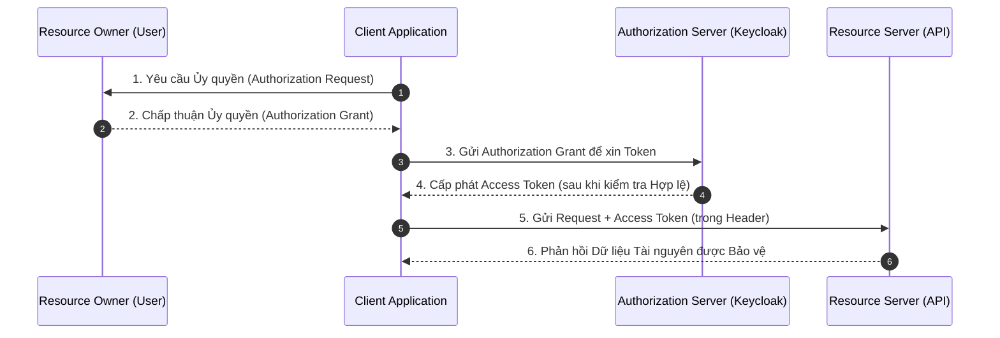

> [!NOTE]
> **Category:** Theory (Lý thuyết)
> **Goal:** Nắm vững định nghĩa, vai trò và sự tương tác giữa 4 thực thể cốt lõi (Actors) trong giao thức OAuth 2.0 theo đặc tả RFC 6749.

## 1. Lý thuyết chuyên sâu (Detailed Theory)

Giao thức OAuth 2.0 không chỉ là một luồng (flow) đơn lẻ, mà là một khuôn khổ (framework) xác định cách thức ủy quyền (delegation of authorization). Để framework này hoạt động, nó định nghĩa rõ ràng 4 vai trò tham gia vào quá trình cấp phát và xác thực quyền truy cập. Bất kỳ kiến trúc bảo mật nào sử dụng OAuth 2.0 đều phải ánh xạ các thành phần thực tế vào đúng 4 vai trò này.

**Bốn thực thể cốt lõi (Actors) bao gồm:**
1. **Resource Owner (Chủ sở hữu tài nguyên):** Thường là người dùng cuối (End-User). Đây là thực thể có khả năng cấp quyền truy cập vào các tài nguyên được bảo vệ. Ví dụ: Chủ tài khoản Google Photos muốn cho phép một ứng dụng in ấn truy cập vào kho ảnh của họ.
2. **Resource Server (Máy chủ tài nguyên):** Máy chủ lưu trữ các tài nguyên được bảo vệ, có khả năng chấp nhận và phản hồi các yêu cầu truy cập thông qua việc xác thực Access Token. Ví dụ: Google Photos API.
3. **Client (Ứng dụng khách):** Ứng dụng đưa ra yêu cầu truy cập tài nguyên thay mặt cho Resource Owner và với sự ủy quyền của họ. Lưu ý: Thuật ngữ "Client" ở đây không ngụ ý bất kỳ giới hạn nào về mặt kiến trúc; nó có thể là ứng dụng Web, ứng dụng Mobile, hoặc ứng dụng Server-to-Server.
4. **Authorization Server (Máy chủ cấp quyền):** Máy chủ đảm nhiệm việc xác thực Resource Owner và cấp phát các Token (Access Token, Refresh Token) cho Client sau khi Client lấy được sự chấp thuận (Consent). Ví dụ: Keycloak, Auth0, Google Sign-In.

**Tại sao cần phân chia 4 vai trò này?**
Mô hình Client-Server truyền thống, khi Client yêu cầu truy cập dữ liệu của user trên Server, Client phải yêu cầu user cung cấp trực tiếp mật khẩu (Password). Sự ra đời của OAuth 2.0 tách biệt quá trình "đăng nhập" (Authorization Server đảm nhận) khỏi "truy cập dữ liệu" (Resource Server đảm nhận). Điều này giúp Client thao tác trên dữ liệu của user mà không bao giờ nhìn thấy mật khẩu của họ.

## 2. Luồng nội bộ & Cơ chế cấp thấp (Internal Workflow & Low-level Mechanisms)

Tuy OAuth 2.0 có nhiều luồng (Grant Types), nhưng luồng giao tiếp trừu tượng cơ bản giữa 4 Actor luôn diễn ra theo mô hình sau:



**Phân tích chi tiết:**
- **Bước 1 & 2 (Abstract):** Trong thực tế, Client không trực tiếp hỏi Resource Owner. Quá trình này thường được chuyển hướng qua Authorization Server. Authorization Server sẽ hiển thị giao diện đăng nhập và Consent Screen (Màn hình cấp quyền) cho Resource Owner.
- **Bước 3 & 4:** Client sử dụng "bằng chứng" rằng user đã đồng ý (ví dụ: Authorization Code) để nộp cho Authorization Server. Authorization Server sẽ kiểm tra tính hợp lệ và trả về Access Token.
- **Bước 5 & 6:** Client dùng Access Token (thường dưới dạng Bearer Token) kẹp vào HTTP Header `Authorization: Bearer <token>` để gọi API của Resource Server. Resource Server sẽ giải mã (nếu là JWT) hoặc gọi hàm Token Introspection lên AS để xác minh Token, sau đó trả về dữ liệu.

## 3. Thực hành tốt nhất & Bảo mật (Best Practices & Security)

> [!WARNING]
> Không bao giờ gộp Authorization Server và Resource Server trên cùng một service nếu hệ thống có ý định mở rộng (Microservices). Việc tách biệt chúng giúp phân tán tải và đảm bảo an ninh (AS giữ Private Key để ký Token, RS chỉ giữ Public Key để xác minh).

> [!IMPORTANT]
> - **Nguyên tắc "Least Privilege" cho Client:** Client chỉ nên yêu cầu các quyền (Scopes) tối thiểu cần thiết để hoạt động.
> - **Xác thực Client trên AS:** Nếu Client là "Confidential Client" (có khả năng giữ bí mật), AS phải yêu cầu Client xác thực (ví dụ bằng `client_secret`) trước khi cấp Token để ngăn chặn kẻ tấn công giả mạo Client.

## 4. Cấu hình minh họa thực tế (Configuration Examples)

Trong một hệ thống Microservices thực tế, việc phân rã 4 Actors diễn ra như sau:
- **Resource Owner:** Con người thao tác trên Web Browser.
- **Client:** Một ứng dụng ReactJS (Frontend) hoặc một Spring Boot Web MVC.
- **Authorization Server:** Keycloak Server chạy tại cổng 8080.
- **Resource Server:** Một API viết bằng NodeJS hoặc Spring Boot REST chạy tại cổng 8081, cấu hình để nhận `Bearer Token` do Keycloak cấp.

**Ví dụ cấu hình Spring Boot đóng vai trò Resource Server:**
```yaml
spring:
  security:
    oauth2:
      resourceserver:
        jwt:
          # URL của Authorization Server để RS tải Public Key phục vụ việc verify Token
          issuer-uri: http://keycloak-server:8080/realms/myrealm
```

## 5. Trường hợp ngoại lệ (Edge Cases)

- **Client Server-to-Server (Máy không có người dùng):** Trong trường hợp hai server giao tiếp với nhau qua API chạy ngầm, không có người dùng thực. Lúc này, Client đồng thời đóng vai trò là Resource Owner cho chính tài nguyên của nó. Nó sẽ sử dụng luồng `Client Credentials Grant` để xin Access Token trực tiếp từ AS.
- **Mô hình kiến trúc Gateway:** Trong nhiều thiết kế, một API Gateway đóng vai trò là Client kết hợp với Resource Server (BFF - Backend for Frontend). Nó tự thực hiện giao tiếp với AS lấy Token, rồi đính kèm Token đẩy xuống các Microservices bên dưới.
- **Token bị lộ:** Nếu Access Token (đang nằm ở Client) bị đánh cắp, kẻ tấn công có thể giả mạo Client gọi tới Resource Server. Biện pháp duy nhất của RS là kiểm tra Token Expiry (Token sống ngắn) hoặc dùng các cơ chế nâng cao như MTLS (Sender-Constrained Tokens).

## 6. Câu hỏi Phỏng vấn (Interview Questions)

1. **(Junior)** Định nghĩa 4 Actor trong OAuth 2.0.
   - *Đáp án:* Resource Owner (User), Client (Ứng dụng cần truy cập data), Authorization Server (Hệ thống xác thực & cấp Token - vd: Keycloak), Resource Server (Server lưu trữ data, verify Token).
2. **(Junior)** Keycloak đóng vai trò nào trong 4 Actor này?
   - *Đáp án:* Keycloak đóng vai trò là Authorization Server (Máy chủ ủy quyền). Nó xác thực user và cấp Access Token/Refresh Token.
3. **(Senior)** Nếu một Backend Service gọi API của một Backend Service khác ngầm định không qua người dùng, thì ai đóng vai trò Resource Owner?
   - *Đáp án:* Khi dùng `Client Credentials`, chính Backend gọi API (Client) tự đóng vai trò là Resource Owner cho các tài nguyên mà nó quản lý. Không có User Context liên quan.
4. **(Senior)** Tại sao Resource Server cần biết Authorization Server là ai? Làm cách nào RS kiểm chứng Token do AS cấp?
   - *Đáp án:* RS cần biết cấu hình của AS (như JWKS URL) để tải Public Key về. Khi RS nhận được Access Token (JWT), nó sẽ dùng Public Key này để verify chữ ký (Signature). Hoặc RS có thể gọi trực tiếp lên Token Introspection Endpoint của AS.
5. **(Senior)** Nêu sự khác biệt giữa Confidential Client và Public Client.
   - *Đáp án:* Confidential Client có thể giữ bí mật credential (như client_secret), thường là Web Server (Spring Boot, NodeJS). Public Client không thể giữ bí mật credential (SPA, Mobile Apps), vì code chạy trên máy khách, do đó phải dùng PKCE.

## 7. Tài liệu tham khảo (References)

- [RFC 6749: The OAuth 2.0 Authorization Framework - Section 1.1 Roles](https://datatracker.ietf.org/doc/html/rfc6749#section-1.1)
- [Keycloak Architecture - OAuth 2.0 Concepts](https://www.keycloak.org/docs/latest/securing_apps/#_oauth2)
