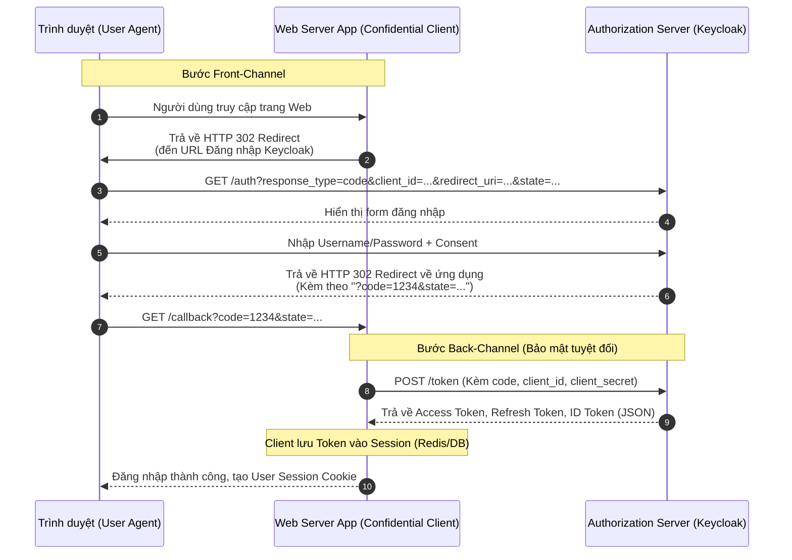

> [!NOTE]
> **Category:** Theory (Lý thuyết)
> **Goal:** Tìm hiểu bản chất và luồng hoạt động chi tiết của Authorization Code Grant - Luồng xác thực an toàn và phổ biến nhất trong hệ sinh thái OAuth 2.0/OIDC dành cho các ứng dụng Server-side.

## 1. Lý thuyết chuyên sâu (Detailed Theory)

**Authorization Code Grant** là quy trình xác thực ủy quyền bảo mật nhất và là xương sống của mọi ứng dụng Web hiện đại tích hợp SSO. Luồng này được thiết kế chủ yếu cho các **Confidential Clients** (như Spring Boot Web App, NodeJS Backend), tức là những ứng dụng có khả năng giữ bí mật cấu hình của mình (giữ kín `client_secret` ở phía Server).

**Vấn đề cốt lõi mà nó giải quyết:**
Nếu Access Token được trả trực tiếp về trình duyệt web qua URL Fragment (như trong luồng Implicit Flow cũ kỹ), token này sẽ dễ dàng bị đánh cắp bởi các mã độc JavaScript trên trang hoặc lưu vết lại trong lịch sử trình duyệt. 

**Giải pháp của Authorization Code Flow:**
Luồng này chia làm hai giai đoạn (Front-channel và Back-channel).
1. **Front-channel (Qua trình duyệt user):** Người dùng đăng nhập, Authorization Server trả về một mã tạm thời gọi là **Authorization Code** tới trình duyệt. Mã code này ngắn ngày, chỉ sử dụng được 1 lần và nếu bị lộ cũng vô hại đối với kẻ cắp vì nó cần `client_secret` đi kèm để đối chiếu.
2. **Back-channel (Server đối thoại với Server):** Ứng dụng Client (phía Server) sẽ lấy Code đó, đính kèm `client_secret` của mình, và tạo một gọi trực tiếp HTTP Server-to-Server (không qua mạng người dùng) đến Authorization Server để nhận Access Token. Vì Token đi bằng Back-channel, trình duyệt của người dùng không bao giờ nhìn thấy Access Token, loại bỏ triệt để rủi ro rò rỉ.

## 2. Luồng nội bộ & Cơ chế cấp thấp (Internal Workflow & Low-level Mechanisms)



**Phân tích chi tiết các tham số cốt lõi:**
- `response_type=code`: Khai báo với AS rằng tao muốn dùng Authorization Code Flow.
- `redirect_uri`: Điểm cuối an toàn (đã đăng ký trước với AS) mà AS sẽ đẩy mã code về.
- `state`: Một chuỗi ngẫu nhiên do Client sinh ra. Khi AS trả về code, AS trả nguyên lại chuỗi state này. Client so sánh để chặn tấn công **CSRF (Cross-Site Request Forgery)**.

## 3. Thực hành tốt nhất & Bảo mật (Best Practices & Security)

> [!WARNING]
> Luồng Implicit Flow trả trực tiếp Token qua URL đã bị "Khai tử" (Deprecated) trong OAuth 2.1. Tất cả mọi loại ứng dụng phải sử dụng Authorization Code (Kèm theo PKCE cho các ứng dụng Public SPA/Mobile).

> [!IMPORTANT]
> - **Tuyệt đối không dùng Redirect URIs chứa Wildcard (`*`):** Rất nhiều lập trình viên khai báo `http://localhost:*` trên Keycloak. Kẻ tấn công có thể lợi dụng điều này làm hỏng luồng redirect sang một server rác. Phải khai báo `redirect_uri` đích danh tuyệt đối (ví dụ `https://myapp.com/callback`).
> - **State Param là Bắt buộc:** Không bao giờ bỏ qua tham số `state`. Nếu không có, kẻ tấn công có thể "nhồi" mã Authorization Code độc hại của hắn vào phiên duyệt web của nạn nhân (Login CSRF).
> - **Kết hợp PKCE:** Ngay cả với Server-side Apps, hãy tích hợp PKCE để gia cố sự vững chắc.

## 4. Cấu hình minh họa thực tế (Configuration Examples)

**Cấu hình Client trong Keycloak:**
- **Client ID:** my-spring-app
- **Client Protocol:** openid-connect
- **Access Type:** confidential
- **Valid Redirect URIs:** `https://myapp.com/login/oauth2/code/keycloak`
- Lấy `Secret` từ tab Credentials để bỏ vào file cấu hình của Spring Boot.

**Cấu hình phía Spring Boot Application `application.yml`:**

```yaml
spring:
  security:
    oauth2:
      client:
        registration:
          keycloak:
            client-id: my-spring-app
            client-secret: my-super-secret-key-from-keycloak
            authorization-grant-type: authorization_code
            scope: openid, profile, email
        provider:
          keycloak:
            issuer-uri: http://keycloak-server:8080/realms/myrealm
```

## 5. Trường hợp ngoại lệ (Edge Cases)

- **Authorization Code Replay Attack:** Kẻ tấn công lấy được mã Code và gọi API lấy Token trước khi Client gọi (rất khó vì cần `client_secret`, nhưng vẫn có thể xảy ra trong một số vụ rò rỉ). Nếu Code bị sử dụng **lần thứ hai**, theo tiêu chuẩn RFC, Authorization Server BẮT BUỘC phải lập tức **thu hồi tất cả các Access Token** đã từng được sinh ra bằng mã Code đó để bảo vệ hệ thống. Keycloak tuân thủ nghiêm ngặt điều kiện này.
- **Mismatch Redirect URI:** Tại bước lấy token ở Back-channel, nếu `redirect_uri` truyền vào khác dù chỉ 1 ký tự so với `redirect_uri` đã dùng ở bước gọi Code ban đầu, Keycloak sẽ trả về lỗi HTTP 400 Bad Request ngay lập tức. Cả hai thông số này phải y chang nhau ở cả 2 bước HTTP Requests.

## 6. Câu hỏi Phỏng vấn (Interview Questions)

1. **(Junior)** Tại sao Authorization Code Flow lại an toàn hơn Implicit Flow?
   - *Đáp án:* Vì Access Token không bao giờ được phơi bày ra trình duyệt web. Nó được truyền qua back-channel (server-to-server) thông qua việc gửi Code và Client Secret để đổi lấy.
2. **(Junior)** Tham số `state` trong request có ý nghĩa gì?
   - *Đáp án:* Nó là một token ngẫu nhiên do Client tạo ra để duy trì trạng thái giữa lúc redirect và callback, dùng để ngăn chặn tấn công Cross-Site Request Forgery (CSRF).
3. **(Senior)** Tại sao trong bước gọi POST /token lại phải gửi kèm theo tham số `redirect_uri` một lần nữa trong khi URL đó đã được gửi ở bước 1 rồi?
   - *Đáp án:* Để Authorization Server xác minh lại (Verify) rằng request xin Token đang đến từ cùng một ngữ cảnh với request xin Code. Nếu ai đó chặn mã code và gửi từ nơi khác, AS sẽ phát hiện sự bất đồng nhất của redirect_uri.
4. **(Senior)** Nếu một ứng dụng SPA (React) muốn gọi luồng Authorization Code nhưng không thể giấu Client Secret, kiến trúc sẽ triển khai thế nào?
   - *Đáp án:* Ứng dụng SPA đóng vai trò là Public Client, không có `client_secret`. Thay vào đó, nó bắt buộc phải triển khai Authorization Code + PKCE (`code_verifier` và `code_challenge`) để cung cấp xác thực luồng ngẫu nhiên.
5. **(Senior)** Nêu định nghĩa và hậu quả của Authorization Code Replay?
   - *Đáp án:* Là việc dùng 1 mã code 2 lần. Hậu quả theo chuẩn: AS sẽ từ chối request thứ 2, đồng thời thu hồi lập tức (Revoke) tất cả các Access Token đã lỡ cấp ở request thứ 1 thành công.

## 7. Tài liệu tham khảo (References)

- [RFC 6749: OAuth 2.0 Authorization Framework - Authorization Code Grant](https://datatracker.ietf.org/doc/html/rfc6749#section-4.1)
- [Keycloak OpenID Connect Core Specification](https://www.keycloak.org/docs/latest/securing_apps/#_oidc)
