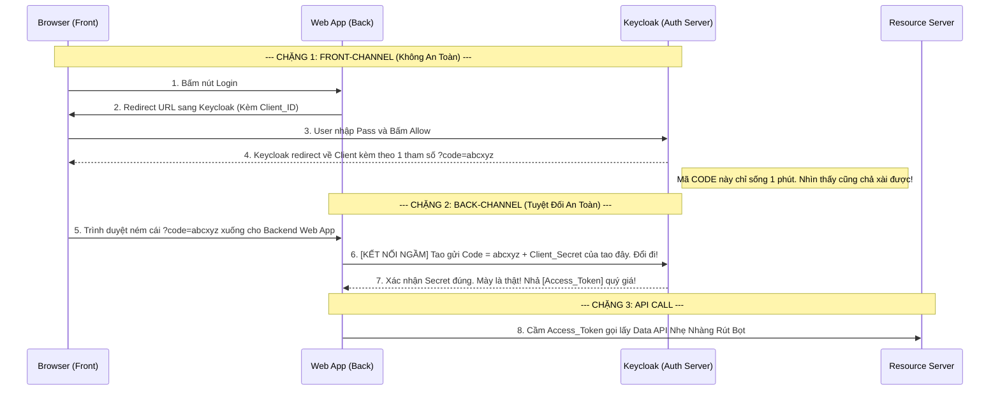

# Lesson 3: Luồng Mã Ủy Quyền (Authorization Code Flow)

> [!NOTE]
> **Category:** Theory (Lý thuyết)
> **Goal:** Trong 4 luồng (Flows) cơ bản của OAuth2, **Authorization Code Flow** là vua. Nó là luồng bảo mật nhất, phổ biến nhất, và bắt buộc phải dùng cho mọi ứng dụng Web Server (Có Backend). Bài học này sẽ mổ xẻ từng bước đi của nó để xem tại sao nó được mệnh danh là luồng "Hoàn hảo" chống đánh cắp Token.

## 1. Lý thuyết chuyên sâu (Detailed Theory)

### 1.1. Tại Sao Phải "Đi Vòng" Bằng Authorization Code?
Luồng này không bao giờ trả Access Token trực tiếp cho người dùng qua trình duyệt (Frontend). Tại sao?
Vì Trình duyệt (Chrome/Edge) là một môi trường vô cùng nguy hiểm. Nó có thể bị cài Extension gián điệp, bị tấn công XSS (Cross-Site Scripting) ăn cắp Javascript.
- Nếu Keycloak quăng cái Access Token quý giá (Mở được API tiền bạc) cái bộp ra màn hình URL Trình Duyệt, Token sẽ bị lộ ngay lập tức (Lưu vết trên Browser History, văng rác ra Console Log).
- **Luật của Code Flow:** Keycloak thông qua trình duyệt, chỉ nhả về một cái **"Mã Code Rác" (Authorization Code)**. Cái mã này tuổi thọ cực ngắn (1 phút) và TỰ NÓ KHÔNG MỞ CỬA API ĐƯỢC.
- Muốn đổi "Mã Code Rác" này thành "Access Token Xịn", Ứng dụng Client (Phần Backend của nó) phải âm thầm kết nối ngầm (Back-Channel) với Keycloak, đưa cái Code Rác kèm theo cái `Client_Secret` (Chìa khóa bí mật giấu ở Backend, hacker không thấy được) để đổi lấy Token Xịn. Tuyệt đỉnh bảo mật!

### 1.2. Điều Kiện Áp Dụng
- **Loại Client:** BẮT BUỘC dùng cho **Confidential Clients** (Các ứng dụng Web có Server Backend ví dụ: NextJS SSR, Spring MVC, ExpressJS).
- Vì chỉ có Backend Server mới giấu được `Client_Secret` an toàn tuyệt đối. Đừng bao giờ mang `Client_Secret` xuống dưới mã nguồn Frontend React/Vue (Nếu làm vậy là bạn vi phạm nghiêm trọng bảo mật).

---

## 2. Luồng nội bộ & Cơ chế cấp thấp (Internal Workflow & Low-level Mechanisms)

Hành Trình OIDC 2 Chặng Đường (Front-Channel Mồi Nhử & Back-Channel Nhả Vàng):

---

## 3. Thực hành tốt nhất & Bảo mật (Best Practices & Security)

> [!IMPORTANT]
> **Tuyệt Đỉnh An Toàn (Cẩn Thận Vụ Ăn Cắp Mã Code - Interception Attack)**
> **Mối Nguy Hiểm:** Mặc dù Mã Code Rác rỗng vô hại, nhưng giả sử một tay Hacker chặn đường (Man-In-The-Middle) lấy được cái `?code=abcxyz` đang bay trên thanh URL trình duyệt của bạn. Nó lấy cái code đó đập về Backend của nó (Giả mạo là bạn) để bắt Backend của bạn đổi Token cho nó thì sao?
> **Biện Pháp Sống Còn (State Parameter):** Chuẩn OAuth2 bắt buộc bạn khi văng khách hàng từ Client sang Keycloak phải đính kèm một chuỗi String Ngẫu nhiên gọi là **`state`**. 
> - VD Url: `https://keycloak/auth?...&state=1234abcd`
> - Keycloak khi trả Code về bắt buộc phải dội lại đúng chuỗi `state` đó: `?code=abcxyz&state=1234abcd`.
> - Backend của bạn có nhiệm vụ check: "Trùng khớp State tao phát ra lúc đầu thì tao mới tiếp tục đổi Token, sai lệch state là có thằng Hacker chèn mã CSRF tao ngắt mạch ngay Lỗi Lệnh!".

---

## 4. Cấu hình minh họa thực tế (Configuration Examples)

Lắp Ráp Cấu Hình Cục Lõi Của Client Trên Keycloak Để Cho Phép Authorization Code Chạy:
1. Bạn tạo Client tên `spring-boot-webapp` trên Keycloak.
2. Bạn gạt công tắc **`Client authentication`** sang trạng thái **ON** (Điều này bắt buộc để sinh ra Tab `Credentials` lấy Client_Secret dùng cho việc đổi mã ở Chặng 2 Hậu Đài).
3. Bật công tắc **`Standard flow`** lên ON. (Tên gọi khác của Authorization Code Flow trên giao diện Keycloak).
4. Khung **Valid Redirect URIs**: Điền MẠCH CHÍNH XÁC URL mà Keycloak được phép văng mã Code Rác về (VD: `http://localhost:8080/login/oauth2/code/keycloak`). KHÔNG ĐỂ DẤU SAO `*` KẺO BỊ HACKER REDIRECT RÚT CODE VỀ DOMAIN LẠ.
5. Save lại! Bây giờ App Spring Boot của bạn có thể gắn Secret vào file Application.properties và chạy luồng OIDC Đỉnh Cao Ngầm.

---

## 5. Câu hỏi Phỏng vấn (Interview Questions)

**1. Em Hãy Phân Biệt Khái Niệm Front-Channel Và Back-Channel Trong Luồng Authorization Code? Nếu Access Token Bị Rò Rỉ Qua Front-Channel Sẽ Gây Hậu Quả Gì?**
- **Senior:** Dạ thưa sếp:
  - **Front-Channel (Kênh Tiền Đài):** Là sự giao tiếp dựa trên thanh URL của Trình duyệt Web (thông qua lệnh Redirect HTTP 302). Môi trường này Kém An Toàn vì tất cả dữ liệu bay trên URL đều được lưu lại trong History của Chrome, hoặc dễ dàng bị các Script cắm trên máy ăn cắp.
  - **Back-Channel (Kênh Hậu Đài):** Là kết nối trực tiếp (Direct HTTP Request) giữa Server Ứng Dụng (NodeJS) và Server Keycloak. Kết nối này tuyệt đối an toàn vì đi qua đường hầm SSL/TLS kín ở mặt sau máy chủ, không đi ngang qua trình duyệt máy khách. Không thằng Hacker nào sniff (bắt gói) được.
  - Luồng Auth Code Flow thiên tài ở chỗ: Nó dùng **Front-Channel** chỉ để mồi nhử (đẩy Mã Code rác). Sau đó dùng **Back-Channel** để Giao Dịch Chuyển Vàng (đổi lấy Access Token).
  - Nếu thiết kế sai lầm nhả Access Token chóp đỉnh ra Front-channel (Cách làm của Implicit Flow thời xưa nay đã bị tẩy chay tiêu diệt), Access Token rớt vô History Chrome, Hacker rút lụa lấy Token đánh sập Backend API ăn cắp toàn bộ tiền tài khoản ngân hàng!

---

## 6. Tài liệu tham khảo (References)
- **RFC 6749:** Section 4.1 Authorization Code Grant.
- **OAuth 2.0 Best Practices:** Oauth 2.0 for Browser-Based Apps.
