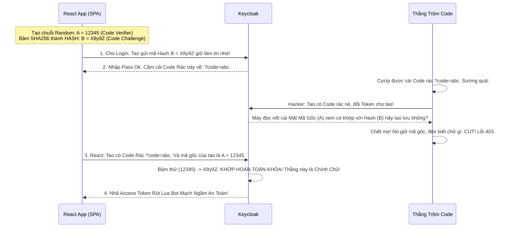

# Lesson 4: Khiên Chắn Cứng PKCE (Auth Code with PKCE)

> [!NOTE]
> **Category:** Theory (Lý thuyết)
> **Goal:** Bạn đã học luồng Authorization Code rất an toàn cho Web Server (nhờ cất giấu được Client_Secret). NHƯNG NẾU bạn viết Mobile App (iOS, Android) hoặc Single Page App (ReactJS, Angular) - tức là các ứng dụng "Public Clients" KHÔNG CÓ BACKEND để giấu Secret thì sao? Câu trả lời là: Vứt Secret đi, và thay bằng siêu vũ khí mật mã **PKCE (Proof Key for Code Exchange)**.

## 1. Lý thuyết chuyên sâu (Detailed Theory)

### 1.1. Vấn Đề Chết Chóc Của Mobile/SPA (Public Clients)
Nếu bạn build một cái App ReactJS và mang nguyên cái mô hình Auth Code Flow ở bài trước áp dụng vào:
1. ReactJS nhả User qua Keycloak lấy Mã Code Rác (`?code=abcxyz`).
2. Trình duyệt đẩy Code Rác về ReactJS.
3. ReactJS kết nối với Keycloak để đổi Token. Ở bước này, Keycloak đòi `Client_Secret`.
4. BẠN PHẢI GHI CỨNG `Client_Secret` vào mã nguồn ReactJS (`const secret = "my-secret-123"`).
- **HẬU QUẢ TÀN KHỐC:** Bất kỳ ai nhấn F12 (DevTools) mở mục Sources là thấy nguyên cái Secret lù lù ra đó. Thằng Hacker lấy Secret, đứng sẵn ở ngã tư mạng chặn cướp cái `?code=abcxyz` bay về, ráp Secret vào và tự tay nó gọi Keycloak rút Access Token! Gãy toàn bộ rào bảo vệ!

### 1.2. Giải Pháp PKCE (Đọc là Pixy)
Chuẩn RFC 7636 (PKCE) ra đời để vá lỗ hổng này bằng một phép thuật mật mã Sinh ra Chìa Khóa Dùng 1 Lần cực thông minh thay thế hoàn toàn cho Client_Secret tĩnh!
- PKCE hoạt động theo nguyên tắc: "Tôi (App React) tự chế ra một cái Chìa Khóa Ngẫu Nhiên (Code Verifier) mỗi lần đăng nhập. Tôi băm nó nát ra thành Mật Mã (Code Challenge). Tôi gửi cái băm cho Keycloak giữ làm tin. Lúc tôi quay lại đổi Code Rác, tôi xuất trình cái Chìa Khóa Gốc ra. Keycloak băm lại thử thấy khớp thì nhả Token".
- Nhờ vậy, `Client_Secret` chết vĩnh viễn trên Frontend! Bảo mật đạt cấp độ tuyệt đối OIDC đỉnh cao!

---

## 2. Luồng nội bộ & Cơ chế cấp thấp (Internal Workflow & Low-level Mechanisms)

Hành Trình OIDC 2 Chặng Đường Với Mã Hóa Hash SHA-256 PKCE:

---

## 3. Thực hành tốt nhất & Bảo mật (Best Practices & Security)

> [!IMPORTANT]
> **Tuyệt Đỉnh Tẩy Khách Mạng Bọc (Ép Buộc Mọi Client Mới Bật Cờ Cấm Bỏ PKCE!)**
> **Tội Ác Thiết Kế:** Bạn Build App Mobile xịn nhưng lại vô tình để sót cấu hình bỏ ngỏ, cho phép Keycloak nhả Token bằng Flow thường mà không thèm đòi mã PKCE.
> **Hậu Quả:** Một mã độc tấn công dạng Custom URI Scheme trên điện thoại Android chặn ứng dụng của bạn lại, cướp đoạt Mã Auth Code và lấy mất Session Token rút lụa ăn cắp dữ liệu User.
> **Biện Pháp Sống Còn Lớp Trọng Lực Thép:** Vào Keycloak, tại cấu hình Client (Tab **Advanced**), cuộn tìm cờ **`Proof Key for Code Exchange Code Challenge Method`**. Lập tức Bắt Buộc khóa bằng phương pháp **`S256`** (Tức là thuật toán băm SHA-256). Đừng bao giờ chọn `plain` (Gửi văn bản rõ - vô dụng).
> Từ năm 2021, Chuẩn Oauth2 2.1 MỚI NHẤT khuyến cáo: Dù bạn dùng Web Server Kín Backend CÓ SECRET đi chăng nữa, VẪN NÊN BẬT PKCE XÀI KÈM SECRET LÀM VÀNH ĐAI KÉP BAO BỌC RÚT LỤA ĐỈNH CHÓP CHỐNG CSRF ĐỘC TÀI!

---

## 4. Cấu hình minh họa thực tế (Configuration Examples)

Lắp Ráp Cấu Hình Client Cho Một SPA ReactJS Chuẩn OAuth 2.1:
1. Bạn tạo Client tên `react-frontend` trên Keycloak.
2. Gạt công tắc **`Client authentication`** sang trạng thái **OFF** (Vì là SPA, Không dùng Secret, đây là Public Client rỗng đáy).
3. Bật công tắc **`Standard flow`** lên ON (Vẫn là Auth Code Flow).
4. Quan trọng nhất: Di chuyển sang Tab **Advanced** của Client này.
5. Cột **Proof Key for Code Exchange Code Challenge Method**: Mặc định nó để trống (Nghĩa là Option/ Tùy Chọn). Bạn sổ Dropdown xuống chọn **`S256`** cứng.
6. Lúc này, nếu React App viết Code bậy gửi Request đổi Token mà không mang theo `code_verifier`, Keycloak sẽ Vả Lỗi HTTP 400 Bad Request Rớt Lệnh Trắng Ngay Mạch Cửa Giao OIDC Oanh Chóp Cắt Đứt! Đảm bảo Dev bên kia phải Code PKCE xịn theo đúng chuẩn Thép OIDC Nhựa Bọc.

---

## 5. Câu hỏi Phỏng vấn (Interview Questions)

**1. Em Hiểu Thế Nào Về Nguy Cơ Bị Đánh Cắp Auth Code Bằng Lỗ Hổng 'Custom URI Scheme' Trên Mobile App (iOS/Android)? PKCE Sinh Ra Để Bịt Lỗ Hổng Đó Như Thế Nào?**
- **Senior:** Dạ thưa sếp:
  - Trên Mobile, các App văng ra Trình duyệt ngoài để Login (Webview/Safari). Khi Login xong Keycloak phải điều hướng trả Code ngược lại cái App Mobile đó thông qua cái gọi là Deep Link (Ví dụ: `myapp://callback?code=123`).
  - **Lỗ Hổng Khủng Khiếp:** Nếu trong điện thoại User lỡ cài 1 App Rác Độc Hại. Cái App đó cũng cấu hình đăng ký ăn chặn cái đường dẫn `myapp://`. Hậu quả: Khi Safari văng mã Code về, App Rác chộp được mã Code rác thay vì App Xịn!
  - **Cách PKCE Bịt Cửa Mù Lòa:** Nếu không có PKCE, App Rác cầm Code rác đập vào Keycloak là lấy được Token (Vì Mobile App không có Secret). NHƯNG NHỜ CÓ PKCE, App xịn lúc đi nhử mồi đã giấu 1 cục `Code Verifier` tĩnh tĩnh nằm trong RAM của riêng nó. App Rác dù cướp được Mã Code trả về, nhưng ôm Mã đi nộp Keycloak mà éo có `Code Verifier` khớp lệnh (Do nó nằm ở vùng nhớ RAM App xịn). Keycloak đạp văng App Rác dội lệnh Đứt 403 Forbidden Rỗng Tĩnh Oanh Cáp Giao Diện Lệnh Chặt Mạch Lụa!

---

## 6. Tài liệu tham khảo (References)
- **RFC 7636:** Proof Key for Code Exchange by OAuth Public Clients.
- **Keycloak Documentation:** Securing Single Page Applications (SPA).
