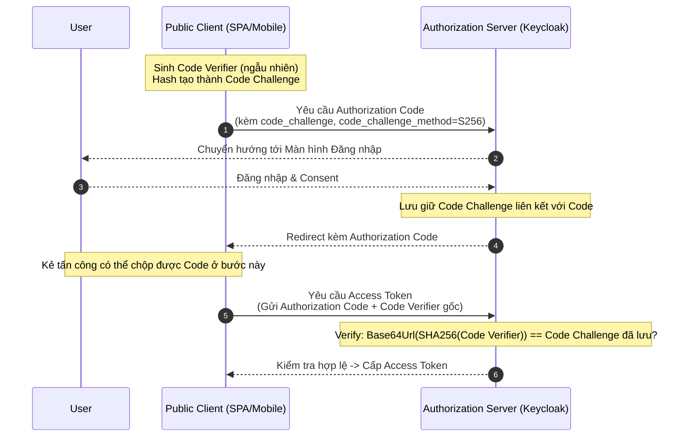

> [!NOTE]
> **Category:** Theory (Lý thuyết)
> **Goal:** Nắm vững cấu trúc bảo mật của Authorization Code với PKCE (Proof Key for Code Exchange) và tại sao đây là chuẩn công nghiệp bắt buộc cho các SPA và Mobile Apps hiện đại.

## 1. Lý thuyết chuyên sâu (Detailed Theory)

**Authorization Code với PKCE** (Proof Key for Code Exchange, phát âm là "pixy" - RFC 7636) là một bản mở rộng của Authorization Code flow truyền thống nhằm giải quyết lỗ hổng bảo mật nghiêm trọng liên quan đến việc đánh cắp Authorization Code (Authorization Code Interception Attack).

**Vấn đề cốt lõi mà PKCE giải quyết:**
Trong luồng Authorization Code tiêu chuẩn, Client gửi Code lên Authorization Server cùng với `client_secret` để đổi lấy Access Token. Tuy nhiên, các **Public Clients** (như ứng dụng Single Page Application - React/Angular, hoặc Mobile App) không có back-end an toàn để lưu trữ `client_secret`. Nếu không có `client_secret`, bất kỳ ai chộp được Authorization Code trên đường truyền (ví dụ: qua ứng dụng độc hại trên điện thoại đăng ký cùng Custom URI Scheme) đều có thể đổi mã đó lấy Access Token.

**Giải pháp của PKCE:**
Thay vì dùng một `client_secret` cố định tĩnh, PKCE tạo ra một "mật khẩu dùng một lần" tự sinh ra trên thiết bị Client ngay tại thời điểm bắt đầu luồng đăng nhập. 
- Client sinh ngẫu nhiên một chuỗi bí mật tên là **`code_verifier`**.
- Client băm (hash) chuỗi đó (thường dùng thuật toán SHA-256) tạo thành **`code_challenge`**.
- Tại bước Authorization Request, Client gửi `code_challenge` lên AS.
- Tại bước Token Request (sau khi nhận Code), Client gửi `code_verifier` (chuỗi gốc) lên AS.
- AS sẽ tự lấy `code_verifier` vừa nhận để băm, nếu khớp với `code_challenge` ban đầu, chứng tỏ ứng dụng đang yêu cầu Token chính xác là ứng dụng đã khởi xướng luồng đăng nhập.

## 2. Luồng nội bộ & Cơ chế cấp thấp (Internal Workflow & Low-level Mechanisms)



**Phân tích chi tiết các cơ chế mã hóa:**
1. **`code_verifier`:** Là một chuỗi ký tự ngẫu nhiên có độ dài từ 43 đến 128 ký tự. Nó bao gồm các ký tự chữ, số, và các ký tự `-`, `.`, `_`, `~`.
2. **`code_challenge_method`:** OAuth định nghĩa hai phương pháp:
   - `plain`: `code_challenge` chính là `code_verifier`. Không an toàn, chỉ dùng để tương thích ngược.
   - `S256` (Khuyên dùng): `code_challenge = BASE64URL-ENCODE(SHA256(ASCII(code_verifier)))`.
3. **Quá trình xác minh:** Ngay cả khi kẻ tấn công bắt được Authorization Code trả về từ URL Redirect, hắn không có `code_verifier` gốc nên Authorization Server sẽ từ chối đổi mã thành Access Token. Do mã băm SHA256 là hàm một chiều, không thể suy ngược `code_challenge` ra `code_verifier`.

## 3. Thực hành tốt nhất & Bảo mật (Best Practices & Security)

> [!WARNING]
> Luôn luôn bắt buộc (`Force`) sử dụng cơ chế PKCE cho tất cả các loại ứng dụng mới, kể cả Confidential Clients, vì nó không tốn kém tài nguyên nhưng lại cung cấp thêm một lớp bảo mật liên quan đến phiên làm việc.

> [!IMPORTANT]
> - **Chỉ dùng S256**: Luôn từ chối `code_challenge_method=plain`.
> - **CSRF Protection:** PKCE có một tác dụng phụ rất tốt là bảo vệ hệ thống khỏi tấn công CSRF, do mỗi luồng xác thực đều yêu cầu `code_verifier` sinh ngẫu nhiên đi kèm, đóng vai trò như một CSRF Token sinh động.
> - **Cấu hình Keycloak:** Cần vào admin console và chọn tùy chọn **"Proof Key for Code Exchange Code Challenge Method"** là `S256` bắt buộc.

## 4. Cấu hình minh họa thực tế (Configuration Examples)

**Cấu hình trên Keycloak:**
- Trong Client settings của Keycloak:
  - Chọn **Advanced** Tab.
  - Tại phần **Advanced Settings**, cài đặt mục **Proof Key for Code Exchange Code Challenge Method** thành `S256`.

**Đoạn code minh họa sinh PKCE (TypeScript):**

```typescript
// Sử dụng thư viện crypto cơ bản của Web Crypto API
function generateRandomString(length: number): string {
    const charset = 'ABCDEFGHIJKLMNOPQRSTUVWXYZabcdefghijklmnopqrstuvwxyz0123456789-._~';
    let result = '';
    const values = new Uint32Array(length);
    window.crypto.getRandomValues(values);
    for (let i = 0; i < length; i++) {
        result += charset[values[i] % charset.length];
    }
    return result;
}

async function generateCodeChallenge(codeVerifier: string): Promise<string> {
    const encoder = new TextEncoder();
    const data = encoder.encode(codeVerifier);
    const digest = await window.crypto.subtle.digest('SHA-256', data);
    
    // Convert ArrayBuffer to Base64Url
    return btoa(String.fromCharCode(...new Uint8Array(digest)))
        .replace(/\+/g, '-')
        .replace(/\//g, '_')
        .replace(/=+$/, '');
}

// Khởi tạo
const codeVerifier = generateRandomString(64);
const codeChallenge = await generateCodeChallenge(codeVerifier);
```

HTTP Request 1 (Lấy Code):
`GET /auth?client_id=spa-app&response_type=code&code_challenge=<challenge>&code_challenge_method=S256`

HTTP Request 2 (Lấy Token):
`POST /token` payload: `client_id=spa-app&grant_type=authorization_code&code=<code>&code_verifier=<verifier>`

## 5. Trường hợp ngoại lệ (Edge Cases)

- **Trình duyệt / Thiết bị không hỗ trợ SHA256:** Rất hiếm gặp ở hiện tại, nhưng nếu xảy ra (các thiết bị IoT rất cũ), client phải lùi (fallback) về phương thức `plain`. Tuy nhiên, điều này cực kỳ rủi ro và các hệ thống Enterprise thường từ chối giao dịch hoàn toàn thay vì sử dụng `plain`.
- **Thất lạc Code Verifier:** Trong các ứng dụng SPA, do quá trình Auth thường gây ra page reload hoặc redirect ra ngoài, trạng thái `code_verifier` có thể bị mất. Do đó, lập trình viên bắt buộc phải lưu `code_verifier` vào `sessionStorage` hoặc `localStorage` trước khi redirect đi và đọc lại nó khi nhận redirect callback.

## 6. Câu hỏi Phỏng vấn (Interview Questions)

1. **(Junior)** PKCE là viết tắt của gì và nó giải quyết bài toán nào?
   - *Đáp án:* Proof Key for Code Exchange. Giải quyết lỗ hổng bảo mật khi kẻ tấn công đánh cắp Authorization Code của các ứng dụng Public (như SPA, Mobile) vì chúng không có `client_secret` để xác thực lại ở bước đổi Token.
2. **(Junior)** Quá trình băm `code_challenge` thường sử dụng thuật toán gì?
   - *Đáp án:* SHA-256 (phương thức S256).
3. **(Senior)** Nếu một Backend Server (Confidential Client) có khả năng cất giấu `client_secret`, liệu nó có nên dùng thêm PKCE không? Tại sao?
   - *Đáp án:* CÓ. OAuth 2.1 Security Best Practices khuyến nghị dùng PKCE cho mọi luồng. Nó bảo vệ phòng trường hợp `client_secret` bị lộ hoặc hỗ trợ chống CSRF attack trên luồng redirect.
4. **(Senior)** Khi triển khai PKCE trong SPA, lập trình viên thường vô tình gây ra lỗi gì ở bước đổi Token?
   - *Đáp án:* Quên lưu trữ `code_verifier` (vào storage cục bộ như sessionStorage) trước khi chuyển hướng sang màn hình đăng nhập của AS. Kết quả là khi trở về, SPA bị reset context và không còn `code_verifier` để gọi API lấy token.
5. **(Senior)** Tại sao lại phải Base64Url-encode hàm băm SHA-256 thay vì dùng chuỗi Hex bình thường?
   - *Đáp án:* Để đảm bảo chuỗi ký tự được truyền tải an toàn (URL-safe) qua URL Query Parameters trong bước Authorization Request, tránh việc các ký tự đặc biệt như `+` hay `/` bị thay đổi làm sai lệch hash.

## 7. Tài liệu tham khảo (References)

- [RFC 7636: Proof Key for Code Exchange by OAuth Public Clients](https://datatracker.ietf.org/doc/html/rfc7636)
- [OAuth 2.0 Security Best Current Practice](https://datatracker.ietf.org/doc/html/draft-ietf-oauth-security-topics)
