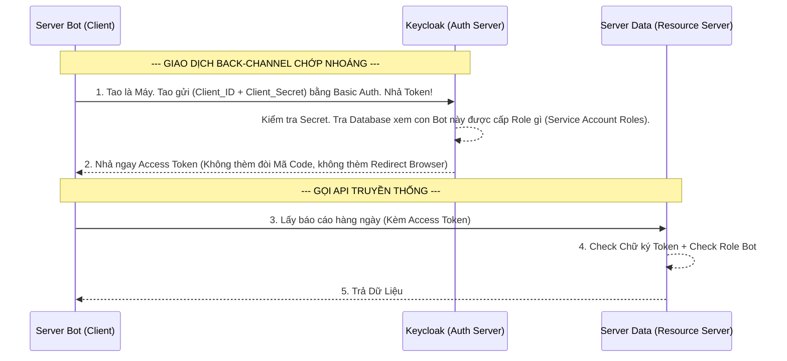

# Lesson 5: Giao Tiếp Máy - Máy (Client Credentials Flow)

> [!NOTE]
> **Category:** Theory (Lý thuyết)
> **Goal:** Nếu 2 bài trước giải quyết bài toán Đăng nhập cho Con Người (Phải bật Trình Duyệt để nhập Mật Khẩu), thì bài học này giải quyết bài toán giao tiếp cho Máy Móc (Ví dụ: Server A muốn gọi API của Server B lúc 3 giờ sáng). Khi không có con người gõ phím, ta dùng **Client Credentials Flow**.

## 1. Lý thuyết chuyên sâu (Detailed Theory)

### 1.1. Bản Chất Của Client Credentials Flow
Luồng này sinh ra cho mô hình **M2M (Machine-to-Machine)**.
- Trong luồng này, KHÔNG TỒN TẠI khái niệm người dùng cuối (End-User / Resource Owner). 
- Phần mềm tự động (Client) vừa đóng vai trò là thằng đi xin quyền, vừa là chủ sở hữu của dữ liệu (Ví dụ: Con Bot tự động quét hóa đơn của công ty).
- Vì là Máy Móc, nên nó Không thể bật Trình duyệt, Không thể tự gõ Username/Password.
- Thay vào đó, nó xác thực trực tiếp bằng chính **Danh Tính Của Ứng Dụng**: Cặp khóa `Client_ID` và `Client_Secret`. 

### 1.2. Tại Sao Không Đóng API M2M Cho Nhanh Mất Công Sinh Token?
Nhiều lập trình viên nghĩ: "Hai con Server A và B cùng nằm trong mạng nội bộ Docker. Thôi tao tắt quách cái bảo mật JWT đi, cho nó gọi API tự do (IP Whitelisting)".
- Đây là lỗi thiết kế cực kỳ nguy hiểm (Zero-Trust Violation).
- Mạng nội bộ hoàn toàn có thể bị thâm nhập (Lateral Movement). Nếu hacker chiếm được một con Container Rác, nó sẽ gọi được thẳng vào API Lõi Kế Toán của bạn vì bạn đã tắt bảo mật.
- Client Credentials sinh ra để giải quyết: Kể cả hai máy nằm cạnh nhau, máy A gọi máy B VẪN PHẢI XUẤT TRÌNH ACCESS TOKEN hợp lệ từ Keycloak. Token này quy định rõ "Con Bot này chỉ được gọi API Thống Kê, cấm gọi API Chuyển Tiền".

---

## 2. Luồng nội bộ & Cơ chế cấp thấp (Internal Workflow & Low-level Mechanisms)

Hành Trình OIDC 1 Chặng Của Máy Móc Không Cần Browser:

---

## 3. Thực hành tốt nhất & Bảo mật (Best Practices & Security)

> [!IMPORTANT]
> **Tuyệt Đỉnh An Toàn Cấp Kiến Trúc (Cấm Tiệt Public Clients Dùng Luồng Này)**
> **Tội Ác Thiết Kế:** Bạn viết Mobile App. Thấy luồng này nhanh quá (Gọi 1 phát API /token là có luôn Access Token khỏi cần bật WebView phiền phức). Thế là bạn nhét luồng Client Credentials vào Mobile App! Bạn hardcode cái `Client_Secret` vào mã nguồn Android để nó tự gọi lấy Token.
> **Hậu Quả:** Một vạn Hacker tải file .APK Android của bạn về, dịch ngược (Decompile) lòi ngay ra cái Secret tĩnh đó. Hacker cầm Secret đó viết Script tự gọi Keycloak lấy Access Token. Do Token này là Token của Hệ Thống (M2M), nó có quyền siêu to khổng lồ. Hệ thống của bạn bị banh xác hoàn toàn!
> **Biện Pháp Sống Còn Lớp Trọng:** Bắt Buộc: `Client Credentials Flow` CHỈ ĐƯỢC CHẠY TỪ SERVER BACKEND (Vì Server bạn giữ thì không ai decompile mã nguồn được). Tuyệt đối cấm ở SPA/Mobile.

---

## 4. Cấu hình minh họa thực tế (Configuration Examples)

Lắp Ráp Cấu Hình Cho Bot M2M Chạy Trên Keycloak Bằng Service Accounts:
1. Tạo một Client trên Keycloak tên là `bot-worker-cronjob`.
2. Gạt công tắc **`Client authentication`** sang **ON** (Nó là Confidential Client, bắt buộc phải có Secret).
3. Ở ô Flow, TẮT MỌI THỨ (`Standard flow`, `Direct access grants` OFF hết). CHỈ BẬT DUY NHẤT một công tắc: **`Service accounts roles`**. (Đây chính là cờ kích hoạt Client Credentials Flow trong Keycloak).
4. Save Lại. Lúc này bạn sẽ thấy xuất hiện một Tab mới tên là **`Service account roles`** (Nằm cạnh tab Credentials).
5. Bạn vào Tab **`Service account roles`** này, bấm `Assign role`, và chọn cấp cho nó một Role cụ thể (Ví dụ: `api_read_only`).
6. Để test, bạn mở Postman/ cURL chạy thẳng lệnh tới ngã ba Token:
   - URL: `http://localhost:8080/realms/master/protocol/openid-connect/token`
   - Header: `Authorization: Basic (Base64 của bot-worker-cronjob:secret)`
   - Body: `grant_type = client_credentials`
7. Cục Token trả về sẽ không có thông tin user nào (không có trường `preferred_username`), nó là một Token Vô Danh mang sức mạnh của Cỗ Máy Thép!

---

## 5. Câu hỏi Phỏng vấn (Interview Questions)

**1. Trong Token JWT Được Đẻ Ra Bằng Luồng 'Client Credentials', Thuộc Tính Nào Đại Diện Cho Danh Tính Của Thằng Nắm Giữ Token? Nó Khác Gì Với Token Của Con Người Đăng Nhập Bằng 'Authorization Code'?**
- **Senior:** Dạ thưa sếp:
  - Khi Con Người đăng nhập, Token đẻ ra thường chứa claim `sub` (Subject ID) là mã UUID của User đó dưới Database Keycloak, kèm theo `preferred_username` hoặc `email`.
  - Nhưng với Token đẻ ra từ **Client Credentials**, hoàn toàn KHÔNG CÓ sự tồn tại của con người. Claim `sub` lúc này sẽ chứa **Chính Client ID** của cái Client đó.
  - Ngoài ra, trong ruột Token M2M, Role của nó được lấy từ bảng `Service account roles` chứ không phải Role cá nhân của bất kỳ User nào. Nhờ sự khác biệt ở Claim `sub` này, API Resource Server dễ dàng phân biệt được: "À, Request này là do Máy Bot gọi tới, không phải do Nhân viên A thao tác".

---

## 6. Tài liệu tham khảo (References)
- **RFC 6749:** Section 4.4 Client Credentials Grant.
- **Keycloak Documentation:** Server Administration Guide - Service Accounts.
