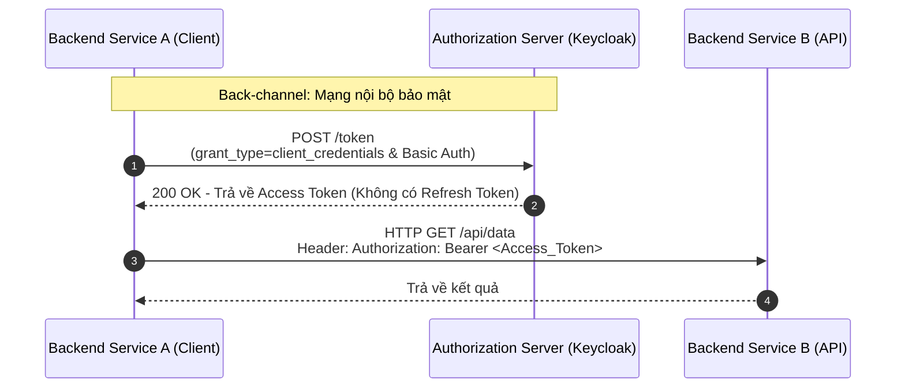

> [!NOTE]
> **Category:** Theory (Lý thuyết)
> **Goal:** Hiểu sâu về luồng Client Credentials, mô hình giao tiếp Machine-to-Machine (M2M) hoàn toàn không có sự tham gia của con người.

## 1. Lý thuyết chuyên sâu (Detailed Theory)

**OAuth 2.0 Client Credentials Grant** là luồng cấp quyền đặc thù nhất trong OAuth 2.0, bởi vì nó hoạt động dựa trên cơ chế **Machine-to-Machine (M2M)**. Ở luồng này, thực thể ủy quyền (Resource Owner) bị loại bỏ hoàn toàn; ứng dụng (Client) thay mặt chính bản thân nó truy cập vào các tài nguyên của hệ thống.

**Vấn đề cốt lõi:**
Trong kiến trúc Microservices, các service backend thường xuyên phải gọi API của nhau (ví dụ: Service Thanh toán gọi sang Service Thông báo). Các giao tiếp này diễn ra ngầm định ở tầng nền, không có người dùng tương tác trực tiếp với giao diện. Do đó, việc bật form đăng nhập (trình duyệt) hay dùng thông tin username/password của người dùng là hoàn toàn phi thực tế.

**Giải pháp:**
Sử dụng luồng Client Credentials. Mỗi Backend Service sẽ được định danh như một **Confidential Client** (một ứng dụng có khả năng lưu giữ bí mật) trên Keycloak. Keycloak cấp cho service đó cặp `client_id` và `client_secret`. Service sử dụng cặp thông tin này gọi trực tiếp đến Keycloak để đổi lấy Access Token. Lúc này, Access Token sẽ mang theo danh tính của ứng dụng thay vì danh tính của con người.

## 2. Luồng nội bộ & Cơ chế cấp thấp (Internal Workflow & Low-level Mechanisms)

Đây là luồng đơn giản và ngắn gọn nhất của OAuth 2.0 vì nó chỉ gồm một bước Request-Response đơn lẻ trực tiếp qua mạng Back-channel.



**Phân tích chi tiết quy trình:**
1. **Token Request:** Client A gửi một HTTP POST trực tiếp đến `/token` endpoint của AS. Thông số `grant_type` luôn phải được đặt là `client_credentials`. 
2. **Client Authentication:** Bắt buộc Client A phải chứng minh danh tính. Phương pháp phổ biến nhất là mã hóa `client_id` và `client_secret` dưới dạng chuỗi `Base64(client_id:client_secret)` và đặt vào Header `Authorization: Basic ...`. Một số hệ thống cũng hỗ trợ gửi secret qua tham số body (`client_id=...&client_secret=...`) nhưng không được ưu tiên vì lộ trên network proxy.
3. **Token Response:** Keycloak trả về Access Token. **Lưu ý cực kỳ quan trọng:** Luồng này không bao giờ trả về Refresh Token, vì Client có khả năng giữ bí mật `client_secret`, nó hoàn toàn có thể tự thực hiện lại luồng này để lấy Access Token mới bất cứ lúc nào.

## 3. Thực hành tốt nhất & Bảo mật (Best Practices & Security)

> [!WARNING]
> Tuyệt đối không sử dụng luồng Client Credentials trên các ứng dụng Frontend (như SPA React/Vue) hoặc thiết bị Mobile (Public Clients). Bất cứ ai dịch ngược mã nguồn đều có thể thấy được `client_secret` và giả mạo hệ thống với quyền hạn vô hạn.

> [!IMPORTANT]
> - **Chống lộ thông tin:** `client_secret` tương đương với mật khẩu root của ứng dụng. Phải lưu trữ nó trong các dịch vụ chuyên dụng như HashiCorp Vault hoặc Kubernetes Secrets, không hard-code trong git.
> - **Cấp quyền tối thiểu (Least Privilege):** Gán Service Account Roles trực tiếp cho Client trong Keycloak một cách cực kỳ cẩn thận. Không nên gán các quyền có mức độ phá hủy dữ liệu (như admin) nếu chỉ cần đọc.
> - **Client Authentication nâng cao:** Đối với các hệ thống tài chính, nên cân nhắc bỏ `client_secret` (vì nó là mật khẩu đối xứng) và thay bằng `Private Key JWT` (sử dụng chữ ký điện tử bất đối xứng - mTLS) để xác thực Client.

## 4. Cấu hình minh họa thực tế (Configuration Examples)

**Bật Service Accounts trên Keycloak:**
1. Chọn Client tương ứng (VD: `payment-service`).
2. Ở tab **Settings**, mục **Capability config**, bật công tắc **Service accounts roles**.
3. Lưu lại. Bạn sẽ thấy tab **Service Account Roles** xuất hiện để phân quyền riêng cho con Bot này.
4. Ở tab **Credentials**, lấy chuỗi `Client Secret`.

**Ví dụ lệnh CURL để lấy Token bằng Client Credentials:**

```bash
curl -X POST "http://keycloak.local:8080/realms/myrealm/protocol/openid-connect/token" \
  -H "Content-Type: application/x-www-form-urlencoded" \
  -u "payment-service:my-secret-key-123" \
  -d "grant_type=client_credentials"
```

*Hoặc gửi secret qua body (ít an toàn hơn về mặt ghi log mạng):*

```bash
curl -X POST "http://keycloak.local:8080/realms/myrealm/protocol/openid-connect/token" \
  -H "Content-Type: application/x-www-form-urlencoded" \
  -d "client_id=payment-service" \
  -d "client_secret=my-secret-key-123" \
  -d "grant_type=client_credentials"
```

## 5. Trường hợp ngoại lệ (Edge Cases)

- **Ngập lụt Request lên Token Endpoint (Token Storm):** Nếu một Backend Service A cần lấy dữ liệu từ Service B liên tục (10,000 requests/giây), nếu mỗi request nó lại gọi lấy một Client Credential Token mới thì hệ thống Keycloak sẽ bị sập vì quá tải.
  *Cách khắc phục:* Backend Service A phải lập trình để **cache (lưu trữ) Access Token** trên bộ nhớ (Redis hoặc RAM) cho đến gần sát thời gian hết hạn (`exp`) thì mới gọi Keycloak để xin Token mới.
- **Microservices xoay vòng Secret:** Khi `client_secret` nghi ngờ bị lộ, admin sẽ gen ra secret mới trên Keycloak. Tuy nhiên các microservices đang chạy vẫn giữ secret cũ trong biến môi trường. Chúng sẽ nhận mã lỗi `401 Unauthorized` từ Keycloak khi xin token mới. Phải cấu hình công cụ quản lý vòng đời như Kubernetes để tự động khởi động lại Pods khi Secret được update (Reload/Rolling Update).

## 6. Câu hỏi Phỏng vấn (Interview Questions)

1. **(Junior)** Tại sao Client Credentials Grant lại không có bước xác thực người dùng?
   - *Đáp án:* Vì đây là luồng dành riêng cho giao tiếp hệ thống với hệ thống (Machine-to-Machine - M2M). Các ứng dụng tự đại diện cho danh tính của mình để truy cập dữ liệu mà không thông qua bất kỳ tài khoản con người nào.
2. **(Junior)** Keycloak sử dụng tính năng gì để hỗ trợ luồng này?
   - *Đáp án:* Tính năng "Service Accounts Roles" - cho phép một Client đóng vai trò như một Account và có thể tự gán Role cho chính nó.
3. **(Senior)** Tại sao luồng này không bao giờ trả về Refresh Token?
   - *Đáp án:* Refresh Token sinh ra để cải thiện trải nghiệm người dùng, giúp họ không phải nhập lại mật khẩu khi Access Token hết hạn. Với M2M, Client đã sở hữu sẵn `client_secret` (tương đương mật khẩu cố định), nên nó có thể tự động xin Access Token mới bất kỳ lúc nào mà không gặp trở ngại gì về UI.
4. **(Senior)** Nêu một sai lầm phổ biến về mặt kiến trúc khi sử dụng Client Credentials giữa các Microservices có tần suất gọi cao?
   - *Đáp án:* Lập trình viên quên không cache Access Token. Cứ mỗi lần gọi API sang service B, service A lại gọi sang Keycloak xin một Token mới. Điều này làm sập Keycloak.
5. **(Senior)** So sánh sự an toàn giữa gửi `client_secret` qua Basic Auth Header và qua Body Form.
   - *Đáp án:* Gửi qua Basic Auth Header an toàn hơn. Tuy cả hai đều đi qua HTTPs an toàn trên đường truyền, nhưng các hệ thống Proxy/Load Balancer thường có xu hướng log lại nội dung Body Form nếu debug mode bật, dẫn đến rò rỉ secret ra file log. Header Authorization ít bị log toàn văn hơn.

## 7. Tài liệu tham khảo (References)

- [RFC 6749: The OAuth 2.0 Authorization Framework - Client Credentials Grant](https://datatracker.ietf.org/doc/html/rfc6749#section-4.4)
- [Keycloak Docs: Service Accounts](https://www.keycloak.org/docs/latest/server_admin/#_service_accounts)
