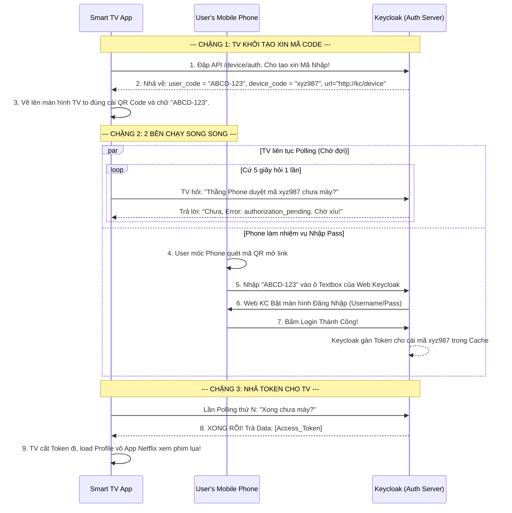

# Lesson 6: Đăng Nhập Không Bàn Phím (Device Flow)

> [!NOTE]
> **Category:** Theory (Lý thuyết)
> **Goal:** Bạn đang viết một ứng dụng xem phim trên **Smart TV**. TV không có bàn phím tử tế, việc cầm remote bấm chữ cái rùa bò để gõ Mật Khẩu Login Keycloak là thảm họa. Giao thức OAuth2 hỗ trợ một luồng sinh ra chỉ dành riêng cho những thiết bị hạn chế I/O này: **Device Authorization Grant (Device Flow)**.

## 1. Lý thuyết chuyên sâu (Detailed Theory)

### 1.1. Bối Cảnh Ra Đời Của Device Flow
Luồng này (RFC 8628) dành riêng cho: Smart TV, Máy Chơi Game (PlayStation, Xbox), Apple TV, hoặc các thiết bị IoT không có trình duyệt/bàn phím.
- **Vấn đề:** Không thể đá văng trình duyệt (Redirect) trên Smart TV vì nó có thể không có Browser xịn. Bắt nhập pass thì khó.
- **Giải pháp:** 
  1. Smart TV kết nối Keycloak, lấy về một Dãy Mã Ngắn (VD: `ABCD-1234`) và 1 cái Mã QR Code.
  2. TV hiển thị lên màn hình: "Hãy lấy Điện Thoại của bạn ra, quét QR này hoặc truy cập `keycloak.com/device`, rồi nhập mã `ABCD-1234` vào".
  3. Trong lúc bạn đang hí hoáy cầm Điện Thoại để thao tác Login, thì cái Smart TV nó âm thầm liên tục gọi (Polling) lên Keycloak hỏi: "Khách nhập mã xong chưa? Có token chưa?".
  4. Bạn đăng nhập trên Điện Thoại bằng vân tay cái "Tít" thành công.
  5. Lần Polling tiếp theo, Smart TV nhận được cái Access Token từ Keycloak! TV tự động nhảy màn hình "Đăng nhập thành công" như một phép thuật!

### 1.2. Bản Chất Bảo Mật Tuyệt Đỉnh (Tách Rời Thiết Bị)
Luồng này bảo mật ở chỗ: Nơi Bạn Nhập Mật Khẩu (Điện Thoại An Toàn) KHÁC BIỆT HOÀN TOÀN với Nơi Tiêu Thụ Token (Smart TV của nhà nghỉ/khách sạn).
- Nếu bạn nhập Pass bằng Remote TV khách sạn, rất có thể TV đó bị cài Keylogger trộm Pass.
- Dùng Device Flow, bạn bấm vân tay trên iPhone của bạn. Pass an toàn trên iPhone. TV chỉ được cầm cái Access Token có hạn sử dụng ngắn. Quá tuyệt vời!

---

## 2. Luồng nội bộ & Cơ chế cấp thấp (Internal Workflow & Low-level Mechanisms)

Hành Trình OIDC Rẽ Đôi - Giao Cắt Giữa Polling Của TV Và Hành Động Của Điện Thoại:

---

## 3. Thực hành tốt nhất & Bảo mật (Best Practices & Security)

> [!IMPORTANT]
> **Tuyệt Đỉnh Tẩy Khách Mạng Bọc (Nguy Cơ Bị Bóp Cổ DDoS Do Polling Quá Nhanh)**
> **Tội Ác Thiết Kế:** Bạn viết App Smart TV, dùng vòng lặp `while(true)` gọi lên API Keycloak liên tục mỗi 100 milliseconds để xem có Token chưa cho nó ngầu, khách khỏi phải chờ.
> **Hậu Quả:** Nếu có 1 vạn cái Smart TV đang ở màn hình chờ Login, hệ thống sẽ tạo ra HÀNG TRIỆU REQUEST mỗi giây đập vào cổng Keycloak. Máy chủ Auth gục ngã vì bị DDoS nội bộ!
> **Biện Pháp Sống Còn Lớp Trọng:** OAuth 2.0 Device Flow có quy định rõ biến thời gian trễ **`interval`** (Thường là 5 giây). 
> - API của Keycloak lúc nhả mã sẽ trả về `{ "interval": 5 }`.
> - Code Smart TV BẮT BUỘC phải delay đúng 5 giây giữa các lần gọi (SetTimeout). 
> - Nếu TV cố tình gọi nhanh hơn (VD: 3 giây), Keycloak sẽ tức giận tát thẳng lỗi `HTTP 400 - slow_down` phạt cảnh cáo. Quá nhiều lỗi nó chặn vĩnh viễn IP cái TV đó luôn! Hãy tôn trọng giới hạn tốc độ!

---

## 4. Cấu hình minh họa thực tế (Configuration Examples)

Lắp Ráp Cấu Hình Cho Thiết Bị Cùi Bắp Device Flow Trên Keycloak:
1. Bạn tạo một Client tên là `smart-tv-app`.
2. Do TV không có Backend an toàn (Nó là Public Client), gạt công tắc **`Client authentication`** sang **OFF**.
3. TẮT TẤT CẢ các Standard Flow, Direct Grant cũ đi.
4. Gạt công tắc cực kỳ đặc thù: **`OAuth 2.0 Device Authorization Grant`** sang trạng thái **ON**.
5. Bây giờ, App Smart TV có thể đập lệnh POST bằng cURL vào endpoint đặc biệt:
   - URL: `http://localhost:8080/realms/master/protocol/openid-connect/auth/device`
   - Body: `client_id=smart-tv-app`
6. Nhận về JSON chứa `user_code`. Sau đó user cầm điện thoại mở link `http://localhost:8080/realms/master/device` nhập mã là khớp lệnh!

---

## 5. Câu hỏi Phỏng vấn (Interview Questions)

**1. Trong Luồng Device Flow, Cái 'User Code' Bắt Nhập Trên Điện Thoại Tại Sao Thường Chỉ Có 8 Ký Tự Ngắn Ngủn (VD: BCDG-WXYZ), Còn Cái 'Device Code' Chạy Dưới Ngầm Thì Lại Dài Nhằng Và Vô Cùng Phức Tạp Bí Mật?**
- **Senior:** Hai mã này phục vụ 2 mục đích hoàn toàn trái ngược nhau:
  - **User Code (Mã Ngắn):** Vì mã này dùng để cho Con Người đọc bằng mắt từ màn hình TV và lấy ngón tay bấm trên Điện Thoại. Nếu dài và lằng nhằng (Có cả chữ O, số 0, chữ I, số 1) thì User gõ sẽ cực kỳ mệt và 100% gõ sai ức chế. Nên chuẩn quy định mã này chỉ chứa ký tự in hoa dễ đọc, loại bỏ các chữ cái dễ nhầm lẫn.
  - **Device Code (Mã Dài Bảo Mật):** Mã này dùng để cái Smart TV giao tiếp ngầm (Polling) với máy chủ Keycloak ở Background. Nó không cần con người đọc. Nó bắt buộc phải dài và chứa tính Entropy (Hỗn loạn) cao để Hacker không thể chạy lệnh Brute-force (Dò mật khẩu) giả mạo cái TV trong lúc chờ đợi. 
  - Tính năng tách đôi mã thiên tài này giúp đáp ứng được 2 thái cực: Vừa dễ xài cho Human, vừa đủ thép an toàn cho Machine!

---

## 6. Tài liệu tham khảo (References)
- **RFC 8628:** OAuth 2.0 Device Authorization Grant.
- **Keycloak Documentation:** Server Administration Guide - OAuth 2.0 Device Authorization Grant.
