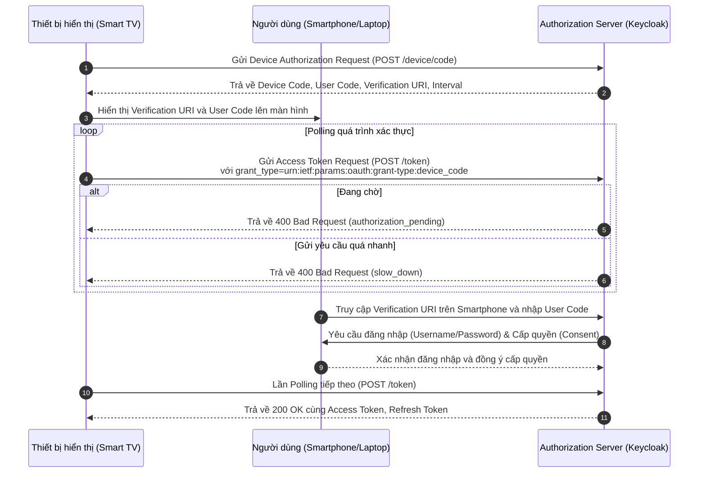

> [!NOTE]
> **Category:** Theory (Lý thuyết)
> **Goal:** Hiểu sâu về OAuth 2.0 Device Authorization Grant (RFC 8628), nắm rõ cách các thiết bị hạn chế đầu vào (như Smart TV, IoT) xác thực an toàn thông qua thiết bị thứ hai (như Smartphone).

## 1. Lý thuyết chuyên sâu (Detailed Theory)

**OAuth 2.0 Device Authorization Grant** (thường được gọi là Device Flow) là một luồng xác thực được thiết kế chuyên biệt cho các thiết bị kết nối Internet nhưng không có trình duyệt (browserless) hoặc có khả năng nhập liệu (input capabilities) cực kỳ hạn chế. Các thiết bị điển hình bao gồm Smart TV, máy chơi game console, thiết bị IoT, hay các công cụ giao diện dòng lệnh (CLI).

**Vấn đề cốt lõi mà Device Flow giải quyết:**
Trong các luồng xác thực truyền thống (như Authorization Code), người dùng phải tương tác với trình duyệt để nhập Username và Password. Tuy nhiên, việc nhập liệu trên Smart TV bằng Remote là một trải nghiệm tồi tệ và không an toàn. Hơn nữa, việc nhúng WebView trực tiếp vào ứng dụng trên thiết bị IoT sẽ làm lộ mật khẩu của người dùng cho Client, vi phạm nguyên tắc thiết kế của OAuth 2.0.

**Giải pháp:**
Device Flow tách biệt quá trình nhập thông tin xác thực khỏi thiết bị đang yêu cầu quyền truy cập (Client). Thiết bị Client (Smart TV) chỉ tạo ra một mã xác thực (User Code) và hiển thị lên màn hình. Người dùng sẽ sử dụng một thiết bị thứ hai, có đầy đủ khả năng duyệt web và nhập liệu (như Smartphone hoặc Laptop), để thực hiện quá trình Authentication và Authorization thay cho thiết bị ban đầu.

## 2. Luồng nội bộ & Cơ chế cấp thấp (Internal Workflow & Low-level Mechanisms)

Luồng Device Flow hoạt động bằng cách Client thực hiện thao tác **polling** (gọi liên tục) tới Authorization Server để kiểm tra xem người dùng đã hoàn tất việc cấp quyền trên thiết bị thứ hai hay chưa.



**Phân tích chi tiết các bước:**
1. **Device Authorization Request**: Client gửi yêu cầu HTTP POST tới `Device Authorization Endpoint` của Authorization Server. Request này chỉ bao gồm `client_id` (nếu là Public Client) và các `scope` cần thiết.
2. **Authorization Response**: AS trả về payload JSON bao gồm:
   - `device_code`: Mã bí mật dành cho Client, được dùng để polling Access Token.
   - `user_code`: Mã ngắn gọn dành cho người dùng nhập trên thiết bị thứ hai.
   - `verification_uri`: URL mà người dùng cần truy cập trên Smartphone.
   - `verification_uri_complete`: URL đã đính kèm sẵn `user_code` (tiện cho việc tạo QR Code).
   - `expires_in`: Thời gian hết hạn của `device_code` và `user_code`.
   - `interval`: Tần suất (tính bằng giây) mà Client được phép polling.
3. **Polling**: Client liên tục gọi tới Token Endpoint. Nếu AS trả về `authorization_pending`, Client phải đợi theo `interval` trước khi gọi lại.
4. **User Verification**: Người dùng truy cập `verification_uri` và nhập `user_code`. Đây là nơi diễn ra quá trình Authentication thực sự thông qua Session trên Smartphone.

## 3. Thực hành tốt nhất & Bảo mật (Best Practices & Security)

> [!WARNING]
> Device Flow chỉ nên được sử dụng cho các thiết bị thực sự bị hạn chế về giao diện đầu vào. Các ứng dụng Native (như app trên Smartphone) PHẢI sử dụng Authorization Code Flow với PKCE.

> [!IMPORTANT]
> - **Entropy của User Code**: `user_code` phải đủ ngắn để người dùng dễ nhập (vd: `A1B2-C3D4`), nhưng cũng phải đủ mạnh để chống lại các cuộc tấn công Brute-force. AS phải giới hạn số lần nhập sai `user_code` (Rate Limiting).
> - **Chống lại Phishing**: Người dùng phải cẩn trọng không quét mã QR ngẫu nhiên trên mạng. Việc hiển thị QR Code trên Smart TV là tốt, nhưng phải đảm bảo QR Code trỏ đúng tới Authorization Server thực.
> - **Rate Limiting trên Polling**: AS phải trừng phạt các Client polling quá nhanh bằng cách trả về lỗi `slow_down` và yêu cầu tăng `interval`.
> - **Thời gian sống (TTL) của Code**: Thời gian sống của `device_code` phải vừa đủ (thường là 5-15 phút) để người dùng hoàn tất thao tác.

## 4. Cấu hình minh họa thực tế (Configuration Examples)

**Bật Device Flow trong Keycloak:**
1. Đăng nhập vào **Keycloak Admin Console**.
2. Chọn Realm tương ứng, điều hướng đến **Clients**.
3. Chọn hoặc tạo một Client mới.
4. Tại tab **Settings**, tìm mục **Capability config**.
5. Bật tùy chọn **OAuth 2.0 Device Authorization Grant**.
6. Lưu lại cấu hình.

**Ví dụ một HTTP Request Request lấy Device Code:**

```http
POST /realms/myrealm/protocol/openid-connect/auth/device HTTP/1.1
Host: keycloak.local:8080
Content-Type: application/x-www-form-urlencoded

client_id=tv-app&scope=openid profile
```

**Ví dụ HTTP Response từ Keycloak:**

```json
{
  "device_code": "GmRhmhcxhwAzkoEqiMEg_DnyEysNkuNhszIySk9eS",
  "user_code": "WDJB-SQSU",
  "verification_uri": "http://keycloak.local:8080/realms/myrealm/device",
  "verification_uri_complete": "http://keycloak.local:8080/realms/myrealm/device?user_code=WDJB-SQSU",
  "expires_in": 600,
  "interval": 5
}
```

## 5. Trường hợp ngoại lệ (Edge Cases)

- **Người dùng không nhập User Code trong thời gian quy định:** Khi `expires_in` cạn kiệt, Authorization Server sẽ xóa thông tin tương ứng. Ở lần Polling tiếp theo, Client sẽ nhận được lỗi `expired_token`. Client lúc này phải làm mới giao diện và khởi tạo lại toàn bộ quy trình từ Bước 1.
- **Tấn công Cross-Device:** Kẻ tấn công trên mạng giả mạo một giao diện yêu cầu cập nhật phần mềm và yêu cầu người dùng nhập User Code (mà kẻ tấn công đã tạo sẵn). Nếu người dùng làm theo, kẻ tấn công sẽ nhận được Access Token trên thiết bị của mình. Cách phòng chống là luôn yêu cầu người dùng xác nhận thông tin thiết bị đang yêu cầu quyền (Device Fingerprint) trên màn hình phê duyệt (Consent Screen).
- **Client bỏ qua tham số Interval:** Nếu Client liên tục gửi Token Request bỏ qua giới hạn `interval`, AS sẽ phản hồi `slow_down` và ép Client phải chờ lâu hơn (ví dụ cộng thêm 5 giây vào Interval ban đầu).

## 6. Câu hỏi Phỏng vấn (Interview Questions)

1. **(Junior)** Device Flow là gì và nó giải quyết vấn đề gì trong OAuth 2.0?
   - *Đáp án:* Là luồng xác thực dành cho các thiết bị hạn chế đầu vào (Smart TV, IoT). Nó giải quyết vấn đề người dùng không thể hoặc khó nhập Username/Password an toàn trên thiết bị đó, bằng cách chuyển giao quá trình xác thực sang thiết bị thứ hai (Smartphone).
2. **(Junior)** User Code khác gì so với Device Code?
   - *Đáp án:* `user_code` là mã ngắn gọn, dễ đọc để người dùng nhập thủ công trên Verification URL. `device_code` là mã sinh ngẫu nhiên, dài và bí mật, được thiết bị Client dùng để polling Access Token.
3. **(Senior)** Nếu Client thực hiện polling liên tục với tần suất vượt quá cho phép, Authorization Server sẽ xử lý thế nào?
   - *Đáp án:* AS sẽ trả về lỗi HTTP 400 với error là `slow_down` để yêu cầu Client giãn cách thời gian polling theo một thông số Interval mới. Nếu vi phạm liên tục, AS có thể chặn tạm thời Client (Rate Limiting).
4. **(Senior)** Làm thế nào Authorization Server ngăn chặn kẻ tấn công brute-force cái mã `user_code` do nó khá ngắn?
   - *Đáp án:* Bằng cách triển khai cơ chế Rate Limiting nghiêm ngặt trên điểm cuối Verification. Nếu sai quá nhiều lần trong một khoảng thời gian ngắn, `user_code` đó sẽ bị AS vô hiệu hóa ngay lập tức.
5. **(Senior)** Tại sao Device Flow có thể bị lợi dụng để thực hiện Phishing, và cách phòng tránh tốt nhất là gì?
   - *Đáp án:* Kẻ tấn công có thể dụ người dùng nhập `user_code` của kẻ tấn công thông qua Social Engineering. Cách phòng tránh là AS phải hiển thị đầy đủ thông tin về Client đang yêu cầu quyền truy cập trên thiết bị thứ hai (tên App, loại thiết bị, vị trí địa lý xấp xỉ) để người dùng xác nhận trước khi cấp quyền.

## 7. Tài liệu tham khảo (References)

- [RFC 8628: OAuth 2.0 Device Authorization Grant](https://datatracker.ietf.org/doc/html/rfc8628)
- [Keycloak Documentation: Device Authorization Grant](https://www.keycloak.org/docs/latest/securing_apps/#_device_authorization_grant)
