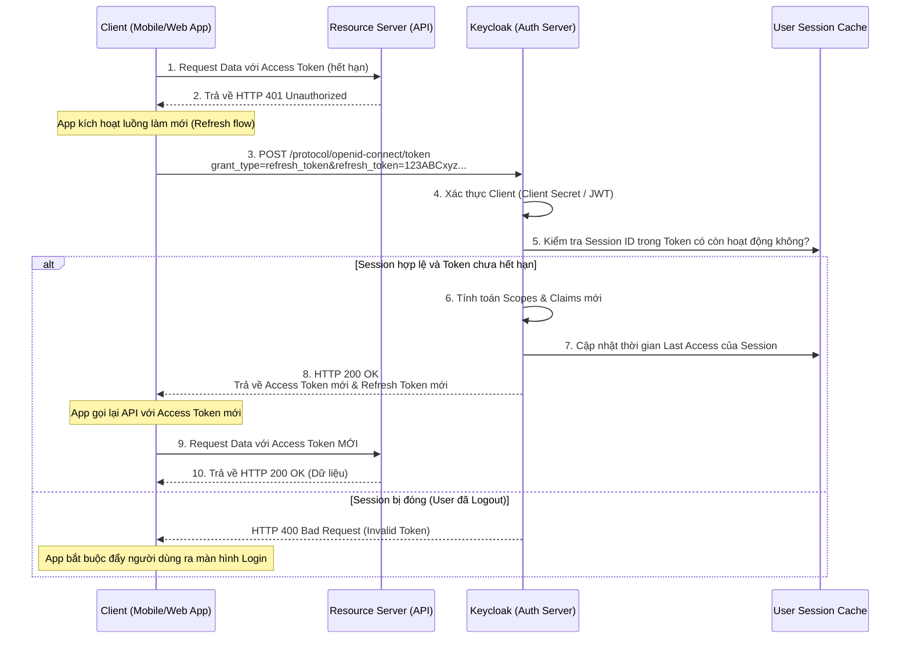

> [!NOTE]
> **Category:** Theory (Lý thuyết)
> **Goal:** Nghiên cứu bản chất, công dụng, và vòng đời của Refresh Token trong hệ sinh thái OAuth 2.0/OpenID Connect. Tìm hiểu cơ chế Refresh Token Rotation (Xoay vòng Token) nhằm nâng cao bảo mật hệ thống.

## 1. Lý thuyết chuyên sâu (Detailed Theory)

Trong kiến trúc ủy quyền bằng Token, **Access Token** là chìa khóa để vào nhà, mang quyền lực tối cao để đọc/ghi dữ liệu. Nếu Access Token bị lộ, kẻ gian có thể đánh cắp toàn bộ thông tin. Để giảm thiểu rủi ro, thời gian sống (TTL - Time to Live) của Access Token thường được đặt rất ngắn (từ 1 đến 5 phút). 

**Vấn đề:** Nếu Access Token hết hạn sau 5 phút, ứng dụng (Client) sẽ bị lỗi `401 Unauthorized`. Không thể bắt người dùng cứ 5 phút lại gõ Username/Password một lần để lấy Token mới, như vậy trải nghiệm người dùng (UX) sẽ vô cùng tồi tệ.

**Giải pháp - Refresh Token:**
Refresh Token là một chứng chỉ bảo mật tĩnh, có tuổi thọ dài hơn nhiều (có thể là vài giờ, vài ngày, hoặc vĩnh viễn đối với Offline Token). Nó được cấp kèm theo cùng lúc với Access Token. Khi Access Token hết hạn, ứng dụng Client sẽ âm thầm sử dụng Refresh Token để yêu cầu Authorization Server (Keycloak) cấp lại một bộ Token mới mà không cần sự can thiệp của người dùng (Silent renew).
- Refresh Token **không bao giờ** được gửi cho Resource Server (API backend). Nó chỉ được dùng để liên lạc tĩnh với Keycloak.
- Keycloak lưu trạng thái của Refresh Token vào cơ sở dữ liệu (In-memory Cache hoặc Database) thông qua khái niệm `User Session`.

---

## 2. Luồng nội bộ & Cơ chế cấp thấp (Internal Workflow & Low-level Mechanisms)

Khi Access Token của ứng dụng bị từ chối, ứng dụng sẽ khởi chạy luồng **Refresh Token Grant** tại endpoint `/token`.

**Lưu ý:** Quá trình cấp mới này hoàn toàn diễn ra ẩn (background, server-to-server) mà người dùng không hề hay biết.

---

## 3. Thực hành tốt nhất & Bảo mật (Best Practices & Security)

> [!IMPORTANT]
> **Refresh Token Rotation (Xoay vòng Refresh Token)**
> Đây là cơ chế bảo mật tối quan trọng. Mỗi khi Client dùng Refresh Token (RT1) để đổi lấy Token mới, Keycloak sẽ hủy RT1 và cấp ra một Refresh Token hoàn toàn mới (RT2). Nếu hacker đánh cắp được RT1 và cố gắng sử dụng nó sau đó (Replay attack), Keycloak sẽ nhận ra rằng RT1 đã được sử dụng trước đó (Reuse detected). Keycloak sẽ ngay lập tức **hủy toàn bộ phiên đăng nhập (Session)**, làm vô hiệu hóa luôn cả RT2 mà ứng dụng hợp pháp đang cầm. Đây là cách chống lại rò rỉ Token (Token Leak) vô cùng hiệu quả.

> [!WARNING]
> **Không lưu trữ Refresh Token không an toàn**
> Refresh Token giữ chìa khóa sinh mạng của phiên đăng nhập lâu dài. Trên Web App (SPA), tuyệt đối không lưu Refresh Token ở `localStorage`. Hãy lưu nó ở máy chủ Backend, hoặc gửi xuống trình duyệt dưới dạng `HttpOnly, Secure, SameSite=Strict Cookie` (Cơ chế BFF - Backend for Frontend).

> [!TIP]
> **Sử dụng Offline Access cho các Background Tasks**
> Nếu hệ thống của bạn cần đọc dữ liệu người dùng hàng đêm lúc 2 giờ sáng (khi người dùng không mở App), hãy xin quyền scope là `offline_access`. Keycloak sẽ cấp Offline Refresh Token. Khác với token thông thường, Offline Session được lưu xuống Database cứng (Persisted), nó sẽ sống ngay cả khi Keycloak Server bị restart và sống theo hàng tháng/năm cho đến khi bị thu hồi (Revoke).

---

## 4. Cấu hình minh họa thực tế (Configuration Examples)

### Kích hoạt Refresh Token Rotation trên Keycloak
1. Mở Admin Console -> Truy cập phần cấu hình `Clients` -> Chọn client của ứng dụng.
2. Tại tab `Advanced` -> Mục `Advanced Settings`.
3. Tìm tùy chọn **Revoke Refresh Token** và bật nó lên (**ON**).
4. Thiết lập **Refresh Token Max Reuse**: Khuyến nghị đặt là `0` (Mỗi token chỉ được dùng 1 lần duy nhất). Nếu mạng của bạn thường xuyên bị rớt gói tin gây mất phản hồi đồng bộ, bạn có thể cân nhắc đặt `1` để du di.

### Cấu hình thời gian sống (Lifespan)
1. Truy cập `Realm Settings` -> tab `Sessions`.
2. **SSO Session Idle:** Khoảng thời gian nếu người dùng không dùng App (không có lệnh refresh nào gọi lên Keycloak), session sẽ chết. Mặc định là 30 phút.
3. **SSO Session Max:** Thời hạn sống tối đa của một phiên dù người dùng có hoạt động năng nổ đến đâu. Mặc định là 10 giờ. Hết 10 giờ, Refresh Token hết hạn, phải login lại.

---

## 5. Trường hợp ngoại lệ (Edge Cases)

### Lỗi Race Condition với Refresh Token Rotation
- **Sự cố:** Ứng dụng SPA mở trên 3 tab trình duyệt khác nhau. Access Token hết hạn. Cả 3 tab đồng loạt gửi request tới API và đều nhận `401 Unauthorized`. Cả 3 tab đồng loạt gửi lệnh gọi cấp mới Token lên Keycloak với **CÙNG MỘT** Refresh Token gốc.
- **Hệ quả:** Request đầu tiên thành công, trả về RT mới. Hai request sau đến trễ, Keycloak coi đây là hành vi "Reuse detected" (Tái sử dụng) như hacker. Keycloak tự động hủy toàn bộ Session. Người dùng bị văng ra khỏi hệ thống đăng nhập.
- **Cách khắc phục:** 
  1. Frontend phải dùng thư viện có cơ chế "Lock" hoặc "Queue" (Ví dụ: `axios` interceptor chỉ cho phép 1 request đi làm mới token, các request khác tạm dừng và chờ token mới).
  2. Hoặc cấu hình Keycloak du di thời gian tái sử dụng một chút (không khuyến nghị vì làm giảm bảo mật).

---

## 6. Câu hỏi Phỏng vấn (Interview Questions)

1. **Tại sao không thiết lập Access Token sống được 10 giờ mà phải cần đến Refresh Token?**
   - *Junior:* Để an toàn hơn, lỡ mất Access Token thì người khác chỉ xài được 5 phút.
   - *Senior:* Access Token phi trạng thái (Stateless JWT) không cần tra cứu database nên rất nhanh, nhưng nhược điểm là không thể chủ động thu hồi (Revoke). Nếu kéo dài TTL của nó, khi có rủi ro, hệ thống bất lực không thể khóa người dùng. Giải pháp là rút ngắn TTL JWT, đẩy trách nhiệm kiểm tra trạng thái Session (Stateful) cho quá trình làm mới Refresh Token, giúp hệ thống có cơ hội (điểm dừng) để từ chối dịch vụ trước khi cấp token chu kỳ tiếp theo.

2. **Khi một người dùng đổi mật khẩu trên Keycloak, làm sao để vô hiệu hóa các ứng dụng họ đang dùng trên điện thoại cũ?**
   - *Senior:* Khi đổi mật khẩu, Keycloak tự động kích hoạt tính năng Xóa mọi User Sessions đang tồn tại liên quan đến User đó. Phiên đăng nhập trên điện thoại cũ bị xóa trên Keycloak. Khi ứng dụng trên điện thoại cũ gọi Refresh Token, nó sẽ bị báo lỗi (Session Not Found), ép điện thoại cũ phải quay về trang đăng nhập và nhập mật khẩu mới.

3. **Cơ chế Refresh Token Rotation (Xoay vòng) chống lại cuộc tấn công nào? Giải thích cách hoạt động.**
   - *Senior:* Chống Token Hijacking (Replay Attack). Khi Rotation kích hoạt, Refresh Token chỉ có giá trị sử dụng 1 lần (One-Time-Use). Nếu hacker trộm được RT gốc, và sau đó nạn nhân hợp pháp vào app khiến RT tự xoay sang cái mới (hủy RT gốc), khi Hacker cố dùng RT gốc, Keycloak sẽ phát hiện có người đang cố dùng lại token cũ. Keycloak không chỉ từ chối Hacker mà còn hủy luôn RT mới của nạn nhân (để an toàn tuyệt đối). Nạn nhân sẽ bị bắt login lại.

4. **Khác biệt giữa Session Idle Timeout và Session Max Timeout?**
   - *Junior:* Idle là thời gian không dùng máy, Max là thời gian tối đa được dùng.
   - *Senior:* `Idle` là khoảng thời gian tịnh tiến (Sliding window) được reset lại mỗi khi có request làm mới token. Nếu Idle = 30p, chỉ cần người dùng bấm app sau phút 29, phiên sẽ sống thêm 30p nữa. `Max` là thời gian tuyệt đối (Absolute timeout). Nếu Max = 10 giờ, thì dù bạn có bấm app liên tục mỗi phút, sau đúng 10 giờ (kể từ lúc login), bạn vẫn bị đăng xuất.

5. **`offline_access` token là gì và dùng khi nào?**
   - *Senior:* Nó là một Refresh Token đặc biệt sinh ra khi gọi cùng scope `offline_access`. Nó không tuân theo giới hạn SSO Session Max mà có bộ cấu hình Offline Session riêng (thường là sống nhiều ngày, nhiều tháng, và không biến mất khi Keycloak restart server do được ghi vào Database Disk). Dùng cho các tác vụ Cronjob, Batch processing, CI/CD pipelines chạy độc lập không có người dùng bấm màn hình.

---

## 7. Tài liệu tham khảo (References)

- [RFC 6749 - The OAuth 2.0 Authorization Framework](https://datatracker.ietf.org/doc/html/rfc6749)
- [OAuth 2.0 Security Best Current Practice - Token Replay](https://datatracker.ietf.org/doc/html/draft-ietf-oauth-security-topics)
- [Keycloak Server Administration Guide - SSO Sessions](https://www.keycloak.org/docs/latest/server_admin/)
