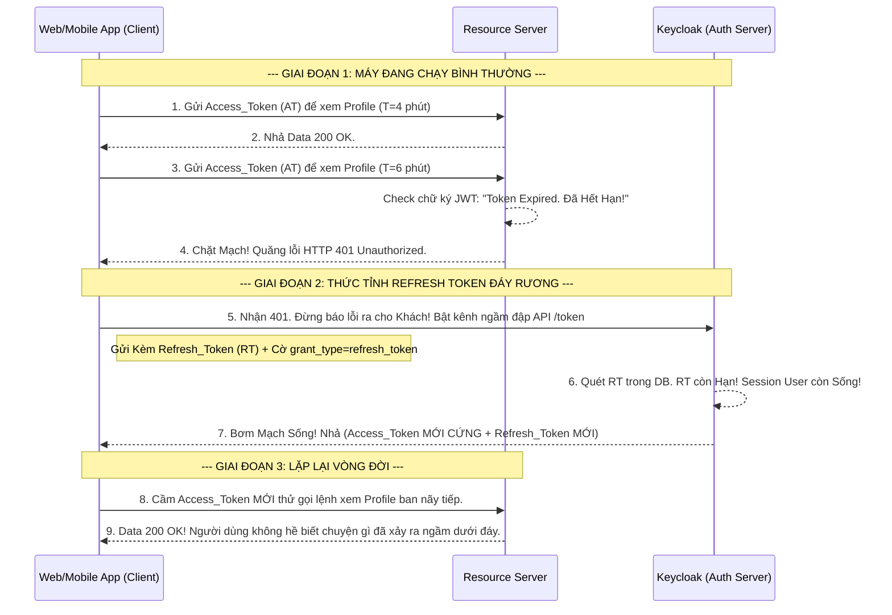

# Lesson 7: Giữ Chặt Đứt Phiên (Refresh Token)

> [!NOTE]
> **Category:** Theory (Lý thuyết)
> **Goal:** Access Token là Chìa Khóa mở API. Nhưng vì lý do an toàn, Chìa Khóa này bắt buộc phải hết hạn rất nhanh (thường là 5 phút). Nếu mỗi 5 phút bạn lại bắt Khách Hàng đăng nhập lại thì hệ thống của bạn sẽ bị gỡ cài đặt ngay lập tức. Để giải quyết, **Refresh Token (Thẻ Gia Hạn)** ra đời!

## 1. Lý thuyết chuyên sâu (Detailed Theory)

### 1.1. Refresh Token Là Gì? Tại Sao Cần Hai Loại Token Chống Nhau?
Trong bộ trả về tiêu chuẩn OIDC, Keycloak thường ném cho bạn 2 cục Token: `access_token` và `refresh_token`.
- **Access Token:** Mang tính chất "Xài liên tục". Nó được đẩy lên API ở mọi cú Click chuột của người dùng. Mức độ bay lượn ở bề mặt mạng Rất Cao -> Tỷ lệ bị lộ/ăn cắp cực cao.
  - **Cách đối phó:** Giới hạn tuổi thọ của nó cực ngắn (VD: 5-15 phút). Hacker có ăn cắp được thì xíu cũng hết xài.
- **Refresh Token:** Mang tính chất "Chôn dưới đáy rương". Nó tuyệt đối KHÔNG bao giờ được mang ra gọi đập vào các API lấy Data thông thường.
  - **Nhiệm vụ duy nhất:** Khi Access Token (thẻ đỏ) hết hạn gãy 401, Client mới lôi Refresh Token (thẻ vàng) dưới rương ra, phi thẳng về cổng ngã 3 của **Keycloak (Auth Server)** để xin Đổi Lấy Một Cái Access Token Mới Cứng!
  - Tuổi thọ của Refresh Token thường rất dài (VD: 30 ngày, hoặc 6 tháng). Nhờ nó mà 1 App Mobile có thể giữ login của khách 1 năm trời không bắt gõ Pass!

### 1.2. Tuổi Thọ Bức Cắt Phiên (Idle Timeout vs Max Lifespan)
Trên Keycloak, Refresh Token bị kiểm soát bởi 2 cây đồng hồ đếm ngược cực kỳ hiểm ác:
1. **SSO Session Idle:** Khoảng thời gian khách không thao tác (Lười biếng). Ví dụ 30 phút. Nếu trong 30 phút bạn không dùng Refresh Token để đổi Token mới, nó sẽ Chết Vĩnh Viễn do bị Timeout.
2. **SSO Session Max:** Tuổi thọ tối đa cứng nhắc. Ví dụ 10 tiếng. Cho dù bạn thao tác liên tục bấm đổi Token mỗi phút không lười biếng, thì tới mốc 10 tiếng (Hết phiên làm việc trong ngày), Keycloak vẫn Bóp Cổ Refresh Token và ép chết toàn bộ chuỗi phiên, bắt User đăng nhập Password lại vào ngày hôm sau!

---

## 2. Luồng nội bộ & Cơ chế cấp thấp (Internal Workflow & Low-level Mechanisms)

Hành Trình OIDC Hô Hấp Nhân Tạo (Gia Hạn Token Ngầm Backend):

---

## 3. Thực hành tốt nhất & Bảo mật (Best Practices & Security)

> [!IMPORTANT]
> **Tuyệt Đỉnh Tẩy Khách Mạng Bọc (Nguy Cơ Bị Trộm Refresh Token Vĩnh Cửu - Refresh Token Rotation)**
> **Mối Nguy Hiểm Lõi:** Nhỡ thằng Hacker lặn sâu vào kho LocalStorage của Trình Duyệt và cướp được cái Refresh Token (Thẻ Vàng)? Cái Token này sống tới 30 ngày! Thế là hacker cứ dùng Thẻ Vàng đổi ra Thẻ Đỏ (Access) và chơi bời phá hoại 1 tháng trời?
> **Biện Pháp Sống Còn Lớp Trọng Lực (Rotation):** Phải bật công tắc **`Revoke Refresh Token`** trên Client Keycloak. 
> - Cơ chế xoay vòng (Rotation) hoạt động như sau: Khi App của bạn dùng Thẻ Vàng (RT-số-1) để đổi thẻ mới. Keycloak nhả cho bạn bộ Token mới kèm 1 Thẻ Vàng mới (RT-số-2), ĐỒNG THỜI TIÊU HỦY LUÔN THẺ (RT-SỐ-1). Thẻ Vàng chỉ được XÀI 1 LẦN DUY NHẤT. 
> - **Cắt Cổ Hacker:** Nếu thằng Hacker ăn cắp cái RT-số-1, lúc nó đem đi đổi, Keycloak chửi: "Thẻ này đã xài rồi, mày là thằng ăn cắp bị lặp (Replay Attack)". Keycloak sẽ dùng Mạch Bức Cắt Khung **HỦY DIỆT TOÀN BỘ CÂY GIA PHẢ SESSION ĐÓ (Xóa cả Thẻ Vàng số 2 của App Xịn Đang Cầm Trọng Tay)**. Bắt cả Hacker và Nạn Nhân đăng nhập lại! Trải Lụa Tuyệt Đỉnh Zero-Trust!

---

## 4. Cấu hình minh họa thực tế (Configuration Examples)

Lắp Ráp Cấu Hình Refresh Token Quay Vòng Chống Trộm Trực Tiếp (Rotation) Trên Client Bọc Lụa:
1. Bạn chọn Client `react-frontend` trên Menu Keycloak.
2. Di chuyển sang Tab **Advanced** (Nâng Cao).
3. Cuộn tìm tới cụm **Advanced settings**. Bạn sẽ thấy các cờ OIDC bảo vệ.
4. Bật công tắc **`Revoke Refresh Token`** sang **ON**. 
   *(Sau mỗi lần đổi Refresh Token, cái cũ lập tức bốc hơi khỏi DB Cắt Khung).*
5. Có một ô đi kèm tên là **`Refresh Token Max Reuse`**: Đây là độ trễ ân hạn (Thường set là 0). Nếu Mạng Lag (App gửi lệnh đổi RT, Keycloak đổi xong trả RT mới về nhưng Đứt cáp, App ko nhận được). App sẽ kẹt với cái RT cũ. Nếu Set Reuse = 1, Keycloak sẽ du di cho App dùng lại RT cũ 1 lần nữa để vượt qua sự cố lag.

---

## 5. Câu hỏi Phỏng vấn (Interview Questions)

**1. Sếp Yêu Cầu Code Tính Năng SPA (Single Page App) Login. Cậu Đang Phân Vân Giữa Việc Lưu Refresh Token Dưới Cửa Sổ `LocalStorage` Của Browser Hay Dưới Dạng `HttpOnly Cookie`. Cậu Lựa Chọn Cái Nào Để Đạt Mức Bảo Mật Chóp Chuẩn OAuth 2.1 Hiện Đại?**
- **Senior:** Chắc Chắn 100% Là Phải Chôn Dưới Đáy Mạch **`HttpOnly Cookie`** Chống Trượt Bọt Rỗng!
  - **Nếu chôn ở LocalStorage:** Mọi mã Script JS chạy trên giao diện web (Kể cả mã rác của một tiện ích thứ 3 cài vào web) đều có lệnh đọc được RAM Trình duyệt và lôi tuột cục Refresh Token này lên dâng cho Hacker (Tấn công XSS - Cross-Site Scripting). Cực kỳ mong manh!
  - **Nếu dùng HttpOnly Cookie + Cờ Secure:** Cái bánh Quy (Cookie) chứa Refresh Token này bị Hệ Điều Hành Trình Duyệt BỌC THÉP TRẮNG TINH. Mọi lệnh JavaScript (Kể cả của chính Dev Code React xịn) đều **Mù Lòa Không Thể Đọc Hoặc Chạm Vào Nó Bằng Lệnh `document.cookie`**. Token chỉ được trình duyệt tự động đính ngầm dưới gầm xe Request khi bắn luồng Fetch/Axios đúng domain Keycloak. Trừ khi Hacker ăn trộm cả máy tính sếp, còn XSS khóc thét bỏ chạy Cắt Mạch Đứt Trải Lụa API Tuyệt Mật!

---

## 6. Tài liệu tham khảo (References)
- **RFC 6749:** Section 1.5 Refresh Token.
- **IETF OAuth 2.1 Draft:** Refresh Token Rotation.
