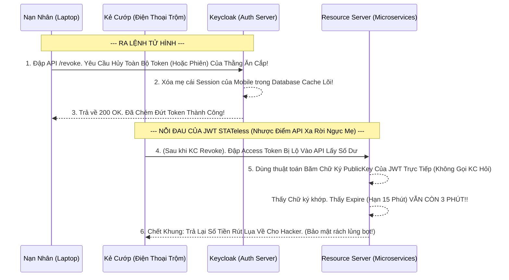

# Lesson 8: Lệnh Truất Ngôi Tử Hình (Token Revocation)

> [!NOTE]
> **Category:** Theory (Lý thuyết)
> **Goal:** Bạn đang dùng App Ngân Hàng, bỗng nhiên phát hiện điện thoại bị giật. Bạn mượn máy người khác truy cập Web Ngân hàng và bấm nút "Đăng xuất khỏi mọi thiết bị" (Logout All Devices). Hành động Bấm Cắt Cầu Dao đó trong OIDC gọi là **Token Revocation (Thu hồi Token)**. Bài này dạy bạn cách chém đứt kết nối của Token trước khi nó tự hết hạn.

## 1. Lý thuyết chuyên sâu (Detailed Theory)

### 1.1. Token Revocation Là Gì?
Khi Access Token (hoặc Refresh Token) được phát hành ra, nó sẽ sống tự do trên tay Client cho tới khi hết hạn (Expiration Time).
Nhưng trong một số tình huống khẩn cấp, bạn không thể đợi nó hết hạn được:
- Điện thoại của khách hàng bị trộm mất.
- Sếp phát hiện nhân viên A đang tuồn tài liệu nên đuổi việc ngay lập tức.
- Client App bị nghi ngờ đang làm lộ dữ liệu.

Giao thức mở rộng **RFC 7009 (OAuth 2.0 Token Revocation)** sinh ra để làm việc này. Nó cung cấp một Endpoint (Cánh cửa API API) đặc biệt trên Keycloak. Ứng dụng chỉ cần cầm Token ném vào cánh cửa đó và hô "HỦY!", Token sẽ lập tức biến thành rác.

### 1.2. Nỗi Đau Của JWT (Stateless) Khi Đụng Lệnh Truất Ngôi
Lý thuyết thì rất hay, nhưng thực tế với JWT Token là một **NỖI ÁC MỘNG** Về Bảo Mật:
- Khác với Session truyền thống (lưu trong RAM Server), JWT Access Token là loại (Stateless) Tự Bọc (Nó ký chữ ký chứa thông tin hạn dùng mang theo trên người).
- Các API Resource Server (Spring Boot / NodeJS) khi nhận JWT Access Token thường CHỈ DÙNG LUẬT TOÁN HỌC kiểm tra Chữ Ký mà KHÔNG HỎI LẠI KEYCLOAK (Để tiết kiệm thời gian mạng).
- **Trái Bom Nổ Chậm:** Khi Keycloak thu hồi Access Token (Xóa nó khỏi DB), thì ở bên dưới Tầng Api (Resource Server), nó VẪN KHÔNG HỀ HAY BIẾT GÌ CẢ. App kẻ trộm đập Token vào API, API check chữ ký vẫn đúng, vẫn chưa tới giờ tàn, API VẪN CHO HACKER VÀO RÚT TIỀN ẦM ẦM mặc kệ trên kia Keycloak đã tuyên án tử!

---

## 2. Luồng nội bộ & Cơ chế cấp thấp (Internal Workflow & Low-level Mechanisms)

Hành Trình OIDC Ném Lệnh Revocation Và Nút Thắt JWT Rỗng Bọt Của Máy Chủ:

---

## 3. Thực hành tốt nhất & Bảo mật (Best Practices & Security)

> [!IMPORTANT]
> **Tuyệt Đỉnh Tẩy Khách Mạng Bọc (Giải Quyết Khủng Hoảng Revocation JWT 4 Cách Cứu Bồ Mạch Nhựa Thép Đáy)**
> Để giải quyết nhược điểm "Chém đầu không chết" của JWT Access Token bên trên, hệ thống Mạng Lớn Dùng 4 Cách Cắt Mạch Đứt Sau:
> 1. **Tuổi Thọ Siêu Ngắn (Khuyên Dùng Nhất):** Đặt tuổi thọ Access Token chỉ có `5 Phút`. Nếu User Revoke, thì cùng lắm Hacker chỉ phá được 5 Phút là cái Token tự gãy thối nát (JWT Hết Expire Exp). API sẽ từ chối tự nhiên do thuật toán.
> 2. **Chỉ Revoke Refresh Token (Hủy Máy Bơm):** Ta thường chém chết cái Refresh Token (Vì nó đẻ ra Access Token). Hacker xài rác nốt 5 phút AT rồi mang cái RT ra đập lệnh đổi Token Mới -> Bùm! RT lúc này gọi lên Keycloak (Nơi có Database xịn) bị chặn họng lỗi Cút Văng 400 Oanh Cáp Cắt Đứt Nối Tương Lai Mạch Sống!
> 3. **Blacklisting (Danh Sách Đen Redis Cực Độ):** Bắt Keycloak khi Revoke thì Bơm thẳng mã UUID của Token đó vào con CSDL In-Memory Redis. Mọi API Backend khi nhận Token thay vì chỉ check Chữ ký Thuần, phải gọi lên Redis chớp nhoáng (Check Blacklist) xem mã Token này có bị chém đầu hay không. (Cách này tốn chi phí Mạng Microservices nhưng Siêu Kín Chóp Không Thể Lách Bọt Cắt Mạch).
> 4. **Token Introspection (Soi Mạch Trực Tiếp):** (Sẽ học ở Bài 9). Ép API Backend bỏ thuật toán Xác thực Offline (Check thuần JWT Local) sang Check Online Gọi Hỏi Thẳng Keycloak Trọng Tâm Cho Bề Mặt Sạch Rút!

---

## 4. Cấu hình minh họa thực tế (Configuration Examples)

Lắp Ráp Cấu Hình Client Cắt Mạch Token Rác OIDC Từ Lệnh Postman Đáy Bọc API:
1. API Cửa Lệnh Thu Hồi Chuẩn Của Keycloak Nằm Ở Địa Chỉ Tĩnh Oanh Cáp Bọc Thép:
   `http://localhost:8080/realms/master/protocol/openid-connect/revoke`
2. Để dập tắt 1 Session, Client App Cần Gửi Lệnh POST Bằng Postman Cắt Đáy Vào URL Trọng Kia:
   - **Header:** `Authorization: Basic [Base64 Của Client_ID:Client_Secret]` (Xác nhận ai đang đòi giết).
   - **Body:** Dạng Data Mạch Đáy URL-Encoded Xuyên Chóp. 
   `token=[Đưa Đoạn Mã Refresh Token Hoặc Access Token Vào Đây]` & `token_type_hint=refresh_token`.
3. Nếu Keycloak Xử tử thành công, Nó trả về Lệnh Lụa `200 OK` Chứ Không Trả Chữ Data Nào.
4. (Bạn có thể lên màn hình Admin Console, mục **Sessions** Của User, và Bấm Nút **Log Out** Lõi Dòng Đáy Tĩnh, Nút Này Có Sức Chém Tương Đương Lệnh Revocation Nhưng Là Diệt Chóp Toàn Bộ Phiên Cắt Toàn Cầu Giao Thức!)

---

## 5. Câu hỏi Phỏng vấn (Interview Questions)

**1. Trong Giao Thức OIDC Revocation RFC 7009. Cậu Truyền Cho Máy Chủ 1 Cái Access Token Của Một Hacker Đã Ăn Cắp Nhưng Không Gửi Kèm 'Client_Secret' Của Ứng Dụng Chứa Client Cấp Phát Mã Đó. Keycloak Sẽ Từ Chối Yêu Cầu Hủy Hay Vẫn Ra Tay Nghĩa Hiệp Tiêu Diệt Cục Rác Cho Cậu Rút Lệnh Bảo Vệ Data Của Client Đó?**
- **Senior:** Dạ thưa sếp, Keycloak Sẽ Lập Tức Báo Lỗi **`401 Unauthorized` Từ Chối Giết Token! Cứu Rỗi Không Đúng Thủ Tục RFC.**
  - **Lý do Vô Địch:** Lệnh Hủy Token Không Thể Được Ném Bừa Bãi! Giả sử Cậu biết Token Của Tôi, Cậu Cố Tình Phá Hoại Bằng Cách Dội Lệnh Lên Máy Chủ Kêu "Hủy Của Tao Đi". Nếu Keycloak Không Thẩm Định "Danh Tính Thằng Cầm Đao" Mà Đi Xóa Liền, Thì Ai Cũng Bị Chặt Đứt Phiên Trải Lụa Nghẽn Mạch Cục Bộ Của Nhau Được Do Tính Dò Đoán UUID Token Tràn Bọt Cắt Ảo!
  - Luồng Chuẩn Bắt Buộc: **Thằng Client Nào Sinh Ra Cái Token Đó Bằng Khóa Secret Của Nó**, Thì Chỉ Có ĐÚNG TAY THẰNG CLIENT ĐÓ VÁC SECRET LÊN DẬP MỚI ĐƯỢC PHÉP CHÉM TỬ HÌNH Token Của Mình Oanh Khung Dịch Lụa! Thằng Client Khác Mang Nhầm Auth Không Xóa Tréo Sân Cho Chóp API Bọc Được!

---

## 6. Tài liệu tham khảo (References)
- **RFC 7009:** OAuth 2.0 Token Revocation.
- **Keycloak Documentation:** Server Administration Guide - Revoking Tokens.
