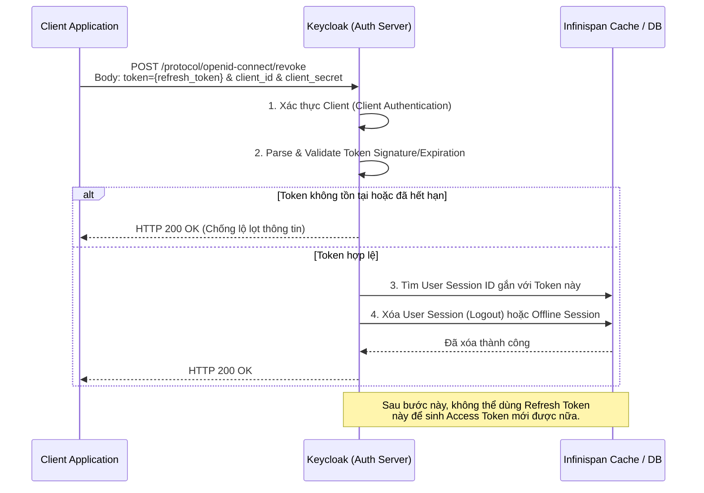

> [!NOTE]
> **Category:** Theory (Lý thuyết)
> **Goal:** Cung cấp hiểu biết chuyên sâu về giao thức Thu hồi Token (Token Revocation - RFC 7009). Phân tích cách Keycloak vô hiệu hóa các Token đang hoạt động và ranh giới kỹ thuật giữa việc thu hồi Refresh Token có trạng thái (Stateful) và Access Token phi trạng thái (Stateless).

## 1. Lý thuyết chuyên sâu (Detailed Theory)

Trong vòng đời của quá trình ủy quyền, không phải lúc nào Token cũng được phép tồn tại cho đến khi hết hạn (Expiration). Sẽ có những trường hợp khẩn cấp mà Token phải bị vô hiệu hóa ngay lập tức (Thu hồi - **Revocation**):
- Người dùng bấm nút Đăng xuất (Logout).
- Người dùng phát hiện điện thoại bị mất và muốn khóa tài khoản từ xa.
- Quản trị viên hệ thống phát hiện hành vi đáng ngờ và khóa người dùng (Disable User).
- Ứng dụng Client bị gỡ cài đặt.

Giao thức **RFC 7009 (OAuth 2.0 Token Revocation)** chuẩn hóa một endpoint (đường dẫn API) để Client gửi tín hiệu yêu cầu Authorization Server (Keycloak) thu hồi các token đã cấp trước đó.

### Nghịch lý của việc thu hồi Access Token (JWT)
Hầu hết các hệ thống hiện đại, bao gồm Keycloak, sinh ra Access Token dưới dạng **JSON Web Token (JWT) phi trạng thái (stateless)**. Có nghĩa là, một khi Keycloak đã ký và phát hành Access Token, nó không lưu Token đó trong cơ sở dữ liệu. Resource Server (API) tự kiểm tra chữ ký (Signature) để quyết định Token hợp lệ mà không cần hỏi Keycloak.
Vì vậy, nếu bạn gọi lệnh Thu hồi (Revoke) một Access Token, về mặt kỹ thuật Keycloak không thể "kéo" Token đó ra khỏi tay kẻ xấu được, và Resource Server vẫn sẽ chấp nhận Token cho đến khi nó hết hạn. Do đó, mục tiêu chính và hiệu quả nhất của Token Revocation là nhắm vào **Refresh Token** (Vì Refresh Token được Keycloak quản lý tập trung qua khái niệm Session).

---

## 2. Luồng nội bộ & Cơ chế cấp thấp (Internal Workflow & Low-level Mechanisms)

Khi một Client muốn thu hồi Token, nó gửi một HTTP POST request lên endpoint Revoke của Keycloak. Keycloak sẽ thực hiện các bước kiểm tra trước khi hủy phiên.



**Bảo mật Luồng:** Quá trình này đòi hỏi phải có thông tin xác thực của Client (Client Secret đối với Confidential Client). Nếu không, kẻ xấu có thể dùng một công cụ quét ngẫu nhiên chuỗi token và gửi lệnh phá hoại (Denial of Service - DoS) làm đăng xuất hàng loạt người dùng.

---

## 3. Thực hành tốt nhất & Bảo mật (Best Practices & Security)

> [!TIP]
> **Giữ vòng đời Access Token cực ngắn (Short-lived Access Token)**
> Để giải quyết nghịch lý thu hồi Access Token ở phần trên, cấu hình tốt nhất là đặt Access Token có tuổi thọ (Lifespan) rất ngắn (1 phút đến 5 phút). Khi cần Revoke hệ thống, bạn gọi Revoke API đối với Refresh Token. Kẻ thù chỉ có thể tận dụng Access Token tối đa trong vài phút trước khi nó tự hủy.

> [!IMPORTANT]
> **Chính sách "Not Before" (nbf) cho các hệ thống yêu cầu thu hồi ngay lập tức**
> Nếu hệ thống của bạn (như ngân hàng) bắt buộc Access Token phải vô hiệu ngay lập tức trên các Microservices, Keycloak cung cấp cơ chế **"Revocation Policy" (Push Not Before)**. Khi Admin bấm nút thu hồi, Keycloak gửi tín hiệu thông báo thời gian cắt (Cut-off time) đến tất cả các Resource Servers. Bất kỳ Token nào được phát hành trước thời điểm đó sẽ bị Resource Server từ chối ngay lập tức, bất chấp việc JWT vẫn chưa hết hạn.

> [!WARNING]
> **Phản hồi 200 OK cho mọi trường hợp**
> Theo chuẩn RFC 7009, ngay cả khi bạn truyền một token rác, token giả, hoặc token đã bị thu hồi từ trước, Endpoint vẫn phải trả về mã `200 OK` (chứ không phải 400 hay 404). Điều này ngăn chặn hacker thực hiện kịch bản "Dò tìm xem Token này có thật/còn hạn hay không".

---

## 4. Cấu hình minh họa thực tế (Configuration Examples)

Endpoint Revoke nằm tại địa chỉ chuẩn: `/realms/{realm-name}/protocol/openid-connect/revoke`.

**Lệnh cURL minh họa thu hồi Token đối với Public Client (Không cần secret):**
```bash
curl -X POST "https://auth.example.com/realms/myrealm/protocol/openid-connect/revoke" \
     -H "Content-Type: application/x-www-form-urlencoded" \
     -d "client_id=my-mobile-app" \
     -d "token=eyJhbGciOiJSUzI1Ni...[Nội dung Refresh Token]" \
     -d "token_type_hint=refresh_token"
```

**Lệnh cURL minh họa thu hồi Token đối với Confidential Client (Cần Basic Auth):**
```bash
curl -X POST "https://auth.example.com/realms/myrealm/protocol/openid-connect/revoke" \
     -H "Content-Type: application/x-www-form-urlencoded" \
     -u "my-backend-client:my-super-secret-key" \
     -d "token=eyJhbGciOiJSUzI1Ni...[Nội dung Refresh Token]"
```

*Tham số `token_type_hint` giúp Keycloak tìm token nhanh hơn trong cơ sở dữ liệu thay vì phải thử cả bảng Access Token lẫn Refresh Token.*

---

## 5. Trường hợp ngoại lệ (Edge Cases)

### Revoke Offline Tokens (Mã thông báo ngoại tuyến)
- **Sự cố:** Keycloak cho phép cấp `offline_access` token, token này không bao giờ hết hạn và được lưu vào cơ sở dữ liệu vật lý (thay vì in-memory cache). Nếu hệ thống bị xâm nhập và mất cơ sở dữ liệu, kẻ gian có thể có Offline Token.
- **Khắc phục:** Revoke endpoint hoạt động hoàn hảo với Offline Token. Tuy nhiên, quản trị viên có thể vào thẳng Admin Console -> `Users` -> `Sessions` -> Tab `Offline Sessions` để Revoke thủ công hàng loạt, hoặc thu hồi cấp phép trực tiếp trên tab `Consents` của User.

---

## 6. Câu hỏi Phỏng vấn (Interview Questions)

1. **Endpoint `revoke` theo RFC 7009 hoạt động như thế nào? Tại sao phải cần đến nó?**
   - *Junior:* Dùng để xóa bỏ Refresh Token hoặc Access Token khi người dùng logout hoặc bị lộ token, giúp token không thể dùng được nữa.
   - *Senior:* Nó cho phép Client báo hiệu cho Authorization Server vô hiệu hóa authorization grant liên kết với Token. Nó giúp làm sạch trạng thái (Session state) ở server, cắt đứt khả năng sinh thêm token mới, tăng tính an toàn, đáp ứng yêu cầu Compliance (tuân thủ bảo mật).

2. **Tại sao việc gửi một token không hợp lệ (invalid token) vào endpoint Revoke lại trả về 200 OK thay vì lỗi?**
   - *Junior:* Do quy định của RFC.
   - *Senior:* Đây là thiết kế bảo mật để chống lại "Information Disclosure" (Lộ lọt thông tin) và "Oracle Attacks". Nếu hệ thống trả về lỗi, kẻ tấn công có thể liên tục tạo token giả và theo dõi phản hồi để phán đoán thuật toán sinh token hoặc dò tìm token của người khác.

3. **Revoke Access Token (loại JWT) trong kiến trúc Stateless (phi trạng thái) có ý nghĩa thực tế không?**
   - *Senior:* Hầu như không có ý nghĩa thực tế để phòng vệ ngay lập tức. Vì Resource Server (API) chỉ chạy hàm xác thực chữ ký nội bộ mà không gọi lên Keycloak. Trừ khi Resource Server sử dụng API Introspection (RFC 7662) cho mỗi request, hoặc Keycloak thực thi cơ chế Push Not Before Policy (Blacklisting). Vì vậy, tốt nhất là chỉ revoke Refresh Token và giữ TTL của Access Token cực ngắn.

4. **Biến `token_type_hint` dùng để làm gì? Bắt buộc hay không?**
   - *Junior:* Để báo cho server biết là mình đang revoke Access hay Refresh token. Không bắt buộc.
   - *Senior:* Không bắt buộc. Nếu có, Auth Server sẽ tìm trong bảng dữ liệu tương ứng trước, giúp tối ưu hóa hiệu năng cơ sở dữ liệu. Nếu không tìm thấy, Server vẫn bắt buộc phải tìm (fallback) trong các bảng dữ liệu của các loại token khác trước khi kết luận.

5. **Phân biệt giữa API Revoke và API Logout (OIDC Front-channel/Back-channel Logout)?**
   - *Senior:* Revoke (RFC 7009) được Client dùng để vô hiệu hóa một Token cụ thể (thường xử lý ở lớp background, máy móc với máy móc). OIDC Logout tập trung vào việc hủy phiên đăng nhập (User Session) trên trình duyệt (Browser), thường yêu cầu redirect người dùng hoặc xóa Cookie (SSO Session). Việc Logout sẽ dẫn đến hậu quả vô hiệu hóa toàn bộ Token, nhưng Revoke Token thì không nhất thiết dẫn đến Logout hoàn toàn nếu người dùng vẫn còn Cookie trên Keycloak.

---

## 7. Tài liệu tham khảo (References)

- [RFC 7009 - OAuth 2.0 Token Revocation](https://datatracker.ietf.org/doc/html/rfc7009)
- [Keycloak Server Administration Guide - Revocation Policies](https://www.keycloak.org/docs/latest/server_admin/)
- [RFC 7523 - JWT Profile for OAuth 2.0 Client Authentication](https://datatracker.ietf.org/doc/html/rfc7523)
