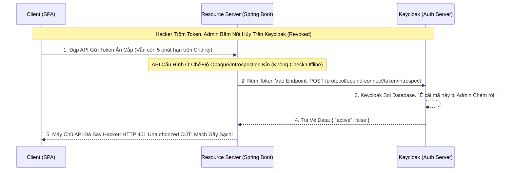

# Lesson 9: Cảnh Sát Soi Chiếu (Token Introspection)

> [!NOTE]
> **Category:** Theory (Lý thuyết)
> **Goal:** Trong Bài 8, chúng ta đã biết nhược điểm chết người của JWT là "Cắt Đầu Vẫn Sống" vì API (Resource Server) thường chỉ check chữ ký offline. Để vá lỗ hổng này ở mức độ bảo mật cao nhất, các API phải từ bỏ sự lười biếng và chuyển sang gọi ngược về Keycloak để hỏi xem Token còn sống không. Hành động "Hỏi Gốc" này gọi là **Token Introspection**.

## 1. Lý thuyết chuyên sâu (Detailed Theory)

### 1.1. Token Introspection Là Gì?
Chuẩn RFC 7662 định nghĩa một Endpoint đặc biệt trên Keycloak. 
Nó sinh ra để phục vụ RIÊNG CHO CÁC MÁY CHỦ API (Resource Server).
- Thay vì API tự lấy Public Key băm giải mã JWT (Check Offline).
- API sẽ ném cái cục Token đó qua đường truyền kín vào API của Keycloak: `Ê Keycloak, soi giùm tao cái Token này xem nó còn hợp lệ không?`.
- Keycloak sẽ chui vào Database của nó, soi xem Token này đã bị Revoke (Thu hồi) chưa, User của Token này có vừa bị Ban (Khóa tài khoản) hay không. Sau đó Keycloak trả về 1 cục JSON thông báo `{"active": true}` hoặc `{"active": false}`.

### 1.2. Opaque Token (Token Bọc Nhựa Bí Mật)
Introspection Endpoint sinh ra để hỗ trợ loại Token siêu bảo mật có tên là **Opaque Token (Token Đục)**.
- **JWT (Token Trong Suốt):** Dài loằng ngoằng, ai cầm lấy ném lên trang `jwt.io` cũng đọc được sạch sành sanh ruột gan (Tên, Email, Role) vì nó chỉ mã hóa Base64URL. Dễ bị lộ thông tin cá nhân (PII) ra màn hình Trình duyệt.
- **Opaque Token:** Cực ngắn (VD: `abcxyz123456`). Ném lên mạng chả có ý nghĩa gì. Nó chỉ là 1 con trỏ (Pointer). App khách lấy được chả biết trong đó có gì. Khi App gửi cái mã `abcxyz` này cho Backend API. Bắt buộc Backend API PHẢI GỌI LỆNH INTROSPECTION lên Keycloak. Keycloak sẽ đối chiếu cái mã `abcxyz` này trong Database và nhả về JSON chứa ruột gan của User cho API xử lý. Tuyệt đỉnh bảo mật che giấu dữ liệu!

---

## 2. Luồng nội bộ & Cơ chế cấp thấp (Internal Workflow & Low-level Mechanisms)

Hành Trình OIDC Đánh Sập Lỗ Hổng Hủy Token Chậm Nhờ Introspection:



---

## 3. Thực hành tốt nhất & Bảo mật (Best Practices & Security)

> [!IMPORTANT]
> **Tuyệt Đỉnh An Toàn Lựa Chọn Kiến Trúc (Đánh Đổi Giữa Tốc Độ Và Khóa An Toàn)**
> **Tội Ác Thiết Kế:** Bạn nghe nói Introspection xịn quá, chặn được lệnh Revoke tức thời. Bạn ép 100 cái Microservices API của Cty chuyển sang xài Introspection 100% thay vì Check Offline.
> **Hậu Quả:** Cứ mỗi Request từ ReactJS dội xuống API. API của bạn (thay vì xử lý nhanh rồi trả) lại phải Tạm Dừng, Đợi Gọi Nối Mạng TCP/IP sang Keycloak để hỏi Introspect. Bất ngờ lượng Traffic tăng vọt 10.000 Request/s. Keycloak biến thành Cổ Chai Thắt Ngạt Cổ (Bottleneck) chịu đòn 10.000 nhát chém mạng liên tiếp. Keycloak Sập! Toàn bộ hệ thống sập!
> **Biện Pháp Sống Còn Lớp Trọng Lực:**
> Phải biết Dùng Đúng Chỗ:
> - **API Bình Thường (Xem báo chí, tải File):** Dùng Check Offline JWT Tĩnh (Stateless). Nhanh, Không nghẽn máy chủ Keycloak. Bị lộ Token xài chùa 5 phút chả sao.
> - **API Lõi Siêu Quan Trọng (Chuyển tiền, Duyệt chi 1 Tỷ, Đổi Pass):** Ở Tầng Này Bắt Buộc Dùng Introspection Endpoint (Hoặc Caching Introspect vào Redis). Chấp nhận trễ thêm 10ms mạng nhưng đổi lại Sự An Toàn Chặn Ngược Tức Thì Kẻ Trộm Cắt Phiên!

---

## 4. Cấu hình minh họa thực tế (Configuration Examples)

Lắp Ráp Cấu Hình Đập Lệnh Vào Cửa Introspection Trên Keycloak Bằng cURL:
1. URL Chuẩn Oanh Cáp Của Keycloak Nằm Tại: `http://localhost:8080/realms/master/protocol/openid-connect/token/introspect`
2. **CẢNH BÁO BẢO MẬT KHUNG:** Cái Endpoint này chứa Lệnh Mở Rương Soi Database Của Lãnh Chúa, Cho nên Nó KHÔNG MỞ CỬA PUBLIC Tự Do Trượt Khung.
3. API Spring Boot Hoặc NodeJS Khi Gọi Gõ Cửa Này Bắt Buộc Phải **Xác Thực Danh Tính Của Nó (Client Authentication)**.
   - Nó Phải Gửi Kèm Header Lệnh Chứa: `Authorization: Basic [Base64(Client_ID : Client_Secret)]`.
4. Nếu Lệnh Gõ Cửa Hợp Lệ, Gửi Body Form Data Cột: `token=[Chuỗi Access Token Cần Soi]`.
5. Kết Quả JSON Trả Về Khớp Lệnh Cắt Khung Sẽ Bao Gồm Toàn Bộ Ruột Của Token (Nếu Đang Sống):
```json
{
  "exp": 1695420000,
  "iat": 1695419700,
  "jti": "54b5f483...",
  "aud": "my-client",
  "sub": "user-uuid-1234",
  "typ": "Bearer",
  "azp": "my-client",
  "preferred_username": "nguyenvana",
  "active": true   // <--- Dòng Chữ Sống Còn Quyết Định Sinh Tử Nhả Lụa Mạng Mạch
}
```

---

## 5. Câu hỏi Phỏng vấn (Interview Questions)

**1. Nếu Một Access Token Vẫn Còn Cờ 'active: true' Lên Mạch Keycloak. Nhưng Lúc Gọi Lệnh Introspect Về API Lõi Của Spring Boot, API Phát Hiện Mảng 'aud' (Audience) Của Token Đó Mang Tên Là 'app-mua-hang' Chứ Không Phải 'app-ke-toan'. Liệu API Có Chấp Nhận Token Đó Cho Giao Dịch Không? Giải Thích Ý Nghĩa Claim AUD?**
- **Senior:** Chắc Chắn 100% Là Spring Boot API Phải Từ Chối Và Ném Ra Bọt Lỗi HTTP 403 Forbidden Oanh Khung Dịch Lụa!
  - Lý do: Mặc dù Token còn sống (Active), nhưng nó Mắc Lỗi Khớp Đích Nhắm **`Audience (aud)`**.
  - **Audience (Độc giả mục tiêu):** Là cờ bảo mật đỉnh cao của OAuth2. Khi App-Mua-Hang xin Token, Keycloak sẽ đóng dấu lên Token đó cờ `aud="app-mua-hang"`. Cờ này có nghĩa là "Token Này Chỉ Được Dùng Để Đi Chợ Tới Các API Của Hệ Sinh Thái Mua Hàng".
  - Nếu thằng Hacker cướp được cái Token đó, chạy sang đập vào cửa API App Kế Toán. API Kế Toán bóc Token ra soi lệnh thấy Audience sai lệch với Tên Đích của mình. Lập tức API Ngắt Cửa Vì Thằng Này Có Giấy Thông Hành Của Rạp Phim Mà Đòi Vào Ngồi Sân Bay! Tránh Tấn Công Token Substitution (Tráo Token Mù)!

---

## 6. Tài liệu tham khảo (References)
- **RFC 7662:** OAuth 2.0 Token Introspection.
- **Keycloak Documentation:** Server Administration Guide - Token Introspection.
