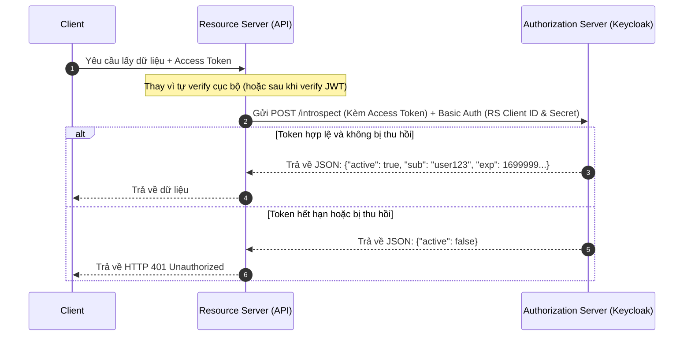

> [!NOTE]
> **Category:** Theory (Lý thuyết)
> **Goal:** Hiểu cơ chế chuẩn hóa của RFC 7662 để kiểm tra trạng thái và meta-data của Access Token, Refresh Token (Token Introspection) giữa Resource Server và Authorization Server.

## 1. Lý thuyết chuyên sâu (Detailed Theory)

**OAuth 2.0 Token Introspection (RFC 7662)** định nghĩa một phương thức (endpoint) cho phép các Resource Server (RS) truy vấn chủ động vào Authorization Server (AS) để lấy trạng thái (status) hoạt động hiện tại của một OAuth 2.0 Token.

**Vấn đề cốt lõi mà Token Introspection giải quyết:**
Với các Token có định dạng đục (Opaque Tokens) - là những chuỗi ký tự ngẫu nhiên, không mang nội dung ngữ nghĩa bên trong, Resource Server không thể tự mình giải mã hoặc xác minh chữ ký của Token (như JWT). Để biết token có hợp lệ không, do ai phát hành, cho user nào, và bao giờ hết hạn, RS bắt buộc phải mang Token đó "đi hỏi" AS.
Ngay cả với JWT (định dạng minh bạch), Introspection vẫn rất quan trọng: Nó là cách **duy nhất theo thời gian thực** để biết một JWT đã bị thu hồi (Revoked) trước thời hạn (ví dụ: User bị khóa tài khoản hoặc chủ động đăng xuất khỏi mọi thiết bị) hay chưa. 

**Giải pháp:**
Cung cấp một REST API (POST `/introspect`) để Resource Server truyền Token vào. AS sẽ kiểm tra database/cache nội bộ và trả về một đối tượng JSON đại diện cho tính hợp lệ (`active: true/false`) kèm theo các claims về đối tượng thụ hưởng.

## 2. Luồng nội bộ & Cơ chế cấp thấp (Internal Workflow & Low-level Mechanisms)



**Phân tích chi tiết quy trình:**
1. **Introspection Request:** RS gọi HTTP POST đến Endpoint `/introspect` của AS.
   - Body chứa tham số `token=...`.
   - Header phải đi kèm chứng chỉ xác thực của bản thân RS (thường là Basic Auth hoặc Bearer Token), bởi vì điểm cuối này trả về thông tin bảo mật, không được public.
2. **Introspection Response:**
   - Trường hợp Token không còn hoạt động, hoặc không tồn tại, JSON trả về chỉ duy nhất `{"active": false}` để ngăn chặn rò rỉ thông tin cho kẻ tấn công (không cho biết token lỗi do ai hay loại trừ token hết hạn).
   - Trường hợp Token hợp lệ, AS trả về `{"active": true}` và kèm theo các thông số:
     - `scope`: Quyền hạn của Token.
     - `client_id`: App nào đã xin cái Token này.
     - `username`: Người dùng là ai.
     - `exp`, `iat`, `nbf`: Thời gian hợp lệ.

## 3. Thực hành tốt nhất & Bảo mật (Best Practices & Security)

> [!WARNING]
> Việc gọi Token Introspection trên mỗi API Request sẽ tạo ra một nút thắt cổ chai (bottleneck) khổng lồ đối với Authorization Server và làm tăng độ trễ (latency) của hệ thống. 

> [!IMPORTANT]
> - **Cơ chế Caching cục bộ:** Resource Server bắt buộc phải có cơ chế cache (như Redis hoặc In-memory cache với TTL ngắn) để lưu kết quả Introspection. Ví dụ: Cache lại 1 phút, giúp giảm tới 90% lượng request lên Keycloak.
> - **Ủy quyền sử dụng Introspection:** Không được mở quyền Public cho Introspection endpoint. Chỉ các Client đặc biệt cấu hình đóng vai trò là "Resource Server" và cung cấp Client Secret mới được quyền gọi API này.

## 4. Cấu hình minh họa thực tế (Configuration Examples)

**Cấu hình bằng curl gọi lên Keycloak:**

```bash
curl -X POST "http://keycloak.local:8080/realms/myrealm/protocol/openid-connect/token/introspect" \
  -H "Content-Type: application/x-www-form-urlencoded" \
  -u "my-resource-server:my-rs-secret" \
  -d "token=eyJh..." 
```

**Ví dụ phản hồi JSON khi Token hợp lệ:**

```json
{
  "exp": 1612345678,
  "iat": 1612345378,
  "jti": "d0c0c629-9e8c-4a37-b765-b1a9c3d4e5f6",
  "iss": "http://keycloak.local:8080/realms/myrealm",
  "aud": "my-resource-server",
  "sub": "b2c3d4e5-f6a7-b8c9-d0e1-f2a3b4c5d6e7",
  "typ": "Bearer",
  "azp": "my-frontend-client",
  "session_state": "ab1234cd",
  "name": "Lucky Dev",
  "given_name": "Lucky",
  "family_name": "Dev",
  "preferred_username": "luckydev",
  "email": "lucky@example.com",
  "email_verified": true,
  "acr": "1",
  "realm_access": {
    "roles": [
      "offline_access",
      "uma_authorization"
    ]
  },
  "resource_access": {
    "account": {
      "roles": [
        "manage-account",
        "manage-account-links",
        "view-profile"
      ]
    }
  },
  "scope": "openid email profile",
  "client_id": "my-frontend-client",
  "username": "luckydev",
  "active": true
}
```

## 5. Trường hợp ngoại lệ (Edge Cases)

- **Ngộ nhận trạng thái Error 401 khi gọi Introspection:** Nếu HTTP trả về Status `200 OK` nhưng body JSON là `{"active": false}`, điều đó có nghĩa là API hoạt động tốt và Token truyền vào không hợp lệ. Chỉ khi thông tin xác thực của bản thân Resource Server (`-u rs:secret`) bị sai thì AS mới trả về HTTP `401 Unauthorized` cho HTTP Request.
- **Microservices và Vấn đề Hiệu năng (Thundering Herd):** Khi một Access Token cấp cho nhiều tác vụ cùng một lúc, nếu một request gọi sang hệ thống và các microservice cùng gọi introspection về một token chưa được cache, Keycloak sẽ chịu tải cực lớn. Hệ thống nên triển khai JWT để verify chữ ký (Local validation) thay vì introspection cho mọi token, và chỉ dùng introspection nếu token bị nghi ngờ hoặc cho các thao tác cực kỳ nhạy cảm (như chuyển tiền).

## 6. Câu hỏi Phỏng vấn (Interview Questions)

1. **(Junior)** Mục đích của Token Introspection endpoint là gì?
   - *Đáp án:* Cho phép Resource Server kiểm tra xem một Token (Access hoặc Refresh) có còn hợp lệ hay không (`active: true/false`) và trả về các thông tin meta của Token đó.
2. **(Junior)** Nếu một Token đã hết hạn thì JSON trả về từ endpoint /introspect sẽ trông như thế nào?
   - *Đáp án:* Sẽ là JSON chứa `{"active": false}`.
3. **(Senior)** Nếu dùng JWT (có thể tự verify chữ ký offline bằng Public Key), tại sao Resource Server vẫn có thể cần gọi Token Introspection?
   - *Đáp án:* Vì self-contained JWT không tự phản ánh được trạng thái Revocation (ví dụ: quản trị viên đã thu hồi quyền của User hoặc ép User log out mọi thiết bị trên Keycloak). Lệnh Introspection giúp RS có được trạng thái hợp lệ theo thời gian thực (Real-time validity check).
4. **(Senior)** Để giải quyết vấn đề hiệu năng do gọi /introspect liên tục, bạn đề xuất kiến trúc nào?
   - *Đáp án:* Sử dụng mô hình Hybrid: Resource Server sẽ cache cục bộ trạng thái Introspection trong một khoảng thời gian ngắn (ví dụ TTL 30 giây đến 1 phút), kết hợp với việc kiểm tra JWT Signature offline và xác minh Token Expiry (exp).
5. **(Senior)** API gọi `/introspect` có cần gửi thông tin xác thực nào không hay gọi tự do?
   - *Đáp án:* Bắt buộc phải có thông tin xác thực của Resource Server (như Client_id và Client_Secret qua Basic Auth), vì đây là API mang tính chất truy vấn hệ thống nhạy cảm.

## 7. Tài liệu tham khảo (References)

- [RFC 7662: OAuth 2.0 Token Introspection](https://datatracker.ietf.org/doc/html/rfc7662)
- [Keycloak Endpoint Reference - Token Introspection](https://www.keycloak.org/docs/latest/securing_apps/#_token_introspection_endpoint)
