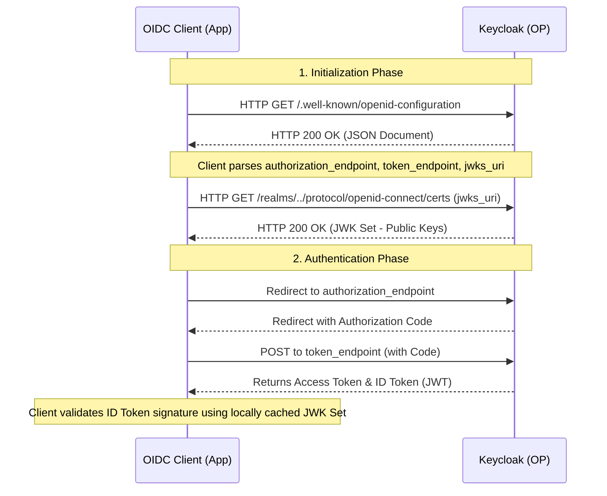

> [!NOTE]
> **Category:** Theory (Lý thuyết)
> **Goal:** Hiểu sâu về cơ chế OpenID Connect Discovery, tệp `/.well-known/openid-configuration`, và vai trò của nó trong cấu hình động (dynamic configuration) cho các Client.

## 1. Lý thuyết chuyên sâu (Detailed Theory)

OpenID Connect (OIDC) Discovery là một cơ chế tiêu chuẩn (được định nghĩa trong OIDC Discovery 1.0) cho phép các Client tự động khám phá và cấu hình các thông số cần thiết để tương tác với OpenID Provider (OP) – ở đây là Keycloak. Thay vì phải cấu hình thủ công (hardcode) hàng loạt các URL và tham số mã hóa vào ứng dụng Client, OIDC Discovery cung cấp một JSON document chuẩn hóa tại một endpoint cố định được gọi là Discovery Endpoint.

Trong Keycloak, endpoint này thường nằm ở dạng:
`https://<keycloak-host>/realms/<realm-name>/.well-known/openid-configuration`

### TẠI SAO OIDC Discovery lại quan trọng?
Trong một hệ thống phân tán phức tạp với hàng trăm microservices hoặc clients, việc cập nhật URL khi Authorization Server (Keycloak) thay đổi (ví dụ: xoay vòng khóa - key rotation, thay đổi URL endpoint, hỗ trợ thêm thuật toán mã hóa mới) là vô cùng rủi ro và tốn kém. OIDC Discovery giải quyết bài toán này bằng cách:
1. **Dynamic Configuration:** Cho phép Client tự động đồng bộ cấu hình khi khởi động hoặc định kỳ.
2. **Key Rotation (Xoay vòng khóa):** Thông qua thuộc tính `jwks_uri`, Client tự động tải về các Public Key mới nhất (JWK Set) để verify chữ ký (Signature) của JWT mà không cần can thiệp thủ công.
3. **Capability Discovery:** Giúp Client biết trước OP hỗ trợ những Response Types nào, Thuật toán nào (Signing/Encryption), và Claims nào.

## 2. Luồng nội bộ & Cơ chế cấp thấp (Internal Workflow & Low-level Mechanisms)

Quá trình giao tiếp thông thường giữa OIDC Client và Keycloak dựa trên Discovery được minh họa dưới đây:



### Chi tiết các Endpoint quan trọng trong JSON Document:
- `issuer`: Định danh duy nhất của OP. Phải khớp chính xác với claim `iss` trong ID Token và Access Token.
- `authorization_endpoint`: URL mà Client dùng để thực hiện Authorization Request (chuyển hướng người dùng tới đây).
- `token_endpoint`: URL mà Client gọi qua back-channel để đổi Code lấy Tokens.
- `userinfo_endpoint`: URL để lấy thêm thông tin người dùng bằng Access Token.
- `jwks_uri`: URL trỏ tới JSON Web Key Set chứa các Public Keys của OP. Client lấy key tại đây để verify chữ ký của Token.

## 3. Thực hành tốt nhất & Bảo mật (Best Practices & Security)

> [!IMPORTANT]
> **Xác minh Issuer:** Client BẮT BUỘC phải xác minh rằng giá trị `issuer` trong discovery document khớp hoàn toàn với giá trị cấu hình cứng của nó, và cũng khớp với claim `iss` trong ID Token nhận được. Kẻ tấn công có thể cấu hình một Discovery Endpoint giả mạo để lừa Client tin tưởng token từ OP độc hại (Mix-Up Attack).

> [!WARNING]
> **Bảo mật kênh truyền:** Giao tiếp với Discovery Endpoint LUÔN LUÔN phải sử dụng **TLS (HTTPS)**. Nếu dùng HTTP, attacker có thể thực hiện Man-in-the-Middle (MitM) và sửa đổi `jwks_uri` thành server của chúng, dẫn đến việc giả mạo hoàn toàn chữ ký của token.

- **Caching:** OIDC Client nên lưu trữ tạm thời (cache) nội dung của discovery document và JWKS. Tránh gọi liên tục `jwks_uri` mỗi khi xác thực một token, điều này làm quá tải Keycloak. Nên dựa vào HTTP `Cache-Control` header từ Keycloak hoặc cơ chế retry khi gặp lỗi "Unknown Key ID (kid)".

## 4. Cấu hình minh họa thực tế (Configuration Examples)

Ví dụ cấu hình Spring Boot (OIDC Client) tự động sử dụng Discovery:

```yaml
spring:
  security:
    oauth2:
      client:
        provider:
          keycloak:
            # Thay vì cung cấp từng endpoint, chỉ cần cung cấp issuer-uri
            # Spring Boot sẽ tự động gọi thêm /.well-known/openid-configuration
            issuer-uri: https://keycloak.example.com/realms/myrealm
        registration:
          my-client:
            client-id: spring-boot-app
            client-secret: my-secret
            authorization-grant-type: authorization_code
            scope: openid, profile, email
```

## 5. Trường hợp ngoại lệ (Edge Cases)

- **Network Partition trong lúc khởi động:** Nếu OIDC Client (như Spring Boot) yêu cầu Discovery lúc khởi động nhưng Keycloak chưa sẵn sàng (Connection Refused), Client sẽ crash (Fail-fast). 
  - *Cách khắc phục:* Triển khai cơ chế retry lúc khởi động (ví dụ: dùng init containers trong Kubernetes để đợi Keycloak ready).
- **Lệch cấu hình Proxy/Reverse Proxy (Invalid Issuer):** Keycloak trả về `issuer` có dạng `http://internal-ip:8080/realms/myrealm` thay vì `https://public-domain/realms/myrealm`.
  - *Cách khắc phục:* Cấu hình `proxy=edge` và `hostname=public-domain` trên Keycloak, đồng thời cấu hình `X-Forwarded-Proto` và `X-Forwarded-For` trên Reverse Proxy.
- **Key Rotation Race Condition:** Keycloak vừa xoay khóa (tạo private key mới) và ký token mới, nhưng Client vẫn dùng JWKS cache cũ.
  - *Cách khắc phục:* OIDC Client (như thư viện Spring Security) được thiết kế để khi gặp `kid` trong token không tồn tại trong cache, nó sẽ tự động gọi lại `jwks_uri` một lần để lấy JWK Set mới nhất trước khi báo lỗi.

## 6. Câu hỏi Phỏng vấn (Interview Questions)

1. **Junior:** Endpoint nào của Keycloak chứa các thông tin OIDC Discovery và trả về định dạng gì?
   - *Đáp án:* Endpoint là `/.well-known/openid-configuration` ở cấp độ Realm. Nó trả về một JSON Document chứa các thông tin cấu hình OIDC.
2. **Junior:** Thuộc tính `jwks_uri` trong OIDC Discovery dùng để làm gì?
   - *Đáp án:* Cung cấp URL để Client tải về tập hợp các Public Keys (JSON Web Key Set), dùng để xác minh chữ ký (signature) của các tokens (ID Token, Access Token).
3. **Senior:** Tại sao việc kiểm tra thuộc tính `issuer` trong OIDC Discovery Document lại cực kỳ quan trọng đối với việc ngăn chặn Mix-up Attack?
   - *Đáp án:* Giúp ngăn chặn việc Client gửi Authorization Code của một người dùng cho một Authorization Server giả mạo. Client phải verify issuer từ discovery phải trùng với issuer cấu hình và issuer trong Token để đảm bảo tính đồng nhất.
4. **Senior:** Trong hệ thống High Availability (HA), OIDC Client caching JWKS như thế nào để vừa đảm bảo hiệu năng, vừa xử lý được Key Rotation mượt mà?
   - *Đáp án:* Client cache JWKS. Khi nhận token có `kid` không có trong cache, Client không reject ngay mà thực hiện 1 thao tác refresh (gọi lại `jwks_uri`) để lấy khóa mới, nếu vẫn không có thì mới từ chối. Điều này xử lý tốt trường hợp OP vừa thực hiện Key Rotation.
5. **Senior:** Nếu triển khai Keycloak đằng sau một API Gateway (Nginx) chặn tất cả đường dẫn ngoại trừ `/protocol/openid-connect/token`, chuyện gì sẽ xảy ra với các Standard OIDC Clients?
   - *Đáp án:* Standard clients sẽ thất bại ngay lập tức vì chúng cần gọi `/.well-known/openid-configuration` và `jwks_uri` để khởi tạo cấu hình. Phải whitelist thêm các đường dẫn này trên API Gateway.

## 7. Tài liệu tham khảo (References)

- [OpenID Connect Discovery 1.0 Specification](https://openid.net/specs/openid-connect-discovery-1_0.html)
- [Keycloak Official Documentation: Securing Applications and Services](https://www.keycloak.org/docs/latest/securing_apps/)
- [RFC 8414 - OAuth 2.0 Authorization Server Metadata](https://datatracker.ietf.org/doc/html/rfc8414)
