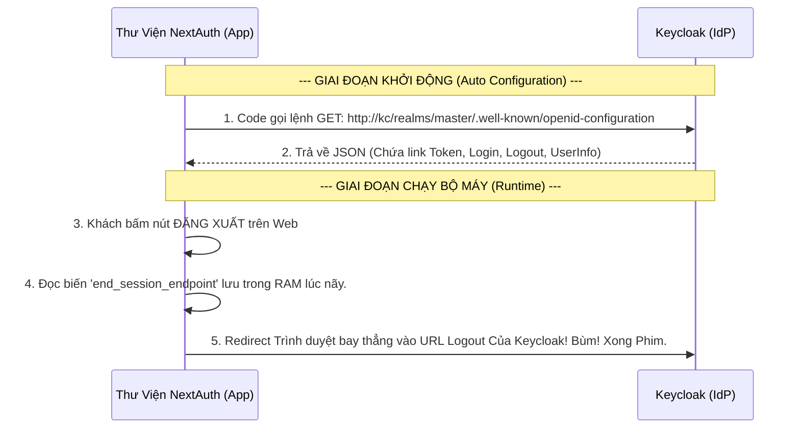

# Lesson 1: Tấm Bản Đồ Định Danh (OIDC Discovery)

> [!NOTE]
> **Category:** Theory (Lý thuyết)
> **Goal:** Giống như OAuth2 có Discovery Endpoint, OpenID Connect cũng sở hữu một cấu trúc tĩnh Discovery của riêng nó để chỉ đường cho các Client (NextJS, React, Spring Boot) biết chỗ nào để gọi hàm Đăng Nhập, Đăng Xuất và Lấy Hồ Sơ.

## 1. Lý thuyết chuyên sâu (Detailed Theory)

### 1.1. Bản Chất OIDC Discovery
- Chuẩn hóa bởi OIDC Foundation, Endpoint này luôn nằm ở đuôi: `/.well-known/openid-configuration`.
- Nếu bạn để ý, Endpoint này trùng khớp hoàn toàn với OAuth2 Discovery (Bài 10 - Chương 15). Lý do? Vì **OIDC được xây dựng TÍCH HỢP TRÊN NỀN OAUTH2**.
- Tấm bản đồ này của Keycloak sẽ phơi bày các Khả Năng (Capabilities) của Server. Bạn không cần phải đoán xem Keycloak hỗ trợ thuật toán mã hóa chữ ký RSA nào, nó liệt kê hết trong JSON!

### 1.2. Những Tham Số Quan Trọng Nhất Dành Cho OIDC
Ngoài những Endpoint của OAuth2 (Token, Authorization), OIDC Discovery bơm thêm những Endpoint "Đặc Quyền" sinh ra chỉ để phục vụ danh tính:
1. **`userinfo_endpoint`**: Link API để lấy toàn bộ Profile (Tên, Tuổi, Hình ảnh) của User. OAuth2 thuần túy KHÔNG BAO GIỜ có link này!
2. **`end_session_endpoint`**: Link API để thực hiện Lệnh Đăng Xuất (Logout). Gửi request tới đây, Keycloak sẽ bắn nát Session của User, đá văng khách ra khỏi hệ thống.
3. **`scopes_supported`**: Nếu bạn thấy chữ `openid` nằm trong mảng này, chúc mừng, Máy chủ này HỖ TRỢ OIDC (Nếu không có chữ này, nó chỉ là con Oauth2 Auth Server cùi bắp, không dùng để Login được).

---

## 2. Luồng nội bộ & Cơ chế cấp thấp (Internal Workflow & Low-level Mechanisms)

Hành Trình Thư Viện NextAuth / Spring Security Auto-Discovery OIDC:

---

## 3. Thực hành tốt nhất & Bảo mật (Best Practices & Security)

> [!IMPORTANT]
> **Tuyệt Đỉnh Tẩy Khách Trải Nghiệm Mạng (Cập Nhật Thường Xuyên Issuer Cache)**
> **Tội Ác Thiết Kế:** Bạn tự Code 1 thư viện OIDC Client bằng C#. Bạn dội lệnh gọi File JSON Discovery đúng 1 lần vào ngày đầu tiên server boot lên. Xong bạn lưu nó vào Database Cache Vĩnh Viễn Không Bao Giờ Tải Lại.
> **Hậu Quả:** Tuần sau sếp vui tay lên Admin Console của Keycloak, đổi cấu hình Thuật toán mã hóa JWT từ `RS256` thành `ES256` (Siêu bảo mật). File JSON Discovery của Keycloak lập tức thay đổi. NHƯNG App C# của bạn không thèm tải lại! Hậu quả là Token dội về, App dùng chuẩn RS256 để giải mã ES256, App Văng Lỗi Sập Ngang Máy Chủ Xác Thực Lỗ Lủng Bọt Toàn Bộ Hệ Thống!
> **Biện Pháp Sống Còn Lớp Trọng Lực:** BẮT BUỘC Phải có cơ chế Refresh Document JSON này! Thông thường các thư viện chuẩn như `oidc-client-ts` sẽ tự động Refetch cái file `.well-known` này mỗi 24 tiếng, hoặc chủ động gọi lại nếu nó phát hiện Chữ Ký Token bỗng nhiên không Decode được bằng Public Key cũ Cắt Mạch Đứt Kẽ Oanh Về!

---

## 4. Cấu hình minh họa thực tế (Configuration Examples)

Lắp Ráp Cấu Hình Xem Trực Tiếp Tham Số OIDC Đỉnh Chóp:
1. Mở Trình Duyệt Truy Cập Link Này:
   `http://localhost:8080/realms/master/.well-known/openid-configuration`
2. Kéo Chuột Tìm Đoạn Khai Báo **`claims_supported`**.
   - OIDC là Giao thức Khẳng Định Danh Tính (Identity). Ở mảng này, Keycloak kiêu hãnh khoe cho bạn biết nó có thể trả về những Thông Tin (Claims) gì của con người!
   - Ví dụ: `"name", "given_name", "family_name", "email", "email_verified", "preferred_username"`.
   - Nếu bạn dùng Oauth2, nó không bao giờ cam kết trả mấy thứ này. Nhưng OIDC thì BẮT BUỘC phải quy chuẩn 14 cái Tên Tiêu Chuẩn (Standard Claims) để dù bạn Login bằng Google, Facebook hay Keycloak, thì thuộc tính "Tên" luôn luôn là chữ `name`, không bao giờ bị lệch data Cắt Khung Tĩnh Oanh Lụa!

---

## 5. Câu hỏi Phỏng vấn (Interview Questions)

**1. Sếp Yêu Cầu Code App Xác Thực. Cậu Đọc File Discovery Thấy Mảng 'id_token_signing_alg_values_supported' Chứa Thuật Toán 'HS256' Và 'RS256'. Cậu Nên Chọn Cấu Hình Thằng Nào Cho Client App Chạy OIDC Trọng Lõi Mạng Lớn Để Tránh Bị Hack Lệnh Ký Tên JWT Cắt Khung?**
- **Senior:** Dạ thưa sếp, Chắc Chắn Phải Cấu Hình Lựa Chọn Lệnh Cứng **`RS256`** (Hoặc Tương Đương Bất Đối Xứng RSA/ECDSA)!
  - **Lý Do Tử Bọt HS256:** HS256 là thuật toán Symmetric (Đối xứng). Tức là Chìa Khóa Dùng Để Ký Tạo Ra Token Ở Keycloak, CHÍNH LÀ Chìa Khóa Để API Giải Mã Token. Nghĩa là Secret phải nằm ở 2 nơi! Nếu em đặt Secret này xuống API Resource Server, Lỡ Thằng Code API Tà Đạo Ăn Cấp Secret, Nó TỰ CODE RA ĐƯỢC 1 CÁI TOKEN GIẢ MẠO Y HỆT KEYCLOAK (Vì nó cầm chìa khóa ký).
  - **Quyền Năng Trọng Lực RS256:** Là Asymmetric (Bất đối xứng). Keycloak Giấu Kín Cục **Private Key** Dưới Đáy Rương (Chỉ Mình Nó Có Thể Sinh Ra Chữ Ký Token). Còn Đám Khách API Chỉ Được Cầm **Public Key** Mở Ra. Có Thằng Hacker Lấy Được Public Key Thì Cũng Chỉ Đứng Nhìn Chữ Khớp Lệnh Chứ Không Bao Giờ Giả Mạo Ký Đóng Dấu Đẻ Ra Token Được! An Toàn Tuyệt Đỉnh!

---

## 6. Tài liệu tham khảo (References)
- **OpenID Connect Discovery 1.0.**
- **Keycloak Documentation:** Server Administration Guide - OIDC Endpoints.
