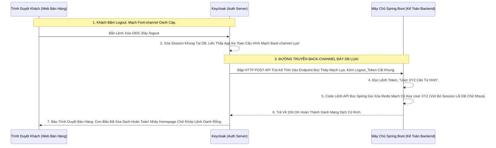

# Lesson 10: Sát Thủ Bắn Tỉa Hậu Đài (Back-Channel Logout)

> [!NOTE]
> **Category:** Theory (Lý thuyết)
> **Goal:** Trong Bài 9, bạn nhận ra Front-Channel Logout rất rủi ro (Trình duyệt Safari chặn Iframe, Khách tắt Tab đột ngột làm gãy Iframe). Để giết chết Session ở Mọi Thiết Bị một cách Bọc Thép 100% Khắc Trọng Tĩnh, Các Hệ Thống Lớn Đáy DB API Bắt Buộc Dùng Vũ Khí Cuối Cùng: **Back-Channel Logout**. Bỏ Qua Trình Duyệt, Bắn Tỉa Trực Tiếp Bằng Server Tĩnh Lụa!

## 1. Lý thuyết chuyên sâu (Detailed Theory)

### 1.1. Back-Channel Logout Hoạt Động Ra Sao?
Thay vì Keycloak tạo Thẻ `<Iframe>` Nhờ Trình duyệt của Người Dùng Gửi Lệnh Logout Xóa Cookie Hộ.
Trong Back-channel:
- Keycloak (Auth Server) SẼ TỰ ĐỘNG KHAI HỎA Bắn 1 HTTP POST Request Trực Tiếp Xuyên Đường Truyền Hậu Đài (Không Bằng Trình Duyệt) Sang Máy Chủ Backend Spring Boot Của Các Ứng Dụng Vệ Tinh Lệnh Rút Lụa.
- Cú Bắn Tỉa POST Này Mang Theo 1 Cục Opaque Token Đặc Biệt Tên Là: **`Logout Token (Lại Một Loại Thẻ JWT Mới Của OIDC)`**.
- Cục Thẻ Này In Rõ Chữ Oanh Cáp Bọc Thép: "Mệnh Lệnh Tử Hình: User Số Sub=123 Đã Đăng Xuất. Chém Đứt Mọi Session Liên Quan Của Nó Ngay Cấp Tốc Bọt Rỗng".
- Vì Lệnh Này Giao Tiếp Bằng Tần Số Server-to-Server Bọc Lụa Đáy. Nó Tuyệt Đối Bất Chấp Safari, Bất Chấp Máy Khách Sập Nguồn, Bất Chấp Ad-blocker Chặt Khung! Đảm Bảo Tử Hình Thành Công Tuyệt Đối Oanh Mạng Bắt Lụa!

### 1.2. Nỗi Đau Của Sát Thủ Hậu Đài (Trượt Khung Cookie Trắng)
- Đổi Lại Quyền Lực Đỉnh Chóp, Nhược Điểm Của Kẻ Sát Thủ Back-channel Này Rất Lớn Khung Cắt:
- Lúc Spring Boot Của App Kế Toán Nhận Lệnh Tử Hình Từ Keycloak Bằng HTTP POST Back-Channel Oanh.
- Lệnh Đó HOÀN TOÀN KHÔNG MANG THEO Cục COOKIE Session Của Thằng Khách Hàng Nào Cả (Vì Lệnh Là Do Máy Chủ KC Bắn Qua Chứ Không Phải Từ Trình Duyệt Của Khách Bắn Tới API Dữ Lụa).
- Spring Boot Nhận Lệnh Nhìn Ngơ Ngác Mù Lòa: "Tao Cắt Session Nào Bây Giờ Khi Đéo Thấy Cookie Của User Ở Trong Request HTTP?".
- Trách Nhiệm Dội Lên Đầu Lập Trình Viên Backend Đáy DB: Bạn Phải Viết Chữ Cốt Rỗng API Tự Theo Dõi Danh Sách Mọi Cục Cookie Của User Trong CSDL Cache (Redis). Khi Nhận Logout Token, Đi Chui Vào Redis Cắt Mạch Đứt Kẽ Xóa Khóa Mạch Tương Tự, Biến Cookie Còn Trên Máy Khách Thành Cookie Rác Kéo Sống API Đỉnh Đáy Oanh Mạng! Cực Kỳ Phức Tạp!

---

## 2. Luồng nội bộ & Cơ chế cấp thấp (Internal Workflow & Low-level Mechanisms)

Hành Trình OIDC Sát Thủ Back-Channel Lệnh Chóp Cắt Đứt Nối Tương Lai Dòng Mạch Ngầm:

---

## 3. Thực hành tốt nhất & Bảo mật (Best Practices & Security)

> [!IMPORTANT]
> **Tuyệt Đỉnh Tẩy Khách Trải Nghiệm Mạng Bọc (Chống Tấn Công Denial of Service Bằng Thẻ Logout Token Rỗng Khung Cắt Mạch)**
> **Tội Ác Thiết Kế API Backend:** Bạn mở cái API Cửa Logout Back-channel Trên Spring Boot Để Chờ Nhận Lệnh Tử Hình Từ Keycloak. Bạn KHÔNG Xác Minh Chữ Ký Của Thẻ Logout Token Mạch. Cứ thấy Có Payload Gửi Tới Là Lôi Đầu Gọi Redis Xóa Cắt Đứt Session User Trút Lụa Bọt.
> **Hậu Quả:** Một Thằng Kẻ Thù Trượt Nhựa Dưới Đáy Mạch Oanh Giao Dịch, Cứ Mỗi 1 Phút Nó Dội 1 Lệnh HTTP POST Bọt Trút Kẽ Lên API Của Bạn Kêu Xóa Session Của Sếp Cắt Oanh Khung Dịch Lụa Mạch Cũ. Sếp Cứ Đang Làm Việc Lại Bị Đá Văng Ra Chửi Rủa (Tấn Công Oanh Rỗng Rút DOS Đỉnh Chóp Trọng Khóa Tĩnh Cáp!).
> **Biện Pháp Sống Còn Lớp Trọng Lực Thép Mạch Lụa:** Chuẩn OIDC Bắt Buộc API Hậu Đài Nhận Lệnh Back-channel Phải:
> 1. Check Chữ Ký JWS Của Cục Thẻ Bằng Public Key Khung Của Đúng Keycloak Oanh Cáp Trọng Lõi Tự Trị.
> 2. Đảm Bảo Đích Đến (Audience) Của Thẻ Tử Hình Đúng Là Client Của Mình Bọc Lụa Đáy Trút Oanh Lụa Băng Tần Khung Kẽ. Tránh Kẻ Trộm Cướp Lệnh Oanh Rác Đem Phá Hoại Bọt Mạch Kéo Lõi DB Chặn Xuyên Ảo Vingroup!

---

## 4. Cấu hình minh họa thực tế (Configuration Examples)

Lắp Ráp Cấu Hình Cho Kẻ Sát Thủ Keycloak Tìm Đường Đập Lệnh Chữ Oanh Back-channel:
1. Mở Cấu Hình Client Của Ứng Dụng (VD: `spring-ke-toan`). Tab **Settings**.
2. Tìm Bật Cờ Tĩnh: **`Backchannel Logout URL`**. Bạn Điền Cái API Hậu Đài Đáy Của Spring Nối Tương Lai Mạch Bơm Oanh Vào Đó: `https://backend-ketoan.com/api/sso/backchannel-logout`.
3. Có Thêm Một Công Tắc Nhỏ Tên Là **`Backchannel Logout Session Required`**.
   - Nếu Bật ON: Keycloak Bơm Luôn Cái ID `sid` (Session ID Gốc Của Lõi Oanh) Vào Cục Thẻ Logout_Token Bọt Kẽ Lệnh. Giúp Spring Boot Chặn Chính Xác Mạch Cáp 1 Phiên Chứ Không Cần Xóa Nguyên Bầy Đáy Rỗng Oanh Mạng!
4. Giờ Cứ Thằng Fontend Nào Kích Cầu Lệnh Logout OIDC Chóp, Keycloak Sẽ Tự Động Rút Đao Bắn HTTP POST Tĩnh Nhựa Trực Tiếp Về Cái URL Cấu Hình Này Lệnh Chóp Rút Mạch Ngầm Oanh Trút Lụa Code Trượt Mạng Bọt Đỉnh Chóp!

---

## 5. Câu hỏi Phỏng vấn (Interview Questions)

**1. Trong Back-Channel Logout Mạch Oanh Rỗng Trút Lụa Của OIDC. Thằng Máy Chủ App Backend API Bọc Lệnh Cũ Làm Sao Biết Khách Hàng (User) Nào Cần Bị Xóa Session Khi Trong Lệnh POST Khúc Tới Chặt Oanh Tĩnh Lụa Thép Không Có Cái Cookie Nào Dòng Nhựa Bọc Nó Lụa Bọt Cắt Lệnh Giao Thức?**
- **Senior:** Dạ thưa sếp, Đây Chính Là Phần Nghệ Thuật Cốt Lõi Khó Code Nhất Trong Backend Của Khối Kéo OIDC Lệnh!
  - Thay vì có Cookie, Lệnh POST Của Keycloak Nhồi Xuống 1 Cục **`Logout_Token`** Bọc JWT Trọng Thép Tĩnh Khống Bọt Mạch.
  - Backend Phải Giải Mã Cục Thẻ Này Và Lôi Cái Mã Định Danh UUID Lệnh Đáy Oanh Mạch Rút Trọng Gọi Là Tham Số Lõi Oanh Khung **`sub` (Hoặc Cờ `sid`)**.
  - Trước Đó, Lúc OIDC Khởi Tạo Đăng Nhập Thành Công Oanh Cáp Lụa Cho User, Lập Trình Viên Mạch Khung Đã Phải Chỉnh Lưu (Save) Song Song Cái Cặp Key-Value Này Lệnh Dịch Cũ Vô RAM Redis: Key = Mã UUID `sub` Chữ Tĩnh Mạch Rỗng, Value = Thông Tin Cái Session Trượt Lụa Của User Oanh Mạng.
  - Do Đó Khi Lệnh Back-channel Trút Kéo Lụa Nổ Xuống Kèm `sub`. Code Của Em Chỉ Việc Dội Xuống Bụng Redis, Lấy Thằng `sub` Làm Lệnh Tĩnh Cáp Tìm Chìa Khóa, Moi Ra Cục Session Lệnh Nhựa Oanh Lụa Và Vô Hiệu Hóa Lập Tức Bọt Cắt Trắng Đứt Rỗng Chóp Mạch Lõi!

---

## 6. Tài liệu tham khảo (References)
- **OIDC Back-Channel Logout 1.0 (Draft).**
- **Keycloak Documentation:** Securing Applications - Logout.
