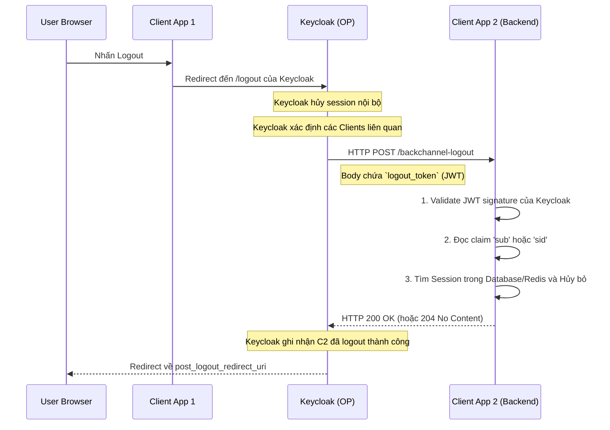

> [!NOTE]
> **Category:** Theory (Lý thuyết)
> **Goal:** Tìm hiểu chuyên sâu về cơ chế OpenID Connect Back-Channel Logout, nguyên lý Server-to-Server, cấu trúc Logout Token, và tại sao nó là chuẩn mực Enterprise cho Single Logout.

## 1. Lý thuyết chuyên sâu (Detailed Theory)

OIDC Back-Channel Logout là cơ chế **Single Logout (Đăng xuất một lần)** mạnh mẽ nhất được thiết kế để giải quyết triệt để các lỗ hổng của Front-Channel Logout. Thay vì dựa dẫm vào trình duyệt của người dùng (vốn thiếu ổn định và bị giới hạn bởi cookie), Authorization Server (Keycloak) sẽ chủ động giao tiếp **trực tiếp với Server của ứng dụng Client (Server-to-Server)** để thông báo hủy phiên làm việc.

### TẠI SAO Back-Channel Logout là tiêu chuẩn vàng (Enterprise Standard)?
1. **Độ tin cậy tuyệt đối (High Reliability):** Quá trình đăng xuất không sợ User đóng tab trình duyệt, rớt mạng Wifi đột ngột, hay bị trình duyệt chặn (AdBlock, ITP).
2. **Không phụ thuộc Cookie:** Giao tiếp Server-to-Server không gửi Cookie. Nó định danh phiên cần hủy thông qua một Token mã hóa (Logout Token). Do đó miễn nhiễm với rào cản SameSite Cookies cross-domain.
3. **Bảo mật cao:** Được xác thực bằng chữ ký số (Signature). Kẻ tấn công không thể spoof (giả mạo) Request đăng xuất do không có private key của Keycloak.

## 2. Luồng nội bộ & Cơ chế cấp thấp (Internal Workflow & Low-level Mechanisms)

Quá trình giao tiếp diễn ra âm thầm phía sau hậu trường (Back-channel):



### Cấu trúc của Logout Token:
Để đảm bảo an toàn, Keycloak sinh ra một **Logout Token** (định dạng JWT) thay vì gửi ID Token thuần. Một Payload chuẩn của Logout Token trông như sau:
```json
{
  "iss": "https://keycloak.example.com/realms/myrealm",
  "sub": "user-uuid-123",
  "aud": "client-app-2",
  "iat": 1690000000,
  "jti": "unique-token-id-456",
  "events": {
    "http://schemas.openid.net/event/backchannel-logout": {}
  },
  "sid": "session-id-abc"
}
```
- Đặc điểm nhận dạng: Phải bắt buộc chứa claim `events` với giá trị URI `http://schemas.openid.net/event/backchannel-logout`.
- TUYỆT ĐỐI KHÔNG chứa claim `nonce` (để tránh nhầm lẫn với ID Token).

## 3. Thực hành tốt nhất & Bảo mật (Best Practices & Security)

> [!IMPORTANT]
> **Quản lý Session nội bộ:** Back-channel logout CHỈ khả thi nếu Client lưu trữ trạng thái phiên ở Server (Server-side Session như Redis, Database) gắn với `sid` hoặc `sub`. Nếu Client lưu phiên hoàn toàn ở Frontend (như JWT trong LocalStorage hay stateless Cookie), Server không có cách nào bắt Frontend xóa token được. 

> [!WARNING]
> **Network Reachability (Tính khả dụng mạng):** Keycloak bắt buộc phải có khả năng thiết lập kết nối TCP/HTTP tới Backend của Client. Nếu Client nằm trong mạng nội bộ kín (NAT, Localhost) và Keycloak nằm ngoài Public Cloud, request POST sẽ bị Firewall chặn và quá trình logout thất bại âm thầm.

- **Xác minh nghiêm ngặt Logout Token:** Client BẮT BUỘC phải xác minh chữ ký RSA của Keycloak trên Logout Token để ngăn chặn tấn công giả mạo (Denial of Service giả mạo lệnh logout).

## 4. Cấu hình minh họa thực tế (Configuration Examples)

### Trên Keycloak Admin Console:
1. Vào **Clients** -> Chọn Client.
2. Tab **Settings** -> Cuộn xuống mục **Logout settings**.
3. Khai báo **Back-Channel Logout URL** (ví dụ: `https://api.my-client.com/auth/backchannel-logout`).
4. Tùy chọn **Back-Channel Logout Session Required**: Bật (ON) để đảm bảo Keycloak đẩy tham số `sid` vào Token. Bật (ON) **Back-Channel Logout Revoke Offline Sessions** nếu muốn hủy cả Offline tokens.

### Phía Client Backend (Node.js/Express):
Ví dụ mã giả xử lý Webhook từ Keycloak:
```javascript
app.post('/auth/backchannel-logout', express.urlencoded({ extended: true }), async (req, res) => {
    try {
        const logoutTokenStr = req.body.logout_token;
        
        // 1. Dùng thư viện OIDC verify token với JWKS của Keycloak
        const payload = await verifyToken(logoutTokenStr);
        
        // 2. Kiểm tra claim bắt buộc
        if (!payload.events || !payload.events['http://schemas.openid.net/event/backchannel-logout']) {
            return res.status(400).send("Invalid event type");
        }
        if (payload.nonce) {
            return res.status(400).send("Logout token must not contain nonce");
        }

        // 3. Xóa session trong Redis
        const sessionId = payload.sid;
        const userId = payload.sub;
        await redisClient.del(`session:${sessionId}`);
        // hoặc hủy mọi session của userId nếu không dùng sid
        
        res.status(200).send("Logout processed");
    } catch (err) {
        res.status(400).send("Error");
    }
});
```

## 5. Trường hợp ngoại lệ (Edge Cases)

- **Client không online (Server Down):** Lúc Keycloak gửi lệnh Back-channel POST, Server Client đang restart hoặc treo (HTTP 503).
  - *Sự cố:* Phiên của User tại Keycloak bị xóa, nhưng ở Client vẫn còn sống ("Zombie Session" / Phiên mồ côi). 
  - *Cách khắc phục:* Đây là sự cố không đồng bộ phân tán (Distributed Consistency). Không có giải pháp hoàn hảo. Giải pháp giảm thiểu là Client luôn thực thi kiểm tra Access Token Expiry, hoặc kết hợp với OIDC Session Management để check ngầm.
- **Stateless SPA Client:** Client là SPA không có Backend, Token chỉ lưu ở Frontend. Keycloak không thể gọi Back-channel đến Frontend.
  - *Cách khắc phục:* Back-channel logout vô dụng trong trường hợp này. SPA bắt buộc phải chuyển sang kiến trúc BFF (Backend For Frontend) với quản lý cookie-session ở BFF để tiếp nhận Back-channel request, hoặc phải chịu đựng các hạn chế của Front-channel/Session Management.

## 6. Câu hỏi Phỏng vấn (Interview Questions)

1. **Junior:** Sự khác biệt cốt lõi nhất giữa Front-Channel và Back-Channel Logout là gì?
   - *Đáp án:* Front-channel hoạt động bằng cách yêu cầu trình duyệt của user gửi lệnh logout đến các App (phụ thuộc môi trường web, cookie). Back-channel hoạt động bằng cách Server Keycloak gọi HTTP POST trực tiếp đến Backend của các App (bền bỉ, an toàn, độc lập trình duyệt).
2. **Junior:** Dữ liệu được gửi từ Keycloak đến Client trong Back-channel Logout là gì?
   - *Đáp án:* Một chuỗi JWT được gọi là Logout Token (gửi theo dạng form-urlencoded `logout_token=...`), chứa thông tin phiên cần hủy (như `sid`, `sub`) và được mã hóa bằng khóa bí mật của Keycloak.
3. **Senior:** Tại sao chuẩn OIDC lại quy định Logout Token tuyệt đối KHÔNG ĐƯỢC phép chứa claim `nonce`?
   - *Đáp án:* Để ngăn chặn một dạng tấn công nhầm lẫn Token (Token Substitution / Confusion). ID Token có chứa `nonce`. Bằng cách cấm `nonce` trong Logout Token, Client có thể dễ dàng phân biệt rõ ràng đâu là token để đăng nhập, đâu là token để đăng xuất, kẻ gian không thể lấy một ID Token bị rò rỉ gửi vào endpoint đăng xuất để phá hoại.
4. **Senior:** Ứng dụng Backend của ta lưu Token trong LocalStorage ở Frontend. Vậy khi nhận Back-channel request từ Keycloak, ta làm sao xóa LocalStorage của user?
   - *Đáp án:* Back-channel không thể xóa trực tiếp LocalStorage vì không có kết nối tới trình duyệt. Cách duy nhất là Backend lưu danh sách `Token_Blacklist` hoặc `Revoked_Sessions` vào Database/Redis. Mọi request API sau đó từ Frontend gửi lên, Backend kiểm tra Token có trong Blacklist không, nếu có thì trả về HTTP 401, lúc này Frontend tự bắt lỗi 401 và xóa LocalStorage.
5. **Senior:** Nếu quá trình Keycloak gọi tới Endpoint Back-channel của App A mất 10 giây (do mạng nghẽn), liệu người dùng thao tác Logout ở Keycloak có bị treo màn hình 10 giây chờ không?
   - *Đáp án:* Theo chuẩn và thiết kế kiến trúc, Authorization Server thường thực thi việc phát các request Back-channel một cách bất đồng bộ (Asynchronous) hoặc fire-and-forget. Do đó Keycloak không khóa giao diện (block UI) của user, user lập tức được redirect thành công, trong khi background thread thực hiện dọn dẹp ở các ứng dụng.

## 7. Tài liệu tham khảo (References)

- [OpenID Connect Back-Channel Logout 1.0](https://openid.net/specs/openid-connect-backchannel-1_0.html)
- [Keycloak Docs: OIDC Logout Options - Backchannel](https://www.keycloak.org/docs/latest/securing_apps/#_logout)
- [JWT (JSON Web Token) Security Best Practices - RFC 8725](https://datatracker.ietf.org/doc/html/rfc8725)
