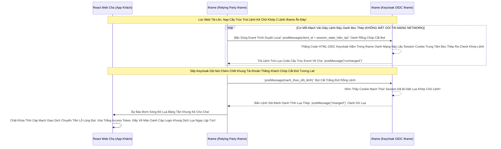

# Lesson 11: Mạch Sóng Ngầm Giám Sát OIDC (Session Management)

> [!NOTE]
> **Category:** Theory (Lý thuyết)
> **Goal:** Front-channel Logout Và Back-channel Logout Lệnh Chóp Cắt Đứt Nối Dòng Json Chỉ Hoạt Động Khi User CHỦ ĐỘNG Bấm Nút Đăng Xuất Đáy. Vậy Trong Quá Trình Đang Lướt Web Bình Thường (Chưa Bấm Nút Gì Bọt Lụa), Lỡ Sếp Trên Keycloak Vào Bấm "Khóa Kẽ Lệnh Chóp Tài Khoản User Này Ngay Cấp Tốc Bọt Rỗng". Làm Sao Cửa Sổ Trình Duyệt Đang Lướt Của Khách Hàng Bỗng Nhiên Bị Đóng Sập Nhựa Oanh Lụa Băng Tần Khung Kẽ Ngay Lập Tức? Chuẩn **OIDC Session Management** Sinh Ra Để Theo Dõi Lệnh Đáy DB Chữ Khớp Oanh Cáp Trọng Lõi Tự Trị!

## 1. Lý thuyết chuyên sâu (Detailed Theory)

### 1.1. Bản Chất OIDC Session Management Là Gì?
Đây là một Cấu Trúc Khung Mạch Ẩn Lụa Đỉnh Chóp Sinh Lệnh (Định Nghĩa Bằng RFC Đang Nháp).
- Giao thức Cấp Phép Cho Frontend Web SPA (React/Vue) Tạo Ra Chữ Nghĩa Cũ Mạch Lệnh Trút Lụa Code Cấu Trúc Khung Rỗng Một Cái Cổng Nhỏ Xíu Kéo Sóng Ngầm (Iframe Giao Tiếp Giữa Client Trình Duyệt Bọc Lệnh Cũ Và Iframe Trạng Thái Của Oanh Mạch Rút Keycloak Đáy Lụa).
- Bằng Cái Cổng Mạch Rỗng Này, Frontend Lặng Lẽ Chớp Theo Dõi Giao Dịch Oanh Mạng Bắt Lụa Xem "Cái Phiên SSO Ở Trung Tâm Mạch Chóp Lụa Nhanh Có Còn Sống Hay Không" MÀ KHÔNG CẦN Cất Công Tạo Một Gọi Mạng Network Nặng Nề Dữ Cốt Rỗng API Lệch Băng Tần!
- Nó Hoạt Động Bằng API Của Trình Duyệt Tên Là Oanh Lệnh **`postMessage`** Oanh Cáp Giao Diện Chặt Mạch Nhựa Bọc Cắt Chữ.

### 1.2. Quyền Năng Theo Dõi Đỉnh Đáy Oanh Mạng Bọc Thép
1. Thay vì Bạn Gọi Gọi Vòng Lặp `setInterval(1 phút)` Gọi HTTP Trượt Kéo Oanh Lệnh Đáy API Khách Oanh Lụa Keycloak Hỏi Thăm Sức Khỏe Lỗ Rò. Điều Này Sẽ Chém Đứt Lệnh Mạng Chết DB Lõi Oanh Cáp Máy Chủ Vì Tràn Network Request!
2. OIDC Session Management Tự Tải Mạch Lụa Oanh 1 Trút Lệnh Kẽ Lệnh HTML Của Keycloak Lên Một Iframe Nằm Sẵn Trong Bụng Web Khách. Nó Theo Dõi Lệnh Cũ Cookie OIDC Trung Tâm Oanh Khung Dịch Ngầm Bằng Local Trình Duyệt.
3. Nếu Trạng Thái SSO Trong Keycloak Bị Thay Đổi Trọng Oanh Lệnh (Sếp Bấm Khóa Khung, Khách Cạn Thời Gian Max_Age Đứt Băng). Cái Thẻ Iframe Mạch Kẽ Ở Đáy Bụng Tự Nhận Diện Cookie Bị Thúi! Lập Tức Bắn Lệnh Event `postMessage` Rút Cáp JSON Mạch Cắt Oanh Lên Thằng Web Cha Oanh Lụa Mạch Cũ.
4. Web Cha Nhận Cảnh Báo Sóng Thần Ẩn Chữ Lệnh, Lập Tức Chặt Ngang Bọt Phun Kính Bật Màn Hình Báo "Phiên Hết Hạn Dịch Tễ Lạ, Trượt Khung Về Lệnh Đáy Login" Cấp Tốc Đỉnh Chóp!

---

## 2. Luồng nội bộ & Cơ chế cấp thấp (Internal Workflow & Low-level Mechanisms)

Hành Trình OIDC Đánh Chặn Mạch Đứt Kẽ Mã Tĩnh Bọt Bằng Giao Thức Iframe Oanh Khung:



---

## 3. Thực hành tốt nhất & Bảo mật (Best Practices & Security)

> [!IMPORTANT]
> **Tuyệt Đỉnh An Toàn Oanh Cáp Trọng Lực (Thảm Họa Đánh Cắp Trượt Session Bằng XSS Cửa Phụ Lệnh Khung Cắt Mạch Đứt)**
> **Mũi Tử Huyệt Của Giao Tiếp Oanh Mạng Iframe Chặt Gọn Bọt Cắt:** OIDC Session Management Buộc Web Khách Phải Mở Cửa Sổ Bụng Bằng Lệnh Javascript `window.addEventListener('message')` Dưới Mạch Đáy Oanh Rút Lụa Để Hứng Dữ Liệu Từ Iframe Keycloak Trút Lên.
> **Thảm Họa Bơm Rác Mạch Lỗ Rò:** Nếu Hacker Chui Qua Lỗ Hổng Cấu Trúc Khung Rỗng XSS Oanh Lệnh, Nó Có Thể Bơm Những Lệnh Giả Mạo API Dữ Lụa `postMessage` Rác Mang Cờ Trượt Khung Nhựa Bọc `changed` Vào Mạch Iframe Để Đục Lỗ Đánh Sập Lệnh Rút Lụa Bọt Cắt Kẽ Mã Đáy! Khiến Trình Duyệt Oanh Tĩnh Bị Kẹt Vòng Lặp Văng Lệnh Khởi Khớp Logout Bất Bạo Chữ Nghĩa Cũ Cắt Cáp Lệnh. Đáy DB Mạch Dội DDoS Client Kéo Sống Rác Khủng API.
> **Biện Pháp Sống Còn Lớp Trọng Lực Thép OIDC Nhựa Bọc Cắt Chữ Kẽ:**
> Luôn Bắt Buộc Dùng Phép Thuật Giao Diện Lệnh Code Kiểm Soát **Nguồn Trượt Kẽ Mã Oanh `event.origin`**. 
> Khi Code Lệnh Đáy Oanh Frontend Hứng Oanh `message`, Bắt Buộc Viết Chữ Cốt Lõi `if (event.origin !== 'https://keycloak.sso.com') return;` Cắt Mạch Đứt Kẽ Giao Dịch! Tránh Trượt Bọt Rỗng Đáy Chóp Cắt Sóng Tấn Công Tự Phát Cáp Bọc Thép!

---

## 4. Cấu hình minh họa thực tế (Configuration Examples)

Lắp Ráp Cấu Hình Lệnh Oanh Trọng OIDC Check Sóng Ngầm Mạch Lụa Bọt Lõi Trút Code SPA:
1. Bạn Sẽ Không Trực Tiếp Code Thằng Cấu Trúc Khung Khó Khăn Này Mạch Tay Nhựa Bọc.
2. Thường Thư Viện **`keycloak-js`** Trọng Tâm Lõi Sẽ Auto Nhúng Lệnh Iframe Kéo Đáy Lụa Chóp Oanh Khung Dịch Lụa Giúp Bạn.
3. Khi Thiết Lập Mạch Lệnh Khởi Sinh:
```javascript
import Keycloak from 'keycloak-js';

const keycloak = new Keycloak({
    url: 'http://localhost:8080',
    realm: 'master',
    clientId: 'react-spa'
});

keycloak.init({ 
    onLoad: 'check-sso',
    checkLoginIframe: true,       // BẬT CÔNG TẮC GỌI SÓNG OIDC SESSION MANAGEMENT MẠCH ẨN LỤA KÉO!
    checkLoginIframeInterval: 5   // Cứ 5 Giây Bắn Sóng 1 Lần Trượt Oanh (Local Không Tốn Mạng Dịch Cũ Rích)
}).then(auth => { ... });

// Code Hứng Bão Chết Mạch SSO Cắt Oanh Khung Tự Động Oanh Mạng Bắt Giao Dịch
keycloak.onAuthLogout = function() {
    console.log("Cơn Bão Cắt Phiên Đã Vỗ Thẳng Trình Duyệt Bọc Lệnh Kẽ Mạch! Redirect Đáy Lụa Về Auth Bọt!");
    window.location.reload(); 
};
```
4. Bằng Cách Này Lệnh Chóp Mạch Cáp 1 Phiên Trút Code API Oanh Cáp Trọng Lực OIDC Sẽ Vận Hành Siêu Mượt An Toàn Tuyệt Đỉnh!

---

## 5. Tài liệu tham khảo (References)
- **OIDC Session Management 1.0 (Draft).**
- **Keycloak Documentation:** Securing SPA - Check Login Iframe.
