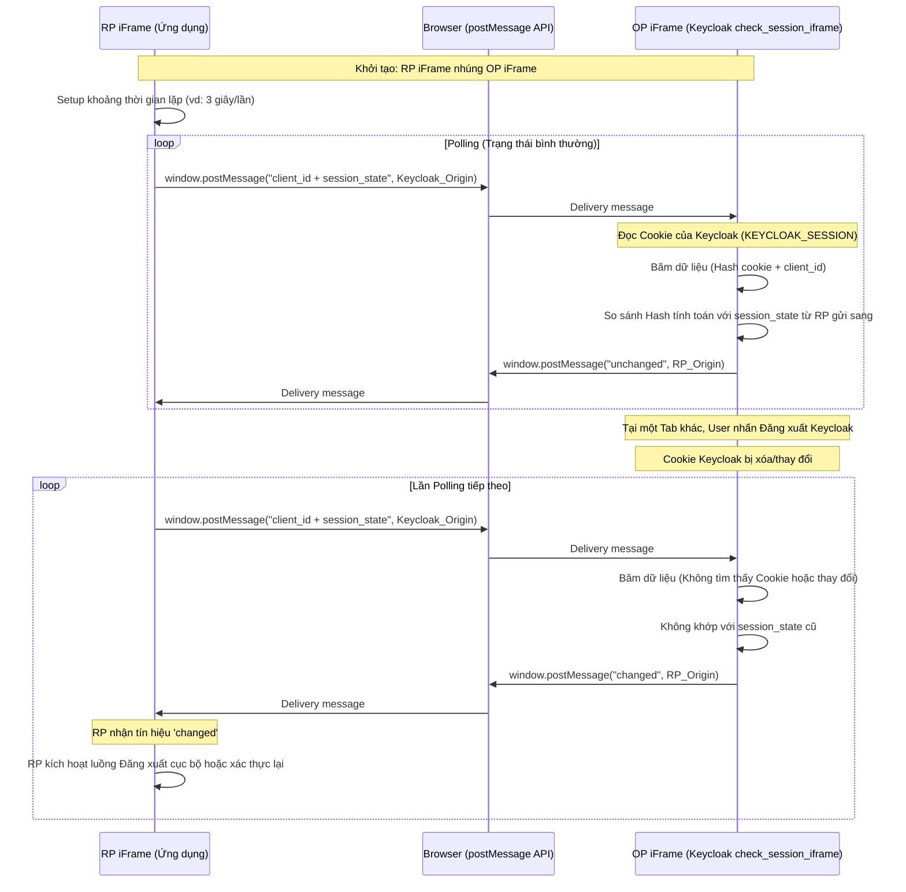

> [!NOTE]
> **Category:** Theory (Lý thuyết)
> **Goal:** Khám phá kỹ thuật OpenID Connect Session Management, cơ chế sử dụng iFrame ẩn (`check_session_iframe`) để đồng bộ trạng thái đăng nhập liên tục giữa Client (trình duyệt) và Keycloak.

## 1. Lý thuyết chuyên sâu (Detailed Theory)

OIDC Session Management là một thông số kỹ thuật bổ sung cho chuẩn OpenID Connect, cung cấp giải pháp cho ứng dụng Frontend (Relying Party - RP) giám sát liên tục trạng thái Đăng nhập/Đăng xuất (Session State) của người dùng trên Authorization Server (Keycloak - OP) **mà không tạo ra tải mạng (network traffic) lớn.**

### TẠI SAO cần Session Management?
Trạng thái đăng nhập của ứng dụng và Keycloak độc lập nhau.
- Người dùng mở nhiều Tab trình duyệt, dùng nhiều App khác nhau qua một SSO Keycloak. 
- Nếu User nhấn Đăng xuất ở **Tab A (App 1)**, làm sao **Tab B (App 2)** đang mở ở nền tự động biết để "đá" User văng ra màn hình đăng nhập ngay lập tức?
Nếu không có OIDC Session Management, ứng dụng ở Tab B có thể phải gọi API liên tục (polling) `prompt=none` lên Server Keycloak (ví dụ mỗi 3 giây) để hỏi "Người dùng còn session không?". Điều này tạo ra lượng Request khổng lồ làm sập Server Keycloak.
OIDC Session Management giải quyết bằng kiến trúc **Client-side Cross-document messaging (postMessage)** qua iFrame vô hình, hoàn toàn không tốn request mạng lên máy chủ ngoài trừ lần khởi tạo đầu tiên.

## 2. Luồng nội bộ & Cơ chế cấp thấp (Internal Workflow & Low-level Mechanisms)

Kiến trúc này yêu cầu hai iFrame chạy ngầm trên trình duyệt: một cái thuộc về RP (Ứng dụng) và một cái thuộc về OP (Keycloak). 



### Yếu tố kỹ thuật:
- **`session_state`:** Đây là một chuỗi bí mật định danh cho phiên, được cấp cho RP (Client) kèm theo Authentication Response ban đầu (cùng lúc với nhận Authorization Code).
- **Trạng thái trả về:** `unchanged` (Chưa đổi), `changed` (Đã đổi / Bị Logout), hoặc `error` (Lỗi tham số).
- **No Network Traffic:** Toàn bộ quá trình kiểm tra (postMessage) xảy ra hoàn toàn trong bộ nhớ RAM của trình duyệt giữa hai iFrame. OP iFrame chỉ truy cập DOM để đọc Document Cookie mà không gọi HTTP lên Keycloak.

## 3. Thực hành tốt nhất & Bảo mật (Best Practices & Security)

> [!WARNING]
> **Giới hạn của Third-Party Cookies:** Tương tự như Front-Channel Logout, cơ chế OP iFrame phụ thuộc 100% vào việc nó có thể đọc được Cookie của Keycloak hay không. Trên các trình duyệt như Safari, Brave chặn phân tích Cookie chéo (Intelligent Tracking Prevention), OP iFrame (chạy bên trong trang của App) không thể tiếp cận Cookie của Keycloak. Kết quả là nó luôn trả về `changed` sai sự thật.

> [!IMPORTANT]
> **Tương lai thoái trào:** Khuyến nghị chuẩn mực (Best Practices) mới hiện nay đối với SPA không khuyến khích việc nhúng iFrame chéo. Mọi người dần chuyển dịch việc quản lý Session về Backend theo mô hình BFF (Backend For Frontend), và dùng WebSockets / SSE (Server-Sent Events) hoặc polling nhẹ ở Backend để đồng bộ logout. OIDC Session Management chỉ khả thi trên các hệ thống Intranet tin cậy, dùng trình duyệt cũ hoặc chia sẻ chung Subdomain.

- **Origin Validation:** Khi RP nhận được `postMessage`, BẮT BUỘC phải kiểm tra thuộc tính `event.origin` để đảm bảo thông điệp `changed` hoặc `unchanged` xuất phát chính xác từ Keycloak, tránh kẻ tấn công nhúng mã độc trên trang và gửi event giả mạo gây Denial of Service (Log User out liên tục).

## 4. Cấu hình minh họa thực tế (Configuration Examples)

Trong tài liệu OIDC Discovery (`/.well-known/openid-configuration`), Keycloak công bố endpoint cho OP iFrame tại key `check_session_iframe`.
Ví dụ: `https://keycloak.example.com/realms/myrealm/protocol/openid-connect/login-status-iframe.html`

Mã Javascript mẫu ở phía Client (RP) triển khai cơ chế này:

```html
<!-- Trang RP ẩn -->
<iframe id="op-iframe" src="https://keycloak.example.com/realms/myrealm/protocol/openid-connect/login-status-iframe.html" style="display:none;"></iframe>

<script>
    const clientId = "my-web-app";
    const opIframe = document.getElementById('op-iframe').contentWindow;
    const opOrigin = "https://keycloak.example.com";
    
    // Giá trị này lấy từ lúc đăng nhập thành công
    let sessionState = "xyz-123-abc-state-string"; 

    // 1. Hàm Polling ngầm gọi mỗi 3 giây
    setInterval(() => {
        const message = clientId + " " + sessionState;
        opIframe.postMessage(message, opOrigin);
    }, 3000);

    // 2. Hàm lắng nghe phản hồi
    window.addEventListener("message", receiveMessage, false);

    function receiveMessage(e) {
        // Kiểm tra an toàn nguồn gửi
        if (e.origin !== opOrigin) { return; }

        if (e.data === "changed") {
            console.log("Phiên đã thay đổi ở Keycloak! Có thể User đã Logout.");
            // Cập nhật lại session_state bằng cách gọi lại prompt=none qua iframe
            // Hoặc thực hiện xóa phiên cục bộ và redirect ra màn hình Login
            handleSessionChanged();
        } else if (e.data === "error") {
            console.error("Cú pháp kiểm tra bị sai");
        }
    }
</script>
```

## 5. Trường hợp ngoại lệ (Edge Cases)

- **Loop Redirect Vô hạn:** Khi nhận được tín hiệu `changed`, RP Client quyết định gọi `prompt=none` để check lại thực hư. Nhưng vì trình duyệt chặn cookie, `prompt=none` thất bại (trả về lỗi). Client lại tiếp tục cố gắng reset trạng thái và hỏi lại tạo ra loop refresh vô tận.
  - *Cách khắc phục:* Giới hạn số lần retry tự động. Khi `changed` xảy ra kèm lỗi `prompt=none`, nên điều hướng User một cách rõ ràng (User Action) bằng cách văng ra màn hình Login vật lý.
- **Tính trễ (Latency) của Cookie:** Đôi khi việc OP update Session Cookie không đồng bộ tức thời ở phía Frontend trên một số nền tảng, khiến iFrame trả về `unchanged` vài giây trước khi thực sự thấy thay đổi.

## 6. Câu hỏi Phỏng vấn (Interview Questions)

1. **Junior:** Mục đích chính của OIDC Session Management là gì?
   - *Đáp án:* Cho phép các ứng dụng nhận biết được ngay lập tức (gần như realtime) khi người dùng đã Đăng xuất ở một hệ thống/ứng dụng khác (Single Logout) mà không cần phải thực hiện truy vấn HTTP liên tục lên Server gây tốn băng thông.
2. **Junior:** `session_state` mà Client nhận được từ Keycloak dùng để làm gì?
   - *Đáp án:* Dùng như một định danh trạng thái. Client sử dụng chuỗi này gửi vào OP iFrame qua Javascript (postMessage) để iFrame kiểm tra xem phiên cục bộ của Keycloak còn khớp với chuỗi này hay không.
3. **Senior:** Tại sao cơ chế `check_session_iframe` không tạo ra bất kỳ HTTP Request nào lên Keycloak mà vẫn biết được trạng thái Đăng xuất?
   - *Đáp án:* Bởi vì Keycloak trả về một trang HTML tĩnh chứa Javascript cho iframe ngầm. Kịch bản Javascript này trực tiếp truy cập vào Document Cookie của chính domain Keycloak (vì iFrame này nằm trên Origin của Keycloak). Việc băm và kiểm tra logic diễn ra toàn bộ trên RAM trình duyệt, không cần gọi API Server.
4. **Senior:** Hạn chế lớn nhất khiến giải pháp `check_session_iframe` dần bị "khai tử" (deprecated) trong các ứng dụng SPA hiện đại là gì?
   - *Đáp án:* Chính sách bảo mật của các trình duyệt hiện đại (SameSite Cookie, ITP, Privacy Sandbox). Các trình duyệt ngăn chặn iFrame chéo đọc và gửi Cookie của bên thứ ba. Nếu không truy cập được Cookie, script trong iFrame của Keycloak không hoạt động, khiến hệ thống báo `changed` giả liên tục.
5. **Senior:** Có những sự kiện nào ở Keycloak có thể dẫn đến việc iFrame trả về trạng thái `changed`?
   - *Đáp án:* Trạng thái trả về `changed` không chỉ diễn ra khi User tự nhấn nút Đăng xuất. Nó còn xảy ra khi phiên (Session) hết hạn (Expired), Session bị Administrator ép buộc xóa bỏ từ Admin Console, hoặc User đổi sang đăng nhập vào tài khoản khác (User switch).

## 7. Tài liệu tham khảo (References)

- [OpenID Connect Session Management 1.0](https://openid.net/specs/openid-connect-session-1_0.html)
- [Keycloak Docs: OIDC Session Management](https://www.keycloak.org/docs/latest/securing_apps/)
- [MDN Web API: Window.postMessage()](https://developer.mozilla.org/en-US/docs/Web/API/Window/postMessage)
