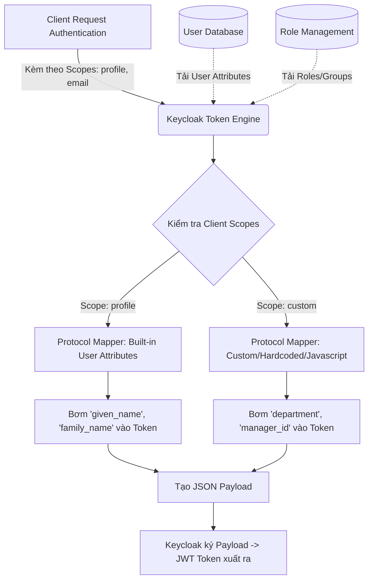

> [!NOTE]
> **Category:** Theory (Lý thuyết)
> **Goal:** Nghiên cứu toàn diện về OIDC Claims, sự phân loại giữa Standard, Custom claims, và cơ chế Protocol Mappers trong Keycloak để kiểm soát dữ liệu bên trong Token.

## 1. Lý thuyết chuyên sâu (Detailed Theory)

Trong thế giới OpenID Connect (OIDC) và JSON Web Tokens (JWT), **Claim (Xác nhận)** là một cặp *key-value (khóa-giá trị)* chứa các thông tin liên quan đến thực thể đang được xác thực (người dùng) hoặc liên quan đến chính token đó (siêu dữ liệu bảo mật). 

Claims là phương tiện giao tiếp cốt lõi. Bất kỳ thông tin nào ứng dụng Client (Frontend) hoặc Resource Server (API) cần biết về người dùng (Tên, Email, Quyền hạn, Phòng ban) đều phải được đóng gói vào các Claims bên trong ID Token hoặc Access Token, hoặc trả về thông qua UserInfo Endpoint.

### TẠI SAO Claims lại quan trọng?
Thay vì mỗi ứng dụng gọi vào Cơ sở dữ liệu (Database) trung tâm để truy vấn "Ông A thuộc phòng ban nào?", Keycloak là hệ thống tập trung gom toàn bộ những thông tin này, "đóng dấu" (ký chữ ký số) và cấp phát trong Token dưới dạng Claims. Điều này mang lại kiến trúc **Stateless (Phi trạng thái)** và **Decentralized (Phân tán)**: Ứng dụng Backend API chỉ cần mở Token ra (Parse Token) là biết ngay quyền hạn và danh tính mà không cần tốn 1 HTTP Request gọi sang Keycloak hay Database.

## 2. Luồng nội bộ & Cơ chế cấp thấp (Internal Workflow & Low-level Mechanisms)

Khi Keycloak nhận yêu cầu phát hành Token, quá trình xử lý và bơm Claims vào Token (Claim Injection) diễn ra qua hệ thống **Protocol Mappers**:



### Phân loại Claims:
Chuẩn OIDC phân Claims thành ba nhóm chính:
1. **Registered Claims (Claims đăng ký trước):** Các claims có ý nghĩa dành riêng cho việc bảo mật và xác minh vòng đời của Token. Bắt buộc các bên phải tuân thủ nghiêm ngặt.
   - `iss` (Issuer): Ai tạo ra token?
   - `sub` (Subject): Ai là chủ thể (User UUID)?
   - `aud` (Audience): Token này dành cho ứng dụng nào?
   - `exp` (Expiration), `iat` (Issued At), `nbf` (Not Before).
2. **Standard Claims (Claims tiêu chuẩn Profile):** Được chuẩn OIDC định nghĩa trong mục UserInfo để đảm bảo khả năng tương thích chéo giữa các hệ thống (Ví dụ: login Google cũng có các key này).
   - `name`, `given_name`, `family_name`, `email`, `picture`, `locale`, `phone_number`.
3. **Custom / Private Claims (Claims tùy biến):** Các thông tin nghiệp vụ độc quyền của doanh nghiệp (Enterprise specific) không nằm trong chuẩn OIDC.
   - Ví dụ: `tenant_id`, `employee_code`, `subscription_level`, `permissions`.

## 3. Thực hành tốt nhất & Bảo mật (Best Practices & Security)

> [!IMPORTANT]
> **Namespace cho Custom Claims:** Khi tạo Custom Claims (đặc biệt khi chia sẻ token ở môi trường mở rộng), KHUYẾN NGHỊ dùng định dạng URI Namespace để tránh đụng độ tên với các Standard claims trong tương lai. Ví dụ thay vì tạo claim `"role": "admin"`, hãy dùng `"https://mycompany.com/claims/role": "admin"`.

> [!WARNING]
> **Hội chứng Token Phình to (Token Bloat):** Đừng biến Token thành một bản sao Database chứa mọi thứ về User (danh sách bạn bè, giỏ hàng, v.v.). JWT Size quá lớn sẽ bị cắt đứt (truncate) bởi kích thước giới hạn của HTTP Headers (thường tối đa 8KB tùy server). Chỉ đẩy vào token những Claims thực sự phục vụ cho Authorization và Access Control cơ bản.

- **Tách biệt Token:** Không bơm bừa bãi.
   - **ID Token:** Chỉ chứa Standard Claims về thông tin cá nhân. KHÔNG chứa Roles hệ thống.
   - **Access Token:** Chứa Role, Permissions, Audience. KHÔNG cần chứa `picture` hay `locale` nếu API Server không cần nó.

## 4. Cấu hình minh họa thực tế (Configuration Examples)

Ví dụ cấu hình đưa một thuộc tính người dùng `employeeNumber` từ giao diện Admin Keycloak vào trong Token.

Trên Keycloak Admin Console:
1. Tạo User "Alice" và thêm Attribute nội bộ: `employeeNumber = EMP001`.
2. Vào **Client Scopes** -> Tạo một Scope mới tên `corporate-info`.
3. Mở tab **Mappers** -> Chọn `Configure a new mapper` -> Chọn kiểu `User Attribute`.
   - **Name:** Map Employee Number
   - **User Attribute:** `employeeNumber` (tên lấy ở database)
   - **Token Claim Name:** `company.emp_id` (tên hiển thị trên Token)
   - **Claim JSON Type:** `String`
   - **Add to ID token:** `ON`
   - **Add to access token:** `OFF`
4. Assign Scope `corporate-info` vào Client mong muốn.

Cấu trúc Payload Token kết quả xuất ra:
```json
{
  "iss": "https://keycloak.company.local/realms/corp",
  "sub": "bf3122-...",
  "company.emp_id": "EMP001",
  "email": "alice@company.local"
}
```

## 5. Trường hợp ngoại lệ (Edge Cases)

- **Claim Type Mismatch (Sai kiểu dữ liệu):** Ứng dụng Backend API mong đợi claim `is_admin` là kiểu `Boolean` (true/false) nhưng trong Keycloak Mapper vô tình cấu hình trả về chuỗi `"true"`. Khi JSON parser của Spring Boot / .NET đọc sẽ quăng lỗi Type Cast Exception.
  - *Cách xử lý:* Luôn chú ý trường "Claim JSON Type" trong Mapper của Keycloak để ép kiểu cho chính xác.
- **Mappers đụng độ nhau (Conflict):** Có hai mappers khác nhau cùng cấu hình trỏ vào một `Token Claim Name` (ví dụ `address`), Keycloak sẽ ghi đè (overwrite) giá trị mà không báo lỗi phụ thuộc vào thứ tự load ngẫu nhiên.
  - *Cách xử lý:* Tổ chức Mappers quy củ theo Client Scopes độc lập.
- **Javascript Mappers nguy hiểm:** Keycloak hỗ trợ tạo Claim thông qua logic code Javascript (Script Mapper). Việc lạm dụng xử lý logic phức tạp trong Script Mapper (như parse chuỗi RegExp phức tạp) sẽ làm chậm đáng kể quá trình phát hành hàng ngàn Token mỗi giây, gây suy giảm hiệu năng CPU Server Authorization.

## 6. Câu hỏi Phỏng vấn (Interview Questions)

1. **Junior:** Kể tên 3 Registered Claims cơ bản trong một JWT Token và ý nghĩa của chúng?
   - *Đáp án:* `iss` (định danh server phát hành - Keycloak), `exp` (thời điểm token hết hạn bằng Unix timestamp), `sub` (định danh độc nhất của người dùng).
2. **Junior:** Mappers trong Keycloak là công cụ dùng để làm gì?
   - *Đáp án:* Mappers là công cụ định tuyến dữ liệu. Nó thực hiện việc đọc dữ liệu từ CSDL của Keycloak (User attributes, Roles, Groups) và ánh xạ (map) chúng thành các Claims với tên mong muốn đính vào JWT payload trả cho ứng dụng.
3. **Senior:** Tại sao một API Gateway lại báo lỗi HTTP 431 "Request Header Fields Too Large" khi hệ thống triển khai Microservices của ta sử dụng Keycloak? Liên quan gì đến Claims?
   - *Đáp án:* Do "Token Bloat". Administrator đã lạm dụng đẩy hàng chục Custom Claims, cấu trúc JSON lớn, kèm theo ánh xạ danh sách hàng trăm Roles vào chung một Access Token làm size của nó phình lên vượt quá giới hạn size mặc định của Nginx/API Gateway (thường là 4KB - 8KB). Giải pháp là tối giản claim, dùng UserInfo Endpoint, hoặc dùng Opaque Token.
4. **Senior:** Phân tích sự khác biệt về bảo mật khi bơm Claims vào ID Token so với Access Token.
   - *Đáp án:* ID Token là bằng chứng danh tính trả về cho Frontend (Client). Nếu bơm các Claim hệ thống/Permissions mang tính nội bộ cấp thấp (vd: `can_drop_database: true`) vào ID Token, người dùng sẽ đọc được và lộ cấu trúc hệ thống. Các claims mang tính cấp quyền thực thi chỉ nên bỏ vào Access Token để gửi cho Backend API xử lý.
5. **Senior:** Nếu chúng ta muốn cấu trúc Claim của Token không phải là một chuỗi Flat Key-Value, mà là một JSON Object lồng nhau sâu (Nested Object) thì trong Keycloak cấu hình thế nào?
   - *Đáp án:* Trong tham số `Token Claim Name` của Mapper, Keycloak hỗ trợ sử dụng dấu chấm (`.`) để biểu diễn đường dẫn lồng nhau. Ví dụ: Khai báo claim name là `organization.department.code` sẽ sinh ra JSON: `{"organization": {"department": {"code": "value"}}}`.

## 7. Tài liệu tham khảo (References)

- [JSON Web Token (JWT) - RFC 7519: Terminology and Claims](https://datatracker.ietf.org/doc/html/rfc7519#section-4)
- [OpenID Connect Core 1.0 - Standard Claims](https://openid.net/specs/openid-connect-core-1_0.html#StandardClaims)
- [Keycloak Docs: Protocol Mappers for OIDC](https://www.keycloak.org/docs/latest/server_admin/#_protocol-mappers)
