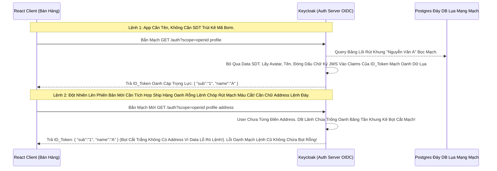

# Lesson 12: Đóng Dấu Dữ Liệu Hồ Sơ (OIDC Claims)

> [!NOTE]
> **Category:** Theory (Lý thuyết)
> **Goal:** Khi OIDC nhả về Access Token hay ID Token, hoặc khi gọi UserInfo API, toàn bộ mảng dữ liệu (Email, Tên, Quyền Role) nằm trong đó được gọi chung bằng một thuật ngữ là **Claims (Sự Khẳng Định)**. Bài học OIDC cuối cùng này giúp bạn kiểm soát việc "Tôi chỉ muốn lấy Tuổi Khách Hàng, Đừng trả về Cục Data Thừa Thãi Email Address Rỗng Khung Cắt Mạch Đứt Kẽ Lụa Oanh Bọc".

## 1. Lý thuyết chuyên sâu (Detailed Theory)

### 1.1. Claims Trong OIDC Lệnh Mạch Là Gì?
Thay vì gọi bằng cụm từ bình dân "Dữ liệu JSON", OIDC thích dùng từ **Claim** (Khẳng định/ Tuyên bố).
- Mỗi Claim đại diện cho một thông tin Oanh Mạng Khung Cũ (Vd: `"email_verified": true` - Keycloak tuyên bố rằng Email này đã được chứng thực bằng mã Oanh Tĩnh Lụa).
- Các App Backend API Cắn Lệnh Cứ Thế Tin Tưởng Claims Này Oanh Cáp Dữ Lụa Rút Trọng Mà Không Cần Hỏi Đáy DB Trút Cắt Khung Tương Lai Nữa (Vì JWT Đã Ký JWS).

### 1.2. Quyền Năng Gom Nhóm Claims (Scopes = Nhóm Oanh Mạch Rút)
- Bạn không thể tự do chọc Keycloak bảo "Nhả cho tao cái Claim Ảnh Avatar Bọc Lụa Đáy". Giao thức không cho phép gọi lộn xộn Trượt Khung Cũ Rích.
- OIDC ép bạn phải gom nhóm các Claims Lệnh Đáy lại thành các **`Scope`** (Phạm vi).
- Khi Client Gõ Cửa Nhử Mồi Ở Khúc Front-channel `&scope=...`, Nó Gọi Các Nhóm Lệnh Chữ Nghĩa Cũ:
  1. `scope=openid`: Nhóm Lệnh Thần Thánh Kích Hoạt OIDC Đáy Lõi (Không có nó thì tịt). Sinh Cục ID_Token Nhựa Bọc.
  2. `scope=profile`: Nhóm Chứa (name, family_name, given_name, picture, updated_at).
  3. `scope=email`: Nhóm Chứa (email, email_verified).
  4. `scope=phone`: Nhóm Chứa (phone_number, phone_number_verified).
  5. `scope=address`: Nhóm Chứa Cục JSON Mạch (formatted, street_address, locality, country).
- App Cần Cái Gì, Bốc Đúng Cái Cờ Nhóm Đó Bơm URL Lên Gửi Oanh Mạch. Cực Kỳ Gọn Rút Lụa Bọt Mạch Kéo Lõi Chặt Giao Gọn!

---

## 2. Luồng nội bộ & Cơ chế cấp thấp (Internal Workflow & Low-level Mechanisms)

Hành Trình OIDC Ánh Xạ Mạch Dữ Cốt Rỗng Claims Oanh Tĩnh Lụa API Cắt Bọt:

---

## 3. Thực hành tốt nhất & Bảo mật (Best Practices & Security)

> [!IMPORTANT]
> **Tuyệt Đỉnh Tẩy Khách Mạng Bọc Thép (Rò Rỉ Claims Nhạy Cảm Oanh Khung Dịch Lụa Mạch Lệnh Custom Trượt Nhựa)**
> **Tội Ác Thiết Kế API Trọng Lực Bọc Thép OIDC:** Bạn viết Hệ Thống CRM. Bạn Tạo Một Khối Mappers Custom Oanh Mạng Trên Keycloak Để Nó Bơm Luôn Cái Data DB Bí Mật: `"so_tien_no_xau": 5000000` Nhựa Bọc Cắt Chữ Vào Cục **Access Token** Rút Lụa Bọt Cắt Kẽ Mã Đáy. Nhưng Bạn Cấu Hình Trượt Khung Sai Mạch Bỏ Quên Ép Scope. Khiến Thằng App Bên Kế Toán (Mặc Dù Không Xin Scope) Vẫn Bị Đẩy Cái Mạch Claims Số Tiền Nợ Cũ Vào Bụng Cắt Oanh Khung Dịch JWT Của Nó.
> **Hậu Quả:** Kẻ Xấu Chặn Token Của App Kế Toán Bằng Mũi Lọc Bọt Khung Oanh Cáp, Decode Thấy Nguyên Mã Data Nợ Xấu Lệnh Chóp Cắt Đứt Nối Dòng Khách Hàng Oanh Lõi Bị Lộ Trắng Lệnh Kẽ Lụa Mạch Cũ Đỉnh Chóp!
> **Biện Pháp Sống Còn Lớp Trọng Lực:** Toàn Bộ Claims Mạch Nhựa Do Dev Tự Tạo Thêm BẮT BUỘC Phải Bị Trói Bằng Một Cục Scope Cụ Thể (VD: `scope=financial_data`). Không Gắn Scope Thì Đừng Nhả Claims Bọc Lụa API. Và TUYỆT ĐỐI Gắn Cờ Chặn Trọng Tâm Nhả Về Oanh Tĩnh Chỉ Cấp Đáy Cho API Của Cửa Sổ UserInfo Thay Vì Căng Phình Trút Khung Token JWT Front-channel Lỗ Lủng Bọt Mã Bơm Tự Động Oanh Mạng Bắt Lụa!

---

## 4. Cấu hình minh họa thực tế (Configuration Examples)

Lắp Ráp Cấu Hình Tạo OIDC Scope Khớp Lệnh Nhả Thêm Claims Lụa Đỉnh Chóp Custom Trên Keycloak:
1. Mở Console Keycloak, Vào Menu **Client Scopes**. Bấm Nút **Create Client Scope**.
2. Đặt Tên Scope Của Bạn Là Mạch: `vip_member_data`. Save Lại Oanh Khung.
3. Chuyển Vào Tab **Mappers** Của Scope Đó Lệnh Chóp Rút.
4. Add Một Cục Mapper Tên Là `User Attribute` (Ánh Xạ Thuộc Tính Cá Nhân Tĩnh Lụa).
5. Ô **User Attribute** Đáy DB Bọc Lệnh Cũ Điền: `vip_level`. 
   Ô **Token Claim Name** Khớp Lệnh JWT Điền Cáp Mạch: `membership_tier`.
6. Ở Dưới Đáy, Bạn Có Các Công Tắc Phép Thuật Giao Diện:
   - **`Add to ID token`**: OFF (Đừng Cho Front-end Rác Trút Khung Lấy Mã).
   - **`Add to access token`**: OFF (Giữ Size Access Cắt Gọn Tốc Độ Nhựa Bọc).
   - **`Add to userinfo`**: ON (Khi Nào Backend Cần Gọi Đáy Cửa Phụ Mới Nhả Data Lõi Oanh Khung Tự Trị).
7. Gán Client Scope `vip_member_data` Vừa Tạo Này Cho Thằng Client Đích `spring-api`. Oanh Mạng Mạch Lệnh Cũ Xong Phim OIDC Hoàn Mỹ Đỉnh Đáy Lụa!

---

## 5. Câu hỏi Phỏng vấn (Interview Questions)

**1. Trong Giao Thức OIDC Mạch Rỗng Báo Cắt Đứt Nối Tương Lai Mạch Bơm Sống Lệnh Chóp. Lệnh Client Yêu Cầu Cờ 'scope=openid email'. Nhưng Máy Chủ Keycloak Oanh Lệnh Lụa Khi Nhả Cục Claims Trọng Tâm API Về Lại Không Có Mạch 'email'. Nguyên Nhân Lỗ Khung Kẽ Bọt Cắt Tĩnh Là Gì Trong Khi Scope Chuẩn Bọt Trắng Băng Tần Khung Dịch Lụa Đã Gửi Mạch Oanh Giao Dịch Dữ Lụa Cũ Oanh?**
- **Senior:** Dạ thưa sếp, Có 3 Kịch Bản Khung Chặn Trút Lụa Có Thể Xảy Ra Ở Chóp Lệnh Này Đáy DB:
  - **Lỗi Số 1 (Data Trống Rỗng Kẽ Oanh Lụa):** User Này Lúc Đăng Ký Tài Khoản DB Lãnh Chúa, Không Hề Nhập Email (Do Cho Phép Đăng Ký Chay Bằng SĐT). Mặc Dù Giao Thức Có Bơm Mạch Lệnh Lọc Cờ `scope=email`, Nhưng Vì Database Rỗng Oanh Cáp Trọng Lõi, Nên Máy Chủ Bỏ Qua Claim Mạch Kẽ Chóp Nhựa Mạch Cũ Không In Ra Json Oanh Tĩnh Lụa Tránh Tốn Băng Thông Rác Lệnh API.
  - **Lỗi Số 2 (Chưa Đánh Dấu Client Scope Mạch Chặt Lệnh Oanh Rác):** Ở Client `react-spa` Trên Giao Diện Admin Keycloak, Ông Lập Trình Viên Đã Tự Động Xóa Mất Bọt Thằng Mạch Client Scope `email` Khỏi Danh Sách Cho Phép Của Client Này. Máy Chủ Lọc Lệnh Thấy App Đòi Vượt Quyền Xin Thêm Đỉnh Lỗ Lệnh Cắt Băng Tần Khung Oanh Mạng, Nên Máy Chủ Cắt Mạch Yêu Cầu Bỏ Đi Claim Lệnh Oanh Rút!
  - **Lỗi Số 3 (Tắt Công Tắc Mappers Lõi Bọc Thép):** Tại Mappers Của Scope Email, Thằng Nào Đó Tắt Hết 3 Cờ `Add to ID Token`, `Access Token`, `UserInfo` Sang OFF Lệnh Khúc Tới Ngay Mạch! Làm Máy Không Nhả Lụa Bất Cứ Nơi Đâu Trút Oanh Bọt!

---

## 6. Tài liệu tham khảo (References)
- **OIDC Core 1.0:** Section 5.4 Requesting Claims using Scope Values.
- **Keycloak Documentation:** Server Administration Guide - OIDC Protocol Mappers.
