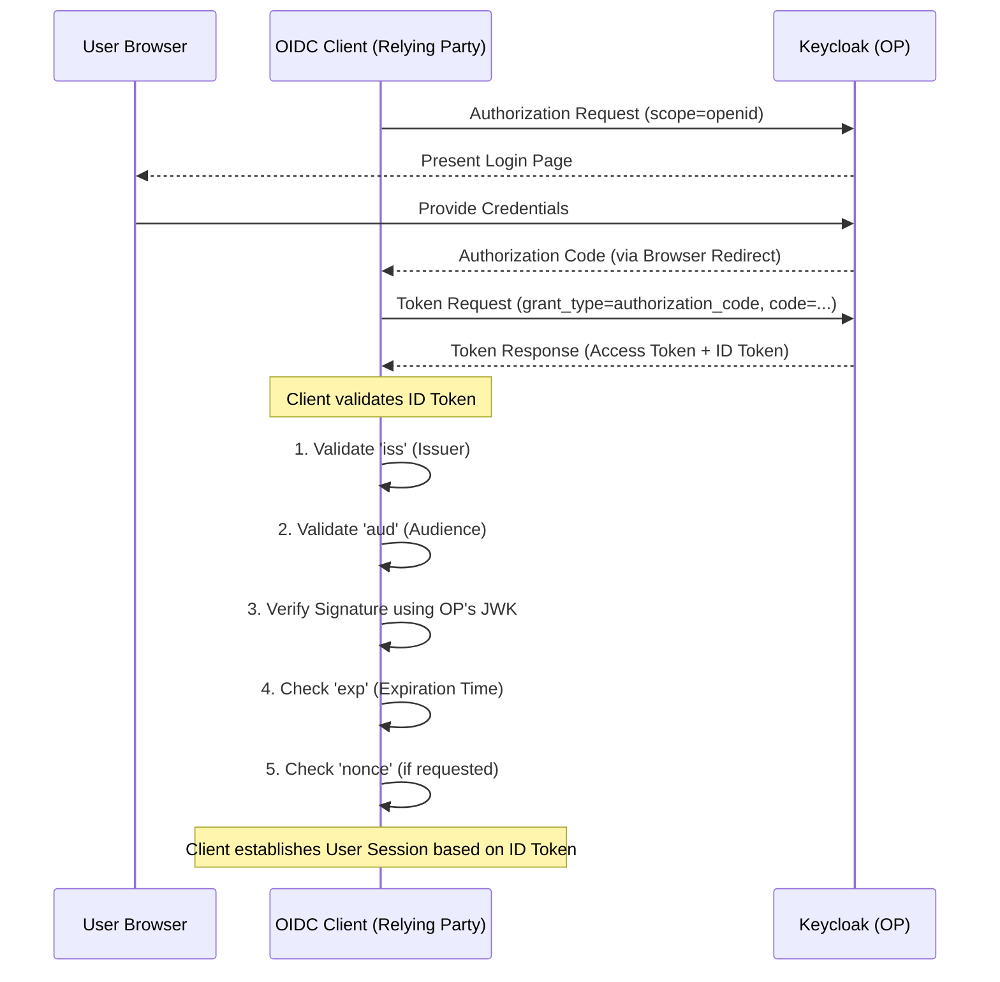

> [!NOTE]
> **Category:** Theory (Lý thuyết)
> **Goal:** Nghiên cứu chuyên sâu về ID Token trong OpenID Connect, cấu trúc, ý nghĩa các claims cốt lõi, quy trình xác minh (validation) và vòng đời của token này.

## 1. Lý thuyết chuyên sâu (Detailed Theory)

ID Token (Identity Token) là thành phần trung tâm làm nên sự khác biệt giữa chuẩn **OpenID Connect (OIDC)** và **OAuth 2.0**. Trong khi OAuth 2.0 cung cấp Access Token (chỉ là chiếc "chìa khóa" để mở cửa tài nguyên - API), nó hoàn toàn không cho biết "ai" đang giữ chìa khóa đó. OpenID Connect giải quyết vấn đề này bằng cách thêm vào **ID Token**.

ID Token là một chuỗi định dạng JSON Web Token (JWT) được ký (và có thể được mã hóa) bởi OpenID Provider (OP - Keycloak). Nhiệm vụ duy nhất của ID Token là **chứng minh danh tính của người dùng (Authentication)** đối với ứng dụng Client. Nó chứa các thông tin (Claims) về kết quả của quá trình xác thực, thời gian xác thực, và các thông tin cơ bản của người dùng (Profile).

### TẠI SAO ID Token lại thiết yếu?
Trong một kiến trúc hiện đại (Single Page App, Mobile App), ứng dụng phía Client (Frontend) cần biết ai đang đăng nhập để hiển thị giao diện (ví dụ: "Welcome, Alice") và quyết định luồng UI (UI Routing). Client KHÔNG THỂ đọc được nội dung của Access Token (vì chuẩn OAuth 2.0 xem Access Token là một chuỗi Opaque đối với Client, chỉ Resource Server mới được hiểu). Do đó, Client đọc **ID Token** để lấy ngữ cảnh xác thực (Authentication Context) một cách bảo mật và chuẩn hóa.

## 2. Luồng nội bộ & Cơ chế cấp thấp (Internal Workflow & Low-level Mechanisms)

Quá trình Client nhận và xử lý ID Token diễn ra theo các bước nghiêm ngặt:



### Cấu trúc tiêu chuẩn của ID Token (Claims):
Một ID Token (sau khi Base64Url Decode phần Payload) có dạng như sau:
```json
{
  "iss": "https://keycloak.example.com/realms/myrealm",
  "sub": "b2f4-4f2a-8c9a-11234abcd",
  "aud": "my-client-app",
  "exp": 1690003200,
  "iat": 1690003000,
  "auth_time": 1690002950,
  "nonce": "n-0S6_WzA2Mj",
  "acr": "1",
  "email": "user@example.com",
  "preferred_username": "john.doe"
}
```
- `iss`: Issuer (Đơn vị phát hành token).
- `sub`: Subject (Định danh duy nhất không thay đổi của người dùng).
- `aud`: Audience (Token này dành cho client nào).
- `exp`: Expiration time (Thời điểm hết hạn).
- `iat`: Issued at (Thời điểm token được sinh ra).

## 3. Thực hành tốt nhất & Bảo mật (Best Practices & Security)

> [!IMPORTANT]
> **Client Validation là BẮT BUỘC:** Client không bao giờ được phép tin tưởng trực tiếp thông tin trong ID Token mà không thực hiện đầy đủ quy trình xác minh (Validation). Bỏ qua bước kiểm tra chữ ký (Signature) hoặc `aud` (Audience) có thể dẫn đến việc Client chấp nhận ID Token bị giả mạo hoặc ID Token bị lấy cắp từ một Client khác.

> [!WARNING]
> **KHÔNG dùng ID Token để gọi API:** Đây là sai lầm phổ biến nhất (Anti-pattern). ID Token chỉ dùng để chứng minh danh tính với **Client**, trong khi Access Token dùng để truy cập **Resource Server (API)**. Gửi ID Token làm Bearer Token tới API sẽ dẫn đến việc rò rỉ thông tin cá nhân và vi phạm nghiêm trọng kiến trúc OIDC.

- **Kích thước Token:** Hạn chế việc "nhồi nhét" quá nhiều thông tin (Custom Claims) vào ID Token. Nếu Token quá lớn, nó có thể vượt quá giới hạn của HTTP Headers hoặc làm giảm hiệu năng. Chỉ để các Claims cơ bản (sub, name, email) trong ID Token, và dùng Access Token để gọi endpoint `/userinfo` lấy các thông tin phụ nếu cần.

## 4. Cấu hình minh họa thực tế (Configuration Examples)

Ví dụ mã Node.js sử dụng thư viện `openid-client` để tự động xác minh ID Token:

```javascript
const { Issuer } = require('openid-client');

async function verifyIdToken(tokenString) {
  // 1. Tải cấu hình từ Discovery endpoint
  const keycloakIssuer = await Issuer.discover('https://keycloak.example.com/realms/myrealm');
  const client = new keycloakIssuer.Client({
    client_id: 'my-client-app',
    client_secret: 'secret'
  });

  try {
    // Thư viện tự động xử lý lấy JWKS, verify signature, aud, iss, exp
    const tokenSet = await client.userinfo(tokenString); 
    // Trong thực tế, hàm userinfo sẽ gọi API, 
    // hoặc hàm decrypt() / validate() nội bộ để xác thực chuỗi ID Token nguyên bản.
    console.log("Valid ID Token payload:", tokenSet);
  } catch (err) {
    console.error("ID Token validation failed!", err);
  }
}
```
Trong Keycloak Admin Console, để tinh chỉnh ID Token Claims, ta sử dụng tính năng **Client Scopes** (ví dụ scope `profile` hoặc `email`) và mapping các user attributes vào ID Token.

## 5. Trường hợp ngoại lệ (Edge Cases)

- **Lệch đồng hồ hệ thống (Clock Skew):** Server Keycloak và máy chủ chứa Client có thời gian không đồng bộ. Nếu đồng hồ của Client chạy nhanh hơn Keycloak, nó có thể đánh giá thuộc tính `iat` nằm trong tương lai, hoặc `exp` đã hết hạn ngay khi vừa nhận.
  - *Cách khắc phục:* Các thư viện chuẩn thường cấu hình `clockTolerance` (thời gian chênh lệch cho phép), ví dụ 30-60 giây.
- **Client nhận Token qua Front-channel (Implicit Flow):** ID Token truyền thẳng qua URL Fragment trên trình duyệt. Điều này dễ bị chặn bắt (Interception).
  - *Cách khắc phục:* Đây là lý do Implicit Flow đã bị "khai tử" (deprecated). Luôn luôn sử dụng Authorization Code Flow với PKCE.
- **Token Injection (Thay thế Token):** Attacker dùng ID Token của chính họ (được cấp hợp lệ bởi Keycloak cho App khác) và inject vào App nạn nhân (bị lỗi Confused Deputy). Việc kiểm tra `aud` (Audience) giúp ngăn chặn lỗi này.

## 6. Câu hỏi Phỏng vấn (Interview Questions)

1. **Junior:** ID Token và Access Token khác nhau như thế nào?
   - *Đáp án:* ID Token dành cho Client để biết danh tính người dùng (Authentication). Access Token dành cho Resource Server để cấp quyền truy cập API (Authorization). Client không nên parse Access Token, và API không nên nhận ID Token.
2. **Junior:** Claim `sub` trong ID Token có nghĩa là gì?
   - *Đáp án:* Subject Identifier. Đây là ID định danh duy nhất của người dùng trong hệ thống (thường là UUID trong Keycloak). Không bao giờ được tái sử dụng và không đổi tên.
3. **Senior:** Tại sao Client lại phải tự đi xác minh chữ ký (Signature) của ID Token nếu nó vừa được lấy trực tiếp từ `/token` endpoint thông qua một kết nối HTTPS an toàn (Back-channel)?
   - *Đáp án:* Theo chuẩn OIDC (Phần 3.1.3.7), nếu Token được nhận qua kết nối HTTPS an toàn từ token_endpoint trực tiếp tới Client, việc verify chữ ký có thể được bỏ qua do TLS đã đảm bảo tính toàn vẹn. Tuy nhiên, việc luôn verify giúp tạo ra một lớp Defense in Depth, bảo vệ khỏi trường hợp TLS Termination lỏng lẻo ở Reverse Proxy.
4. **Senior:** Thuộc tính `nonce` trong ID Token giúp ngăn chặn loại tấn công nào và nó hoạt động ra sao?
   - *Đáp án:* Ngăn chặn Replay Attack. Client sinh một giá trị ngẫu nhiên (nonce) gửi trong Auth Request. Keycloak nhúng giá trị này vào ID Token. Khi nhận Token, Client so sánh nonce trong Token với nonce đã lưu trữ ở session. Nếu khớp mới chấp nhận Token.
5. **Senior:** Giải thích vai trò của claim `acr` trong ID Token.
   - *Đáp án:* Authentication Context Class Reference. Nó cho biết "cấp độ tin cậy" của quá trình đăng nhập. Ví dụ, `acr: "1"` có thể là đăng nhập Password, `acr: "2"` có thể là MFA (Multi-Factor Authentication). Dựa vào đây, Client có thể bắt buộc người dùng nâng cấp xác thực (Step-up Authentication).

## 7. Tài liệu tham khảo (References)

- [OpenID Connect Core 1.0 - ID Token Validation](https://openid.net/specs/openid-connect-core-1_0.html#IDTokenValidation)
- [RFC 7519 - JSON Web Token (JWT)](https://datatracker.ietf.org/doc/html/rfc7519)
- [Keycloak Documentation: Server Administration Guide (Tokens)](https://www.keycloak.org/docs/latest/server_admin/)
