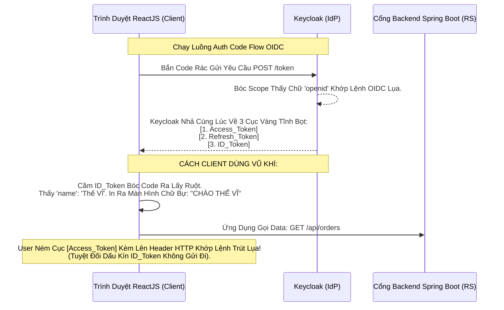

# Lesson 2: Chứng Minh Thư Điện Tử (ID Token)

> [!NOTE]
> **Category:** Theory (Lý thuyết)
> **Goal:** Trong OAuth2, nếu lấy Access Token là mục đích sống còn để mở cửa API. Thì trong OIDC, **ID Token** chính là tấm "Chứng minh nhân dân (CCCD)" điện tử của User. App của bạn (ReactJS, Mobile) cần ID Token để biết: "À, Thằng đang cầm điện thoại này tên là Nguyễn Văn A, email của nó là a@gmail.com". Khác với Access Token (Chỉ API đọc), ID Token sinh ra LÀ ĐỂ CHO ỨNG DỤNG BÊN THỨ 3 (CLIENT) ĐỌC.

## 1. Lý thuyết chuyên sâu (Detailed Theory)

### 1.1. Access Token Khác Gì ID Token?
Đây là câu hỏi phỏng vấn kinh điển!
- **Access Token (Vé Vào Cửa API):** 
  - Khán giả mục tiêu (Audience) của nó là **Resource Server (API Backend)**.
  - Client App (ReactJS) KHÔNG ĐƯỢC PHÉP bóc nó ra đọc (Dù là nó tự động bóc được bằng Base64 nhưng chuẩn OIDC cấm làm thế, vì định dạng của Access Token có thể là Opaque Token - Chuỗi rác mã hóa).
  - Nó chứng minh: "Ai Cầm Cái Token Này Thì Có Quyền Xóa Đơn Hàng".
- **ID Token (Thẻ Định Danh User):**
  - Khán giả mục tiêu (Audience) của nó LÀ CHÍNH **Client App (ReactJS)**.
  - Chuẩn OIDC BẮT BUỘC ID Token PHẢI LÀ JWT (JSON Web Token).
  - Nó chứng minh: "Sự kiện Đăng Nhập vừa diễn ra lúc 8:00 sáng. Đứa đăng nhập tên là Nguyễn Văn A. Cấp bởi Trạm Cảnh Sát Keycloak".
  - **Tối Kỵ Tuyệt Đối:** KHÔNG BAO GIỜ mang ID Token ném lên Header gọi API đập vào Resource Server. API Server Từ chối lụa gãy mạng ngay lập tức! (Vì API không quan tâm mày là ai, nó chỉ quan tâm mày có Access Token quyền hạn gì).

### 1.2. Bên Trong Tấm Thẻ CCCD Có Gì?
Khi Keycloak nhả ID Token về, nếu bạn Paste nó lên `jwt.io`, bạn sẽ thấy các mảng (Claims) bắt buộc của OIDC:
1. **`iss` (Issuer):** Kẻ in ra tấm CCCD này. (URL của Keycloak).
2. **`sub` (Subject):** Số ID duy nhất của con người này (Mã UUID ngẫu nhiên không bao giờ thay đổi). (Lưu ý: Không dùng Tên/Email làm Sub vì Email có thể bị sửa, nhưng mã UUID thì bất tử).
3. **`aud` (Audience):** Tên của Ứng Dụng (Client_ID) được quyền cầm cái CCCD này. (Chống lấy râu ông nọ cắm cằm bà kia).
4. **`exp` (Expiration Time):** Giờ phút thẻ hết hạn sử dụng.
5. **`iat` (Issued At):** Cột mốc thời gian sự kiện Đăng Nhập Vừa Xảy Ra.

---

## 2. Luồng nội bộ & Cơ chế cấp thấp (Internal Workflow & Low-level Mechanisms)

Hành Trình OIDC Rẽ Dòng 2 Cái Token Cùng Lúc Bắn Về Mạch Client:

---

## 3. Thực hành tốt nhất & Bảo mật (Best Practices & Security)

> [!IMPORTANT]
> **Tuyệt Đỉnh Tẩy Khách Mạng Bọc (Không Bao Giờ Gửi Cục ID_Token Vô API Mù Lòa)**
> **Tội Ác Thiết Kế:** Bạn là Lập Trình Viên Backend. Bạn Code API Order. Bạn lười không muốn gọi lệnh móc Data User, nên bạn bảo thằng Dev Frontend ReactJS: "Mày ném cả cục ID Token lên Header cho tao, để tao đọc tên Email của nó tao lưu vào Bảng Đơn Hàng cho Lẹ!".
> **Hậu Quả:** Cái Cục ID Token Được Sinh Ra Không Dành Cho Thằng Đứng Ở Đáy API (Nó mang Audience Của Thằng Web Frontend Cơ Mà). Thằng Hacker sẽ giả mạo ID Token Mù Lòa Đập Lệnh Chữ Ký Cắt Khung. Hơn nữa, việc lạm dụng ID Token để gọi API phá vỡ hoàn toàn kiến trúc Microservices Zero-Trust OIDC (Nơi Access Token là Vua Quyền Lực).
> **Biện Pháp Sống Còn Lớp Trọng Lực Thép OIDC:**
> Nếu Backend Spring Boot cần Tên/Email của khách để chèn vô DB. Nó hãy tự bóc cái Mạch JSON Claims nằm bên trong **Access Token**! Vì Keycloak Mặc định cấu hình In Hết Toàn Bộ Tên/Email vào luôn cả bề mặt của Access Token (Protocol Mappers). Đừng bóp dái hệ thống bằng cách lấy Râu Ông ID Cắm API Bà Tác!

---

## 4. Cấu hình minh họa thực tế (Configuration Examples)

Lắp Ráp Cấu Hình Cắt Khung Ép Máy Chủ Bơm ID_Token Lụa Oanh Lệnh API Tĩnh:
1. Trong Request Đi Gõ Cửa Keycloak Để Xin Login `http://.../auth?...`
2. **LUẬT THÉP CỦA OIDC:** Bạn BẮT BUỘC Phải Gắn Tham Số **`scope=openid`**.
3. Nếu Bạn Gọi OAuth2 Mà Bỏ Quên Mất Cái Từ Khóa Phép Thuật Giao Diện `openid` Này (Ví dụ bạn chỉ gửi `scope=email`). Thì Keycloak Sẽ Xử Lý Request Đó Nhờ Động Cơ OAuth2 Cổ Đại. Nó Sẽ Lập Tức **CHỈ TRẢ VỀ ACCESS TOKEN**. Cục ID Token Tuyệt Vời Biến Mất Hoàn Toàn Rỗng Khung Cắt Mạch Trắng Bóc!
4. Do Đó, Cờ Scope = Openid Chính Là Công Tắc Để Biến Khối Giao Thức Chuyển Từ OAuth2 Sang Trọng Tâm Lõi OIDC Của Lãnh Chúa! (Thường hay gọi kèm là `scope=openid profile email`).

---

## 5. Câu hỏi Phỏng vấn (Interview Questions)

**1. Trong Giao Thức OIDC Đỉnh Chóp, Thằng ID Token Trả Về Thường Chứa Một Cái Mã Claim Tên Là 'nonce' Khớp Lệnh Nằm Nằm Sâu Dưới Gầm Json. Ý Nghĩa Của Nó Là Gì Và Nó Bảo Vệ Client Tránh Mũi Tấn Công Sinh Tử Nào Oanh Khung Dịch Lụa Mạng Mạch Lụa?**
- **Senior:** Chà, Sếp Hỏi Đúng Điểm Tử Huyệt Giao Thức Thép! 
  - Tham số **`nonce` (Number Used Once - Số Chỉ Dùng 1 Lần)** Là Trái Tim Chống **Replay Attack (Tấn Công Lặp Cướp Phiên)** của ID Token.
  - Lúc Thằng Frontend (React) ném User Bay Sang Màn Hình Login. React Tự Động Sinh 1 Dãy Số Random Tuyệt Mật (`nonce=99xyz`) Lên URL Auth.
  - Khi Keycloak Đẻ Ra Cục ID Token Mới Tinh Trắng Bóc, Nó Lôi Cái Dãy 99xyz Đó Ra In Cứng Chết Mực Đóng Dấu Chữ Ký JWS Vào Bề Mặt Cái Cục ID Token Đó Trút Kéo Lụa.
  - Lúc React Nhận ID Token Về, Nó Bóc Ra Xem Đáy: "À Cái ID Token Này Chứa Nonce 99xyz, Trùng Khớp Với Số Tao Sinh Ra Ban Đầu Nè! Đây Đúng Là Token Tao Gọi Lệnh! Bọc Lụa API Giao Dịch Rỗng Kéo Sống!".
  - Giả sử Hacker Ăn Cắp Cái ID Token Cũ Đem Dội Lên App Khách Lệnh CSRF Cắt Khung (Replay). App Khách So Nonce Thấy Sai Lệch Rác Lập Tức Đạp Lỗi Văng Chóp Oanh Dịch Mù Lòa!

---

## 6. Tài liệu tham khảo (References)
- **OIDC Core 1.0:** Section 2. ID Token.
- **Keycloak Documentation:** Server Administration Guide - OIDC Core.
