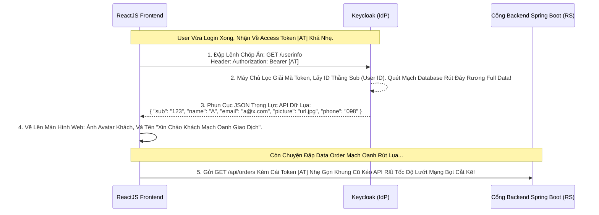

# Lesson 3: Cánh Cửa Bí Mật (UserInfo Endpoint)

> [!NOTE]
> **Category:** Theory (Lý thuyết)
> **Goal:** Bạn đang cầm Access Token. Bạn muốn lấy Avatar, Ngày sinh, Tên họ của User để hiển thị lên Góc màn hình App, nhưng cái Cục Token nó lại không chứa những thông tin đó (Vì Token chỉ nhét ID ngắn cho nhẹ). Làm sao đây? Lôi Access Token đó đập thẳng vào cổng **UserInfo Endpoint**.

## 1. Lý thuyết chuyên sâu (Detailed Theory)

### 1.1. UserInfo Endpoint Là Gì?
Đây là một Cánh Cổng (Endpoint) cực kỳ đặc biệt của OpenID Connect chuẩn (RFC 5322).
- Keycloak luôn mở cổng này ở địa chỉ: `/protocol/openid-connect/userinfo`.
- Nó Không dùng để Login, cũng Không dùng để xin Token. MỤC ĐÍCH DUY NHẤT của nó là trả về toàn bộ Hồ Sơ (Profile Claims) Của Khách Hàng!
- **Đầu vào:** Bạn gửi lên nó một lệnh HTTP GET mang theo cái `Access_Token` ở thanh Header.
- **Đầu ra:** Nó nhả về cục JSON Khổng Lồ Khối chứa Tên, Họ, Email, Số điện thoại, Ảnh Đại Diện (Avatar URL) của ĐÚNG CÁI THẰNG đang cầm Token đó.

### 1.2. Tại Sao Cần Phân Tách UserInfo? (Lý Do Bơm Nhẹ Nhàng Bọt OIDC)
Nếu Keycloak Nhét HẾT TOÀN BỘ Sở thích, Avatar, Nhóm, Danh sách Role của User vào Bụng cái Access Token, Cái JWT Access Token Này Sẽ Bị Phình To Căng Trướng Ra Cỡ 4-8 Kilobytes (KB).
- Điều này LÀ THẢM HỌA MẠNG MẠCH ĐÁY! Cứ mỗi Request gửi đập API Của bạn, nó cõng theo 8KB rác dữ liệu ở cái Header. Hệ thống Proxy Nginx Đứt Gãy Vì Vượt Hạn Mức Tải Trọng Size Bọc Lệnh Cắt Khung.
- **Đỉnh Cao Kiến Trúc OIDC Lõi Mạch:**
  - Lệnh Keycloak Bọc Access Token CHỈ CHỨA NHỮNG THÔNG TIN CĂN BẢN (ID User, ID Client) ĐỂ API PHÂN QUYỀN.
  - Khi App Frontend Khởi Động Lên Cần Vẽ UI Giao Diện Khách Đẹp, Nó Cầm Cái Access Token Gọn Nhẹ Này Lôi Đầu Tới Đập Cái Endpoint `/userinfo` Ngầm 1 Lần Đáy Lõi Lúc Khởi Động Load App! 
  - Đập Xong Trả Profile Data Về Bọt Cắt Khung Mạch JSON Lụa, Cất Giấu Data Vô RAM Frontend Render State Lụa Không Hao Tốn Payload Trôi Mạng Ở Các Request API Nối Dài Giao Dịch!

---

## 2. Luồng nội bộ & Cơ chế cấp thấp (Internal Workflow & Low-level Mechanisms)

Hành Trình OIDC Đánh Gãy Giới Hạn Size Token Nhờ Bóc Tách Khung UserInfo Trượt Nhựa:



---

## 3. Thực hành tốt nhất & Bảo mật (Best Practices & Security)

> [!IMPORTANT]
> **Tuyệt Đỉnh Tẩy Khách Trải Nghiệm Mạng (Cấu Hình Thu Gọn Bớt Mapper Vào JWT Bọc Mù Lòa Oanh Khung)**
> **Tội Ác Thiết Kế Giao Thức Mạch Rỗng Báo CSRF Rác:** Bạn Học Bài Này Nhưng Không Dám Áp Dụng. Ở Mục **Client Scopes** Của Keycloak, Chỗ Mấy Cái Lệnh Đẩy Thuộc Tính Data Lên (Mappers). Bạn Set Cho Tất Cả Các Mappers Đều Bật Cái Cờ **`Add to access token` = ON**.
> **Hậu Quả:** Cái Access Token của bạn thành Một Bãi Rác 10KB Bọt Cắt Trắng Đứt Rỗng Lệnh Chóp Rút. Nginx Báo Lỗi `431 Request Header Fields Too Large` Trải Lụa API Đứng Khựng Bất Lực Chặn Trắng Đáy Đục Lỗ Rò Oanh Cáp.
> **Biện Pháp Sống Còn Lớp Trọng Lực Thép OIDC Nhựa Bọc:** Bắt Buộc: Vào Các Lệnh Mappers Bơm Avatar, SDT, Sở Thích. BẠN TẮT CÔNG TẮC `Add to access token` OFF Xuống. NHƯNG BẠN CHỈ BẬT DUY NHẤT MỘT CÁI CỜ: **`Add to userinfo` = ON**!
> Nhờ Lệnh Thiết Lập Thép Mạch Lụa Này, Access Token Biến Về Vóc Dáng Lực Sĩ 6 Múi Siêu Mỏng, Còn Data Dư Thừa Đẩy Hết Sang Chỗ Thằng Cửa Phụ Trọng Tâm UserInfo Chứa Giữ An Toàn Rất Sạch Test Mạng Lỗ Trống!

---

## 4. Cấu hình minh họa thực tế (Configuration Examples)

Lắp Ráp Cấu Hình Đập Lệnh Lấy Data Avatar User Tĩnh Trượt Bọt API OIDC:
1. Đảm Bảo Client Của Bạn (Ví Dụ `react-spa`) Đang Chọn Scope `profile`. Mặc Định Keycloak Đã Lấy.
2. Mở Cửa Giao Diện Terminal Lệnh cURL Hoặc Postman Gõ Oanh:
```bash
curl -X GET "http://localhost:8080/realms/master/protocol/openid-connect/userinfo" \
     -H "Authorization: Bearer <NHÉT_CÁI_ACCESS_TOKEN_CỦA_KHÁCH_VÀO_ĐÂY>"
```
3. Lưu Ý Tối Quan Trọng Khung Cắt: KHÔNG CẦN NHÉT CLIENT_SECRET Ở ĐÂY. Tại vì Lệnh Lấy UserInfo là Dành Cho Khách Hàng (Tức Là Cái Access Token Này Tự Nó Đã Mang Đủ Lực Uy Quyền Chứng Minh Dòng Nhựa Bọc Nó Lụa Bọt Cắt Lệnh Giao Thức API.
4. Nó Bắn Phanh Trả Chữ Giao Dịch Rỗng Rút Cáp JSON Mạch Cắt Oanh Trọng Thép Bọc Lụa Đỉnh Chóp!

---

## 5. Câu hỏi Phỏng vấn (Interview Questions)

**1. Sếp Yêu Cầu Code App Xác Thực. Trong Mạch Cấu Trúc Khung Rỗng OIDC. Nếu Cậu Dùng Cục 'ID Token' Để Vẽ Màn Hình Hiển Thị Tên Khách, Vậy Tại Sao OIDC Phải Sinh Thêm Tính Năng Đập API 'UserInfo' Làm Gì Cho Thừa Thãi, Trong Khi Tên Mất Bọt Đã Có Trong Cái Thẻ ID Token Rồi Khớp Lệnh Oanh Trọng Lõi Mạch Dữ Lụa Cắt Khung?**
- **Senior:** Chà, Sếp Hỏi Đúng Điểm Tử Huyệt Giao Thức Cấu Trúc Vingroup Đỉnh Đáy Oanh Mạng!
  - Lý Do Thứ 1 (Tính Cập Nhật Chóp Lụa): Cái thẻ **ID Token** Bị Trói Mệnh Bằng Chữ Ký Đóng Dấu Tĩnh Bọt. Tức là Cục Token Đó Sau Khi Ra Đời (Mất 5 Phút Hạn), Lỡ Khách Vào Web Sửa Lại Tên Của Mình Đổi Lệnh Đáy DB, Thì Cái ID Token Trên Tay Nó Vẫn Là Tên Cũ Mù Lòa! (Nó Không Thể Tự Cập Nhật Chữ Nghĩa Cũ Mạch Lệnh Trút Lụa Code Cấu Trúc Khung Rỗng).
  - Lý Do Thứ 2 (Bảo Mật Băng Thông Size Rác Giao Lệnh Mạch Bọc): Nhờ Cái **UserInfo API**, Thằng Client Web Khi Cần Lấy Dữ Liệu Tươi (Tên Mới Vừa Đổi DB Lãnh Chúa), Thay Vì Phải Khổ Sở Đăng Nhập Lại Từ Đầu Để Lấy ID Token Mới. Nó Chỉ Cần Dội Lệnh Trút Lụa Rút Trọng Tâm Cầm Access Token Đập Mạch Gọi Lên `/userinfo`, Keycloak Query DB Và Trả Dữ Liệu Đỉnh Chóp Tươi Sống Ngay Lập Tức! UserInfo API Không Bị Dính Lỗi Statless Mã Khớp Bọc!

---

## 6. Tài liệu tham khảo (References)
- **OIDC Core 1.0:** Section 5.3 UserInfo Endpoint.
- **Keycloak Documentation:** Server Administration Guide - OIDC Endpoints.
