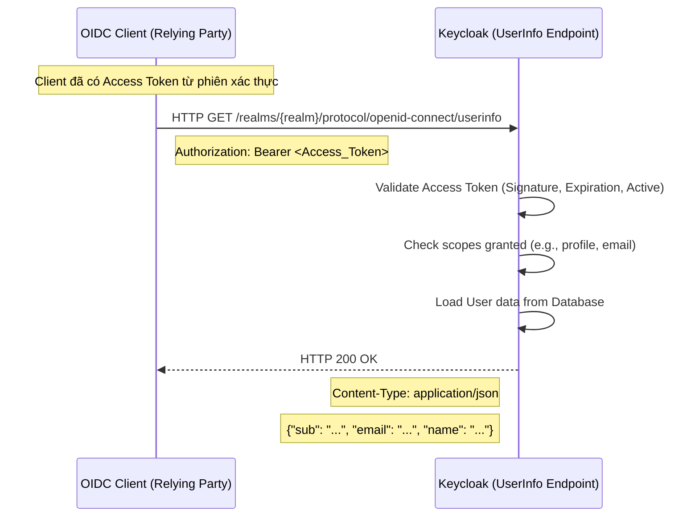

> [!NOTE]
> **Category:** Theory (Lý thuyết)
> **Goal:** Khám phá chi tiết về UserInfo Endpoint trong OpenID Connect, phương pháp sử dụng Access Token để yêu cầu thông tin người dùng, và các thực hành tốt nhất khi triển khai.

## 1. Lý thuyết chuyên sâu (Detailed Theory)

UserInfo Endpoint là một Protected Resource API do OpenID Provider (Keycloak) cung cấp theo chuẩn OpenID Connect (OIDC). Nhiệm vụ của endpoint này là trả về các thông tin cá nhân bổ sung (Claims) của người dùng hiện tại (Authenticated User).

### TẠI SAO cần có UserInfo Endpoint?
Mặc dù thông tin người dùng đã được đính kèm vào trong **ID Token**, tuy nhiên có một giới hạn rất lớn về không gian lưu trữ:
1. **Kích thước Token:** Nếu nhồi nhét tất cả thông tin (ảnh đại diện, địa chỉ, quyền hạn, nhóm) vào ID Token, dung lượng Token sẽ quá lớn, làm tăng đáng kể dung lượng HTTP Header mỗi khi Client gửi request, ảnh hưởng đến băng thông và hiệu năng.
2. **Quyền riêng tư (Privacy):** ID Token thường được gửi công khai tới trình duyệt và có thể lưu ở Frontend (LocalStorage, Cookies). Chứa quá nhiều PII (Personally Identifiable Information) trong Token có rủi ro bị lộ thông tin.
3. **Tính tức thời (Freshness):** ID Token tĩnh trong suốt thời hạn sống của nó. Khi profile người dùng cập nhật trên Keycloak, ID Token cũ không tự cập nhật. UserInfo Endpoint cung cấp cách để Client truy vấn thông tin người dùng mới nhất tại thời điểm gọi API.

## 2. Luồng nội bộ & Cơ chế cấp thấp (Internal Workflow & Low-level Mechanisms)

Quá trình truy vấn thông tin từ UserInfo Endpoint yêu cầu Client phải có một Access Token hợp lệ (chứa scope `openid`).



### Chi tiết kỹ thuật:
- **Xác thực API:** Endpoint `/userinfo` luôn yêu cầu một Access Token hợp lệ làm phương thức xác thực (Bearer Token).
- **Liên kết Scopes và Claims:** Lượng thông tin trả về phụ thuộc chặt chẽ vào các **Scopes** mà Client đã xin quyền ban đầu và được người dùng đồng ý. Ví dụ:
  - Scope `profile` sẽ yêu cầu trả về các claims: `name`, `family_name`, `given_name`, `picture`.
  - Scope `email` sẽ yêu cầu trả về: `email`, `email_verified`.
- **Định dạng trả về:** Mặc định là JSON. Tuy nhiên, nếu được cấu hình (thông qua Client Metadata `userinfo_signed_response_alg`), Keycloak có thể trả về một JWT chứa các thông tin này (được ký bằng private key của OP) để tăng cường bảo mật.

## 3. Thực hành tốt nhất & Bảo mật (Best Practices & Security)

> [!IMPORTANT]
> **Hạn chế việc gọi liên tục:** Không nên gọi UserInfo Endpoint tại mọi request của người dùng vì nó đòi hỏi Database lookup ở Keycloak, gây thắt cổ chai (bottleneck) hệ thống. Nên truy vấn một lần ở lần đăng nhập đầu tiên, sau đó cache lại dữ liệu ở Server Client hoặc Session nội bộ.

> [!WARNING]
> **Access Token Leakage:** UserInfo API dùng Bearer Token. Nếu Access Token bị rò rỉ, bất kỳ ai cũng có thể gọi `/userinfo` để trích xuất toàn bộ thông tin cá nhân được cấp phép. Luôn đảm bảo thời gian sống (Lifespan) của Access Token ngắn và dùng HTTPS tuyệt đối.

- **Dùng Thin Token:** Một chiến lược Enterprise tốt là cấu hình Keycloak phát hành "Thin Token" (ID và Access Token chứa rất ít claim, chỉ có `sub` và `iss`), sau đó bắt Client gọi UserInfo bằng Server-to-Server back-channel để lấy dữ liệu.

## 4. Cấu hình minh họa thực tế (Configuration Examples)

Ví dụ cấu hình gọi UserInfo Endpoint bằng một lệnh `curl`:

```bash
# Giả sử ACCESS_TOKEN đã được lưu
ACCESS_TOKEN="eyJhbGciOiJSUz..."

# Yêu cầu thông tin UserInfo
curl -X GET \
  https://keycloak.example.com/realms/myrealm/protocol/openid-connect/userinfo \
  -H "Authorization: Bearer ${ACCESS_TOKEN}" \
  -H "Accept: application/json"
```
Kết quả phản hồi JSON tiêu chuẩn:
```json
{
  "sub": "248289761001",
  "name": "Jane Doe",
  "given_name": "Jane",
  "family_name": "Doe",
  "preferred_username": "j.doe",
  "email": "janedoe@example.com",
  "email_verified": true
}
```

Trong Keycloak, để một Custom Claim (ví dụ `department`) xuất hiện ở UserInfo:
1. Vào **Client Scopes** -> `profile` -> **Mappers**.
2. Thêm mapper kiểu `User Attribute`.
3. Bật tùy chọn **Add to userinfo** sang `ON` (đảm bảo nó không nằm trong token nếu muốn giảm size: tắt `Add to ID token` và `Add to access token`).

## 5. Trường hợp ngoại lệ (Edge Cases)

- **Lỗi 401 Unauthorized:** Gặp khi Access Token bị hết hạn, bị thu hồi (revoked), hoặc không chứa scope `openid` (Keycloak yêu cầu mọi token gọi UserInfo phải thuộc chuẩn OIDC).
  - *Cách xử lý:* Client phải sử dụng Refresh Token để lấy một cặp token mới và thử gọi lại (Retry logic).
- **Lỗi Thiếu Claims (Missing Claims):** Gọi `/userinfo` thành công nhưng thông tin bị rỗng.
  - *Nguyên nhân:* Mặc dù mapper đã được cấu hình "Add to userinfo", nhưng Client lúc khởi tạo Authorization Request đã quên truyền vào Scope tương ứng (ví dụ: thiếu `scope=profile`).
- **Sự cố tải (High Load):** Khi một đợt burst traffic đến Client, hàng ngàn request cùng gọi `/userinfo` làm Keycloak kiệt sức do truy vấn Database.
  - *Cách xử lý:* Cache thông tin ở Redis (phía Client) với thời gian TTL tương ứng với chu kỳ update profile hợp lý.

## 6. Câu hỏi Phỏng vấn (Interview Questions)

1. **Junior:** UserInfo Endpoint dùng để làm gì trong OpenID Connect?
   - *Đáp án:* Là một API để lấy thêm thông tin của người dùng hiện tại (profile, email, phone) dựa trên Access Token được cung cấp.
2. **Junior:** Tôi có cần gọi UserInfo Endpoint nếu ID Token đã chứa đủ mọi thông tin cần thiết?
   - *Đáp án:* Không. Việc gọi UserInfo là một tùy chọn thêm. Nếu ID Token đã thoả mãn nghiệp vụ, có thể tiết kiệm một lệnh gọi mạng (network call).
3. **Senior:** Nếu ta muốn giữ cho ID Token và Access Token thật nhỏ gọn trên mạng, làm sao để Client vẫn có đủ Profile Data?
   - *Đáp án:* Chúng ta cấu hình "Thin Tokens" trên Keycloak bằng cách tắt tùy chọn "Add to ID Token" và "Add to Access Token" trong các Mappers. Thay vào đó, bật "Add to userinfo". Client khi có Access Token mỏng sẽ gọi UserInfo Endpoint qua Back-channel để tải Full Profile.
4. **Senior:** Tại sao có lúc gọi UserInfo trả về lỗi 403 Forbidden hoặc trả về thiếu trường `email` dù User có cấu hình email?
   - *Đáp án:* Lỗi có thể do Access Token thiếu scope `openid` (biến nó thành thuần OAuth thay vì OIDC) hoặc thiếu scope `email`. Keycloak kiểm tra chặt chẽ Client Scopes được cấp trong quá trình gọi token.
5. **Senior:** Dữ liệu trả về từ UserInfo có an toàn chống giả mạo khi qua đường truyền hay không?
   - *Đáp án:* Trả về JSON qua HTTPS thì ngăn chặn nghe lén (Man-in-the-Middle). Nhưng nếu yêu cầu tính toàn vẹn (Non-repudiation) ở mức message, ta phải cấu hình Keycloak phát hành Signed UserInfo Response (JWS - JSON Web Signature) thay vì chỉ là raw JSON.

## 7. Tài liệu tham khảo (References)

- [OpenID Connect Core 1.0 - UserInfo Endpoint](https://openid.net/specs/openid-connect-core-1_0.html#UserInfo)
- [Keycloak Official Docs: Protocol Mappers](https://www.keycloak.org/docs/latest/server_admin/#_protocol-mappers)
- [RFC 6750 - OAuth 2.0 Bearer Token Usage](https://datatracker.ietf.org/doc/html/rfc6750)
