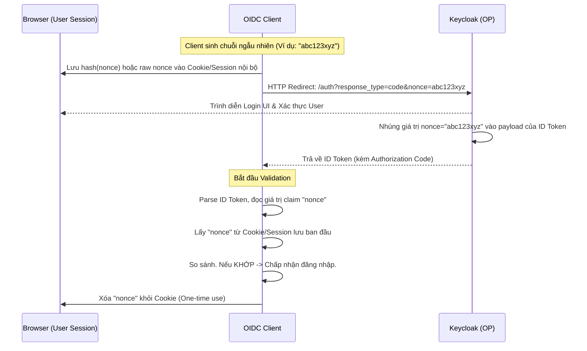

> [!NOTE]
> **Category:** Theory (Lý thuyết)
> **Goal:** Hiểu sâu về tham số `nonce` trong OpenID Connect, cơ chế hoạt động để ngăn chặn tấn công Replay Attack và cách kiểm tra hợp lệ tại phía Client.

## 1. Lý thuyết chuyên sâu (Detailed Theory)

Trong hệ thống xác thực OpenID Connect (OIDC), `nonce` (Number Used Once) là một chuỗi ngẫu nhiên do phía Client tạo ra tại thời điểm gửi yêu cầu xác thực (Authorization Request) và nó chỉ được sử dụng duy nhất một lần cho một phiên đăng nhập cụ thể. 

### TẠI SAO `nonce` lại thiết yếu?
Vấn đề cốt lõi mà `nonce` giải quyết là loại bỏ **Replay Attack (Tấn công phát lại)** trong quá trình truyền ID Token.
Nếu không có cơ chế `nonce`, khi một kẻ tấn công nghe lén (Man-in-the-Middle) và sao chép được ID Token hợp lệ của nạn nhân, chúng có thể đem Token này gửi ngược lại cho ứng dụng Client trong một phiên khác. Vì ID Token có chữ ký hợp lệ và chưa hết hạn, Client sẽ hiểu nhầm kẻ tấn công là nạn nhân và cho phép đăng nhập trái phép. 

Bằng cách sử dụng tham số `nonce`, ID Token trở nên bị ràng buộc (bound) trực tiếp với một phiên trình duyệt cụ thể do Client khởi tạo. Bất kỳ nỗ lực nào nhằm "chơi lại" một ID Token cũ sang một Request mới đều sẽ thất bại vì giá trị `nonce` không khớp với giá trị Client đang mong đợi. Tham số này đặc biệt BẮT BUỘC trong chuẩn Implicit Flow và được khuyến nghị cực kỳ cao trong Authorization Code Flow.

## 2. Luồng nội bộ & Cơ chế cấp thấp (Internal Workflow & Low-level Mechanisms)

Quá trình khởi tạo, truyền tải và xác minh `nonce` tuân theo một chu trình khép kín giữa Client và Keycloak:



### Chi tiết luồng xử lý:
1. **Khởi tạo:** Client phải dùng trình sinh số giả ngẫu nhiên an toàn bằng mật mã (CSPRNG) để tạo chuỗi độ dài hợp lý.
2. **Gửi đi:** Tham số `nonce` đính kèm qua query string của URL gửi đến endpoint `/auth`.
3. **Phản hồi:** Keycloak không kiểm tra giá trị này mà chỉ đơn giản là nhúng nó nguyên vẹn (như một Claim) vào Payload của ID Token chuẩn bị xuất ra.
4. **Validation:** Đây là trách nhiệm của Client. Nếu Claim `nonce` trong Token không khớp tuyệt đối với giá trị đã lưu nội bộ, ID Token phải bị **TỪ CHỐI NGAY LẬP TỨC**.

## 3. Thực hành tốt nhất & Bảo mật (Best Practices & Security)

> [!IMPORTANT]
> **Khả năng dự đoán:** `nonce` không bao giờ được phép dự đoán được hoặc là một giá trị cố định (hard-coded). Nó PHẢI ngẫu nhiên và độ entropy cao (ví dụ: chuỗi 32 byte được mã hóa Base64).

> [!WARNING]
> **Quy tắc Sử dụng Một lần (Number Used Once):** Khi Client nhận ID Token và verify `nonce` thành công, `nonce` đó PHẢI được xóa hoặc vô hiệu hóa ngay khỏi lưu trữ session (Session/Cookie/LocalStorage). Nếu giữ lại, kẻ tấn công vẫn có thể lấy lại ID Token và qua mặt bước kiểm tra.

- **Hash Nonce:** Thay vì lưu raw nonce ở phía Client (ví dụ trên trình duyệt), best practice là Client có thể lưu mã băm (SHA-256) của nonce để tăng cường bảo mật nếu Cookie bị đọc lén, và truyền raw nonce cho Keycloak.

## 4. Cấu hình minh họa thực tế (Configuration Examples)

Ví dụ mã giả (pseudo-code) của OIDC Client thực hiện quản lý Nonce khi dùng NodeJS:

```javascript
const crypto = require('crypto');

// BƯỚC 1: Sinh Request
function generateAuthRequest(req, res) {
    // Tạo CSPRNG nonce
    const nonce = crypto.randomBytes(32).toString('base64url');
    
    // Lưu tạm vào HTTP Only Cookie với thời hạn ngắn
    res.cookie('oidc_nonce', nonce, { httpOnly: true, secure: true, maxAge: 60000 });
    
    // Redirect đến Keycloak
    const loginUrl = `https://keycloak.example.com/realms/myrealm/protocol/openid-connect/auth?client_id=myclient&response_type=code&scope=openid&nonce=${nonce}&redirect_uri=...`;
    res.redirect(loginUrl);
}

// BƯỚC 2: Xử lý Callback & Validate
function handleCallback(req, idTokenPayload) {
    const savedNonce = req.cookies['oidc_nonce'];
    const tokenNonce = idTokenPayload.nonce;
    
    // Phải xóa ngay lập tức dù đúng hay sai
    clearCookie('oidc_nonce');
    
    if (!savedNonce || savedNonce !== tokenNonce) {
        throw new Error("Tấn công Replay! Nonce không hợp lệ.");
    }
    
    // Xác thực thành công
}
```

## 5. Trường hợp ngoại lệ (Edge Cases)

- **Mất Nonce do Cross-Site Cookie:** Với các trình duyệt hiện đại (như Safari chặn Third-Party Cookies hoàn toàn), nếu Client là SPA (Single Page App) và Keycloak khác domain, session chứa Nonce lúc khởi tạo có thể bị mất mát khi trình duyệt redirect lại (đặc biệt nếu thuộc tính `SameSite` không được set chuẩn).
  - *Cách xử lý:* Phải thiết lập Cookie Nonce với `SameSite=Lax` hoặc `None; Secure` nếu chạy cross-domain thật sự.
- **Client không yêu cầu `nonce`:** Nếu Client dùng Authorization Code Flow và không gửi tham số `nonce` trong URL.
  - *Cách xử lý:* Keycloak sẽ không nhúng claim `nonce` vào ID Token. Điều này hoàn toàn hợp lệ theo chuẩn OIDC, nhưng làm giảm mức độ bảo vệ của Client đối với các cuộc tấn công đánh cắp Token (Token substitution/injection attack). PKCE là một biện pháp thay thế bảo vệ Code, nhưng `nonce` bảo vệ ở cấp độ ID Token.

## 6. Câu hỏi Phỏng vấn (Interview Questions)

1. **Junior:** `nonce` trong OIDC là gì và nó giúp giải quyết bài toán gì?
   - *Đáp án:* Là một chuỗi ngẫu nhiên dùng một lần. Nó giúp liên kết ID Token với yêu cầu đăng nhập cụ thể, ngăn chặn kỹ thuật phát lại Token cũ (Replay attack).
2. **Junior:** Ai là người chịu trách nhiệm tạo ra `nonce` và kiểm tra nó?
   - *Đáp án:* OIDC Client sinh ra `nonce` lúc gửi yêu cầu đăng nhập, và cũng tự kiểm tra sau khi nhận được ID Token. Authorization Server (Keycloak) chỉ có vai trò nhúng giá trị đó vào Token mà không kiểm tra.
3. **Senior:** Tại sao trong Implicit Flow, `nonce` được OIDC đánh giá là BẮT BUỘC, trong khi ở Authorization Code flow nó lại chỉ là Tùy chọn (Optional)?
   - *Đáp án:* Trong Implicit Flow, Token được trả thẳng qua Front-channel (URL fragment) vốn dễ bị theo dõi và đánh cắp. Không có kênh giao tiếp bảo mật (back-channel) nên Replay attack rất dễ xảy ra, do vậy `nonce` bắt buộc. Trong Code flow, code được trao đổi qua back-channel an toàn, làm giảm rủi ro phát lại token.
4. **Senior:** Nếu ta đã sử dụng PKCE (Proof Key for Code Exchange) trong luồng Authorization Code, ta có cần dùng `nonce` nữa không? 
   - *Đáp án:* Nên dùng cả hai vì mục đích của chúng khác nhau. PKCE bảo vệ **Authorization Code** (ngăn kẻ gian lấy code để đổi token). `nonce` bảo vệ trực tiếp **ID Token** (ngăn kẻ gian lấy token hợp lệ của người khác chèn vào ứng dụng nạn nhân).
5. **Senior:** Một Client phàn nàn rằng họ bị văng lỗi "Invalid Nonce" liên tục. Qua kiểm tra mã nguồn, họ đang dùng chung một hằng số (ví dụ: `nonce=12345`) cho mọi request. Giải thích tại sao hệ thống lại từ chối?
   - *Đáp án:* Nếu dùng hardcode, sau lần đăng nhập đầu, Token có `nonce=12345`. Client nếu xây dựng chuẩn sẽ bắt buộc xóa giá trị `12345` khỏi bộ nhớ nội bộ ở phiên đó. Khi đăng nhập lại, hoặc nếu Token cũ bị lấy cắp gửi lại, Client thấy `12345` trong Token nhưng do giá trị đã bị dùng (không còn trong session memory để match hoặc đã bị đánh dấu) nên sẽ từ chối. Bản chất `nonce` (Number Used Once) đã bị vi phạm.

## 7. Tài liệu tham khảo (References)

- [OpenID Connect Core 1.0 - Section 3.1.2.1: Authentication Request](https://openid.net/specs/openid-connect-core-1_0.html#AuthRequest)
- [RFC 6819 - OAuth 2.0 Threat Model and Security Considerations](https://datatracker.ietf.org/doc/html/rfc6819)
- [Keycloak Documentation: Securing Apps - Advanced OIDC configurations](https://www.keycloak.org/docs/latest/securing_apps/)
