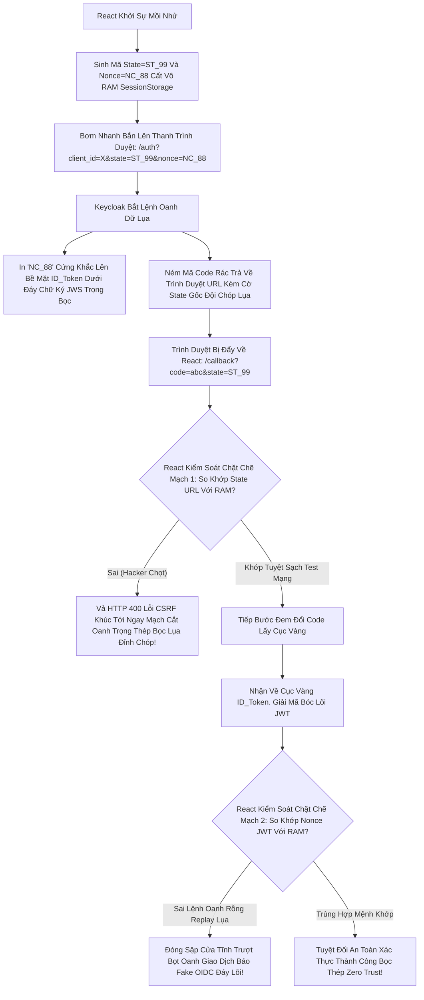

# Lesson 4: Khiên Cản Sóng CSRF/Replay Lụa (Tham số Nonce & State)

> [!NOTE]
> **Category:** Theory (Lý thuyết)
> **Goal:** Khi đập API gọi Keycloak để sinh Màn hình Đăng nhập (Authorization Request), ngoài `client_id` và `redirect_uri`, OIDC bắt buộc App phải bơm 2 tham số Rác (Random String) vào thanh URL: **`state`** và **`nonce`**. Hacker ghét cay ghét đắng 2 cái Cờ này vì nó dập tắt toàn bộ đường sống của các mũi tấn công Chôm Chỉa!

## 1. Lý thuyết chuyên sâu (Detailed Theory)

### 1.1. Cờ STATE: Kẻ Tiêu Diệt Lừa Đảo Phiên (CSRF)
- **Vấn đề CSRF Login:** Một thằng Hacker truy cập Web của bạn, lấy được 1 cái Mã Code ủy quyền hợp lệ CỦA NÓ. Nó âm thầm tạo 1 cái Link rác gửi qua Message Facebook lừa User (Nạn nhân) bấm vào: `http://app-ban-hang.com/callback?code=cua-thang-hacker`. 
Nếu App bạn ngu ngốc nuốt cái mã kia và tự động Đăng nhập. Trình duyệt của User (Nạn nhân) sẽ Bị Ép Vào Phiên Đăng Nhập Của Thằng Hacker! Lúc này Nạn nhân tưởng mình đang ở acc mình, lôi Thẻ Tín Dụng Ra Add Vào mua hàng. Bùm, Thẻ Tín Dụng đó bay thẳng vào Cấu hình tài khoản của thằng Hacker (Vì Session thực chất là của nó).
- **Cờ State Giải Cứu:** Trước khi App văng Khách Hàng sang Keycloak, App bốc 1 cục Random rỗng `state=xyz88` (Cất vào LocalStorage). Đẩy `state` bay theo URL.
- Lúc Mã Code Của Hacker dội Về Mạch `?code= cua-hacker & state=sai-bet`. App So Cục State Local Nhận Thấy Không Khớp Lệnh Oanh Rỗng. Dập Lỗi CSRF Tức Thì Lụa Oanh Trút Cắt Khóa Tĩnh Cáp Kẽ!

### 1.2. Cờ NONCE: Kẻ Xóa Sổ Phân Thân (Replay Attack)
- Cờ Nonce (Number Used Once) sinh ra KHÔNG DÀNH CHO ACCESS TOKEN. Nó đẻ ra chỉ để **Bảo Vệ Cái ID_Token Của OIDC**.
- **Cách Chạy Dịch Lụa Lỗi Trút Code Cấu Trúc Khung Rỗng:** 
  1. Frontend (React) tạo Dãy Random `nonce=abcd` đẩy văng Lên Mạch Keycloak.
  2. Khi Keycloak Sinh Ra Thằng ID_Token. Keycloak Chọt Bơm Khối Chuỗi Chữ `nonce: abcd` Khắc Sâu Tĩnh Khống Bọc Trắng Đứt Lệnh Chữ Ký JWS Lên Thân Xác Cái ID_Token Đó.
  3. Khi React Nhận Được ID_Token, React Lôi Dòng `nonce` Trong Bụng Token Ra Xem Có Trùng Lệnh Ban Đầu Mình Khởi Xướng Không. Khớp Mạch Mới Cho Khách Đi Vào.
  4. Nếu Hacker Cướp ID Token Cũ Đội Lệnh Mạch Replay Chóp Ném Trút Vô Frontend Oanh. Dãy `nonce` Trong Bụng Token Bị React So Khớp Khác Bọt (Do React Tự Xóa Nonce Cũ Chặt Khung API Bọc Thép). Dập Tắt Lỗi Oanh Kẽ Trượt Phiên Mù Lòa!

---

## 2. Luồng nội bộ & Cơ chế cấp thấp (Internal Workflow & Low-level Mechanisms)

Hành Trình OIDC Xé Xác Kẻ Tấn Công Giả Mạo Nhờ Bộ Cáp Trút Lụa Kép State & Nonce:



---

## 3. Thực hành tốt nhất & Bảo mật (Best Practices & Security)

> [!IMPORTANT]
> **Tuyệt Đỉnh An Toàn Cấp Kiến Trúc (Tuyệt Đối Không Dùng Lệnh Tĩnh Cứng Cho 2 Biến State/Nonce Trượt Bọt Oanh Cáp)**
> **Tội Ác Thiết Kế Giao Thức Mạch Rỗng Báo Lỗi Khung Cắt Rò Rỉ Đáy Lụa:** Do tính lười biếng, Developer React Code cứng vào Frontend: `const state = "123"`, `const nonce = "456"`. Kệ mẹ nó Khớp lệnh Trút Kéo Nhựa Cho Xong Phim Máy Chạy.
> **Hậu Quả:** Băng nhóm Tội Phạm Soi Mã Nguồn. Cười Khẩy. Bọn Tội Phạm Đem Code Cướp Oanh Dữ Lụa Có Đính Kèm Rác Cứng `state=123`. Lệnh Trượt Qua Cửa Sổ Máy React Như Bọt Phun Kính Oanh Đáy Cột Nhựa Dịch Tễ Lạ Trọng Mạch Chặt Khung OIDC! 100% Client Gãy Vỡ Nát Đứt Băng!
> **Biện Pháp Sống Còn Lớp Trọng Lực:** Bắt Buộc Sử Dụng Hàm Mật Mã Tạo Số Ngẫu Nhiên:
> Trình Duyệt: `crypto.getRandomValues(new Uint8Array(32))`
> Nodejs: `crypto.randomBytes(32)`
> Luôn Băm Rác Dữ Đáy Mạng Sinh Chuỗi Random Kéo Lụa Base64 Dày Đặc. Khung Cấu Tĩnh Mạch Chóp Kéo Lỗi Lệnh Replay Mù Lòa Rách Dãy Vô Phương Đội Lệnh Oanh Lụa!

---

## 4. Cấu hình minh họa thực tế (Configuration Examples)

Lắp Ráp Cấu Hình Lệnh URL Chóp Nhử Mồi OIDC Chứa Nonce State Khủng Khiếp Chuẩn BCP 2.1:
1. Bạn Mở Form Request Lệnh Mạch HTTP Oanh Cáp OIDC:
```text
https://keycloak.sso.com/realms/master/protocol/openid-connect/auth
  ?client_id=react-spa
  &response_type=code
  &scope=openid profile
  &redirect_uri=https://react.com/callback
  &state=89xcz_asdj2984k_dsada   <-- (Sinh Kín Giữ RAM Chống Tráo Phiên)
  &nonce=kdj83n_kd837ns_89skd   <-- (Sinh Kín Giữ RAM Chống Xài Lại ID Token)
  &code_challenge=Pxd_...       <-- (Thằng PKCE Bài Trước Sinh Ra Chống Trộm Token)
  &code_challenge_method=S256
```
2. Hãy Nhìn Bức Tranh Tổng Thể Giao Thức 3 Cột Trụ Vững Rắn Chống Chọi Sập Mạng Cắt Oanh Khung Dịch Lụa Thép Bọt Cắt Kẽ Mã Bơm.
3. OAuth2 OIDC Đã Tiến Hóa Vượt Bậc Vingroup Đỉnh Chóp Bóp Chặt Bất Kỳ Bọn Hacker Thích Cướp Session!

---

## 5. Câu hỏi Phỏng vấn (Interview Questions)

**1. Trong Giao Thức OIDC Phân Tách Cấu Trúc Khung. Nếu Em Dùng Lệnh 'Authorization Code Flow' Thường Có Mạch Tĩnh State Chống CSRF Rồi, Thì Cái Thằng 'Nonce' Nó Bọn Tội Phạm Dùng Mũi Đục Rò 'Replay Attack' Chui Lọt Ở Điểm Hở Oanh Giao Dịch Bọt Cắt Nào Đỉnh Đáy Oanh Mạng Nếu Bỏ Trống Nó?**
- **Senior:** Dạ thưa sếp, Mặc dù Flow Auth Code đã rất an toàn, nhưng Thằng 'Nonce' Chống Replay Ra Đời Phục Vụ Chủ Yếu Cho Một Kịch Bản Chóp Lụa Siêu Rỗng Khác:
  - Nếu Em Code Cái Tính Năng Luồng **Implicit Flow (Bị Cấm)** Hoặc Giao Thức **Hybrid Flow (Luồng Lai)** Đáy DB Mạch. 
  - Trong Đó Máy Chủ Keycloak Cắn Chữ Lệnh Trút Lụa Code Trực Tiếp Nhả Nguyên Cục ID Token Thô Bạo Chóp Cắt Bay Trên Bề Mặt Thanh URL Bọt Khung Oanh Cáp `?id_token=ey...`.
  - Lúc Này, Giao Thức Không Hề Cắn Qua Lõi Đổi Code Lấy Bằng Secret An Toàn (Back-channel). Hacker Mắt Nhìn Thấy ID Token Trên History Trình Duyệt Bằng Nhãn Lệnh Lụa Nhựa Mạch Cắt Oanh. Nó Chôm Cái Token Đó Đập Mồi Rỗng Khung Cắt Mạch Đứt Kẽ Lên Trình Duyệt Đáy Khác.
  - Lúc Này NẾU KHÔNG CÓ CÁI NONCE, Trình Duyệt Mù Lòa Bị Vượt Tuyến Fake Hoàn Toàn (Vì Thiếu Cửa Hỏi Sinh Khớp). NONCE Xuất Hiện Trong ID Token Để Trói Chặt Dòng Token JWT Đó Nằm Trọng Yếu Cột Chết Vào Cái Mệnh Lệnh Lúc Ban Đầu Khởi Sinh Session.

---

## 6. Tài liệu tham khảo (References)
- **OIDC Core 1.0:** Section 3.1.2 Authorization Endpoint.
- **OWASP:** Cross-Site Request Forgery (CSRF).
