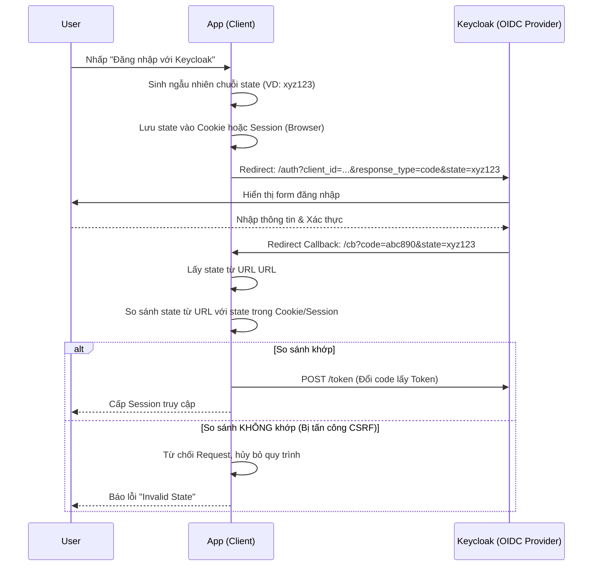

> [!NOTE]
> **Category:** Theory (Lý thuyết)
> **Goal:** Hiểu sâu về vai trò của tham số `state` trong giao thức OpenID Connect và OAuth 2.0, cơ chế chống tấn công CSRF, và các phương pháp thực hành bảo mật tốt nhất.

### 1. Lý thuyết chuyên sâu (Detailed Theory)
Trong giao thức OAuth 2.0 và OpenID Connect (OIDC), tham số `state` là một thành phần tùy chọn theo lý thuyết, nhưng lại là **bắt buộc trong thực tế** đối với mọi ứng dụng web. 
Nhiệm vụ chính của `state` là duy trì trạng thái của phía Client giữa lúc Gửi yêu cầu chuyển hướng (Authorization Request) và Nhận kết quả phản hồi (Callback). Quan trọng hơn, `state` được thiết kế để phòng chống lỗ hổng **Cross-Site Request Forgery (CSRF)** trong quá trình ủy quyền. 
Nếu không có `state`, kẻ tấn công có thể đăng nhập vào một ứng dụng độc hại bằng tài khoản của chúng để lấy Authorization Code, sau đó gửi một liên kết chứa Code đó cho nạn nhân. Nếu nạn nhân nhấp vào, ứng dụng (Client) sẽ dùng Code của kẻ tấn công đổi lấy Token và gán phiên đăng nhập (Session) của ứng dụng đó cho tài khoản của kẻ tấn công (Lỗ hổng Login CSRF). Việc này khiến nạn nhân điền thông tin thẻ tín dụng/dữ liệu nhạy cảm vào tài khoản mà kẻ tấn công đang kiểm soát.

### 2. Luồng nội bộ & Cơ chế cấp thấp (Internal Workflow & Low-level Mechanisms)

### 3. Thực hành tốt nhất & Bảo mật (Best Practices & Security)
- **Độ phức tạp (Entropy):** Giá trị `state` phải là một chuỗi ngẫu nhiên không thể dự đoán (ví dụ: băm một UUID ngẫu nhiên). Không dùng các con số tuần tự hoặc mã hóa Base64 các chuỗi tĩnh như "login".
- **Gắn chặt với Phiên duyệt web:** `state` chỉ có tác dụng chống CSRF nếu nó được sinh ra và ghi nhận gắn với trình duyệt của đúng người dùng đó (qua Cookie mã hóa). Nếu chỉ sinh ra để truyền đi nhưng không lưu lại đối chiếu, `state` trở nên vô dụng.
- **Mang thông tin chuyển hướng (App Routing):** Ngoài mục đích bảo mật, `state` thường được dùng để nhớ trang thái UI. Ví dụ, người dùng đang xem trang `/product/123`, họ bấm Đăng nhập. Client có thể nhúng đường dẫn `/product/123` vào `state` (sau khi mã hóa chung với chuỗi ngẫu nhiên), để sau khi đăng nhập xong, Client biết chuyển hướng họ về lại trang sản phẩm.
> [!WARNING]
> Không bao giờ để thông tin cá nhân nhạy cảm dạng Plaintext trong tham số `state` (ví dụ `state={"email":"a@b.com"}`). Tham số này sẽ hiển thị rõ ràng trên thanh địa chỉ URL của trình duyệt và có thể bị rò rỉ qua các proxy hoặc Referer header.

### 4. Cấu hình minh họa thực tế (Configuration Examples)
Hầu hết các thư viện bảo mật hiện đại (như Spring Security, NextAuth.js, Passport.js) tự động xử lý tham số `state`.
Ví dụ về cấu trúc một state mã hóa tốt do Client (Backend) tạo ra:
1. Client sinh `nonce` ngẫu nhiên: `r4nD0mS7r1ng`.
2. Client thêm url cần quay lại: `returnUrl=/dashboard`.
3. Client tạo chuỗi JSON: `{"n":"r4nD0mS7r1ng","u":"/dashboard"}`
4. Client mã hóa AES chuỗi JSON này, hoặc dùng Base64URL để truyền qua URL (với Cookie chứa mã hash tương ứng để đối chiếu).
Keycloak không can thiệp vào `state`, Keycloak chỉ đóng vai trò nhận `state` trong Authorization Request và **chuyển tiếp nguyên vẹn** nó về Redirect URI.

### 5. Trường hợp ngoại lệ (Edge Cases)
- **Lỗi Invalid State ở nhiều Tab:** Nếu người dùng mở nhiều Tab trình duyệt để đăng nhập cùng lúc, tham số `state` lưu trong Cookie bị ghi đè bởi Tab mở sau cùng. Khi Tab mở trước hoàn thành việc đăng nhập của Keycloak và chuyển hướng về, `state` của nó sẽ không khớp với `state` trong Cookie hiện tại, gây ra lỗi "Invalid State" làm bối rối người dùng. **Giải pháp:** Client không nên lưu `state` đè lên nhau, mà nên lưu dưới dạng mảng các state hợp lệ trong Session, hoặc dùng sessionStorage phía frontend.
- **Trình duyệt Safari/Brave chặn Cookie (ITP):** Nếu ứng dụng Client không thể thiết lập Cookie cho `state` do các chính sách chặn theo dõi nghiêm ngặt của trình duyệt, quá trình so khớp sẽ luôn thất bại.

### 6. Câu hỏi Phỏng vấn (Interview Questions)
1. **Câu hỏi (Junior):** Vai trò chính của tham số `state` trong luồng OIDC là gì?
   - *Đáp án:* Dùng để liên kết yêu cầu ủy quyền với phản hồi trả về, nhằm mục đích ngăn chặn tấn công CSRF và duy trì ngữ cảnh trạng thái của người dùng.
2. **Câu hỏi (Junior):** Keycloak có sinh ra tham số `state` không?
   - *Đáp án:* Không, `state` do ứng dụng Client sinh ra, Keycloak chỉ lưu nó trên bộ nhớ tạm và gửi trả lại y nguyên cho Client khi quá trình xác thực hoàn tất.
3. **Câu hỏi (Senior):** Tấn công Login CSRF mà tham số `state` chống lại diễn ra cụ thể thế nào?
   - *Đáp án:* Kẻ tấn công mở phiên đăng nhập của mình, lấy URL có chứa "Authorization Code" của kẻ đó nhưng không xử lý. Hắn gửi URL đó cho nạn nhân. Nạn nhân bấm vào, ứng dụng Client dùng Code của kẻ tấn công để login. Nạn nhân tưởng đang ở tài khoản mình, cập nhật thẻ tín dụng. Kẻ tấn công về nhà đăng nhập bằng tài khoản của hắn và thấy được thẻ tín dụng của nạn nhân.
4. **Câu hỏi (Senior):** Sự khác nhau giữa `state` và `nonce` trong OpenID Connect?
   - *Đáp án:* `state` dùng để chống CSRF trong quy trình chuyển hướng Authorization Code, do Client tự kiểm tra. `nonce` dùng để chống Replay Attack cho ID Token, do Keycloak nhúng vào bên trong ID Token (chữ ký số) để Client xác minh Token này thuộc về chính Request nó vừa gửi.
5. **Câu hỏi (Senior):** Làm sao để lưu trữ thông tin về URL quay lại (Return URL) trong `state` mà không làm mất đi tính bảo mật chống CSRF?
   - *Đáp án:* Phải kết hợp chuỗi Return URL với một chuỗi ngẫu nhiên cao (entropy). Sau đó hash và mã hóa cả cụm này thành giá trị tham số `state`. Client lưu hash vào Cookie. Khi nhận callback, giải mã `state` để kiểm tra độ khớp của chuỗi ngẫu nhiên, nếu khớp thì mới dùng Return URL.

### 7. Tài liệu tham khảo (References)
- [OAuth 2.0 Threat Model and Security Considerations (RFC 6819) - Section 4.4.1.8](https://datatracker.ietf.org/doc/html/rfc6819#section-4.4.1.8)
- [OpenID Connect Core 1.0 - Section 3.1.2.1](https://openid.net/specs/openid-connect-core-1_0.html#AuthRequest)
