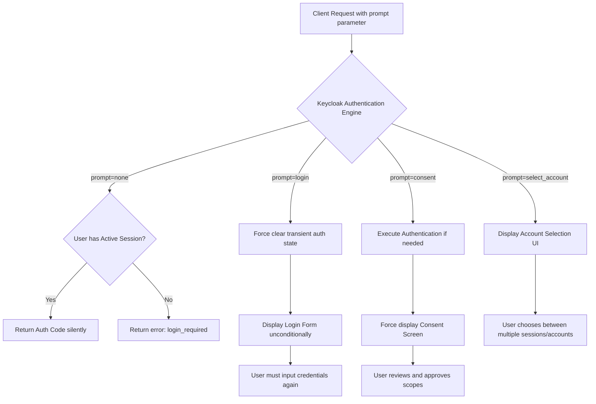

> [!NOTE]
> **Category:** Theory (Lý thuyết)
> **Goal:** Khám phá chi tiết tham số `prompt` trong OpenID Connect, các chế độ hoạt động (none, login, consent, select_account) và cách dùng để điều khiển hành vi màn hình xác thực trên Keycloak.

## 1. Lý thuyết chuyên sâu (Detailed Theory)

Tham số `prompt` là một chỉ thị đặc biệt mà ứng dụng Client đính kèm vào Authorization Request (endpoint `/auth`) để ép buộc OpenID Provider (Keycloak) tuân theo một hành vi cụ thể trong giao diện người dùng (UI) khi tương tác với User. 

### TẠI SAO `prompt` lại cần thiết?
Trong luồng SSO thông thường, nếu người dùng đã có phiên đăng nhập (Active Session) ở Keycloak, Keycloak sẽ tự động bỏ qua giao diện đăng nhập (Silent Login) và phát hành Token ngay lập tức. Tuy nhiên, sẽ có những nghiệp vụ thực tế yêu cầu ngoại lệ:
1. **Nâng cao bảo mật (Step-up / Re-authentication):** Client cần người dùng **bắt buộc phải gõ lại mật khẩu** (mặc dù đã có session) trước khi thực hiện chuyển tiền.
2. **Cải thiện trải nghiệm (Silent Auth Check):** Client SPA (Single Page App) muốn chạy ngầm trong iFrame để kiểm tra xem User còn đăng nhập hay không mà **tuyệt đối không hiển thị UI**.
3. **Chuyển đổi tài khoản:** Người dùng có nhiều account trên máy và muốn được chọn tài khoản.
Để giải quyết bài toán giao tiếp giữa ý định của Client và hành vi UI của Server, tham số `prompt` ra đời.

## 2. Luồng nội bộ & Cơ chế cấp thấp (Internal Workflow & Low-level Mechanisms)

Khi nhận được Request chứa tham số `prompt`, Engine Authentication của Keycloak sẽ diễn dịch và điều hướng luồng Authentication Flow (Browser Flow) theo các nhánh khác nhau:



### Chi tiết các giá trị `prompt`:
1. **`prompt=none`**: Yêu cầu Keycloak KHÔNG BAO GIỜ hiển thị giao diện người dùng. Phải xử lý âm thầm. Nếu cần User tương tác (do chưa đăng nhập, cần consent, cần nhập OTP), Keycloak sẽ từ chối và trả về HTTP Redirect với mã lỗi (ví dụ: `error=login_required` hoặc `error=interaction_required`).
2. **`prompt=login`**: Bắt buộc phải xác thực lại. Bỏ qua hoàn toàn SSO Cookie (Session). Người dùng phải thấy form đăng nhập.
3. **`prompt=consent`**: Bắt buộc Keycloak phải hiển thị màn hình cấp quyền (Consent Screen) ngay cả khi trước đó người dùng đã "Remember My Consent". 
4. **`prompt=select_account`**: Hỗ trợ User chọn giữa các tài khoản đã đăng nhập trước đó (Multi-login session).

## 3. Thực hành tốt nhất & Bảo mật (Best Practices & Security)

> [!IMPORTANT]
> **Kết hợp giá trị:** Bạn có thể truyền nhiều giá trị cùng lúc phân cách bởi khoảng trắng (ví dụ: `prompt=login consent`). Tuy nhiên, `none` là một giá trị độc quyền. Tuyệt đối không truyền `prompt=none login`, điều này là vi phạm chuẩn OIDC và sẽ gây ra lỗi tại Server.

> [!WARNING]
> **Sử dụng iFrame với `prompt=none`:** Đối với các SPA dùng iFrame ẩn để gọi ngầm `prompt=none` giữ phiên (Silent Refresh), thiết kế này đang dần bị chặn bởi trình duyệt (như Safari ITP, Chrome chặn Third-party Cookies). Thay vào đó, thực hành hiện đại khuyên dùng **Refresh Token** lưu nội bộ thay vì phụ thuộc vào cookie bằng `prompt=none`.

- **Thanh toán & Giao dịch:** Hãy áp dụng `prompt=login` trước những action mang tính rủi ro cao (chuyển khoản, xóa tài nguyên) để đảm bảo phiên không bị người khác chiếm dụng tạm thời tại máy tính của nạn nhân (Session Hijacking via physical access).

## 4. Cấu hình minh họa thực tế (Configuration Examples)

Ví dụ tạo một link Đăng nhập bắt buộc yêu cầu User nhập lại mật khẩu và cấp lại quyền:

```html
<!-- Nút chức năng "Thanh toán giao dịch" trên website -->
<a href="https://keycloak.example.com/realms/myrealm/protocol/openid-connect/auth
  ?client_id=banking-app
  &response_type=code
  &redirect_uri=https://app.com/callback
  &scope=openid payment
  &prompt=login consent"> <!-- ÉP BUỘC Login lại VÀ hiển thị màn hình cấp quyền -->
  Xác nhận Thanh Toán
</a>
```

Để kiểm tra ngầm trạng thái đăng nhập trong SPA (sử dụng JS):
```javascript
const iframe = document.createElement('iframe');
iframe.style.display = 'none';
// Gọi silent login
iframe.src = "https://keycloak.../auth?client_id=spa&response_type=code&prompt=none&redirect_uri=...";
document.body.appendChild(iframe);

// Lắng nghe postMessage từ iframe callback để nhận auth code hoặc bắt lỗi 'login_required'
```

## 5. Trường hợp ngoại lệ (Edge Cases)

- **Vòng lặp vô hạn với `prompt=none` (Infinite Loop):** Ứng dụng Client thực hiện silent auth (prompt=none). Keycloak trả về `login_required`. Do lỗi lập trình, Client lại tiếp tục gọi `prompt=none` ngay lập tức, dẫn đến loop liên tục.
  - *Cách khắc phục:* Khi nhận lỗi `login_required` hoặc `interaction_required` từ Keycloak, Client phải dừng gọi ngầm và điều hướng người dùng tới UI đăng nhập thông thường bằng thẻ `<a>` hoặc Javascript `window.location`.
- **Identity Brokering (Đăng nhập qua IDP thứ ba):** Nếu người dùng dùng "Login with Google", truyền `prompt=login` vào Keycloak có thể sẽ không ép được Google hiển thị lại form đăng nhập nếu Keycloak không forward chính xác tham số `prompt` sang Google IDP.
  - *Cách khắc phục:* Cấu hình "Forward Parameters" trong phần thiết lập Identity Provider ở Keycloak để truyền `prompt` sang các IDP hạ tầng.

## 6. Câu hỏi Phỏng vấn (Interview Questions)

1. **Junior:** `prompt=none` được sử dụng để làm gì trong OpenID Connect?
   - *Đáp án:* Để thực hiện xác thực ngầm (Silent Authentication). Báo cho Identity Provider tuyệt đối không hiển thị giao diện UI. Nếu người dùng chưa đăng nhập, trả thẳng lỗi về Client thay vì kẹt ở màn hình Login.
2. **Junior:** Một hệ thống đang áp dụng Single Sign-On. Làm sao để bắt người dùng phải nhập lại password nếu họ click vào nút "Cập nhật mật khẩu"?
   - *Đáp án:* Phía Client sẽ gửi Authorization Request tới Keycloak kèm theo tham số `prompt=login`. Điều này bỏ qua phiên SSO hiện tại và hiển thị lại trang Login.
3. **Senior:** Điều gì xảy ra nếu Client truyền `prompt=none consent`?
   - *Đáp án:* Request sẽ thất bại (ví dụ lỗi HTTP 400 hoặc OIDC spec error). Trong chuẩn OIDC, giá trị `none` không thể được kết hợp với bất kỳ giá trị nào khác (login, consent, select_account) vì bản chất của chúng mâu thuẫn (none cấm UI, consent bắt UI).
4. **Senior:** Ứng dụng SPA của chúng ta gọi `prompt=none` bằng iframe ngầm để lấy Token mới nhưng liên tục nhận lỗi `login_required`, mặc dù người dùng vừa đăng nhập. Hiện tượng gì đang xảy ra?
   - *Đáp án:* Hiện tượng chặn Third-Party Cookies (ITP) trên các trình duyệt hiện đại (Safari, Brave). Vì iframe gọi cross-domain đến Keycloak, trình duyệt không gửi Cookie của Keycloak (SSO cookie) đính kèm theo. Do đó, Keycloak xem như người dùng chưa đăng nhập. Giải pháp thay thế là sử dụng Refresh Token Rotation.
5. **Senior:** Trong Keycloak, khi `prompt=select_account` được gọi, tính năng nào ở phía Server cần được bật để nó hoạt động?
   - *Đáp án:* Keycloak không hỗ trợ mạnh tính năng select account mặc định như Google (Multiple Active Sessions). Tuy nhiên, ta có thể tích hợp qua Identity Provider (IDP hinting) hoặc bật các luồng Account Chooser custom trong Authentication Flows để cung cấp trải nghiệm chọn tài khoản.

## 7. Tài liệu tham khảo (References)

- [OpenID Connect Core 1.0 - Section 3.1.2.1: Authentication Request](https://openid.net/specs/openid-connect-core-1_0.html#AuthRequest)
- [OAuth 2.0 Multiple-Response-Type Encoding Practices](https://openid.net/specs/oauth-v2-multiple-response-types-1_0.html)
- [Keycloak Docs: Third-party cookies and Silent SSO](https://www.keycloak.org/docs/latest/securing_apps/#_browser_support)
