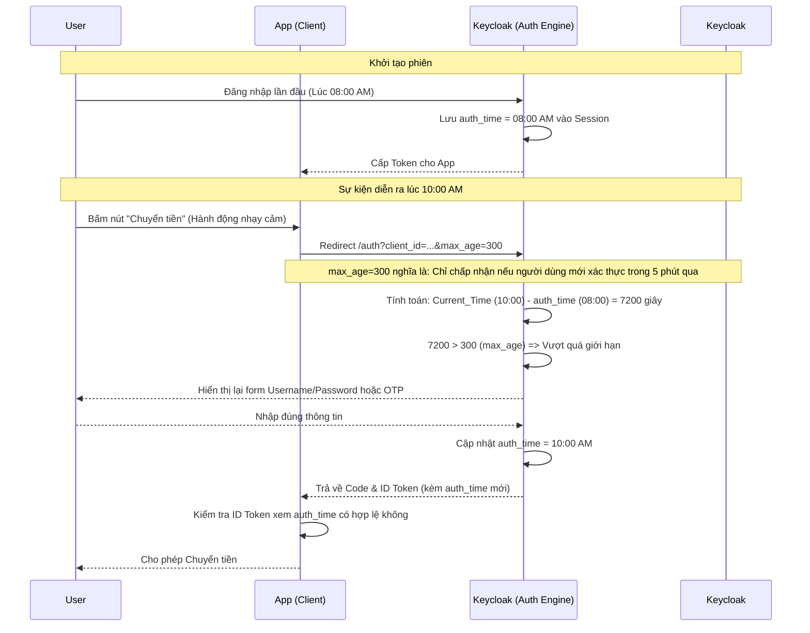

> [!NOTE]
> **Category:** Theory (Lý thuyết)
> **Goal:** Hiểu nguyên lý hoạt động của tham số `max_age` trong OpenID Connect, cơ chế bắt buộc xác thực lại (Re-authentication) và cách nó củng cố bảo mật đối với các hành động nhạy cảm.

### 1. Lý thuyết chuyên sâu (Detailed Theory)
Trong giao thức OpenID Connect (OIDC), `max_age` là một tham số đặc biệt được Client gửi kèm trong Authorization Request. Tham số này quy định **thời gian tối đa (tính bằng giây)** tính từ lần cuối cùng người dùng thực sự chủ động xác thực (nhập mật khẩu hoặc MFA) với Identity Provider (Keycloak).
Bình thường, nếu Keycloak kiểm tra thấy Cookie SSO (SSO Session) vẫn còn hiệu lực, nó sẽ tự động cấp phát Token mới mà không hỏi người dùng (Silent Login). Tuy nhiên, đối với các hành động có tính rủi ro cao (như chuyển tiền, đổi mật khẩu, hoặc nâng cấp đặc quyền), Client không muốn tin tưởng vào một phiên đã đăng nhập từ 3 ngày trước. 
Khi Client gửi `max_age=0` (hoặc một số nhỏ như `max_age=300`), Keycloak sẽ kiểm tra trường `auth_time` của phiên. Nếu khoảng thời gian từ lúc xác thực đến hiện tại lớn hơn `max_age`, Keycloak **bắt buộc (MUST)** chặn luồng, bỏ qua Session SSO hiện tại, và yêu cầu người dùng phải nhập lại thông tin xác thực để tiếp tục.

### 2. Luồng nội bộ & Cơ chế cấp thấp (Internal Workflow & Low-level Mechanisms)



### 3. Thực hành tốt nhất & Bảo mật (Best Practices & Security)
- **Kiểm tra auth_time tại Backend:** Khi sử dụng `max_age`, OIDC Server (Keycloak) bắt buộc phải trả về trường `auth_time` bên trong `ID Token`. Ứng dụng Client (Resource Server) phải tự mình parse ID Token và trừu tượng hóa thời gian (`Current Time - auth_time <= max_age`) trước khi thực hiện hành động nhảy cảm. Không bao giờ chỉ tin tưởng vào việc Keycloak đã trả về Token.
- **Sử dụng `max_age=0` để bắt buộc xác thực tức thời:** Đây là cách thiết kế phổ biến nhất (còn được gọi là Step-up Authentication). Thay vì dùng `prompt=login`, `max_age=0` tuân thủ đúng chuẩn OIDC hơn để ép người dùng xác nhận ngay tại thời điểm thao tác.
> [!WARNING]
> Nếu bạn sử dụng Identity Brokering (Keycloak ủy quyền cho Google hoặc Facebook), tham số `max_age` phụ thuộc vào việc nhà cung cấp thứ ba có hỗ trợ chuyển tiếp thông số này không. Đôi khi Google không ép xác thực lại, dẫn đến cấu hình của bạn bị lách qua.

### 4. Cấu hình minh họa thực tế (Configuration Examples)
Ứng dụng Client (như React/Angular dùng oidc-client-ts hoặc Spring Boot) sẽ cấu hình chèn thêm tham số vào URL chuyển hướng:
```http
GET /realms/myrealm/protocol/openid-connect/auth?
  client_id=bank_app
  &response_type=code
  &redirect_uri=https://app.example.com/callback
  &scope=openid profile
  &max_age=300
```
Keycloak tự động xử lý tham số `max_age` (tính năng mặc định). ID Token trả về cho Backend sẽ trông như sau:
```json
{
  "exp": 1690000000,
  "iat": 1689999000,
  "auth_time": 1689999000, 
  "sub": "user123",
  "azp": "bank_app"
}
```
*Ghi chú: `auth_time` (thời điểm người dùng nhập pass) thường bằng `iat` (thời điểm xuất Token) nếu người dùng vừa mới bị ép xác thực lại.*

### 5. Trường hợp ngoại lệ (Edge Cases)
- **Token Refresh qua Offline Session:** Nếu Client dùng Offline Token và gọi `/token` endpoint, tham số `max_age` không có tác dụng. `max_age` chỉ áp dụng cho Interactive Flow (người dùng dùng trình duyệt chuyển hướng).
- **Lệch giờ (Clock Skew) khi tính auth_time:** Tương tự như `exp` hay `nbf`, nếu thời gian hệ thống của Client lệch so với Keycloak, phép toán `CurrentTime - auth_time` có thể ra số âm hoặc một khoảng lớn hơn thực tế, dẫn đến Client đánh giá sai và từ chối request của người dùng hợp lệ.
- **SSO bị phá vỡ không cần thiết:** Nếu một Client A gắn `max_age=0` cho mọi request đăng nhập (không lý do chính đáng), nó sẽ bắt người dùng liên tục nhập mật khẩu, và tệ hơn là nó liên tục thay đổi `auth_time` của phiên SSO chung, ảnh hưởng đến các Client B, C khác trong cùng hệ sinh thái.

### 6. Câu hỏi Phỏng vấn (Interview Questions)
1. **Câu hỏi (Junior):** Tham số `max_age` dùng để làm gì trong OpenID Connect?
   - *Đáp án:* Dùng để đặt giới hạn tuổi đời cho một phiên xác thực. Nếu khoảng thời gian từ lúc người dùng đăng nhập đến hiện tại vượt quá `max_age`, hệ thống sẽ bắt người dùng phải nhập mật khẩu đăng nhập lại.
2. **Câu hỏi (Junior):** Nếu tôi muốn bắt buộc người dùng luôn luôn phải nhập lại mật khẩu, tôi nên truyền `max_age` bằng bao nhiêu?
   - *Đáp án:* Truyền `max_age=0`.
3. **Câu hỏi (Senior):** Tại sao Client sau khi nhận được Token từ luồng có `max_age` lại bắt buộc phải kiểm tra Claim `auth_time` trong ID Token?
   - *Đáp án:* Vì OIDC Provider có thể có lỗi hệ thống hoặc bị tấn công bỏ qua luồng ép buộc, hoặc kẻ tấn công chặn HTTP Reponse và chèn một ID Token cũ (Replay Attack). Việc Client verify `auth_time` là bước phòng thủ chiều sâu (Defense-in-depth) cuối cùng để đảm bảo thao tác được cấp quyền dựa trên chứng minh thực tế.
4. **Câu hỏi (Senior):** So sánh sự khác nhau giữa việc dùng `prompt=login` và `max_age=0` trong Authorization Request?
   - *Đáp án:* Về trải nghiệm người dùng, cả hai đều ép người dùng phải nhìn thấy form đăng nhập. Tuy nhiên, `prompt=login` chỉ bắt buộc UI phải hiện form, không định hình rõ về mặt ngữ nghĩa bảo mật. `max_age=0` là tiêu chuẩn bảo mật chính thống liên quan đến việc đếm thời gian hiệu lực và yêu cầu Server phải trả về `auth_time` trong Token để Client thẩm định (Audit).
5. **Câu hỏi (Senior):** Làm thế nào Keycloak biết khi nào cập nhật giá trị `auth_time` của một phiên người dùng (User Session)?
   - *Đáp án:* Keycloak cập nhật `auth_time` vào bộ nhớ Session Data bất cứ khi nào một `Authenticator` (như Password Form hoặc OTP) trả về trạng thái `SUCCESS`. Quá trình đăng nhập bằng SSO Cookie sẽ KHÔNG thay đổi giá trị `auth_time` hiện tại của phiên.

### 7. Tài liệu tham khảo (References)
- [OpenID Connect Core 1.0 - Section 3.1.2.1 (max_age)](https://openid.net/specs/openid-connect-core-1_0.html#AuthRequest)
- [OpenID Connect Core 1.0 - Section 2 (ID Token - auth_time)](https://openid.net/specs/openid-connect-core-1_0.html#IDToken)
