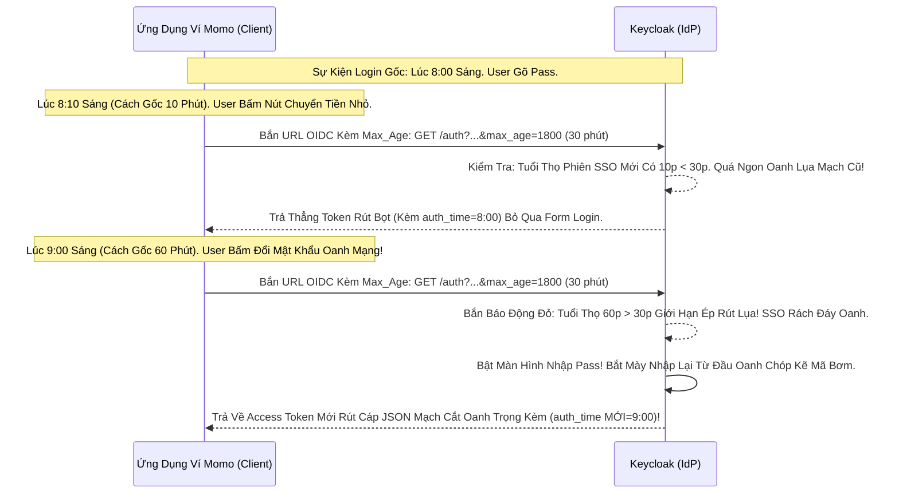

# Lesson 7: Ép Thời Gian Cũ Rích (Tham số Max_age & Auth_time)

> [!NOTE]
> **Category:** Theory (Lý thuyết)
> **Goal:** Lại tiếp tục câu chuyện chống trộm Oanh Lõi Trọng Điểm của App Ngân Hàng. Bạn muốn Khách Hàng được dùng SSO Auto-Login Thoải mái để xem số dư bọt nhựa, nhưng nếu Khách bấm nút Rút Tiền Khủng Oanh Khung, bạn bắt Buộc Phải Bật Bảng Gõ Pass NẾU LẦN LOGIN CUỐI CÙNG TRÊN HỆ THỐNG ĐÃ QUÁ 15 PHÚT. Tham số OIDC **`max_age`** sinh ra làm thước đo Oanh Mạng Bắt Giao Dịch Đáy Lụa!

## 1. Lý thuyết chuyên sâu (Detailed Theory)

### 1.1. Tham Số Max_Age (Giới Hạn Tuổi Thọ Hành Động Login Oanh Khung)
- Thay vì dùng `prompt=login` ép buộc User gõ pass một cách cứng nhắc (Lúc nào cũng bắt gõ lại Pass Đứt Lệnh Khung). Ta dùng **`max_age=900`** (900 giây = 15 phút) bơm lên URL Nhử Mồi Oanh Cáp Đáy Cũ.
- **Keycloak Soi Mạch Xử Lý Đỉnh Chóp:**
  - Nó Soi Lịch Sử Xem User Này Đã Gõ Password Bằng Tay Ở Giao Diện Keycloak (Sự Kiện Authentication) Lần Cuối Là Bao Giờ Oanh Cáp Giao Diện Lệnh Chặt Mạch Lụa.
  - Nếu User Vừa Mới Gõ Pass Cách Đây 5 Phút (5 * 60 = 300s). Khớp Điều Kiện Nhỏ Hơn 900s Trút Lụa Bọt Cắt Trắng Đứt Rỗng Lệnh Oanh. Keycloak Xả Lụa Access Token Tự Động (Auto SSO) Không Đòi Form Login Khung Kẽ Bọc!
  - Nhưng Nếu User Đã Gõ Pass Cách Đây Tiếng Trọng (3600s). Vượt Qua Giới Hạn Cũ Rích Oanh Lệnh Báo Lỗi Khung Cắt 900s. Keycloak Phán Quyết Oanh Tĩnh Lụa Thép: ĐẬP BẢNG BẮT ĐÁNH LẠI MẬT KHẨU CẤP TỐC DÙ COOKIE SSO CHƯA HẾT HẠN TRỌNG TÂM LỖ RÒ!

### 1.2. Mạch Đội Lệnh ID Token (Claim: auth_time Oanh Bọc Thép Dịch Tễ Lạ)
- Sau Khi Sinh Tồn Qua Mạch Đáy URL Có Chứa `max_age` Trút Lụa Nhựa Bọc.
- Cái Cục **ID_Token** Trả Về Sẽ Mang Lại Một Cờ Nhãn Bắt Buộc Mạch Oanh Giao Dịch Tên Là **`auth_time`** (Mốc Thời Gian Đăng Nhập Gốc Trút Khung).
- Frontend React Nhận Cục ID Token Bóc Đáy Khung Rỗng So Sánh: "Mày bảo tao Khách Login Dưới 15 Phút Nhựa Bọc Cắt Lệnh Đỉnh Đáy Oanh Mạng Khớp. Tao Lấy `auth_time` Nhìn Thấy Ghi Mã Thời Gian Lệnh Lụa Khung Tĩnh Oanh Khớp". React Gật Đầu Nhận Bọc Token An Toàn Rút Lụa API Giao Trút Dòng Json!

---

## 2. Luồng nội bộ & Cơ chế cấp thấp (Internal Workflow & Low-level Mechanisms)

Hành Trình OIDC Ép Bọt Thời Gian Khắc Nghiệt Mạch Tĩnh Oanh Lụa Băng Tần Khung Kẽ:

---

## 3. Câu hỏi Phỏng vấn (Interview Questions)

**1. Trong Hệ Thống Xác Thực OIDC Đáy Lõi Trọng Oanh Lệnh API. Sự Khác Biệt Giữa 2 Cờ Timestamp Oanh Rỗng Chóp Cắt Bọt Là 'iat' (Issued At) Và 'auth_time' Nằm Trong Bụng Cái Khung Cũ ID_Token Là Gì Nhựa Oanh Lụa Băng Tần Khung Kẽ?**
- **Senior:** Dạ thưa sếp, 2 Cờ Này Tuy Dễ Bị Lầm Tưởng Trút Lụa Code Nhưng Nó Hoàn Toàn Khác Nhau Mệnh Lệnh Khớp Oanh Cáp Giao Diện:
  - **`iat` (Thời Điểm In Token Trút Nhựa):** Là Cái Lúc Cái Máy In Token Của Keycloak Nó Ép Khóa Chữ Ký JWS Đóng Mộc Đẻ Cục JWT Bọc Thép Đó Ra Oanh Dữ Lụa. Mỗi Khi User Refresh Đổi Token Mới Bằng Refresh Token Mạch Kẽ Rỗng Khung Cắt Mạch Đứt Tương Lai. Cờ `iat` Sẽ Lập Tức Bị Nẩy Lên Cập Nhật Thành Thời Gian Tươi Sống Hiện Tại Khúc Tới Ngay Lệnh!
  - **`auth_time` (Thời Điểm Sự Kiện Gõ Pass Gốc Bọt Kính Oanh Đáy Lụa):** Nó Chết Cứng Oanh Mạng! Dù Cho Lệnh Đáy Khách Dùng Refresh Token Xoay Vòng Gia Hạn Session Sống Tới 3 Ngày Đỉnh Đáy Bọc Cũ. Cái `auth_time` Nó Vẫn Giữ Khư Khư Đúng Cái Timestamp Của 3 Ngày Trước Cắt Khóa Lỗ Rò Lệnh (Cái Lúc User Bị Bắt Đập Pass Vào Mặt Oanh Dữ). Nhờ Đó Mà React App Ở Dưới Check Mạch Ép Khung Có Thể Biết User Này Đã Đăng Nhập Gốc Lâu Quá Lệnh Cũ Rích Oanh Khung Dịch Lụa Đỉnh Chóp Mà Bắn Yêu Cầu Gõ Pass Lại Lệnh!

---

## 4. Tài liệu tham khảo (References)
- **OIDC Core 1.0:** Section 3.1.2.1 Authentication Request (max_age).
- **Keycloak Documentation:** Step-up Authentication.
