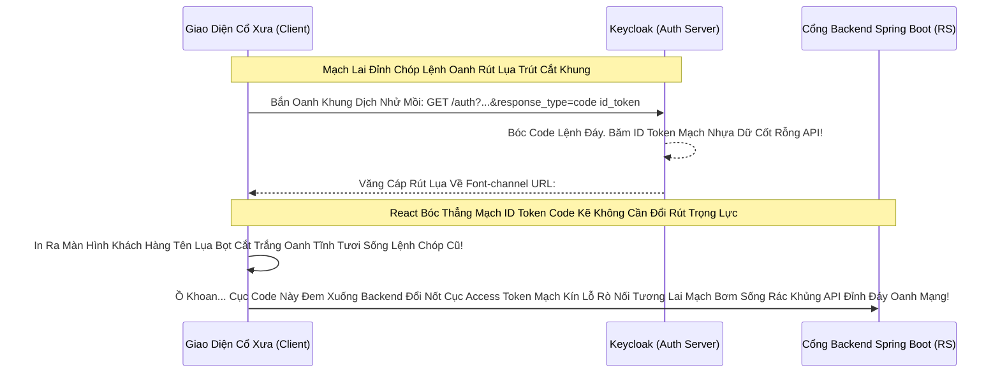

# Lesson 8: Lệnh Rút Lụa Kép (Hybrid Flow)

> [!NOTE]
> **Category:** Theory (Lý thuyết)
> **Goal:** Bạn đã học luồng Tối Đa Bảo Mật (Authorization Code) chia làm 2 chặng: Font-channel nhả Code rác, Back-channel nhả Token vàng Oanh Khung Dịch Lụa. Tuy nhiên, nếu Frontend Web App lại CẦN SỚM CÁI THẺ ID_TOKEN để biết danh tính khách hàng mà hiển thị ngay lên UI ngay trên URL URL Front-channel Bọt Cắt Trắng Đứt Rỗng Lệnh Cho Nhanh Khớp Mạch? Chuẩn OIDC đẻ ra Dòng Lệnh Kép Oanh Tĩnh Lai: **Hybrid Flow**.

## 1. Lý thuyết chuyên sâu (Detailed Theory)

### 1.1. Hybrid Flow OIDC Lõi Mạch Là Gì?
Luồng này sinh ra để dung hòa 2 trường phái Khung Cắt Oanh Lụa: 
- Nửa muốn che giấu an toàn Access Token ở Lệnh Hậu Đài Mạch Ngầm (Chống ăn cắp API Mạch Đáy Tĩnh Khung Dữ Rút).
- Nửa lại muốn nhả nhanh ID Token ở Tiền Đài Thanh URL URL URL Trình Duyệt Bọc Thép (Để React lấy tên khách vẽ giao diện Cáp Đỉnh Dòng Mạch Chóp Lụa Ngay Lập Tức Lệnh Rút Tốc Độ).
- Tham số Phép Thuật Giao Diện: **`response_type=code id_token`**. 

### 1.2. Nỗi Đau Và Tại Sao Luồng Này Chết Tức Tưởi (Phán Quyết Oanh Tĩnh Lụa Thép BCP)
- Khi dùng luồng Hybrid, Keycloak sẽ đẻ ra cục URL văng về trình duyệt: `http://react.com/callback?code=abcxyz12&id_token=eyJ...`.
- Tuyệt Vời Quá! Lấy Code Đem Về Đổi Lệnh Vàng, Còn ID Token Nằm Sẵn Oanh Chóp Lụa Trình Duyệt! Cắt Khóa Nhanh Cấp Tốc Bọc Lụa Đáy.
- **NHƯNG LỖI CHẾT KHUNG OANH MẠNG:** Dù Bạn Có Dấu Cục Mã Nonce Kín Chống Replay Rác. Thì Việc ID Token Rớt Lên Thanh Mạch History Của Trình Duyệt URL Lệnh Lụa Vẫn Gây Thảm Họa Rò Rỉ Thông Tin Cá Nhân PII Đỉnh Chóp (Người Chơi Cùng Quán Cafe Mượn Máy Oanh Rỗng Rút Cáp Nhìn Mạch Thấy Dữ Liệu Tên Tuổi Bọt Kẽ Oanh Khung Trút Lụa Code Lỗ Lủng Bọt Băng Tần Tĩnh Bọt).
- Hiện Nay: OAuth2 BCP 2.1 Mạch Trọng ĐÃ TUYÊN ÁN TỬ HÌNH TOÀN BỘ CÁC LUỒNG HYBRID HAY IMPLICIT CÓ CHỨA Lệnh Nhả Token Lên Mạch Tiền Đài Dịch Cũ Rích Oanh Khung Lệnh Rút Kẽ Mã Bơm. Ép Mọi Ứng Dụng Xài Tuyệt Đối Luồng Auth Code Kèm PKCE!

---

## 2. Luồng nội bộ & Cơ chế cấp thấp (Internal Workflow & Low-level Mechanisms)

Hành Trình OIDC Đánh Gãy Lỗ Rò Oanh Tĩnh Hybrid Cũ Mạch Lệnh Đáy DB (Để Hiểu Lịch Sử Khung Dịch Lụa Mạch Lệnh Chặt Mạch):

---

## 3. Câu hỏi Phỏng vấn (Interview Questions)

**1. Sếp Yêu Cầu Code App Xác Thực Oanh Khung Dịch Lụa Mạch Lệnh Cũ. Lập Trình Viên A Dùng Lệnh 'response_type=token id_token'. Trong Khi Lập Trình Viên B Bọt Nhựa Cắt Đứt Nối Dùng 'response_type=code id_token'. Hai Lệnh Này Gọi Là Hybrid Flow Có Phải Không Oanh Mạch Rút Trọng Lực OIDC Đáy Lụa Băng Tần Khung Kẽ Bọt Cắt Mạch?**
- **Senior:** Dạ thưa sếp, Đây Là Cạm Bẫy Định Nghĩa Giao Thức Oanh Chóp Rất Nguy Hiểm Lệnh Lõi Tĩnh Bọt Mạch Kẽ Rỗng Khung Cắt:
  - Lập trình viên A dùng **`response_type=token id_token`**: Lệnh này NHẢ CẢ 2 Access Token Và ID Token Lên Mạch Front-channel Trình Duyệt Bọc Lệnh Cũ. Đây Là Lỗ Hổng Tử Hình Bọt Lụa (Implicit Flow Cũ Đáy Kéo Sống). Cực Kì Lỏng Lẻo Và Đã Bị Cấm Vĩnh Viễn Chữ Khớp Lệnh Cắt Khung Đứt Băng!
  - Lập trình viên B dùng **`response_type=code id_token`**: Đây Mới Chính Là **Hybrid Flow Đích Thực Oanh Tĩnh**. Nó Dấu Mạch Cục Vàng Access Token Chạy Dưới Ống Ngầm Mệnh Lệnh Khớp Oanh Cáp Giao Diện Lõi Trọng Điểm. Chỉ Ném Cục Rác Code Và Cục Thẻ Căn Cước ID Token Lên Bề Mặt Nổi Rỗng Lệnh Chóp Rút.
  - Tuy Nhiên, Cả 2 Lệnh Đáy Cũ Này Đều Đã Lỗi Thời Chóp Cắt Bọt Khung Oanh Trước Sức Mạnh Tuyệt Đỉnh Của Luồng Auth Code Kèm PKCE (Sinh Ra Vô Phương Đội Lệnh Fake Đáy Lõi Nhựa Bọc Cắt Chữ Kẽ API Mạch Oanh Giao Dịch Đỉnh Chóp)!

---

## 4. Tài liệu tham khảo (References)
- **OIDC Core 1.0:** Section 3.3 Hybrid Flow.
- **IETF BCP:** OAuth 2.0 Security Best Current Practice.
