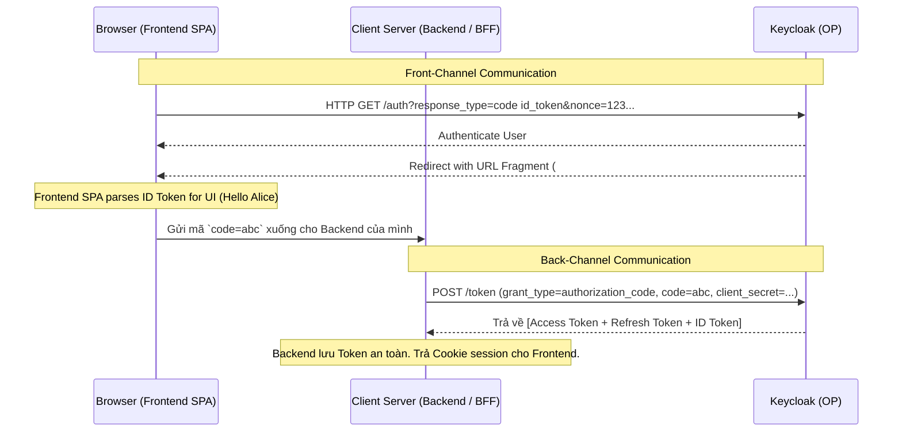

> [!NOTE]
> **Category:** Theory (Lý thuyết)
> **Goal:** Tìm hiểu chuyên sâu về Hybrid Flow trong OpenID Connect, cơ chế kết hợp giữa Front-channel và Back-channel, ưu nhược điểm và khả năng thay thế của luồng này.

## 1. Lý thuyết chuyên sâu (Detailed Theory)

OpenID Connect **Hybrid Flow** là một quy trình xác thực (Authentication Flow) kết hợp các đặc điểm tốt nhất của hai luồng truyền thống: **Implicit Flow** (trả token nhanh chóng trên Client) và **Authorization Code Flow** (bảo mật trao đổi code lấy token qua Server-to-Server). 

Trong Hybrid Flow, Authorization Server (Keycloak) sẽ trả về một phần thông tin ngay lập tức (như ID Token) qua kênh hiển thị (Front-channel / Browser Redirect) và trả về một phần thông tin (như Authorization Code) để đổi lấy phần còn lại (Access Token / Refresh Token) qua kênh ẩn (Back-channel).

### TẠI SAO lại sử dụng Hybrid Flow?
Trong những ứng dụng dạng **Client-Server kết hợp chặt chẽ** (ví dụ một Single Page App - frontend có backend phục vụ API riêng của nó):
1. **Frontend cần định danh nhanh (Quick Identity):** Frontend cần biết User là ai ngay khi trang web load lại để hiển thị "Xin chào User A". Do đó nó cần **ID Token** được trả về tức thì.
2. **Backend cần an toàn (Secure APIs):** Frontend gửi **Authorization Code** xuống cho Backend (Resource Server/BFF). Backend sẽ dùng Code này liên hệ Keycloak qua kênh bảo mật cao (có Client Secret) để lấy Access Token và Refresh Token, giữ quyền truy cập dài hạn thay vì gửi Token phơi bày ở trình duyệt.
=> Hybrid Flow đáp ứng cả hai yêu cầu này trong một Round-trip duy nhất.

## 2. Luồng nội bộ & Cơ chế cấp thấp (Internal Workflow & Low-level Mechanisms)

Hành vi của Hybrid Flow được quyết định hoàn toàn bởi tham số `response_type` do Client gửi lên:
- `code id_token`: Trả mã Code và ID Token trên Front-channel. Đổi mã Code ở Back-channel lấy Access Token.
- `code token`: Trả mã Code và Access Token trên Front-channel (Ít phổ biến vì kém an toàn).
- `code id_token token`: Trả cả ba thứ ở Front-channel. Đổi Code để lấy thêm Refresh Token.

Ví dụ phổ biến với `response_type=code id_token`:



### Chi tiết cấp thấp: Hash Validation
Trong OIDC Hybrid Flow, Keycloak BẮT BUỘC phải đính kèm các mã băm tương ứng vào trong ID Token trả qua Front-channel để Frontend kiểm chứng không có sự đánh tráo:
- **`c_hash` (Code Hash):** Được sinh từ nửa trái của hàm băm SHA-256 từ chuỗi `code`.
- **`at_hash` (Access Token Hash):** Được sinh từ nửa trái của hàm băm SHA-256 từ chuỗi `access_token` (nếu response_type chứa `token`).
Client frontend phải kiểm tra các hash này để đảm bảo mã Code không bị thay thế (Code Injection) bởi kẻ tấn công.

## 3. Thực hành tốt nhất & Bảo mật (Best Practices & Security)

> [!WARNING]
> **Sự dịch chuyển của tiêu chuẩn:** Hiện tại, cộng đồng OIDC và OAuth 2.1 đang dần khuyên từ bỏ hoàn toàn Hybrid Flow và Implicit Flow. Kiến trúc được khuyến nghị hiện nay (Best Current Practice) là dùng thuần **Authorization Code Flow + PKCE** cho MỌI LOẠI CLIENT, kết hợp với mô hình **BFF (Backend For Frontend)**.

> [!IMPORTANT]
> **Luôn sử dụng `nonce`:** Trong Hybrid Flow, do ID Token (hoặc Token) được trả trực tiếp qua URL fragment trên trình duyệt, tham số `nonce` là BẮT BUỘC để chống lại tấn công Replay Attack.

- **Bảo vệ mã Code:** Dù mã Authorization Code vô giá trị nếu không có Client Secret, nhưng kẻ gian vẫn có thể thực hiện *Authorization Code Injection* nếu ứng dụng Backend nhận mã Code một cách bất cẩn mà không dùng PKCE và `c_hash` validation.

## 4. Cấu hình minh họa thực tế (Configuration Examples)

Để sử dụng Hybrid Flow với Keycloak:
1. Trong Admin Console -> Chọn Client.
2. Phần **Capability config**: Bật ON cả hai chuẩn: `Standard flow` (cho việc cấp Code) và `Implicit flow` (cho việc cấp token qua front-channel).
3. Khi gọi Authorization Request, Client truyền chuỗi:

```http
GET /realms/myrealm/protocol/openid-connect/auth?
  client_id=hybrid-app
  &response_type=code%20id_token
  &scope=openid%20profile
  &redirect_uri=https://hybrid-app.example.com/callback
  &nonce=n-0S6_WzA2Mj
  &state=af0ifjsldkj
```

Response Keycloak trả về trình duyệt sẽ nằm ở dấu `#` (Fragment), không lưu vào lịch sử server:
```http
HTTP/1.1 302 Found
Location: https://hybrid-app.example.com/callback#code=SplxlOBeZQQYbYS6WxSbIA&id_token=eyJhbG...&state=af0ifjsldkj
```

## 5. Trường hợp ngoại lệ (Edge Cases)

- **Mismatch cấu hình Client:** Developer quên không bật "Implicit flow" trong cài đặt Client ở Keycloak, nhưng lại gửi `response_type=code id_token`. Keycloak sẽ trả về lỗi HTTP 400 `unsupported_response_type` ngay lập tức.
- **Rò rỉ qua Referer Header:** Dù Token được trả qua URL Fragment (`#`), nó sẽ không được gửi lên Server theo cách thông thường, nhưng nó có thể bị rò rỉ (leaked) qua thẻ `<a href>` nếu Frontend navigate đi nơi khác mà trang web chưa xóa fragment trên thanh URL.
  - *Cách khắc phục:* Trình duyệt hiện đại giới hạn Referer, nhưng Client nên dùng Javascript lập tức xóa sạch URL fragment bằng `history.replaceState()` ngay sau khi đọc xong token.
- **Lỗi xác minh `c_hash`:** Nếu Frontend SPA được xây dựng tay mà không dùng thư viện OIDC chuẩn, họ thường bỏ qua việc kiểm tra `c_hash` trong ID Token so với mã code nhận được. Việc này tạo lỗ hổng chí mạng để bị Code Injection.

## 6. Câu hỏi Phỏng vấn (Interview Questions)

1. **Junior:** Hybrid Flow là gì và nó khác gì so với Authorization Code Flow thông thường?
   - *Đáp án:* Hybrid kết hợp việc trả ngay một số Token (như ID Token) ở phía Frontend và trả Authorization Code để đổi Access Token ở phía Backend. Code Flow thông thường chỉ trả Code và mọi trao đổi Token diễn ra ở Backend.
2. **Junior:** Làm sao để kích hoạt Hybrid Flow trong request gửi tới Keycloak?
   - *Đáp án:* Sử dụng tham số `response_type` có chứa nhiều giá trị, ví dụ: `response_type=code id_token` hoặc `code token`.
3. **Senior:** Tại sao trong phản hồi của Hybrid Flow, Keycloak lại phải nhúng claim `c_hash` vào trong ID Token?
   - *Đáp án:* Vì ID Token và Authorization Code đều trả chung một chỗ trên Front-channel, kẻ tấn công nghe lén có thể dùng thủ thuật đánh tráo (inject) một mã Code độc hại nhưng vẫn giữ ID Token hợp lệ. `c_hash` là mã băm của code thật do Keycloak sinh ra. Khi Client nhận, nó tự băm mã code và so sánh với `c_hash` trong ID Token để khẳng định tính toàn vẹn (rằng code này sinh ra cùng lúc với Token này).
4. **Senior:** Trong xu hướng kiến trúc OAuth 2.1 mới, Hybrid Flow có còn được coi là Best Practice cho SPA không? Tại sao?
   - *Đáp án:* Không. OAuth 2.1 loại bỏ hoàn toàn Implicit Flow và không còn khuyến khích Hybrid Flow. Lý do là Front-channel luôn ẩn chứa rủi ro rò rỉ dữ liệu. Chuẩn mới yêu cầu dùng Authorization Code Flow với PKCE cho toàn bộ luồng, hoặc sử dụng kiến trúc BFF (Backend For Frontend) dựa trên Cookie HTTP-Only bảo mật thay vì nhả token xuống Frontend.
5. **Senior:** Nếu ta yêu cầu `response_type=code id_token token`, làm thế nào Keycloak quyết định Token nào được dùng để mã hóa cho `at_hash` và `c_hash`?
   - *Đáp án:* Keycloak lấy chính giá trị Access Token và Code được cấp trực tiếp trong luồng Front-channel hiện tại, băm 50% byte đầu tiên bằng SHA-256 (hoặc tương ứng với thuật toán ký) và encode Base64Url để nhúng vào ID Token. Điều này đảm bảo toàn bộ payload đi chung một vòng tuần hoàn là hợp lệ.

## 7. Tài liệu tham khảo (References)

- [OpenID Connect Core 1.0 - Section 3.3: Hybrid Flow](https://openid.net/specs/openid-connect-core-1_0.html#HybridFlow)
- [OAuth 2.1 Draft Specification (Deprecation of Implicit/Hybrid)](https://datatracker.ietf.org/doc/html/draft-ietf-oauth-v2-1)
- [Keycloak Official Docs: Securing Web Applications](https://www.keycloak.org/docs/latest/securing_apps/)
