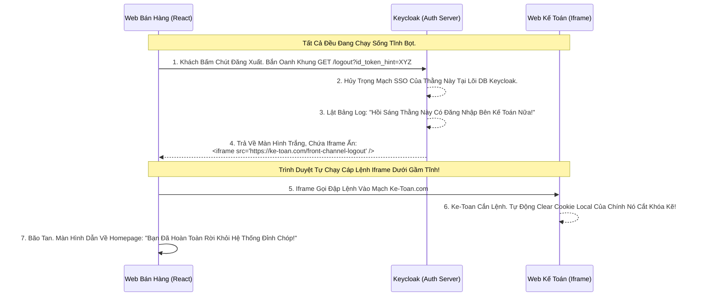

# Lesson 9: Cơn Sóng Thần Xóa Sạch Cookie (Front-Channel Logout)

> [!NOTE]
> **Category:** Theory (Lý thuyết)
> **Goal:** Khi người dùng bấm Đăng Xuất (Logout) ở App A. Bạn không những phải hủy Session ở App A, mà bạn còn PHẢI hủy Session SSO Trung Tâm nằm ở Máy Chủ Keycloak. Không những thế, nếu User đang mở sẵn App B và C (Đều đăng nhập bằng Keycloak), OIDC có nhiệm vụ tạo ra một cơn sóng thần Vỗ Thẳng vào Trình Duyệt để xóa sạch sành sanh Cookie của cả 3 App kia. Đó gọi là **Front-Channel Logout**.

## 1. Lý thuyết chuyên sâu (Detailed Theory)

### 1.1. Nỗi Đau Của Kiến Trúc Single Sign-On (SSO) Chết Cứng
- **Bài toán:** Bạn có 3 ứng dụng: Web-Ban-Hang, Web-Ke-Toan, Web-Nhan-Su. Cả 3 đều nối vào chung 1 con Keycloak.
- Sáng 8h, Nhân viên A đăng nhập Web-Ban-Hang (Keycloak tạo SSO Cookie Sống).
- 8h05, Nhân viên A mở Tab Web-Ke-Toan. Bùm, Login luôn (Nhờ Cookie SSO).
- **11h00 Trưa, Cú Logout Chết Chóc:** Nhân viên A Bấm Đăng Xuất Khỏi Web-Ban-Hang. Web-Ban-Hang đá User về Keycloak. Keycloak Xóa Session Trung Tâm Oanh Cáp. Xong Keycloak báo Logout Thành Công!
- **HẬU QUẢ LỖ LỦNG BỌT:** Khách Hàng chuyển sang Tab Web-Ke-Toan. Nó vẫn sống nhăn răng! Vì Web-Ke-Toan có cái Cookie riêng của nó chưa bị xóa! Khách lại mua đồ tẹt ga dù Tưởng Mình Đã Logout!

### 1.2. Front-Channel Logout Ra Tay Cứu Rỗi (OIDC Specification)
OIDC xử lý thảm họa trên bằng cách Bơm Sóng Thần Chạy Ngang Trình Duyệt (Trực Tiếp Qua Giao Diện Font-channel Oanh Khung Dịch Lụa Mạch Lệnh).
- Khái niệm Front-channel Logout (RFC Đang Nháp của OIDC) quy định: 
  - Mỗi khi Bạn Đăng ký App trên Keycloak. Bạn phải khai báo 1 cái Link Logout Bí Mật (VD: `https://web-ke-toan.com/logout`).
  - Khi Khách Bấm Đăng Xuất Từ App Bán Hàng Dội Lên Keycloak. Keycloak sẽ Không Trả Về Màn Hình Thành Công Vội.
  - Keycloak Xây 1 Cái Mã HTML Giao Diện Chứa Các Thẻ **`<iframe>`** Trượt Rỗng Ẩn. Mỗi Thẻ Iframe Nó Bắn Lệnh Vào Link Logout Của Mấy Thằng App Vệ Tinh Kẽ Chữ (VD: Kế Toán, Nhân Sự).
  - Trình duyệt Mở Các Iframe Này Lên, Chạy Lệnh Rút Lụa Xóa Sạch Cookie Session Local Của Từng Thằng Đáy Lõi DB! Khi Xóa Xong Toàn Bộ, Cơn Sóng Thần Rút Đi, Màn Hình Mới Hiện Chữ Logout Oanh Mạng! Tuyệt Đỉnh Phá Sập!

---

## 2. Luồng nội bộ & Cơ chế cấp thấp (Internal Workflow & Low-level Mechanisms)

Hành Trình OIDC Front-Channel Càn Quét Iframe Xóa Session Sạch Bọt:



---

## 3. Thực hành tốt nhất & Bảo mật (Best Practices & Security)

> [!IMPORTANT]
> **Tuyệt Đỉnh An Toàn Oanh Cáp Cắt Bọt (Thảm Họa Chặn Iframe Safari Cũ Rích)**
> **Mũi Tử Huyệt Của Front-Channel Logout:** Vì Luồng Này Dựa 100% Vào Thẻ Ẩn Trượt `<iframe>` Đập Mạch API Khác Domain Bọc Lụa (Cross-origin). 
> **Thảm Họa:** Trình duyệt **Safari Mới (Apple) Hoặc Cờ Tính Năng Chống Theo Dõi (ITP - Intelligent Tracking Prevention)** Mặc Định Lệnh Đáy DB CHẶN ĐỨNG Toàn Bộ Cookie Gửi Qua Iframe Bên Thứ 3.
> Tức là Cái Iframe Của Keycloak Mở Lên Gọi Vào `ke-toan.com` Bị Trình Duyệt Chửi: "Thằng Hacker Đang Cố Tình Theo Dõi Mày Bằng Iframe, Tao Khóa Lệnh Cấp Tốc Cắt Mạch Đứt Kẽ!".
> **Hậu Quả:** Web Kế Toán Cắn Không Được Cục Lệnh Rút Lụa Có Chứa Cookie Session. Web Kế Toán Không Xóa Được Session Đáy! Cơn Sóng Thần Bị Chặt Gãy Nửa Đường Oanh Rỗng. Lỗ Hổng Khủng Khiếp!
> **Biện Pháp Sống Còn Lớp Trọng Lực:** Chỉ dùng Front-Channel Lệnh Chữ Ký Cho Các Ứng Dụng SPA Cùng Nằm Dưới 1 Sub-Domain (VD: `a.congty.com`, `b.congty.com`). Nếu Khác Miền Chóp Cắt Đứt Tương Lai. Bắt Buộc Phải Chuyển Sang Dùng Sức Mạnh Của Vũ Khí Hạng Nặng **Back-Channel Logout (Học Ở Bài 10)**!

---

## 4. Cấu hình minh họa thực tế (Configuration Examples)

Lắp Ráp Cấu Hình Lệnh Oanh Rỗng Gọi Iframe Logout Trút Nhựa Ở Giao Diện Clients:
1. Mở Admin Console Keycloak, Tìm Tab Cấu Hình Client `web-ke-toan`.
2. Kéo xuống mục Settings Cổ Đại, Tìm Cờ: **`Front-Channel Logout URL`**.
3. Bạn Điền Cái Link API Lệnh Tĩnh Của App Frontend Vào Đó: `https://web-ke-toan.com/api/auth/logout`.
4. Khi App Bán Hàng Dội Lệnh Trút Lụa Logout Đập API Keycloak OIDC Chuẩn:
```text
https://localhost:8080/realms/master/protocol/openid-connect/logout
  ?id_token_hint=<Cục ID_Token_Để_Chứng_Minh_Danh_Tính_Kẻ_Logout>
  &post_logout_redirect_uri=https://web-ban-hang.com/home
```
5. Keycloak Sẽ Dùng Cái Link Cấu Hình Nãy Tự Đẻ Iframe Bọc Oanh Cáp Trọng Lõi. Cực Kỳ Tiện Lợi Bọt Mạch Kéo API Nhanh Chóng Khớp Lệnh!

---

## 5. Câu hỏi Phỏng vấn (Interview Questions)

**1. Trong Giao Thức Front-Channel Logout, Khi Máy Chủ Keycloak Oanh Lệnh Trả Về Một Đống Các Thẻ Iframe Rỗng Cắt Mạch Của Các Ứng Dụng Vệ Tinh Khác Nhau. Liệu Có Tồn Tại Một Lỗ Hổng Nào Cho Phép Hacker Chặn Bắt (Intercept) Giữa Chừng Không Cho Các Thẻ Iframe Này Tải Thành Công, Dẫn Tới Việc Session Vệ Tinh Vẫn Sống Khỏe Trút Lụa Bọt Kẽ API Lụa?**
- **Senior:** Dạ thưa sếp, Có! Đây Chính Là Yếu Điểm Cốt Lõi Của Trái Tim OIDC Mạch Front-channel!
  - Bản chất các Thẻ Iframe Này Load Hoàn Toàn Phụ Thuộc Vào Sức Khỏe Mạng Của Trình Duyệt Ở Client Trượt Nhựa.
  - Nếu Hacker (Hoặc Thậm Chí Một Cái Extension Ad-blocker Xóa Quảng Cáo Của User) Tự Động Bắn Gãy Request Của Iframe Vì Thấy Nó Chứa Lệnh Cross-Origin Khả Nghi.
  - Hoặc Người Dùng Bấm Nút Đăng Xuất Xong Vội Vã Tắt Luôn Tab Cửa Sổ Trình Duyệt Mà Các Iframe Dưới Đáy Chưa Kịp Load Xong (Race Condition Oanh Cáp Cắt Đứt).
  - Lúc Này Cơn Sóng Thần Chết Dọc Đường. Keycloak Tưởng Đã Xóa Bọt, Nhưng Thằng Session Bên Kế Toán Vẫn Còn Đó Sống Oanh!
  - Giao Thức OIDC Coi Front-Channel Là "Fire-and-Forget" (Bắn Lệnh Rồi Bỏ Mặc). Không Hề Đảm Bảo Lệnh Giao Hàng Rút Tiền Thành Công API Đáy. Cần Cẩn Trọng Tĩnh Khớp Khi Dùng!

---

## 6. Tài liệu tham khảo (References)
- **OIDC Front-Channel Logout 1.0 (Draft).**
- **Keycloak Documentation:** Securing Applications - Logout.
