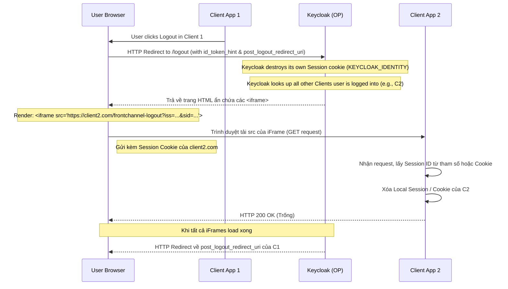

> [!NOTE]
> **Category:** Theory (Lý thuyết)
> **Goal:** Nghiên cứu cơ chế OpenID Connect Front-Channel Logout, nguyên lý đồng bộ đăng xuất (Single Logout) thông qua trình duyệt người dùng, ưu điểm và các hạn chế chết người trong môi trường web hiện đại.

## 1. Lý thuyết chuyên sâu (Detailed Theory)

OIDC Front-Channel Logout là một chuẩn mở rộng của OpenID Connect cung cấp cơ chế **Single Logout (Đăng xuất một lần)**. Khi người dùng nhấn nút "Đăng xuất" trên một Client, hoặc đăng xuất trực tiếp trên Keycloak (Authorization Server), Keycloak sẽ sử dụng **trình duyệt của người dùng (Front-channel)** để gửi tín hiệu yêu cầu đăng xuất tới tất cả các Client khác mà người dùng đang có phiên (Session) hợp lệ.

### TẠI SAO dùng Front-Channel?
Trước khi có OIDC, các ứng dụng tự quản lý Session/Cookie của mình. Trong môi trường SSO, việc chỉ hủy phiên tại Keycloak không làm cho Cookie ở các Client khác bị xóa, người dùng vẫn tiếp tục dùng các ứng dụng đó trái phép. 
Front-channel Logout giải quyết bằng cách: Keycloak mượn trình duyệt của User, âm thầm mở các thẻ `<iframe>` trỏ tới các Endpoint đăng xuất được cấu hình sẵn của các ứng dụng Client khác. Khi trình duyệt gọi vào các iFrame này, Cookie phiên của các ứng dụng đó (nếu có) sẽ được gửi kèm, giúp Client nhận diện được User và hủy chính xác phiên của User đó.

## 2. Luồng nội bộ & Cơ chế cấp thấp (Internal Workflow & Low-level Mechanisms)

Khi một quá trình Đăng xuất bắt đầu tại Keycloak (do Client A yêu cầu hoặc User thao tác trên màn hình Account Console):



### Chi tiết tham số gửi đến Client:
Khi Keycloak nhúng iFrame gọi tới Client, nó đính kèm hai tham số (theo chuẩn OIDC Front-Channel):
- `iss`: Issuer identifier của Keycloak.
- `sid`: Session ID của Keycloak. Client có thể dùng giá trị này để map với local session của nó nếu nó có lưu trữ ID này lúc login.

## 3. Thực hành tốt nhất & Bảo mật (Best Practices & Security)

> [!WARNING]
> **Hạn chế kỹ thuật hiện đại (ITP / SameSite Cookies):** Đây là "gót chân Achilles" của Front-Channel Logout. Các trình duyệt hiện đại (Safari, Chrome) ngày càng siết chặt quyền riêng tư. Việc Keycloak (domain A) dùng iFrame để gọi Client 2 (domain B) được coi là một **Third-party Request**. Trình duyệt sẽ CHẶN việc gửi Cookie của domain B vào iFrame này. Hậu quả là Client 2 nhận được request logout nhưng không có Cookie, không biết ai đang yêu cầu đăng xuất, và luồng Single Logout thất bại.

> [!IMPORTANT]
> **Giải pháp thay thế:** Front-channel Logout chỉ hoạt động ổn định khi các Client và Keycloak chia sẻ chung một Subdomain (ví dụ `app1.company.com`, `auth.company.com`) để Cookie có thể đi kèm. Đối với môi trường Cross-domain, kiến trúc Enterprise bắt buộc phải chuyển sang **Back-Channel Logout**.

- **Không bao giờ tin tưởng hoàn toàn:** Việc iFrame có tải thành công hay không phụ thuộc mạng của trình duyệt hoặc User đóng tab giữa chừng. Server-side Session Management và Token Expiration ngắn mới là lớp phòng thủ cuối cùng.

## 4. Cấu hình minh họa thực tế (Configuration Examples)

Để cấu hình trên Keycloak (Admin Console):
1. Vào **Clients** -> Chọn Client (ví dụ `my-webapp`).
2. Mở tab **Settings** -> Cuộn xuống mục **Logout settings**.
3. Điền vào trường `Front-Channel Logout URL` (ví dụ: `https://my-webapp.com/logout-callback`).
4. Bật tùy chọn `Front-Channel Logout Session Required` (Nếu bật, Keycloak sẽ gửi thêm tham số `sid`).

Phía Client (Spring Boot chẳng hạn), cần xử lý endpoint `GET /logout-callback` để clear SecurityContext.

Khi User ở một App khác gọi `/logout` của Keycloak, HTML Keycloak sinh ra sẽ trông như sau:
```html
<html>
<body>
  <p>Logging out...</p>
  <!-- Gọi tới Client 2 -->
  <iframe src="https://my-webapp.com/logout-callback?iss=https%3A%2F%2Fkeycloak...&sid=123-abc" style="display:none"></iframe>
  <!-- Gọi tới Client 3 -->
  <iframe src="https://other-app.com/front-logout?iss=https%3A%2F%2Fkeycloak...&sid=123-abc" style="display:none"></iframe>
  
  <script>
    // Javascript chờ các iframe onload rồi chuyển hướng
  </script>
</body>
</html>
```

## 5. Trường hợp ngoại lệ (Edge Cases)

- **Trình duyệt chặn Cookie chéo (Third-party cookie blocked):** Yêu cầu gửi tới `/logout-callback` của Client đến mà không có Header `Cookie`.
  - *Cách khắc phục:* Client lúc login nên lưu trữ map giữa `Keycloak SID` (có trong ID Token) và `Local Session ID`. Khi nhận request logout, Client không cần Cookie mà chỉ cần đọc tham số `sid=...` từ URL của iFrame, sau đó tìm trong Database/Redis để hủy bỏ Session cục bộ tương ứng.
- **Mạng chập chờn (Network Partition):** Một trong các iFrame bị Time-out hoặc User tắt hẳn trình duyệt trước khi iframe kịp render. 
  - *Cách khắc phục:* Chấp nhận rủi ro Front-channel. Thiết kế các Access Token có thời hạn cực ngắn (5 phút). Dù session không được hủy sạch trên client, token sẽ vô tác dụng sớm.

## 6. Câu hỏi Phỏng vấn (Interview Questions)

1. **Junior:** Front-channel Logout trong OpenID Connect hoạt động dựa trên cơ chế HTML nào?
   - *Đáp án:* Dựa trên việc nhúng các thẻ `<iframe>` ẩn vào trong trang web đăng xuất của Authorization Server để yêu cầu trình duyệt của người dùng gọi đồng thời các endpoint đăng xuất của các ứng dụng khác.
2. **Junior:** Nhược điểm lớn nhất của Front-Channel Logout so với giao tiếp Back-Channel là gì?
   - *Đáp án:* Rất dễ bị gián đoạn. Nếu người dùng tắt trình duyệt sớm, tắt tab, hoặc mạng lỗi, các iframe sẽ không chạy. Ngoài ra nó phụ thuộc nặng nề vào các chính sách của trình duyệt (SameSite cookies).
3. **Senior:** Một Client app được cấu hình Front-channel Logout URL, nhưng khi Keycloak trigger logout, session trên Client vẫn không bị xóa. Phân tích nguyên nhân và cách khắc phục nếu không đổi sang Back-channel?
   - *Đáp án:* Nguyên nhân là do trình duyệt chặn gửi third-party cookie vào trong iframe cross-domain (thuộc tính `SameSite=Lax` mặc định). Để khắc phục, Client không nên phụ thuộc vào Session Cookie để xác định ai đăng xuất, mà phải bật "Front-Channel Logout Session Required" trên Keycloak. Khi Keycloak gửi tham số `sid` qua iframe URL, Client sẽ tìm `sid` đó trong Cache/Database nội bộ để xóa phiên.
4. **Senior:** OIDC Opaque Token (OAuth2) và Front-channel Logout liên quan nhau thế nào?
   - *Đáp án:* Thực chất Front-channel Logout giải quyết việc hủy *User Session* (giao diện web). Nếu ứng dụng Client sử dụng Access Token gọi API (Resource Server), việc logout qua Front-channel không trực tiếp thu hồi (revoke) các Token đó trên Server. Cần có thêm cơ chế Token Revocation hoặc thiết kế Token Expire ngắn.
5. **Senior:** Tại sao khi Client khởi xướng một luồng đăng xuất (gọi Keycloak `/logout`), nó phải cung cấp tham số `id_token_hint`?
   - *Đáp án:* Để Keycloak biết chính xác ai đang yêu cầu đăng xuất để tránh tấn công "Logout CSRF" (kẻ gian lừa người dùng vô tình truy cập link logout làm họ bị văng khỏi hệ thống). `id_token_hint` đóng vai trò như một chữ ký xác nhận ý định thực sự của người dùng.

## 7. Tài liệu tham khảo (References)

- [OpenID Connect Front-Channel Logout 1.0](https://openid.net/specs/openid-connect-frontchannel-1_0.html)
- [Keycloak Docs: OIDC Logout Options](https://www.keycloak.org/docs/latest/securing_apps/#_logout)
- [MDN Web Docs: SameSite cookies](https://developer.mozilla.org/en-US/docs/Web/HTTP/Headers/Set-Cookie/SameSite)
