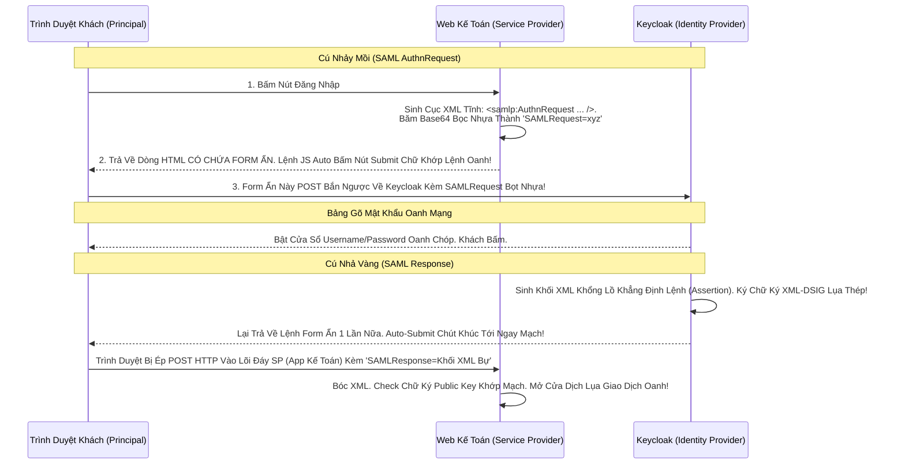

# Lesson 1: Bố Già XML Khởi Nguồn (SAML Basics)

> [!NOTE]
> **Category:** Theory (Lý thuyết)
> **Goal:** SAML (Phát âm là Sam-el) là một chuẩn do tổ chức OASIS đẻ ra từ năm 2005. Tuổi đời của nó hơn xa OAuth2. Bài học này giúp bạn Map (Ánh xạ) lại thuật ngữ của 4 Vai Trò trong OAuth2 sang thế giới Khái Niệm Thuật Ngữ Enterprise của SAML. Tránh bị Ngộp Thở khi đọc tài liệu Ngân Hàng!

## 1. Lý thuyết chuyên sâu (Detailed Theory)

### 1.1. SAML Là Gì? Tại Sao Enterprise Lại Thích Nó?
SAML viết tắt của **Security Assertion Markup Language**. 
Ngay trong cái tên đã nói lên tất cả: Nó là Ngôn ngữ Đánh Dấu (XML) dùng để gửi Khẳng Định Bảo Mật (Assertion).
- **Tại sao Ngân hàng (Enterprise) khoái SAML?**
  1. Nó ra đời sớm. Mọi hệ thống Java Cổ, .NET Cổ (Khoảng năm 2005-2010) đều đã xây sẵn bộ thư viện SAML siêu khủng đập vào CSDL lõi.
  2. Nó dùng XML. XML có một sức mạnh vô đối là **XML Signature (Chữ ký điện tử nhúng thẳng vào từng thẻ XML)** và **XML Encryption (Mã hóa siêu bảo mật từng thẻ con)**. JSON (của OIDC) thời kỳ đầu không bao giờ làm được việc Mã Hóa Chữ Ký phức tạp như XML.

### 1.2. Ánh Xạ Thuật Ngữ (Vocabulary Mapping) - CỰC QUAN TRỌNG
Nếu bạn mang khái niệm `Client` hay `Auth Server` đi chém gió với Chuyên gia SAML, họ sẽ cười bạn. SAML có bộ từ vựng Quý Tộc Riêng Biệt:

1. **Identity Provider (IdP) - Trạm Khẳng Định Danh Tính:**
   - Trong Oauth2 gọi là: `Authorization Server`. (Chính là **Keycloak** của chúng ta).
   - Nhiệm vụ: Nắm giữ CSDL Password. Bật màn hình Form Login.
2. **Service Provider (SP) - Kẻ Cung Cấp Dịch Vụ:**
   - Trong Oauth2 gọi là: `Client` (Bên thứ 3 - Ví dụ Web Kế Toán, Web Bán Hàng).
   - Nhiệm vụ: Nắm giữ Chức Năng. Đẩy khách sang IdP đòi Login.
3. **Principal - Kẻ Ủy Thác (Người Dùng):**
   - Trong Oauth2 gọi là: `Resource Owner / End-User`.
   - Chính là con người đang cầm chuột lướt Web.

---

## 2. Luồng nội bộ & Cơ chế cấp thấp (Internal Workflow & Low-level Mechanisms)

Hành Trình SAML Văng Request Bằng Form Auto-Submit (Cơ Chế Khác Lạ OIDC):

---

## 3. Thực hành tốt nhất & Bảo mật (Best Practices & Security)

> [!IMPORTANT]
> **Tuyệt Đỉnh Tẩy Khách Mạng Bọc Thép (Sự Tàn Phá Của Kích Thước SAML Trượt Bọt Oanh Khung)**
> **Tội Ác Thiết Kế:** Ở Bước Gửi SAML Request Lệnh Nhử Mồi. Bạn (Service Provider) sinh ra khối XML quá dài, xong bạn Nén Lại Rồi Đính Thẳng Nó Lên Thanh URL Của Trình Duyệt Bằng Phương Thức **`HTTP GET (SAML Redirect Binding)`**.
> **Hậu Quả:** Khối XML Chữ Ký Của SAML Nó To Khủng Khiếp Trút Kéo Lụa. Nhét Lên Thanh URL Vượt Quá 2048 Ký Tự. Trình duyệt (Chrome/Edge) Cắt Đứt Nửa Đuôi Oanh Mạng Báo Lỗi `414 URI Too Long`. Khách Hàng Chết Trắng Màn Hình Đáy Oanh!
> **Biện Pháp Sống Còn Lớp Trọng Lực Thép Mạch Lụa:** Phải Biết Lúc Nào Dùng GET, Lúc Nào Dùng POST!
> - Nếu Gửi **`SAMLRequest`** Nhử Mồi (Bản chất XML nó rỗng và ngắn): Dùng **`HTTP Redirect Binding (GET)`** Trượt Lụa Ok.
> - Nhưng Nếu Nhận **`SAMLResponse`** Trả Về (Bản chất là Khối Dữ Liệu Profile Có Chữ Ký XML Mã Hóa Rất Nặng): TỐI KỴ DÙNG GET! Bắt Buộc Phải Cấu Hình Giao Thức Dùng **`HTTP POST Binding`**. Giao Việc Vận Chuyển Cho Bụng (Body) Form HTML Auto-Submit Xuyên Đáy Mạng Rút Tĩnh Không Bao Giờ Tràn Limit Kẽ Oanh Khung Dịch Lụa!

---

## 4. Cấu hình minh họa thực tế (Configuration Examples)

Lắp Ráp Cấu Hình Tạo SAML SP Client Trên Keycloak Bọc Mạch Nhựa:
1. Vào Giao Diện Keycloak Console. Bấm Tạo **Client**.
2. Ô **Client Type**: Lần Này Bắt Buộc Đổi Khỏi OIDC. Chọn Mạch **`SAML`** Kẽ Lụa.
3. Ô **Client ID**: Đừng Điền Chữ Tùy Ý Nữa. Trong SAML, Client ID Bắt Buộc Nên Là Một CÁI URL Định Danh Duy Nhất Tên Bọt Lụa (Gọi Là **EntityID** Của SP). Ví Dụ: `https://web-ke-toan.com/saml-sp`.
4. Mục **Valid Redirect URIs**: Đây Chính Là Cái Endpoint Bọc Thép Của Thằng Kế Toán Đang Hứng Lệnh POST Chờ Thằng Trình Duyệt Bắn Cái Khối SAMLResponse Lệnh Về Đáy Oanh DB. (Trong OIDC Nó Gọi Là Redirect URI, Trong SAML Từ Vựng Của Nó Gọi Là `Assertion Consumer Service - ACS URL`).

---

## 5. Câu hỏi Phỏng vấn (Interview Questions)

**1. Sếp Yêu Cầu Tích Hợp Một Con App Bằng SAML. Sếp Hỏi Em Có Cần Phải Có Bước Gọi Back-Channel Đổi Code Lấy Token Giống Nhau OIDC Không Trọng Lõi Mạch Dữ Lụa Cắt Khung? Tại Sao Oanh Cáp Giao Diện Lệnh Chặt Mạch Lụa?**
- **Senior:** Dạ thưa sếp, Trong Luồng Giao Thức SAML Kinh Điển Web Browser Profile, HOÀN TOÀN KHÔNG TỒN TẠI ĐƯỜNG BACK-CHANNEL NÀO CẢ Oanh Tĩnh Lụa!
  - Luồng SAML Là Luồng **1 Chặng Lệnh Tĩnh Trút Cáp**.
  - Lúc Thằng Keycloak (IdP) Trả Về, Nó Bọc Toàn Bộ Thông Tin Mạch Máu (Profile), Quyền Hạn, Tên Tuổi User Vào 1 Cục XML (Assertion) Bơm Chữ Ký Đóng Dấu Đỉnh Chóp. Rồi Nhờ Thằng Trình Duyệt Của Khách Bắn HTTP POST Cục Chóp Đó Dội Thẳng Vào Bụng Thằng SP (Web Kế Toán).
  - Web Kế Toán Cầm Cục XML Đó, Dùng Public Key Tự Giải Mã Check Bọt Lụa Đáy. Nếu Đúng Chữ Ký Cắt Khung Là Coi Như Xong Luôn, Cho Khách Đăng Nhập Tạo Session Kẽ Mạch. KHÔNG CẦN CHẠY BƯỚC ĐỔI CODE.
  - Về Cơ Bản, Flow Của SAML Chính Là Đứa Con Hoàn Hảo Của Luồng (Implicit OIDC Bị Cấm). Nhưng Nó Không Bị Lộ Lỗ Hổng Trên URL Vì Nó Dùng Bụng FORM HTML POST Đội Mũ Kín Đáy Oanh Bọc Thép Dịch Tễ Lạ! Trải Nghiệm Lỗ Bọt Cắt Trắng Không Sợ Rò Rỉ Mạch Rỗng!

---

## 6. Tài liệu tham khảo (References)
- **OASIS SAML V2.0:** Technical Overview.
- **Keycloak Documentation:** Server Administration Guide - SAML.
