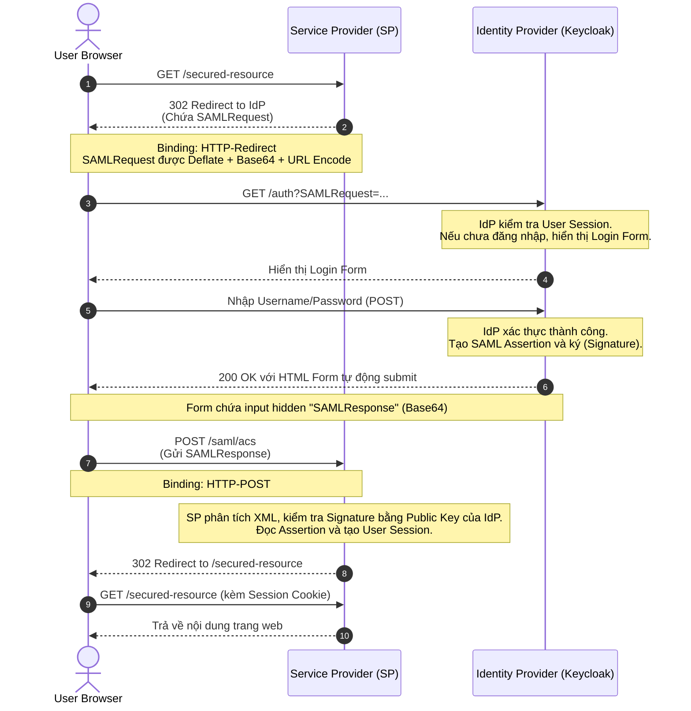

> [!NOTE]
> **Category:** Theory (Lý thuyết)
> **Goal:** Hiểu rõ các khái niệm cốt lõi của SAML 2.0, kiến trúc tổng thể, các thành phần chính (IdP, SP), và cách SAML giải quyết bài toán Single Sign-On (SSO) trong môi trường doanh nghiệp.

## 1. Lý thuyết chuyên sâu (Detailed Theory)

**SAML (Security Assertion Markup Language)** là một tiêu chuẩn mở, dựa trên XML, được thiết kế để trao đổi dữ liệu xác thực (authentication) và ủy quyền (authorization) giữa các bên, cụ thể là giữa **Identity Provider (IdP)** và **Service Provider (SP)**. Ra đời từ những năm đầu 2000 và phiên bản 2.0 được OASIS phê duyệt năm 2005, SAML vẫn là tiêu chuẩn xương sống cho Single Sign-On (SSO) trong môi trường doanh nghiệp (Enterprise).

Tại sao SAML lại tồn tại và quan trọng?
Trong một môi trường doanh nghiệp lớn, nhân viên cần truy cập hàng chục ứng dụng nội bộ (CRM, ERP, HRM). Nếu mỗi ứng dụng yêu cầu quản lý mật khẩu riêng, rủi ro bảo mật sẽ tăng lên và trải nghiệm người dùng sẽ rất tệ. SAML giải quyết bài toán này bằng cách:
- **Tập trung hóa xác thực:** Chỉ có IdP mới lưu trữ và kiểm tra thông tin đăng nhập của người dùng.
- **Ủy thác sự tin cậy (Federated Trust):** SP không cần biết mật khẩu của người dùng, nó chỉ cần tin tưởng vào "Assertion" (chứng nhận) do IdP cấp phát.

Các thành phần cốt lõi trong SAML:
- **Principal:** Thực thể yêu cầu quyền truy cập (thường là User).
- **Identity Provider (IdP):** Hệ thống chịu trách nhiệm xác thực Principal. (Ví dụ: Keycloak, Okta, Active Directory Federation Services - ADFS).
- **Service Provider (SP):** Ứng dụng mà Principal muốn truy cập (Ví dụ: Salesforce, Google Workspace).
- **Assertion:** Một gói dữ liệu XML được ký điện tử bởi IdP, chứa thông tin xác thực, thuộc tính người dùng và quyền hạn.
- **Binding:** Cách thức mà các thông điệp SAML được truyền qua HTTP (Ví dụ: HTTP-Redirect, HTTP-POST).
- **Profile:** Cách kết hợp các Assertions, Protocols, và Bindings để giải quyết một Use Case cụ thể (Ví dụ: Web Browser SSO Profile).

## 2. Luồng nội bộ & Cơ chế cấp thấp (Internal Workflow & Low-level Mechanisms)

Luồng SAML Web Browser SSO (SP-Initiated Profile) là luồng phổ biến nhất. Dưới đây là cơ chế hoạt động chi tiết ở mức HTTP.



**Chi tiết luồng:**
1. **Request:** Người dùng cố gắng truy cập tài nguyên được bảo vệ trên SP.
2. **SAMLRequest:** SP nhận thấy người dùng chưa xác thực, tạo ra một XML `SAMLRequest` (AuthnRequest), nén nó (Deflate), mã hóa Base64 và URL Encode, sau đó đính kèm vào URL chuyển hướng của IdP bằng phương thức HTTP GET (HTTP-Redirect Binding).
3. **Authentication:** Browser chuyển hướng đến IdP. IdP giải mã `SAMLRequest`, nhận diện SP và yêu cầu người dùng xác thực.
4. **SAMLResponse:** Sau khi xác thực thành công, IdP tạo `SAMLResponse` chứa XML Assertion, ký mã hóa (XML Signature), và trả về cho Browser dưới dạng một trang HTML chứa Form ẩn với phương thức HTTP POST. Đoạn script trong trang HTML sẽ tự động submit form này.
5. **Assertion Consumer Service (ACS):** Browser thực hiện HTTP POST `SAMLResponse` lên endpoint ACS của SP. SP xác minh chữ ký số của IdP. Nếu hợp lệ, SP cấp quyền truy cập.

## 3. Thực hành tốt nhất & Bảo mật (Best Practices & Security)

> [!IMPORTANT]
> **Trust Establishment:** Mối quan hệ tin cậy giữa IdP và SP phải được thiết lập từ trước thông qua việc trao đổi Metadata (SAML Metadata). SP phải có Public Key của IdP để xác minh `SAMLResponse`.

> [!WARNING]
> **XML Signature Wrapping (XSW) Attacks:** Việc xử lý XML trong SAML phức tạp và dễ gặp lỗ hổng XSW, nơi kẻ tấn công chèn các Assertion giả mạo vào payload. **Cách phòng chống:** Luôn sử dụng các thư viện SAML đã được kiểm định (như Spring Security SAML, Keycloak SAML Adapter) thay vì tự viết trình phân tích cú pháp XML.

- **Sử dụng TLS/SSL:** Tất cả lưu lượng HTTP liên quan đến SAML (đặc biệt là Assertion) PHẢI được mã hóa qua HTTPS để ngăn chặn Man-in-the-Middle (MitM).
- **Encrypt Assertions:** Ngoài việc ký (Sign) để đảm bảo tính toàn vẹn, IdP nên mã hóa (Encrypt) toàn bộ hoặc một phần Assertion nếu nó chứa dữ liệu nhạy cảm, sử dụng Public Key của SP.
- **Giới hạn thời gian sống của Assertion:** Các Assertions phải có thuộc tính `NotBefore` và `NotOnOrAfter` với khoảng thời gian hợp lý (ví dụ: vài phút) để ngăn chặn Replay Attack.
- **Bắt buộc ký AuthnRequest (Sign Requests):** Đối với các SP quan trọng, yêu cầu SP phải ký điện tử `AuthnRequest` trước khi gửi đến IdP để IdP biết chắc chắn yêu cầu đến từ một SP hợp lệ.

## 4. Cấu hình minh họa thực tế (Configuration Examples)

Ví dụ một payload `SAMLRequest` cơ bản (trước khi được nén và mã hóa):

```xml
<samlp:AuthnRequest 
    xmlns:samlp="urn:oasis:names:tc:SAML:2.0:protocol" 
    xmlns:saml="urn:oasis:names:tc:SAML:2.0:assertion" 
    ID="_a1b2c3d4e5" 
    Version="2.0" 
    IssueInstant="2023-10-10T12:00:00Z" 
    Destination="https://idp.example.com/auth/realms/master/protocol/saml" 
    AssertionConsumerServiceURL="https://sp.example.com/saml/acs" 
    ProtocolBinding="urn:oasis:names:tc:SAML:2.0:bindings:HTTP-POST">
    
    <saml:Issuer>https://sp.example.com</saml:Issuer>
    <samlp:NameIDPolicy Format="urn:oasis:names:tc:SAML:1.1:nameid-format:emailAddress" AllowCreate="true"/>
</samlp:AuthnRequest>
```

**Cấu hình trên Keycloak (Làm IdP):**
Để cấu hình Keycloak hoạt động như một IdP cho một ứng dụng SAML SP:
1. Tạo một Client mới trong Keycloak.
2. Chọn `Client type` là `SAML`.
3. Nhập `Client ID` (thường là URL Issuer của SP).
4. Cấu hình `Valid Redirect URIs` tới endpoint ACS của SP (VD: `https://sp.example.com/saml/acs`).

## 5. Trường hợp ngoại lệ (Edge Cases)

- **Lệch thời gian (Clock Skew):** Do Assertion có khoảng thời gian hiệu lực khắt khe (NotBefore / NotOnOrAfter), nếu đồng hồ hệ thống giữa máy chủ IdP và SP bị lệch chỉ vài phút, Assertion sẽ bị từ chối. **Khắc phục:** Định cấu hình NTP trên tất cả các server, và cấu hình `Clock Skew Tolerance` trên SP (thường là khoảng 60-90 giây).
- **Trình duyệt chặn Third-Party Cookies / SameSite:** Mặc dù luồng SAML POST không phụ thuộc trực tiếp vào Third-Party Cookies, nhưng trong một số luồng iFrame hoặc khi SP yêu cầu duy trì phiên, các thiết lập bảo mật hiện đại của trình duyệt có thể gây rớt Session. **Khắc phục:** Đảm bảo cấu hình cookie `SameSite=None; Secure`.
- **Message quá lớn cho HTTP-Redirect:** Đôi khi `SAMLRequest` kèm theo quá nhiều tham số mở rộng (Extensions) dẫn đến vượt quá giới hạn độ dài URL (thường là 2048 ký tự). **Khắc phục:** Chuyển sang sử dụng `HTTP-POST Binding` cho SAMLRequest thay vì `HTTP-Redirect`.

## 6. Câu hỏi Phỏng vấn (Interview Questions)

1. **Junior:** Phân biệt Identity Provider (IdP) và Service Provider (SP) trong SAML.
   *Đáp án:* IdP lưu trữ thông tin xác thực và chịu trách nhiệm kiểm tra danh tính người dùng (VD: Keycloak). SP là ứng dụng thực tế cung cấp dịch vụ mà người dùng muốn truy cập (VD: Salesforce), nó tin tưởng vào xác thực của IdP.
2. **Junior:** Hai Binding phổ biến nhất trong SAML Web Browser SSO là gì?
   *Đáp án:* `HTTP-Redirect` (thường dùng để gửi `SAMLRequest` thông qua URL params) và `HTTP-POST` (thường dùng để gửi `SAMLResponse` qua một HTML form ẩn tự submit, do Response XML khá lớn).
3. **Senior:** Tại sao SAML `AuthnRequest` thường gửi bằng HTTP-Redirect, trong khi `SAMLResponse` lại gửi bằng HTTP-POST?
   *Đáp án:* `AuthnRequest` thường có dung lượng nhỏ, việc mã hóa base64 và gắn vào URL (GET request) giúp chuyển hướng mượt mà, dễ dàng được browser cache hoặc xử lý. `SAMLResponse` chứa Assertion với nhiều thông tin, chữ ký mã hóa, thường lớn hơn giới hạn độ dài an toàn của URL GET, nên bắt buộc dùng HTTP-POST.
4. **Senior:** Giải thích lỗ hổng XML Signature Wrapping (XSW) và cách khắc phục trên SP.
   *Đáp án:* Kẻ tấn công lợi dụng việc parser XML không phân biệt được chữ ký áp dụng cho toàn bộ cấu trúc hay chỉ một phần tử. Chúng bọc Assertion thật bên trong một cấu trúc giả, khiến SP đánh giá chữ ký hợp lệ nhưng lại lấy quyền truy cập từ Assertion giả. Khắc phục: Dùng thư viện SAML chuẩn, hạn chế validate tự chế, và validate đúng node có ID được tham chiếu trong Signature.
5. **Senior:** Nếu ứng dụng của bạn nhận được lỗi "SAML Assertion is not yet valid" hoặc "expired", nguyên nhân phổ biến nhất là gì?
   *Đáp án:* Clock Skew (Đồng hồ lệch) giữa IdP và SP. Do thuộc tính `NotBefore` hoặc `NotOnOrAfter` của Assertion được đánh dấu bởi thời gian trên IdP, nếu SP chạy nhanh hoặc chậm hơn quá mức, nó sẽ từ chối Assertion. Giải pháp là thiết lập NTP đồng bộ thời gian và thêm khoảng `clock skew tolerance` vào parser của SP.

## 7. Tài liệu tham khảo (References)

- [OASIS SAML V2.0 Core Specification (RFC/Standard)](https://docs.oasis-open.org/security/saml/v2.0/saml-core-2.0-os.pdf)
- [OWASP SAML Security Cheat Sheet](https://cheatsheetseries.owasp.org/cheatsheets/SAML_Security_Cheat_Sheet.html)
- [Keycloak Official Documentation - SAML Clients](https://www.keycloak.org/docs/latest/server_admin/#_saml_clients)
