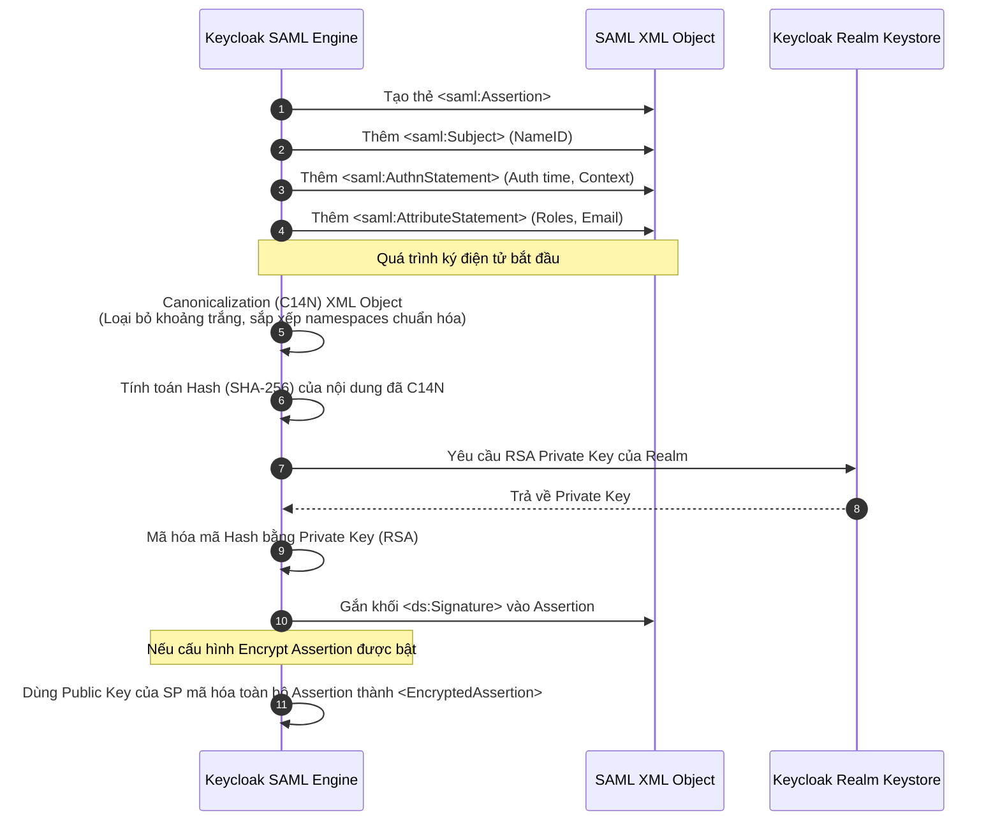

> [!NOTE]
> **Category:** Theory (Lý thuyết)
> **Goal:** Nghiên cứu sâu về cấu trúc bên trong của một SAML Assertion, cách các thuộc tính (Attributes), danh tính (Subject), và thông tin xác thực (AuthnStatement) được mã hóa. Hiểu về cơ chế chống giả mạo thông qua XML Signature.

## 1. Lý thuyết chuyên sâu (Detailed Theory)

**SAML Assertion** là cốt lõi của giao thức SAML. Sau khi người dùng xác thực thành công tại Identity Provider (IdP), IdP sẽ phát hành một Assertion đóng gói các thông tin dưới dạng một tài liệu XML. Service Provider (SP) dựa hoàn toàn vào Assertion này để quyết định việc cấp quyền truy cập.

Một SAML Assertion không chỉ chứa mỗi thông tin "đã đăng nhập", mà thường đóng gói 3 loại *Statement* chính:
1. **Authentication Statement (`<saml:AuthnStatement>`):** Khẳng định rằng người dùng (Subject) đã thực sự xác thực, kèm theo thời gian xác thực và phương thức xác thực đã sử dụng (ví dụ: Password, Multi-Factor Authentication).
2. **Attribute Statement (`<saml:AttributeStatement>`):** Chứa các thông tin bổ sung (Claims) về người dùng. Ví dụ: `email`, `roles`, `department`, `first_name`. Đây là cách hệ thống RBAC (Role-Based Access Control) trên SP biết User thuộc Role nào để phân quyền.
3. **Authorization Decision Statement (Hiếm dùng hơn):** Dùng để khẳng định một quyết định cho phép hoặc từ chối truy cập tới một tài nguyên cụ thể. (Thường trong SAML SSO hiện đại, SP sẽ tự quyết định Authorization dựa vào Attribute Statement).

Ngoài các Statement, các thành phần quan trọng khác của một Assertion bao gồm:
- **Issuer:** Ai là người phát hành Assertion này (Thường là Entity ID của IdP, ví dụ: URL của Keycloak Realm).
- **Subject:** Ai là chủ thể của Assertion (Thường là tên đăng nhập hoặc NameID của người dùng).
- **Conditions:** Các điều kiện bắt buộc mà SP phải tuân thủ khi chấp nhận Assertion. Phổ biến nhất là giới hạn thời gian hợp lệ (`NotBefore`, `NotOnOrAfter`) và giới hạn đối tượng tiêu thụ (`AudienceRestriction`).
- **Signature:** Chữ ký số (XML Signature) để đảm bảo tính toàn vẹn và xác thực nguồn gốc.

## 2. Luồng nội bộ & Cơ chế cấp thấp (Internal Workflow & Low-level Mechanisms)

Khi IdP sinh ra một Assertion và đóng gói nó vào trong một `SAMLResponse`, nó phải thực hiện một quá trình phức tạp gọi là **XML Canonicalization (C14N)** và **XML Signature**. Dưới đây là luồng xử lý ở cấp thấp:



**Tại sao phải có Canonicalization (C14N)?**
Bởi vì XML là một ngôn ngữ đánh dấu, hai tài liệu XML có thể mang ý nghĩa hoàn toàn giống nhau nhưng khác nhau về vị trí khoảng trắng, dấu ngoặc kép hoặc namespace prefixes. Nếu ký số trực tiếp lên chuỗi byte thô, bất kỳ thay đổi khoảng trắng nào trong quá trình truyền dẫn (ví dụ bởi một proxy) sẽ làm thay đổi mã Hash và phá hỏng chữ ký số. C14N đảm bảo XML được chuyển đổi về một định dạng chuỗi byte "chuẩn hóa duy nhất" trước khi băm và ký.

## 3. Thực hành tốt nhất & Bảo mật (Best Practices & Security)

> [!WARNING]
> **XML External Entity (XXE) Attacks:** Khi SP phân tích cú pháp Assertion từ IdP, nếu bộ phân tích cú pháp XML không được cấu hình để tắt External Entities (DTD), kẻ tấn công có thể chèn các mã độc vào Assertion XML để đọc file hệ thống `/etc/passwd` hoặc thực hiện SSRF (Server-Side Request Forgery).

> [!IMPORTANT]
> **Always Validate the `Audience`:** Một SP khi nhận được Assertion BẮT BUỘC phải kiểm tra thẻ `<saml:Audience>`. Điều này để ngăn chặn kịch bản: Kẻ tấn công có tài khoản trên một SP rác rưởi (SP-B) cũng dùng chung IdP. Hắn ta lấy Assertion sinh ra cho SP-B và gửi nó cho SP-A (Hệ thống ngân hàng). Nếu SP-A không kiểm tra Audience, nó sẽ chấp nhận Assertion hợp lệ này.

- **Ký toàn bộ Response hay ký Assertion?** Theo Best Practice, bạn nên cấu hình Keycloak ký điện tử lên CẢ `SAMLResponse` VÀ `SAMLAssertion` bên trong nó. Ký Response ngăn chặn Message-Level tampering, ký Assertion ngăn chặn việc bóc tách Assertion để dùng ở nơi khác.
- **Sử dụng SHA-256:** Tránh cấu hình thuật toán băm yếu như SHA-1. Keycloak hiện tại mặc định sử dụng RSA-SHA256 cho chữ ký số SAML.

## 4. Cấu hình minh họa thực tế (Configuration Examples)

Đây là ví dụ cấu trúc một `<saml:Assertion>` thực tế khi được xuất ra từ Keycloak:

```xml
<saml:Assertion xmlns:saml="urn:oasis:names:tc:SAML:2.0:assertion"
                ID="ID_1234567890abcdef"
                IssueInstant="2023-10-10T12:05:00Z"
                Version="2.0">
    <saml:Issuer>https://idp.example.com/auth/realms/master</saml:Issuer>
    
    <!-- Chữ ký số điện tử -->
    <ds:Signature xmlns:ds="http://www.w3.org/2000/09/xmldsig#">
        <ds:SignedInfo>
            <ds:CanonicalizationMethod Algorithm="http://www.w3.org/2001/10/xml-exc-c14n#"/>
            <ds:SignatureMethod Algorithm="http://www.w3.org/2001/04/xmldsig-more#rsa-sha256"/>
            <ds:Reference URI="#ID_1234567890abcdef">
                <ds:Transforms>
                    <ds:Transform Algorithm="http://www.w3.org/2000/09/xmldsig#enveloped-signature"/>
                </ds:Transforms>
                <ds:DigestMethod Algorithm="http://www.w3.org/2001/04/xmlenc#sha256"/>
                <ds:DigestValue>a1b2c3d4...</ds:DigestValue>
            </ds:Reference>
        </ds:SignedInfo>
        <ds:SignatureValue>x9y8z7...</ds:SignatureValue>
    </ds:Signature>
    
    <!-- Chủ thể danh tính -->
    <saml:Subject>
        <saml:NameID Format="urn:oasis:names:tc:SAML:1.1:nameid-format:emailAddress">user@example.com</saml:NameID>
        <saml:SubjectConfirmation Method="urn:oasis:names:tc:SAML:2.0:cm:bearer">
            <saml:SubjectConfirmationData NotOnOrAfter="2023-10-10T12:10:00Z"
                                          Recipient="https://sp.example.com/saml/acs"/>
        </saml:SubjectConfirmation>
    </saml:Subject>
    
    <!-- Điều kiện -->
    <saml:Conditions NotBefore="2023-10-10T12:04:00Z"
                     NotOnOrAfter="2023-10-10T12:10:00Z">
        <saml:AudienceRestriction>
            <saml:Audience>https://sp.example.com</saml:Audience>
        </saml:AudienceRestriction>
    </saml:Conditions>
    
    <!-- Thông tin xác thực -->
    <saml:AuthnStatement AuthnInstant="2023-10-10T12:05:00Z"
                         SessionIndex="session_987654321">
        <saml:AuthnContext>
            <saml:AuthnContextClassRef>urn:oasis:names:tc:SAML:2.0:ac:classes:Password</saml:AuthnContextClassRef>
        </saml:AuthnContext>
    </saml:AuthnStatement>
    
    <!-- Thuộc tính người dùng (Mappers) -->
    <saml:AttributeStatement>
        <saml:Attribute Name="Role" NameFormat="urn:oasis:names:tc:SAML:2.0:attrname-format:basic">
            <saml:AttributeValue>admin</saml:AttributeValue>
        </saml:Attribute>
    </saml:AttributeStatement>
</saml:Assertion>
```

Trên Keycloak, để thêm các `<saml:Attribute>` (như ví dụ Role ở trên), bạn cấu hình phần **Mappers** trong cài đặt của SAML Client.

## 5. Trường hợp ngoại lệ (Edge Cases)

- **Namespace Conflicts trong quá trình C14N:** Một số thư viện phân tích cú pháp SP cũ có thể thay đổi namespace khi xử lý `<saml:Assertion>` được tách ra từ `<samlp:Response>`. Điều này dẫn đến sự cố: Chữ ký trên Response hợp lệ, nhưng khi extract Assertion ra để lưu vào bộ nhớ, chữ ký của Assertion lại báo lỗi "Invalid Signature". **Khắc phục:** Đảm bảo thư viện SAML của SP sử dụng thuật toán Exclusive Canonicalization (`xml-exc-c14n#`).
- **Nhiều thẻ Assertion trong một Response:** Một Response có thể chứa nhiều Assertion. Có trường hợp kẻ tấn công cố tình chèn thêm Assertion rác và chỉ ký một cái. Thư viện xử lý non-standard có thể lấy nhầm Assertion không được ký để cấp quyền. **Khắc phục:** SP luôn phải reject bất kỳ Response nào chứa Assertion không hợp lệ hoặc thiếu chữ ký.

## 6. Câu hỏi Phỏng vấn (Interview Questions)

1. **Junior:** Kể tên 3 khối Statement chính thường có trong một SAML Assertion.
   *Đáp án:* AuthnStatement (chứa chi tiết đăng nhập), AttributeStatement (chứa thuộc tính user), và AuthorizationDecisionStatement (thường ít gặp hơn, xác định quyền truy cập).
2. **Junior:** NameID trong thẻ `<saml:Subject>` có ý nghĩa gì?
   *Đáp án:* Nó là định danh duy nhất (Identifier) của người dùng được trả về cho SP. Thường là địa chỉ Email, Username hoặc một ID ẩn danh (persistent/transient ID).
3. **Senior:** Tại sao trước khi tạo XML Signature cho Assertion, hệ thống lại phải chạy qua bước Canonicalization (C14N)?
   *Đáp án:* XML cho phép linh hoạt về khoảng trắng (whitespace) và định dạng namespace. Trong quá trình truyền HTTP, các node mạng hoặc parser có thể vô tình làm thay đổi các khoảng trắng này. C14N giúp chuẩn hóa tài liệu XML về một chuỗi byte vật lý duy nhất, đảm bảo tính toán Hash không bị sai lệch dù XML được phân tích ở hệ điều hành hay framework khác nhau.
4. **Senior:** Phân biệt "Sign Response" và "Sign Assertion". Khi nào cần dùng cái nào?
   *Đáp án:* Sign Response mã hóa hash toàn bộ gói tin trả về từ IdP, đảm bảo thông điệp không bị can thiệp. Sign Assertion chỉ ký riêng rẽ cái Assertion bên trong. Việc ký Assertion bảo vệ nó nếu SP tách Assertion ra và sử dụng lại ở nơi khác, hoặc lưu trữ. Best practice là cấu hình ký cả hai (hoặc ít nhất phải ký Assertion).
5. **Senior:** Thuộc tính `AudienceRestriction` có tác dụng ngăn chặn kịch bản tấn công nào?
   *Đáp án:* Ngăn chặn Privilege Escalation và Token substitution. Kẻ tấn công không thể lấy Assertion được cấp hợp lệ cho một SP cấp thấp (Audience A) và đem nhồi nó sang một SP quan trọng (Audience B) để vượt qua xác thực, vì SP B sẽ kiểm tra và thấy Audience không trùng khớp với nó.

## 7. Tài liệu tham khảo (References)

- [OASIS SAML V2.0 Core Specification - Assertions](https://docs.oasis-open.org/security/saml/v2.0/saml-core-2.0-os.pdf)
- [XML Signature Syntax and Processing (W3C)](https://www.w3.org/TR/xmldsig-core/)
- [OWASP XML Security Cheat Sheet](https://cheatsheetseries.owasp.org/cheatsheets/XML_Security_Cheat_Sheet.html)
