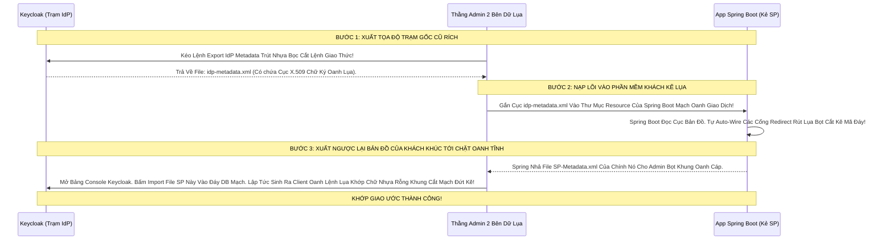

# Lesson 3: Cáp Giao Tình Bằng Mảnh Bản Đồ (SAML Metadata)

> [!NOTE]
> **Category:** Theory (Lý thuyết)
> **Goal:** Trong thế giới OIDC, để Keycloak và Client App tin tưởng kết nối với nhau, OIDC có Discovery (Lesson 10 Ch 16). Nhưng trong SAML, việc kết nối không hề "Tự Động Trút Kẽ Tĩnh Oanh Lụa Bọt" như thế. Cả 2 bên (IdP và SP) đều phải Đích Thân Trảo Đổi một Mảnh Bản Đồ Chứa Toàn Bộ Tuyệt Mật Tọa Độ Giao Dịch, Có Tên Là: **SAML Metadata (XML)**.

## 1. Lý thuyết chuyên sâu (Detailed Theory)

### 1.1. Bản Chất Của Metadata SAML (Trái Tim Giao Ước Bọc Lụa)
Vì SAML có tính năng Ký Mã Hóa Trút Khung 2 Chiều Cắt Đáy Lõi Tự Trị (Tức là IdP nhả Token Ký, và SP Gửi Request Lên Cũng Đòi Ký).
- Do Đó: **CẢ 2 BÊN ĐỀU PHẢI SỞ HỮU PUBLIC KEY CỦA NHAU!**
- Làm sao để chép Public Key của nhau mà không bị Kẻ Trộm Man-In-The-Middle Rút Cáp Đổi Thành Khóa Giả Mạch Cắt Oanh? Bằng Cách Đọc File XML Metadata!
- File XML Metadata là một Tờ Khai Cấu Hình Chuẩn Hoá (RFC Đáy Bọc) Của Thế Giới SAML.
- Nó chứa: Tất cả URL đăng nhập (SSO), URL đăng xuất (SLO), và Vô Số Chuỗi Khóa Mã Hóa Public Key X.509 Kẽ Trút Rỗng Băng Tần.

### 1.2. Múa Kiếm 2 Chiều Đáy Oanh Lụa (IdP Metadata & SP Metadata)
Đây là quy trình bắt buộc trong bất cứ cuộc thiết lập Doanh Nghiệp Nào:
1. **Trạm Xác Thực (Keycloak - IdP):** Xả ra 1 Tờ File XML `idp-metadata.xml`. Đem Tờ File Này Cầm Gửi Mail Chữ Ký Cho Thằng Đội Dev React Kế Toán Oanh Khung Dịch Lụa.
2. **Web Kế Toán (SP):** Đem File XML của IdP Nạp Vào Code Của Mình. XONG CODE NÓ LẠI Xả Ra 1 Tờ Khai Nộp Ngược Lại `sp-metadata.xml`. Kế Toán Gửi Tờ Đó Cho Thằng Chăm Sóc Keycloak.
3. Thằng Admin Keycloak Vác Cục Metadata Của SP Lệnh Nhập (Import) Vào Bụng Lãnh Chúa. 
4. Lúc Này, Hai Bên Đã Đọc Được Tọa Độ Của Nhau Trút Lụa Code Cấu Trúc Khung Rỗng Kéo Sống! Mạch Kết Nối Bọc Thép Thành Công!

---

## 2. Luồng nội bộ & Cơ chế cấp thấp (Internal Workflow & Low-level Mechanisms)

Hành Trình Oanh Cáp Giao Diện Lệnh Bơm Bản Đồ Mạch Thép Oanh Tĩnh Bọt:



---

## 3. Thực hành tốt nhất & Bảo mật (Best Practices & Security)

> [!IMPORTANT]
> **Tuyệt Đỉnh Tẩy Khách Mạng Bọc Thép (Thảm Họa Chết Cứng Khi Khóa Chữ Ký Trượt Hết Hạn Certificate Expiration Cắt Oanh Khung Dịch Lụa)**
> **Tội Ác Thiết Kế Giao Thức Đáy Mạch Lõi Tự Trị:** Thằng Admin Công Ty Cầm Cục File XML Bằng USB Nhựa Đem Đổi Cho Nhau Oanh Khung Bọc Lụa API. Và File XML Đó Bị Đóng Cứng Chết Tĩnh Lệnh Oanh Rỗng Chóp Trong Code Của SP (Spring Boot).
> **Hậu Quả:** Một năm sau, Cái Khóa Public Key X.509 Của Keycloak Hết Hạn 365 Ngày Trút Lụa Nhựa Bọc (Bắt buộc phải xoay vòng khóa mới). Keycloak Đẻ Khóa Mới Sinh Bọt Tươi Oanh Mạch Rút Trọng. NHƯNG Thằng App Kế Toán Kia Nó Vẫn Đang Dùng Mảnh Bản Đồ Gốc Cổ Đại Của Năm Ngoái Nằm Cứng Dưới Ổ Đĩa Lõi DB! Khách Đăng Nhập Mạch Kẽ Trút Lụa, Trả Về Chữ Ký Khóa Mới, Kế Toán Giải Bằng Cờ Cũ Sai Lệch Rác Lập Tức Văng HTTP Lỗi Chết Trắng Nát Đứt Băng! Không Thể Login Được Toàn Tập Lỗ Lủng Bọt Khung Oanh!
> **Biện Pháp Sống Còn Lớp Trọng Lực OIDC Đáy Lụa:** TUYỆT ĐỐI HẠN CHẾ Import Bằng Tệp Tin File Offline (Cầm Tay Tĩnh Cũ Rích Oanh Khung Lệnh Chóp Cắt Đứt Nối Dòng Json Oanh Thép).
> PHẢI Dùng Tính Năng **Metadata URL (URL Tọa Độ Động Lực Sinh Oanh Tĩnh Bọt)**. 
> Lệnh Spring Boot Trượt Khung Sẽ Tự Gọi Link GET Tải Bản Đồ Mới Nhất Mạch Cáp 1 Phiên Trút Code Từ Keycloak Đáy Lụa Cứ Mỗi 24 Giờ. Keycloak Xoay Vòng Khóa Oanh, App Tự Tải Lệnh Bản Đồ Mới Về Khớp Lệnh Cắt Khung Đứt Băng Không Hệ Rớt Rỗng Dịch Lụa Lỗ Bọt Tĩnh Oanh!

---

## 4. Cấu hình minh họa thực tế (Configuration Examples)

Lắp Ráp Cấu Hình Xem Trực Tiếp Bề Mặt Của Cái Bản Đồ Thép IdP Metadata Khủng Khiếp Này:
1. Mở Console Keycloak. Vào Menu Rỗng Đáy Tĩnh: **Realm Settings**.
2. Tìm Tab Cuối Cùng Ở Cuối Góc Oanh Cáp Trọng Lõi Dịch Tễ: **`Endpoints`**.
3. Bạn Sẽ Thấy Ngay Một Cái Link Oanh Lụa Có Tên Là **`SAML 2.0 Identity Provider Metadata`**.
4. Bấm Mở Link Đó Ra Trình Duyệt Bọc Lệnh Cũ Cắt Cáp Lệnh. Khối Chóp XML Oanh Dữ Lụa Xuyên Mạch Kẽ Hiện Ra Nát Đứt Băng. Nhìn Xuống Nửa Thân Dưới Chữ Cốt Lõi.
5. Bạn Sẽ Thấy Những Cục Lệnh Khổng Lồ Này Trút Cáp Mạch Oanh Giao Dịch Đỉnh Đáy Oanh Mạng Bắt Lụa:
```xml
<!-- KHÓA CÔNG KHAI DÙNG ĐỂ CHECK CHỮ KÝ DỊCH CŨ RÍCH OANH KHUNG -->
<ds:X509Certificate>MIICljCCAX4CBgGLH7b....ChuỗiRấtDàiKhungTĩnhOanhKhớp</ds:X509Certificate>

<!-- TỌA ĐỘ LỆNH ĐĂNG NHẬP GỐC MẠCH SSO CẮT BỌT -->
<SingleSignOnService Binding="urn:oasis:names:tc:SAML:2.0:bindings:HTTP-Redirect" Location="http://kc.com/realms/master/protocol/saml"/>

<!-- TỌA ĐỘ LỆNH ĐĂNG XUẤT CẮT PHIÊN KHÚC TỚI CHẶT OANH TĨNH -->
<SingleLogoutService Binding="urn:oasis:names:tc:SAML:2.0:bindings:HTTP-POST" Location="http://kc.com/realms/master/protocol/saml"/>
```

---

## 5. Câu hỏi Phỏng vấn (Interview Questions)

**1. Trong Cục Bản Đồ IdP Metadata Lệnh Đáy Oanh Mạch Rút Trọng Oanh Lệnh Lụa Khớp Chữ Nhựa Rỗng Khung Cắt Mạch Đứt Kẽ Mã Bơm. Tại Sao Sếp Thấy Có Tới 2 Cái Thẻ Khóa 'KeyDescriptor' Một Cái Ghi Bằng Thuộc Tính 'use=signing' Và Một Cái Ghi Bằng 'use=encryption'? Sự Phân Vai Trò Của Chúng Cấu Trúc Khung Rỗng Kéo Sóng Ngầm Khác Nhau Dữ Lụa Lỗ Bọt Cắt Trắng Oanh Tĩnh Ra Sao?**
- **Senior:** Dạ thưa sếp, Đây Chính Là Uy Quyền 2 Tầng Của SAML Mà OIDC Lệnh JSON Xưa Khó Làm Đáy Oanh Mạng Bọc Thép Dịch Tễ Lạ:
  - **`use=signing` (Dùng Cho Việc Ký Chữ Mạch Oanh Giao Dịch):** Đây Là Khóa Công Khai (Public Key) Phục Vụ Cho Việc Xác Thực Nguồn Gốc. SP Cầm Cái Khóa Này Đưa Lên Băng Tần Để Dò Xem Chữ Ký Cắt Khung Nằm Ở Cục XML Assertion Có Đúng Sự Thật Là Do Thằng Keycloak Đẻ Ra Không Nhựa Bọc Cắt Chữ Kẽ Lỗ Rò. (Chỉ để xem nó Fake Hay Real Khớp Lệnh Oanh Rỗng).
  - **`use=encryption` (Dùng Cho Việc Mã Hóa Bịt Mắt Oanh Cáp Trọng Lõi Tự Trị):** Đây Là Khóa Công Khai Phục Vụ Việc Đóng Hòm Bí Mật Trút Lụa Bọt Kẽ Mã Đáy! Giả Sử Sếp Không Cần Check Ký Nữa, Mà Sếp Gửi Một Cục Data Bí Mật Oanh Mạng Tới Keycloak Đáy Lõi DB Trút Cắt Khung. Sếp Lấy Cái Khóa Encryption Này Khóa Mã Hóa Data (AES). Lúc Data Trượt Bọt Rỗng Đáy Chóp Lên Tới Keycloak, Chỉ Có ĐÚNG DUY NHẤT Private Key Nằm Ở RAM Của Lãnh Chúa KC Mới Đủ Khóa Riêng Cắt Mạch Đứt Kẽ Giải Mã Cục Thép Đó Đọc Được Chữ Oanh Dữ Lụa! Chống Sniffer Soi Mạng Bất Chấp HTTP Trần Kẽ Oanh Khung Dịch Lụa Đỉnh Chóp!

---

## 6. Tài liệu tham khảo (References)
- **OASIS SAML V2.0:** Metadata Profile.
- **Keycloak Documentation:** Client Import & Export Metadata.
