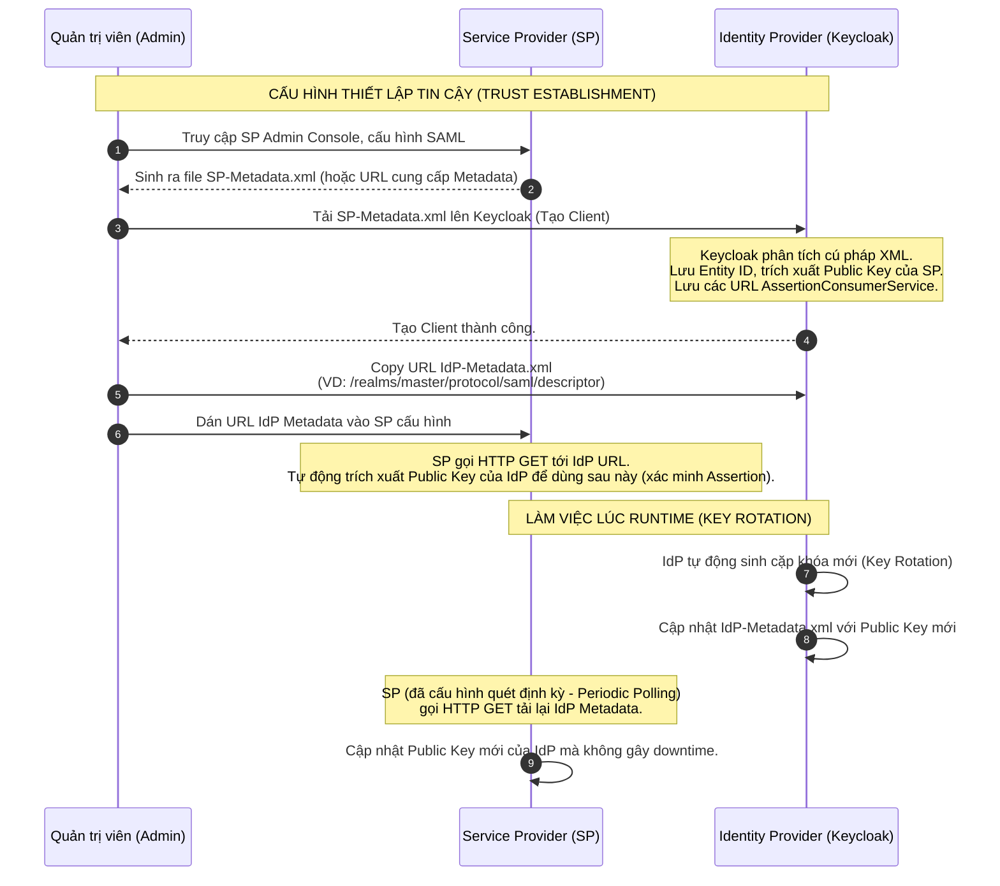

> [!NOTE]
> **Category:** Theory (Lý thuyết)
> **Goal:** Nắm bắt khái niệm và cấu trúc của SAML Metadata, cơ chế thiết lập sự tin cậy (Trust Establishment) giữa Identity Provider (IdP) và Service Provider (SP), và cách tự động hóa quá trình cấu hình bằng tài liệu XML Metadata.

## 1. Lý thuyết chuyên sâu (Detailed Theory)

Trong kiến trúc phân tán của giao thức SAML, hệ thống Identity Provider (IdP) và Service Provider (SP) có thể được vận hành bởi hai công ty khác nhau, nằm trên hai hạ tầng mạng khác nhau. Để chúng có thể giao tiếp, mã hóa thông điệp và xác minh chữ ký của nhau, chúng cần một cơ chế để trao đổi thông tin cấu hình từ trước (Establish Trust). Cơ chế này chính là **SAML Metadata**.

**SAML Metadata** là một tài liệu chuẩn hóa định dạng XML chứa tất cả các tham số cần thiết để một thực thể (IdP hoặc SP) có thể giao tiếp với đối tác. Thay vì phải cấu hình thủ công hàng chục tham số (URL, thuật toán, khóa mã hóa), quản trị viên chỉ cần trao đổi file Metadata này.

Các thành phần cốt lõi trong một file Metadata:
- **Entity ID:** Định danh duy nhất toàn cầu của thực thể (thường là một URL).
- **Public Keys (X.509 Certificates):** Chứa chứng chỉ khóa công khai (Public Key) dùng để xác minh chữ ký (Signature Validation) hoặc mã hóa dữ liệu (Encryption).
- **Endpoints (URL):**
  - Đối với IdP: `SingleSignOnService` (Nơi nhận AuthnRequest) và `SingleLogoutService`.
  - Đối với SP: `AssertionConsumerService` (Nơi nhận SAMLResponse) và `SingleLogoutService`.
- **Bindings:** Các phương thức HTTP được hỗ trợ (HTTP-POST, HTTP-Redirect, SOAP).
- **NameID Formats:** Các định dạng định danh người dùng được hỗ trợ (Ví dụ: Email, Transient, Persistent).

## 2. Luồng nội bộ & Cơ chế cấp thấp (Internal Workflow & Low-level Mechanisms)

Có hai cách để trao đổi Metadata: **Tĩnh (Static)** và **Động (Dynamic/URL-based)**. Trong môi trường doanh nghiệp hiện đại, trao đổi động thông qua URL được ưu tiên vì tính tự động cập nhật của nó.



**Tại sao trao đổi Metadata động lại quan trọng?**
Chứng chỉ mã hóa (X.509) có thời hạn (thường từ 1-3 năm) và cần được xoay vòng (Key Rotation) để đảm bảo bảo mật. Nếu trao đổi tĩnh bằng file, khi chứng chỉ hết hạn, quản trị viên phải hẹn lịch thức dậy lúc nửa đêm để tải file thủ công lên cả hai hệ thống. Nếu tải Metadata qua URL với cơ chế polling, quá trình này là hoàn toàn tự động (Zero-downtime key rotation).

## 3. Thực hành tốt nhất & Bảo mật (Best Practices & Security)

> [!WARNING]
> **Man-in-the-Middle (MitM) với Metadata:** Nếu lấy Metadata qua URL bằng HTTP không mã hóa, kẻ tấn công có thể thay thế Public Key của IdP trong file XML bằng Public Key của chúng. Từ đó, mọi chữ ký số của IdP sẽ bị từ chối, nhưng các chữ ký do kẻ tấn công giả mạo sẽ được chấp nhận!

> [!IMPORTANT]
> **Metadata Signature:** Tương tự như Assertion, bản thân file Metadata cũng BẮT BUỘC phải được ký điện tử (Signed Metadata). Điều này đảm bảo tính toàn vẹn của file cấu hình khi trao đổi qua môi trường mạng không đáng tin cậy.

- **Dùng HTTPS cho Metadata URL:** Luôn dùng TLS/HTTPS với chứng chỉ CA hợp lệ khi chia sẻ hoặc fetch URL Metadata.
- **Vô hiệu hóa Entity Expansion (XXE):** Khi tự viết mã (code) để parse file Metadata, phải bảo vệ bộ phân tích cú pháp XML khỏi các cuộc tấn công XXE, vì Metadata thường là đầu vào do đối tác hoặc bên thứ ba cung cấp.
- **Kiểm tra thời hạn (ValidUntil):** Root element `<EntityDescriptor>` thường hỗ trợ các thuộc tính `validUntil` và `cacheDuration`. Hệ thống đọc metadata phải tuân thủ nghiêm ngặt: Không tin tưởng metadata đã hết hạn.

## 4. Cấu hình minh họa thực tế (Configuration Examples)

Đây là ví dụ cấu trúc rút gọn của một **IdP Metadata** sinh ra từ Keycloak:

```xml
<EntityDescriptor xmlns="urn:oasis:names:tc:SAML:2.0:metadata" 
                  entityID="https://idp.example.com/auth/realms/master"
                  cacheDuration="PT10H"
                  validUntil="2025-10-10T12:00:00Z">
    
    <!-- IDPSSODescriptor định nghĩa khả năng làm IdP -->
    <IDPSSODescriptor WantAuthnRequestsSigned="true" 
                      protocolSupportEnumeration="urn:oasis:names:tc:SAML:2.0:protocol">
        
        <!-- Khóa công khai (Public Key) dùng cho Signature -->
        <KeyDescriptor use="signing">
            <ds:KeyInfo xmlns:ds="http://www.w3.org/2000/09/xmldsig#">
                <ds:X509Data>
                    <ds:X509Certificate>
                        MIICmzCCAYMCBgF... (Base64 Encoded Cert) ...p7m8=
                    </ds:X509Certificate>
                </ds:X509Data>
            </ds:KeyInfo>
        </KeyDescriptor>
        
        <!-- Các Endpoints của IdP -->
        <SingleLogoutService Binding="urn:oasis:names:tc:SAML:2.0:bindings:HTTP-POST" 
                             Location="https://idp.example.com/auth/realms/master/protocol/saml"/>
        
        <SingleSignOnService Binding="urn:oasis:names:tc:SAML:2.0:bindings:HTTP-Redirect" 
                             Location="https://idp.example.com/auth/realms/master/protocol/saml"/>
    </IDPSSODescriptor>
</EntityDescriptor>
```

**Cấu hình trên Keycloak (Làm SP và nhập IdP Metadata):**
Nếu Keycloak làm Identity Broker (đóng vai trò SP kết nối tới một ADFS IdP):
1. Vào mục `Identity Providers` -> Chọn `SAML v2.0`.
2. Cuộn xuống phần `Import external IDP config`.
3. Có 2 cách:
   - Paste URL của ADFS IdP Metadata (Khuyến nghị).
   - Hoặc upload trực tiếp file `xml` từ máy tính cục bộ.
4. Keycloak sẽ tự điền tất cả các URL `Single Sign-On Service URL` và `Validating X509 Certificates`.

## 5. Trường hợp ngoại lệ (Edge Cases)

- **Self-signed Certificates không khớp tên miền:** Đôi khi SP từ chối metadata vì chứng chỉ X.509 nằm bên trong nó là Self-signed. Thực tế, SAML Trust không phụ thuộc vào PKI (Public Key Infrastructure) hay CA của trình duyệt. Sự tin cậy được thiết lập *bằng cách* file Metadata được chia sẻ an toàn ra sao (ví dụ admin tải trực tiếp vào console). Chứng chỉ trong file SAML Metadata tự nó là "Trust Anchor", không nhất thiết phải do VeriSign hay Let's Encrypt cấp.
- **Nhiều chứng chỉ (Multiple Keys):** Trong quá trình xoay vòng khóa, thẻ `<IDPSSODescriptor>` sẽ chứa ĐỒNG THỜI 2 block `<KeyDescriptor use="signing">` (một khóa cũ, một khóa mới). Nếu thư viện SP cũ/kém chất lượng chỉ đọc thẻ khóa đầu tiên và bỏ qua khóa thứ hai, nó sẽ gây ra lỗi xác minh chữ ký. **Khắc phục:** Nâng cấp thư viện SAML của SP để hỗ trợ mảng Multi-keys.

## 6. Câu hỏi Phỏng vấn (Interview Questions)

1. **Junior:** Mục đích chính của việc trao đổi SAML Metadata là gì?
   *Đáp án:* Để tự động hóa việc chia sẻ cấu hình giữa IdP và SP, bao gồm các URL giao tiếp (Endpoints), và đặc biệt là các khóa công khai (Public Keys/Certificates) dùng để mã hóa và xác minh chữ ký.
2. **Junior:** Sự khác biệt giữa `IDPSSODescriptor` và `SPSSODescriptor` trong file Metadata là gì?
   *Đáp án:* `IDPSSODescriptor` chứa cấu hình khi thực thể đó hoạt động với tư cách là Identity Provider (chứa SingleSignOnService url). `SPSSODescriptor` chứa cấu hình khi nó làm Service Provider (chứa AssertionConsumerService url).
3. **Senior:** Tại sao nên dùng Dynamic Metadata URL (với cơ chế fetch định kỳ) thay vì tải file XML thủ công?
   *Đáp án:* Hỗ trợ Key Rotation tự động với Zero-downtime. Khi IdP thay khóa ký mới (thường là để tăng cường bảo mật hoặc do khóa hết hạn), nó chỉ cần cập nhật Metadata của chính nó. Các SP sẽ tự động polling (tải lại) file từ URL, lấy được khóa mới mà không cần thao tác thủ công của kỹ sư hệ thống.
4. **Senior:** Giao thức SAML có quy định chứng chỉ X.509 bên trong Metadata phải được cấp bởi một Public CA (Certificate Authority như DigiCert) không? Tại sao?
   *Đáp án:* Không. Mô hình SAML dùng Explicit Trust (tin cậy rõ ràng). Khi Admin tải thủ công file hoặc URL Metadata cấu hình vào SP, SP đã xác nhận sự tin cậy vào toàn bộ nội dung file đó. Khóa X.509 bên trong đóng vai trò tự định danh. Việc dùng Self-signed certs là hoàn toàn chuẩn và hợp lệ trong kiến trúc SAML.
5. **Senior:** Lỗ hổng XML External Entity (XXE) có thể bị khai thác như thế nào qua quá trình Import Metadata?
   *Đáp án:* Kẻ tấn công lợi dụng việc Admin có thể cung cấp URL Metadata cho SP. Kẻ tấn công tạo một server độc hại chứa file Metadata XML, trong đó có các thẻ DOCTYPE độc hại trích xuất file `/etc/passwd`. Nếu máy chủ SP đọc XML mà không tắt tính năng giải quyết Entity bên ngoài, nó sẽ thực thi các mã độc này.

## 7. Tài liệu tham khảo (References)

- [OASIS SAML V2.0 Metadata Specification](https://docs.oasis-open.org/security/saml/v2.0/saml-metadata-2.0-os.pdf)
- [OWASP XML Security Cheat Sheet](https://cheatsheetseries.owasp.org/cheatsheets/XML_Security_Cheat_Sheet.html)
- [Keycloak Official Documentation - Identity Providers](https://www.keycloak.org/docs/latest/server_admin/#_saml)
