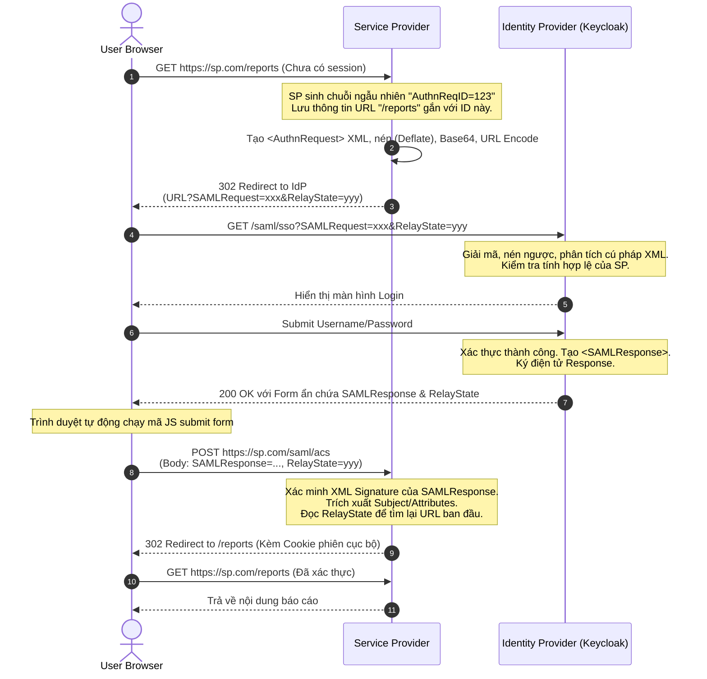

> [!NOTE]
> **Category:** Theory (Lý thuyết)
> **Goal:** Phân tích sâu các luồng đăng nhập (Login Flows) trong SAML, sự khác biệt kiến trúc giữa SP-Initiated và IdP-Initiated, cấu trúc chi tiết của AuthnRequest, và các mối đe dọa bảo mật liên quan đến luồng đăng nhập.

## 1. Lý thuyết chuyên sâu (Detailed Theory)

Quá trình đăng nhập trong SAML không chỉ có một kịch bản duy nhất. Tùy thuộc vào nơi người dùng bắt đầu luồng tương tác, SAML phân chia thành hai mô hình Login chính: **SP-Initiated** (Do Service Provider khởi xướng) và **IdP-Initiated** (Do Identity Provider khởi xướng).

1. **SP-Initiated Login (Web Browser SSO Profile):**
   - **Định nghĩa:** Người dùng gõ URL của ứng dụng (SP) vào trình duyệt. SP nhận thấy người dùng chưa đăng nhập, nên tự tạo một `AuthnRequest` và chuyển hướng (Redirect) trình duyệt sang IdP.
   - **Sử dụng:** Đây là luồng tiêu chuẩn, hiện đại và an toàn nhất. Khuyến khích sử dụng cho 99% các trường hợp.

2. **IdP-Initiated Login:**
   - **Định nghĩa:** Người dùng truy cập thẳng vào Cổng thông tin của IdP (IdP Portal - ví dụ trang My Apps của Okta hoặc Keycloak Account Console), sau đó click vào một biểu tượng Ứng dụng. IdP không cần chờ `AuthnRequest` từ SP, nó tự động tạo luôn `SAMLResponse` kèm Assertion và đẩy (POST) sang SP.
   - **Sử dụng:** Phổ biến ở các doanh nghiệp có cổng Intranet. Tuy nhiên, luồng này tiềm ẩn nhiều lỗ hổng bảo mật (như CSRF) và thường bị giới hạn hoặc vô hiệu hóa trong các kiến trúc bảo mật khắt khe.

Một thành phần then chốt trong quá trình Login là tham số **RelayState**. Vì HTTP là giao thức phi trạng thái (Stateless), khi SP chuyển người dùng sang IdP và người dùng quay lại, SP cần biết người dùng đang cố truy cập vào URL nào ban đầu (ví dụ: `/dashboard/reports`). `RelayState` được SP truyền đi lúc bắt đầu và IdP có trách nhiệm phải trả lại nguyên vẹn `RelayState` đó cùng với `SAMLResponse`.

## 2. Luồng nội bộ & Cơ chế cấp thấp (Internal Workflow & Low-level Mechanisms)

Hãy xem xét cơ chế cấp thấp của luồng **SP-Initiated Login** sử dụng binding HTTP-Redirect.



**Tại sao HTTP-Redirect lại phải dùng nén Deflate?**
`SAMLRequest` là một khối XML. Dù nhỏ hơn Response, nhưng khi mã hóa Base64 nó vẫn có thể khá dài. Các trình duyệt và Proxy thường có giới hạn chiều dài của URL (khoảng 2048 ký tự). Thuật toán Deflate thu gọn kích thước XML trước khi đưa lên URL, giúp tránh lỗi `414 URI Too Long`. Luồng HTTP-POST không dùng Deflate.

## 3. Thực hành tốt nhất & Bảo mật (Best Practices & Security)

> [!WARNING]
> **IdP-Initiated Login Risk (CSRF / Login Hijacking):** Trong luồng IdP-Initiated, không có tham số nào chứng minh được SP đã yêu cầu Assertion đó. Kẻ tấn công có thể dụ nạn nhân click vào một form POST độc hại chứa Assertion của *chính kẻ tấn công*. Nếu SP chấp nhận, nạn nhân sẽ bị đăng nhập vào tài khoản của kẻ tấn công (Login CSRF) và có thể vô tình nhập thông tin nhạy cảm vào tài khoản đó.

> [!IMPORTANT]
> **Bắt buộc ký AuthnRequest (Sign Requests):** Dù SP-Initiated an toàn hơn, nhưng nếu AuthnRequest không được ký, bất kỳ ai cũng có thể giả mạo SP gửi yêu cầu đăng nhập. Doanh nghiệp cần cấu hình Keycloak thiết lập `WantAuthnRequestsSigned="true"`.

- **Vô hiệu hóa IdP-Initiated Login:** Nếu kiến trúc không bắt buộc, hãy vô hiệu hóa tính năng này trên cấu hình SAML Client của Keycloak. Thay vào đó, nếu cần cổng Intranet Portal, hãy để Portal chứa các liên kết dạng `https://sp.example.com` (trực tiếp đến SP), từ đó kích hoạt luồng SP-Initiated.
- **RelayState Validation:** Kẻ tấn công có thể lợi dụng tham số `RelayState` để thực hiện Open Redirect (Chuyển hướng mở) tới các trang lừa đảo. SP chỉ được phép chuyển hướng tới các URL cục bộ (Relative Paths) hoặc nằm trong danh sách White-list domain sau khi login thành công.
- **Kiểm tra InResponseTo:** Trong SP-Initiated, `SAMLResponse` trả về luôn chứa thuộc tính `InResponseTo="ID_của_AuthnRequest"`. SP BẮT BUỘC phải lưu trữ các Request ID này (trong cache tạm thời) và kiểm tra xem `InResponseTo` có khớp không. Điều này chống lại Unsolicited Responses (Response không do mình yêu cầu).

## 4. Cấu hình minh họa thực tế (Configuration Examples)

Cấu trúc một `AuthnRequest` (sau khi giải mã):

```xml
<samlp:AuthnRequest xmlns:samlp="urn:oasis:names:tc:SAML:2.0:protocol"
                    xmlns:saml="urn:oasis:names:tc:SAML:2.0:assertion"
                    ID="REQ_A1B2C3D4"
                    Version="2.0"
                    IssueInstant="2023-10-10T08:00:00Z"
                    Destination="https://idp.example.com/auth/realms/master/protocol/saml"
                    AssertionConsumerServiceURL="https://sp.example.com/saml/acs"
                    ProtocolBinding="urn:oasis:names:tc:SAML:2.0:bindings:HTTP-POST">
                    
    <saml:Issuer>https://sp.example.com</saml:Issuer>
    
    <samlp:NameIDPolicy Format="urn:oasis:names:tc:SAML:1.1:nameid-format:emailAddress"
                        AllowCreate="true"/>
                        
    <samlp:RequestedAuthnContext Comparison="exact">
        <saml:AuthnContextClassRef>urn:oasis:names:tc:SAML:2.0:ac:classes:PasswordProtectedTransport</saml:AuthnContextClassRef>
    </samlp:RequestedAuthnContext>
</samlp:AuthnRequest>
```

**Ý nghĩa các thẻ quan trọng:**
- `AssertionConsumerServiceURL`: SP chỉ định nơi nó muốn IdP gửi `SAMLResponse` về. IdP sẽ kiểm tra tính hợp lệ của URL này với cấu hình nội bộ để chống giả mạo.
- `ProtocolBinding`: SP yêu cầu IdP gửi trả Response qua Front-channel dùng phương thức HTTP-POST.
- `RequestedAuthnContext`: (Tùy chọn) SP có thể YÊU CẦU IdP phải xác thực bằng một cấp độ bảo mật nhất định (ví dụ: bắt buộc phải dùng thẻ Smart Card hoặc OTP).

**Cấu hình trên Keycloak:**
Để bật yêu cầu ký:
1. Chọn SAML Client.
2. Bật công tắc `Client Signature Required`.
3. Nhập Certificate hoặc Public Key của SP trong tab **Keys** (để Keycloak có thể verify chữ ký của AuthnRequest).

## 5. Trường hợp ngoại lệ (Edge Cases)

- **Mismatch AssertionConsumerServiceURL:** IdP báo lỗi `Invalid redirect uri`. Điều này xảy ra khi SP tạo XML `AuthnRequest` và gửi URL ACS là `http://sp.com/acs`, nhưng trên Keycloak admin lại cấu hình `https://sp.com/acs` (Khác giao thức HTTP/HTTPS) hoặc thiếu dấu gạch chéo `/`. **Khắc phục:** URL trong Request phải khớp tuyệt đối (Exact Match) với danh sách `Valid Redirect URIs` trên Keycloak.
- **IdP-Initiated Login thất bại do SP Reject:** Do rủi ro bảo mật, một số thư viện như Spring Security SAML2 hiện đại mặc định vô hiệu hóa IdP-Initiated (nó sẽ ném lỗi khi nhận được `SAMLResponse` mà thiếu `InResponseTo` ID trong bộ nhớ). **Khắc phục:** Nếu bắt buộc phải dùng IdP-Initiated, lập trình viên phải tìm cách Override cấu hình của Framework để hạ thấp tiêu chuẩn bảo mật (cho phép Unsolicited Response).

## 6. Câu hỏi Phỏng vấn (Interview Questions)

1. **Junior:** Điểm khác biệt lớn nhất về luồng chạy giữa SP-Initiated và IdP-Initiated Login là gì?
   *Đáp án:* Trong SP-Initiated, người dùng truy cập ứng dụng (SP) trước, SP sinh ra AuthnRequest gửi cho IdP. Trong IdP-Initiated, người dùng truy cập trang portal của IdP trước, IdP sinh luôn SAMLResponse đẩy thẳng cho SP mà không cần Request.
2. **Junior:** Mục đích của tham số `RelayState` trong luồng SAML là gì?
   *Đáp án:* Duy trì trạng thái ứng dụng. Nó chứa URL mà người dùng muốn truy cập ban đầu tại SP. Sau khi quá trình xác thực tại IdP hoàn tất (vốn bị phân mảnh qua nhiều redirect), SP đọc RelayState để điều hướng người dùng quay lại đúng trang họ cần.
3. **Senior:** Tại sao luồng IdP-Initiated lại bị coi là có rủi ro Login CSRF (Login Hijacking)?
   *Đáp án:* Kẻ tấn công tự xác thực tại IdP bằng tài khoản của chúng, lấy được Response gửi về SP. Chúng đưa Response đó vào một trang web lừa đảo và dụ nạn nhân nhấn submit form. SP không có cách phân biệt nạn nhân đã tự gửi yêu cầu hay không (vì không có AuthnRequest lưu ID). Kết quả nạn nhân bị đăng nhập nhầm vào tài khoản của kẻ tấn công.
4. **Senior:** Nếu SP gửi `AuthnRequest` với một cấp độ `RequestedAuthnContext` rất cao (ví dụ: MFA/SmartCard), nhưng hệ thống Keycloak không hỗ trợ thì sao?
   *Đáp án:* Tùy thuộc vào thuộc tính `Comparison` (như exact, minimum). Nếu Keycloak không thể đáp ứng cấp độ bảo mật đó, theo chuẩn SAML, nó sẽ hủy luồng xác thực và trả về một Error Response (AuthnFailed) cho SP, không cho phép đăng nhập bằng Password thường.
5. **Senior:** Thuộc tính `InResponseTo` trong SAML đóng vai trò quan trọng gì đối với bảo mật của SP-Initiated Login?
   *Đáp án:* Nó chống lại Replay Attack và Unsolicited Responses. Khi SP gửi đi một `AuthnRequest`, nó tạo một ID ngẫu nhiên. Khi `SAMLResponse` quay về, nó bắt buộc phải chứa `InResponseTo` khớp với ID đó. Điều này chứng minh rằng Response này sinh ra từ chính yêu cầu hiện tại của SP, chứ không phải một gói tin cũ bị chụp lại.

## 7. Tài liệu tham khảo (References)

- [OASIS SAML 2.0 Web Browser SSO Profile](https://docs.oasis-open.org/security/saml/v2.0/saml-profiles-2.0-os.pdf)
- [Keycloak SAML Identity Provider documentation](https://www.keycloak.org/docs/latest/server_admin/#_saml)
- [OWASP Unvalidated Redirects and Forwards Cheat Sheet](https://cheatsheetseries.owasp.org/cheatsheets/Unvalidated_Redirects_and_Forwards_Cheat_Sheet.html)
