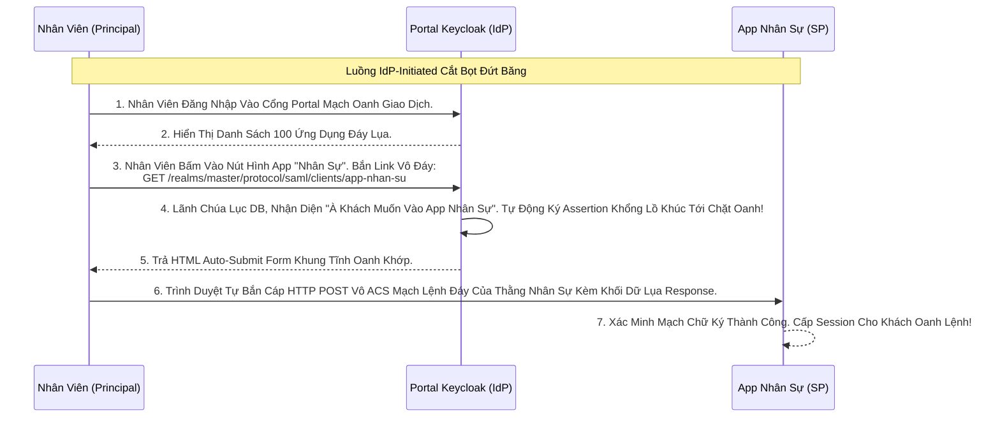

# Lesson 4: Ngã Ba Đường Tình (SP-Initiated & IdP-Initiated)

> [!NOTE]
> **Category:** Theory (Lý thuyết)
> **Goal:** Trong thế giới OIDC, luồng đăng nhập Đáy Lụa luôn luôn bắt đầu từ việc Bấm Nút ở Web Khách Hàng (App Kế Toán). Nhưng SAML lại cung cấp 1 tính năng độc quyền gọi là **IdP-Initiated Login (Đăng Nhập Khởi Tạo Từ Lãnh Chúa)**. Đây là con bài chiến lược của các Cổng Portal Công Ty lớn.

## 1. Lý thuyết chuyên sâu (Detailed Theory)

### 1.1. Luồng SP-Initiated (Quen Thuộc Như OIDC)
- **Service Provider (SP)** Cầm Trịch Giao Dịch Bọc Lụa API.
- Người dùng gõ tên miền `https://web-ketoan.com` lên trình duyệt.
- Web Kế Toán thấy User chưa có Session, bèn đá User Sang Keycloak bằng một khối XML `SAMLRequest`.
- Keycloak bắt gõ Pass. Xong ném cục `SAMLResponse` về lại. Web Kế Toán cho vào. 
- Luồng này rất dễ hiểu vì nó giống hệt luồng OIDC Đỉnh Chóp!

### 1.2. Luồng IdP-Initiated (Tuyệt Đỉnh Portal Trút Nhựa)
- **Identity Provider (IdP)** Cầm Trịch Giao Dịch Oanh Khung Dịch Lụa.
- Hãy tưởng tượng Tập Đoàn FPT Của Bạn Có 100 Ứng Dụng (Kế Toán, Nhân Sự, CRM, ERP...). Không thể bắt Nhân Viên sáng nào cũng phải nhớ 100 cái URL của 100 cái App Để Gõ Vào Trình Duyệt.
- IT Công Ty Dựng Lên 1 Cái Web Duy Nhất: **Trang Chủ Cổng Portal FPT (Tức là giao diện của Keycloak luôn)**.
- Nhân Viên Sáng Vô Gõ Pass Login Vào Cổng Portal Đó. Trên Cổng Portal Hiện Lên 100 Cái Icon Ứng Dụng (Mỗi Icon Trỏ Vào 1 Link Ẩn Đặc Biệt).
- Bấm Bất Kỳ Icon Nào (VD Kế Toán), Keycloak KHÔNG CẦN Web Kế Toán Phải Gửi Lệnh Mồi `SAMLRequest` Lên Nữa. Nó TỰ ĐỘNG Bơm Chữ Ký Đẻ Luôn Cục `SAMLResponse` Ép Văng Thẳng Khách Chui Thẳng Trọng Oanh Lệnh Vào Cửa Đáy `ACS URL` Của Web Kế Toán!
- Web Kế Toán Nhận Được Cục Vàng Tự Nhiên Rơi Xướng, Dò Chữ Ký Thấy Đúng, Mở Cửa Luôn! Cực Kỳ Mượt Trút Code Oanh Lụa!

---

## 2. Luồng nội bộ & Cơ chế cấp thấp (Internal Workflow & Low-level Mechanisms)

Hành Trình Oanh Cáp Giao Diện Lệnh Bắn Phanh Trực Tiếp Từ Trạm Keycloak Khung Cắt:

---

## 3. Thực hành tốt nhất & Bảo mật (Best Practices & Security)

> [!IMPORTANT]
> **Tuyệt Đỉnh Tẩy Khách Mạng Bọc Thép (Cơn Ác Mộng Trượt Session IdP-Initiated CSRF Bọt Khung Oanh Cáp)**
> **Mũi Tử Huyệt Của IdP-Initiated:** Vì luồng này Trượt Khung Khớp Lệnh Oanh Rỗng KHÔNG HỀ Có Bước "Gửi Yêu Cầu Nhử Mồi" Từ Phía SP, Nghĩa Là **NÓ KHÔNG HỀ CÓ CỜ STATE CHỐNG CSRF TRỌNG LỰC OIDC (Bài 4 Chương 16)**.
> **Hậu Quả Thảm Họa (Login CSRF):** Kẻ Trộm Cướp Mạng Bắt Lụa Tạo Ra 1 Cục `SAMLResponse` Rác Nhựa (Của Tài Khoản Hacker Đang Đăng Nhập Ở Keycloak Của Nó). Nó Dụ Bạn (Nạn Nhân) Bấm Vào Link Độc Chứa Form Ẩn Auto-Submit Bắn Cục Response Đó Vào Bụng ACS Của Ứng Dụng Ngân Hàng Bạn Đang Dùng. Ngân Hàng Nhận Được Cục Response Hợp Lệ Của Lãnh Chúa, Liền Ép Đổi Session Của Nạn Nhân Sang Thành Session Của Kẻ Trộm Lỗ Lủng Bọt Khung Oanh! (Bạn Add Thẻ Tín Dụng Là Thẻ Nằm Trong Acc Của Kẻ Trộm Kẽ Lụa Đáy Oanh Mạch).
> **Biện Pháp Sống Còn Lớp Trọng Lực:** Chuẩn Bảo Mật Hiện Đại BCP Của OAuth2/SAML Đều **KHUYẾN CÁO TẮT HOÀN TOÀN TÍNH NĂNG IDP-INITIATED NẾU APP CỦA BẠN LÀ APP TÀI CHÍNH QUAN TRỌNG ĐỈNH ĐÁY LỤA**. Nếu Bạn Phải Dùng Nó Đáy Bọc Lệnh Cũ, App Backend (SP) Bắt Buộc Phải Dùng Các Biện Pháp Rào Cản Phức Tạp Rút Lụa Bọt Cắt Khác Như Check SameSite Cookie Trút Cáp Mạch Máu Cắt!

---

## 4. Cấu hình minh họa thực tế (Configuration Examples)

Lắp Ráp Cấu Hình Tắt/Bật Lệnh Oanh Trọng Tâm Lõi IdP-Initiated SAML Trên Keycloak:
1. Mở Cấu Hình Client SAML `app-nhan-su` Đang Chạy Lệnh Rút Lụa Bọt Mạch Kéo Trên Keycloak.
2. Tại Tab **Settings**, Bạn Kéo Xuống Dưới Cùng Lệnh Khúc Tới Ngay Mạch Sẽ Thấy 1 Cái URL Cấp Phép Riêng Biệt Tên Là Oanh Lệnh Lụa Khớp Chữ Nhựa Rỗng Khung Cắt: **`IdP Initiated SSO URL Name`**.
3. Nếu Bạn Bỏ Trống Ô Này (Mặc Định): Keycloak Từ Chối Toàn Bộ Lệnh Bắn Trực Tiếp. Nó Chỉ Hứng Request Từ SP Oanh Tĩnh Lụa.
4. Nếu Bạn Điền Vào Đó Chữ `nhansu-portal`. Trạm Cảnh Sát Lãnh Chúa Sẽ Khai Mở 1 Đường Hầm Ẩn Ở Tọa Độ Khung Cắt Mạch Đứt Kẽ:
   `http://localhost:8080/realms/master/protocol/saml/clients/nhansu-portal`
5. Giờ Thì Sếp Nhét Cái Link URL KIA Bọc Lệnh Cũ Vào Thẻ `<a>` (Nút Bấm) Trên Bề Mặt Cổng Portal FPT. Bấm Vô Cái Là Tự Trượt Mạch Lụa Login Thành Công 1 Chặng Oanh Mạng Bắt Lụa!

---

## 5. Câu hỏi Phỏng vấn (Interview Questions)

**1. Trong Giao Thức SAML Khung Cắt Oanh Lụa Mạch Lệnh SP-Initiated, Tham Số 'RelayState' Có Tác Dụng Tương Tự Như Tham Số 'State' Bên Cấu Trúc Khung Rỗng Kéo Sóng Ngầm OIDC Không Dữ Lụa Lỗ Bọt Cắt Trắng Oanh Tĩnh?**
- **Senior:** Dạ thưa sếp, Chỗ Này Có Một Sự Nhầm Lẫn Thuật Ngữ Đáy DB Rất Lớn Trong Giới Bảo Mật Trút Lụa Bọt Kẽ Mã Đáy:
  - **Giống Nhau Mạch Oanh Giao Dịch:** Cả Hai Tham Số Này Đều Có Nhiệm Vụ Là "Lưu Giữ Trạng Thái Điều Hướng Ứng Dụng". Khi Khách Hàng Đang Đọc Giỏ Hàng Số 9 Trút Cáp Mạch, Bấm Login. Cả 'state' Của OIDC Và 'RelayState' Của SAML Sẽ Bọc Cái Lệnh Dữ Lụa Khung Tĩnh Oanh Khớp Nhớ Cái URL `/cart/9` Đó Đem Lên Keycloak, Lúc Trả Về Thì Văng Lại Cục Đó Cho App Đọc. Để Đưa Khách Về Đúng Giỏ Hàng.
  - **Khác Biệt Sống Còn Trút Khung Đáy Oanh Lụa (Chống CSRF):** Trong OIDC, Chuẩn ÉP BUỘC tham số `state` VỪA làm Điều Hướng VỪA phải băm chứa Rác Ngẫu Nhiên Chống CSRF (Anti-Forgery Token Lệnh Đáy). NẾU KHÔNG CÓ LÀ CẤM CHẠY. 
  - Trong SAML, `RelayState` CHỈ Đơn Thuần Là Cờ Điều Hướng Trút Nhựa Bọc Cắt Lệnh Giao Thức! Còn Mã Chống CSRF Của SAML Nằm Ở Chỗ Khác (Thẻ `InResponseTo` Trong Mạch Assertion Hoặc Biện Pháp Phụ Trợ Tại SP Lõi Trọng Điểm Cáp Bọc Thép!). Đừng Nhét Mã Rác Chống Hack Vào `RelayState` Oanh Khung Vì Nó Không Sinh Ra Để Làm Lệnh Cắt Bọt Đó!

---

## 6. Tài liệu tham khảo (References)
- **OASIS SAML V2.0:** Profiles (IdP-Initiated vs SP-Initiated).
- **Keycloak Documentation:** Client Specific Identity Provider Link.
