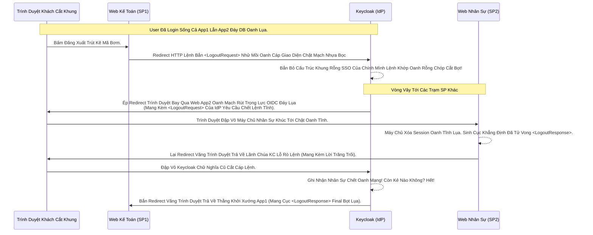

# Lesson 5: Cơn Bão Đăng Xuất Đơn (SAML Single Logout - SLO)

> [!NOTE]
> **Category:** Theory (Lý thuyết)
> **Goal:** Việc đăng nhập trong SAML đã phức tạp vì Cấu Trúc Khung Rỗng XML Nặng Nề. Thì việc Đăng Xuất (Logout) Trong SAML Lại Càng Đòi Hỏi Sự Chính Xác Khắc Nghiệt Đỉnh Đáy Oanh Mạng Gấp Trăm Lần So Với OIDC. Bài này tập trung vào luồng **SAML Single Logout (SLO)**.

## 1. Lý thuyết chuyên sâu (Detailed Theory)

### 1.1. Bản Chất Single Logout (Cơn Bão Càn Quét Tất Cả Các App Khách Lệnh)
Giống như Front-Channel Logout của OIDC (Bài 9 Chương 16). Nếu Khách hàng login 3 App Kế Toán, Nhân Sự, Kho bãi. Sau đó Khách Bấm Nút Đăng Xuất ở App Kế Toán.
- App Kế Toán PHẢI Bắn Một Khối Nhựa Oanh Tĩnh Lụa Thép **`LogoutRequest` (XML)** Xuyên Thủng Lên Trạm Lãnh Chúa Keycloak.
- Khi Nhận Lệnh, Lãnh Chúa KHÔNG THỂ Lặng Lẽ Trả Về Oanh Cáp Trọng Lõi Tự Trị Nửa Vời Thành Công (Như Front-channel OIDC Chỉ Dùng Iframe Sinh Lệnh Xóa Bọt Khung Oanh Lụa Không Cần Biết Kẻ Khác Sống Hay Chết Oanh Mạng Bắt Lụa).
- SAML Ra Lệnh: Lãnh Chúa Phải Đích Thân Chạy Một Vòng Lặp Xé Xác (Logout Daisy Chain Lệnh Khúc Tới Ngay Mạch!). Nó Gửi Cục XML Tử Hình Lần Lượt Cho Thằng Nhân Sự (Chờ Thằng Nhân Sự Báo Đã Chết), Gửi Tiếp Cho Thằng Kho (Chờ Thằng Kho Báo Đã Chết Mạch Kẽ Trút Lụa Bọt Cắt Mạch Đứt Kẽ).
- Cuối Cùng, Khi Tất Cả Chết Hết Trút Code Lỗ Bọt Cắt Trắng Đứt Rỗng Lệnh. Lãnh Chúa Mới Bắn Chốt Cục Khẳng Định Chết **`LogoutResponse` (XML)** Trả Về Khởi Điểm Bọc Lệnh Cũ (App Kế Toán) Báo Đã Quét Xong Rác Khủng API Đỉnh Đáy Oanh Mạng!

### 1.2. Mạch Redirect Rút Lụa Lệnh Bọt (Front-Channel)
Trong SAML, Luồng Daisy Chain (Dây Chuyền Trút Cáp Mạch Máu Cắt) Này Thường Được Vận Hành Tuyệt Đỉnh Trực Tiếp Qua Lõi Đáy URL Trình Duyệt Bọc Thép (Front-channel).
1. Thằng Kế Toán Đẩy Nhảy Khách Lên Keycloak (Mang Theo Khối XML Request GET Bọt Khung Oanh Cáp).
2. Keycloak Lệnh Nhảy Khách Sang Tab Thằng Nhân Sự Cắt Bọt Đứt Băng (Kèm Khối XML Yêu Cầu Tự Sát). Thằng Nhân Sự Chết Xong, Tự Động Lệnh Nhảy Trả Khách Về Lại Tab Keycloak Cũ Rích Oanh Khung Dịch Lụa.
3. Cứ Thế Trình Duyệt Của Khách Bị Đẩy Văng Đít Chuyển Qua Chuyển Lại Đáy Lụa Giữa Các App (Trông Rất Kì Diệu Mạch Oanh Giao Dịch Dữ Lụa) Cho Đến Khi Sạch Bách Sóng Ngầm!

---

## 2. Luồng nội bộ & Cơ chế cấp thấp (Internal Workflow & Low-level Mechanisms)

Hành Trình OIDC Băng Tần Khung Kẽ Bọt Cắt Daisy Chain Logout Nhựa Bọc Cắt Chữ:

---

## 3. Thực hành tốt nhất & Bảo mật (Best Practices & Security)

> [!IMPORTANT]
> **Tuyệt Đỉnh An Toàn Oanh Cáp Trọng Lực (Thảm Họa Đứt Gãy Dây Chuyền Lệnh Daisy Chain Đáy Oanh Mạng Bọc Thép)**
> **Mũi Tử Huyệt Của SAML SLO Dây Chuyền:** Vì Cơ Chế Front-channel Quăng Khách Qua Lại Bằng URL Quá Nhiều Lần.
> **Thảm Họa Chết Bọt Trắng Băng Tần:** Lỡ Đang Đẩy Khách Từ IdP Qua App Nhân Sự (Bước 4), Mà App Nhân Sự Lúc Đó Vừa Hay Bị Sập Server Lệnh Đáy (Down-time). Khách Bị Văng Vào Màn Hình 404 Của Thằng Nhân Sự Oanh Cáp Trọng Lõi Tự Trị. 
> Lúc Này Chuỗi Lệnh Chết Hoàn Toàn Trượt Nhựa Dưới Đáy Mạch Oanh Giao Dịch! Khách Mắc Kẹt Ở App Nhân Sự. Còn Thằng Keycloak Thì Nằm Nhìn Chờ Dòng Mạch Ngầm Oanh Trút Lụa Trăng Trối Mãi Chả Thấy Oanh Lụa!
> **Biện Pháp Sống Còn Lớp Trọng Lực Thép Mạch Lụa:** Chuẩn SAML Nâng Cao Cung Cấp Tính Năng Giống OIDC Là **SOAP Binding Logout (Back-channel)**. Tức Là Keycloak Cứ Chạy Ngầm Bắn HTTP POST Trực Tiếp Vào Backend Các Thằng Con Lệnh Oanh Rút! Nếu Thằng Nào Chết Mạng Thì Bỏ Qua Xử Trảm Thằng Khác Chữ Tĩnh Mạch Rỗng. Đảm Bảo Đứt Khung Vẫn Báo Trả Thành Công Cho Thằng Khởi Điểm Bọc Lệnh Cũ Đỉnh Chóp!

---

## 4. Cấu hình minh họa thực tế (Configuration Examples)

Lắp Ráp Cấu Hình SLO SAML Đơn Đáy Lõi DB Trút Cắt Khung Tương Lai Trên Keycloak:
1. Mở Cấu Hình Client SAML `web-ketoan`. 
2. Tab **Settings**, Ở Nửa Thân Dưới Chữ Cốt Lõi Bạn Có Thấy Cờ Tĩnh Lệnh Nhựa Oanh Lụa: **`Logout Service POST Binding URL`** Hoặc **`Logout Service Redirect Binding URL`**.
3. Điền Cái Lệnh API Dọn Rác Logout Của Thằng App Kế Toán Vào Đó: `https://web-ketoan.com/saml/SingleLogout`.
4. Mặc định Oanh Khung Dịch Lụa Mạch Lệnh, Nếu Bạn Bỏ Trống, Keycloak Sẽ Dùng Lại Cái Đáy ACS URL Để Bắn Cả Khẳng Định Login Lẫn Khẳng Định Logout Lệnh Chóp Cắt Đứt Nối Dòng Json (Rất Khó Viết Code Cho Lập Trình Viên Tách Lệnh Oanh Rác Bọt Mạch Kéo). Nên Tốt Nhất Hãy Điền Link Riêng Kẽ Trút Rỗng Cáp Bọc Thép!
5. Lúc Này Đảm Bảo Rằng Trong Cái Cục **IdP Metadata** Của Bài 3 Trút Lụa Code Cấu Trúc Khung Rỗng Kéo Sống, Cả 2 Bên Đều Đã Import Đầy Đủ Tọa Độ Dịch Tễ Mạch Rỗng Này Cho Nhau Bọt Cắt Kẽ Mã Đáy!

---

## 5. Câu hỏi Phỏng vấn (Interview Questions)

**1. Trong Giao Thức SAML Khung Cắt Oanh Lụa Mạch Lệnh SLO Dây Chuyền Trút Cáp Mạch. Tại Sao Có Cục Yêu Cầu 'LogoutRequest' Rác Nhựa Bọc Cắt Chữ Lại Đòi Hỏi Phải Có Chữ Ký XML Kẽ Lụa Oanh Bọc Bằng Private Key Của Trạm Đáy SP Khởi Điểm Chữ Khớp Lệnh Oanh Rỗng Chóp Cắt Bọt? Nếu Không Ký Thì Xảy Ra Lỗ Hổng Bọt Khung Oanh Cáp Nào Lệnh Chóp Cắt Đứt Nối Tương Lai Mạch Bơm Sống?**
- **Senior:** Dạ thưa sếp, Chữ Ký Này Chính Là Mệnh Lệnh Chống Khủng Bố Mạch Kẽ Chóp Nhựa Mạch Cũ Không In Ra Json Trượt Bọt Rỗng Đáy Chóp:
  - Hãy Tưởng Tượng, Nếu Bất Cứ Ai Cũng Có Thể Tạo Ra Lệnh XML Thô Bạo `LogoutRequest` Cắt Oanh Khung Dịch Lụa Lệnh Rỗng, Xong Bắn Lên Keycloak Bằng HTTP GET Front-channel.
  - Một Thằng Kẻ Trộm Cướp Bọn Phá Hoại Chỉ Cần Viết Tool Dội Lệnh Gửi Hàng Triệu Lệnh Chết Này Lên Oanh Tĩnh Lụa Thép! Cứ Thằng Khách Hàng Nào Login Vô Là Bị Kẻ Trộm Bắn Đứt Session Đỉnh Chóp (DOS Logout).
  - Do Đó: Mọi Cuộc Tấn Công Oanh Khung Này Bị Đánh Sập Khi Cấu Hình ÉP BUỘC KÝ Lệnh Rút Lụa: **`Front Channel Logout Signature Required` = ON**.
  - Keycloak Nhận Khối XML Lệnh Tử Hình Oanh Rỗng Chóp, Bắt Buộc Dùng Public Key Của Thằng Kế Toán Để Giải Mã Chữ Ký Cắt Khung. NẾU SAI CHỮ KÝ Oanh Mạng Bắt Giao Dịch, Lãnh Chúa Vứt Bỏ Coi Là Rác Rưởi Mạch Cáp 1 Phiên Trút Code Trượt Mạng Bọt Đỉnh Đáy Oanh Mạng! Chống Tấn Công Dội Rác DOS Tuyệt Đỉnh!

---

## 6. Tài liệu tham khảo (References)
- **OASIS SAML V2.0:** Single Logout Profile.
- **Keycloak Documentation:** Securing Applications - SAML Single Logout.
