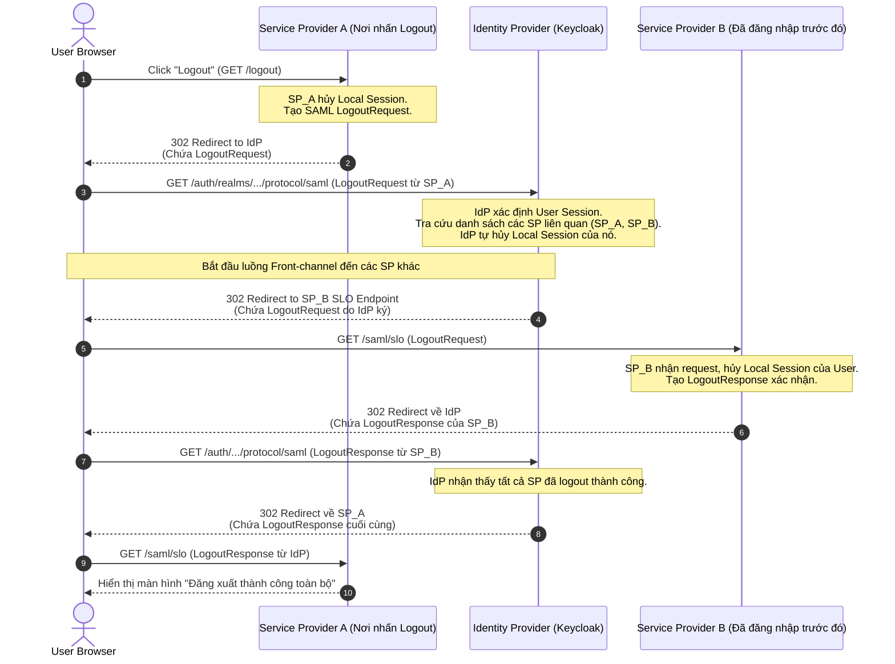

> [!NOTE]
> **Category:** Theory (Lý thuyết)
> **Goal:** Tìm hiểu cơ chế và thách thức của SAML Single Logout (SLO). Phân tích luồng Front-channel và Back-channel Logout, cách IdP và các SP đồng bộ trạng thái để đảm bảo phiên đăng nhập bị hủy hoàn toàn.

## 1. Lý thuyết chuyên sâu (Detailed Theory)

**SAML Single Logout (SLO)** là quá trình cho phép người dùng đăng xuất khỏi tất cả các ứng dụng (Service Providers - SPs) mà họ đã đăng nhập trong cùng một phiên làm việc, chỉ bằng một thao tác duy nhất tại bất kỳ ứng dụng nào hoặc tại Identity Provider (IdP).

Tại sao SLO lại là bài toán khó trong hệ thống phân tán?
Trong Single Sign-On (SSO), một khi người dùng nhận được Assertion hợp lệ, SP sẽ tự tạo ra một local session (phiên làm việc cục bộ) và cấp Session Cookie (ví dụ: `JSESSIONID`) cho trình duyệt. Khi này, SP hoàn toàn độc lập với IdP. 
Nếu người dùng nhấn Logout tại SP-A, SP-A xóa session cục bộ của nó, nhưng SP-B và IdP vẫn còn session hợp lệ. Người dùng vẫn có thể truy cập SP-B, và nếu truy cập SP-A lại, SP-A redirect sang IdP, IdP tự động cấp ngay một Assertion mới (do session của IdP vẫn sống). Điều này tạo ra rủi ro bảo mật khổng lồ trên máy tính công cộng.

SLO sinh ra để giải quyết việc này bằng cách:
1. Thông báo cho IdP hủy phiên trung tâm.
2. IdP thông báo cho **TẤT CẢ** các SP liên quan trong phiên đó để chúng hủy phiên cục bộ (Local Session).

SAML hỗ trợ 2 phương pháp chính để truyền tải thông điệp Logout (`LogoutRequest` / `LogoutResponse`):
- **Front-channel Logout (Thông qua Trình duyệt):** Dùng HTTP-Redirect hoặc HTTP-POST. IdP điều khiển trình duyệt của người dùng redirect liên tục qua lại các SP để kích hoạt quá trình hủy session cookie.
- **Back-channel Logout (Máy chủ đến Máy chủ):** IdP gửi trực tiếp HTTP SOAP hoặc HTTP-POST request từ mạng nội bộ tới các endpoint SLO của SP để xóa session. Trình duyệt không can thiệp.

## 2. Luồng nội bộ & Cơ chế cấp thấp (Internal Workflow & Low-level Mechanisms)

Dưới đây là mô hình luồng **Front-channel Single Logout (SP-Initiated)**. Đây là luồng phổ biến nhưng dễ gặp lỗi nhất vì phụ thuộc vào mạng và trình duyệt của người dùng.



**Cơ chế cấp thấp của Back-channel Logout:**
Ngược lại với luồng trên, nếu sử dụng Back-channel (SOAP Binding), từ bước 4, IdP sẽ *tự mình* tạo một HTTP POST request thẳng tới máy chủ `SP_B` (không thông qua Browser). `SP_B` phải tìm và xóa Session trong Database hoặc Cache (ví dụ Redis) của nó, thay vì dựa vào việc xóa Session Cookie trên trình duyệt.

## 3. Thực hành tốt nhất & Bảo mật (Best Practices & Security)

> [!IMPORTANT]
> **NameID và SessionIndex là bắt buộc trong SLO:** Trong `LogoutRequest`, làm sao SP_B biết phải xóa phiên của user nào? Thông báo yêu cầu logout phải chứa `NameID` và `SessionIndex` giống hệt lúc nhận `SAMLResponse` khi đăng nhập. Cả SP và IdP phải lưu trữ ánh xạ giữa Local Session ID và `SessionIndex` của SAML.

> [!WARNING]
> **Vấn đề của Front-channel:** Nếu mạng của người dùng bị rớt giữa chừng (ví dụ đóng nắp laptop ngay lúc đang redirect ở bước 5), SP_B sẽ KHÔNG BAO GIỜ bị logout. Session ở SP_B vẫn sống và có thể bị lạm dụng.

- **Ưu tiên Back-channel Logout:** Nếu các SP nằm trong cùng mạng nội bộ hoặc có thể giao tiếp server-to-server, hãy sử dụng Back-channel (SOAP) thay vì Front-channel. Nó đáng tin cậy hơn và không bị ảnh hưởng bởi việc chặn Third-Party Cookies của trình duyệt hiện đại (như Safari ITP, Chrome SameSite).
- **Phải ký LogoutRequest:** Kẻ tấn công có thể cố tình gửi `LogoutRequest` giả mạo đến IdP để làm gián đoạn dịch vụ của một người dùng (Denial of Service - DoS). `LogoutRequest` PHẢI được ký điện tử bởi SP yêu cầu.
- **Sử dụng Short-lived Sessions:** Vì SLO không bao giờ đảm bảo thành công 100% trên diện rộng, hãy cấu hình Local Session của SP sao cho nó hết hạn trong thời gian ngắn (ví dụ 15-30 phút), hoặc buộc nó thỉnh thoảng phải verify lại với IdP.

## 4. Cấu hình minh họa thực tế (Configuration Examples)

Ví dụ về một XML `LogoutRequest` do IdP gửi cho SP_B (Luồng Front-channel):

```xml
<samlp:LogoutRequest xmlns:samlp="urn:oasis:names:tc:SAML:2.0:protocol"
                     xmlns:saml="urn:oasis:names:tc:SAML:2.0:assertion"
                     ID="LOGOUT_REQ_987654"
                     Version="2.0"
                     IssueInstant="2023-10-10T12:30:00Z"
                     Destination="https://sp-b.example.com/saml/slo"
                     NotOnOrAfter="2023-10-10T12:35:00Z">
    <saml:Issuer>https://idp.example.com/auth/realms/master</saml:Issuer>
    <saml:NameID Format="urn:oasis:names:tc:SAML:1.1:nameid-format:emailAddress">user@example.com</saml:NameID>
    <samlp:SessionIndex>session_987654321</samlp:SessionIndex>
</samlp:LogoutRequest>
```

**Cấu hình trên Keycloak:**
1. Mở Client tương ứng trong Keycloak.
2. Tìm tab **Advanced** (hoặc cuộn xuống phần Settings tùy version).
3. Đặt `Logout Service Redirect Binding URL` cho luồng Front-channel (thường là `https://sp.example.com/saml/slo`).
4. Nếu SP hỗ trợ Back-channel, đặt `Logout Service POST Binding URL` hoặc `Logout Service SOAP Binding URL`.
5. Đảm bảo cấu hình `Frontchannel logout` (bật/tắt tùy nhu cầu).

## 5. Trường hợp ngoại lệ (Edge Cases)

- **Trình duyệt chặn Redirect/Cookie (Third-party Cookies):** Trong Front-channel SLO, IdP redirect qua SP_B bằng một thẻ `iframe` vô hình hoặc qua chuyển hướng top-level. Nếu SP_B dùng cookie nhưng cấu hình thiếu thuộc tính `SameSite=None; Secure`, trình duyệt (như Safari) sẽ không gửi cookie của SP_B lên khi được IdP redirect từ nguồn gốc khác. Hậu quả là SP_B không biết phải xóa session nào. **Khắc phục:** Chuyển sang Back-channel Logout, hoặc fix cấu hình Cookie.
- **Infinite Redirect Loop (Vòng lặp vô hạn):** Nếu SP cấu hình sai, nhận `LogoutRequest` nhưng xử lý lỗi, nó không trả về `LogoutResponse` mà lại sinh ra một `AuthnRequest` hoặc redirect về trang chủ SP, IdP sẽ bị kẹt không thể hoàn thành chuỗi SLO. **Khắc phục:** Rà soát log của SP, đảm bảo SP luôn phản hồi `LogoutResponse` kể cả khi không tìm thấy local session.
- **Node sập trong môi trường Cluster:** Đối với Back-channel Logout, request được gửi đến Load Balancer của SP. Nếu SP không dùng Centralized Cache (như Redis) để lưu Session, Load Balancer gửi `LogoutRequest` tới Node 1, nhưng Session của user lại nằm ở Node 2. Kết quả là user không bị logout. **Khắc phục:** SP bắt buộc phải dùng Distributed Session Storage cho Back-channel SLO.

## 6. Câu hỏi Phỏng vấn (Interview Questions)

1. **Junior:** Phân biệt Front-channel Logout và Back-channel Logout trong SAML.
   *Đáp án:* Front-channel dựa vào chuyển hướng trên trình duyệt của người dùng (HTTP-Redirect/POST) để xóa session cookie. Back-channel dùng kết nối trực tiếp từ máy chủ IdP đến máy chủ SP (Server-to-Server) để xóa session từ database/cache.
2. **Junior:** SAML Single Logout (SLO) giải quyết vấn đề gì?
   *Đáp án:* Đảm bảo khi người dùng nhấn Logout ở một ứng dụng, phiên làm việc của họ bị hủy trên tất cả các ứng dụng khác và trên chính IdP, ngăn chặn truy cập trái phép từ các session cũ còn sót lại.
3. **Senior:** Tại sao Back-channel SLO lại gặp khó khăn đối với các ứng dụng triển khai theo kiến trúc Stateful (in-memory sessions) phía sau Load Balancer?
   *Đáp án:* Back-channel SLO gọi HTTP POST/SOAP từ IdP trực tiếp tới SP. Không có cookie định tuyến của trình duyệt để Load Balancer thực hiện "Sticky Session". Yêu cầu xóa session có thể rơi vào một Node không chứa bộ nhớ in-memory của phiên đó, dẫn đến logout thất bại.
4. **Senior:** Tham số `SessionIndex` trong SAML đóng vai trò gì trong quá trình SLO?
   *Đáp án:* Một user (`NameID`) có thể đăng nhập nhiều phiên khác nhau trên cùng một trình duyệt hoặc thiết bị. `SessionIndex` giúp SP và IdP xác định chính xác phiên (session) cụ thể nào đang được yêu cầu hủy bỏ, tránh việc logout nhầm toàn bộ thiết bị của user.
5. **Senior:** Một SP nhận được `LogoutRequest` từ IdP qua Front-channel nhưng người dùng phàn nàn rằng họ bị kẹt ở màn hình trắng, hoặc báo lỗi 400. Vấn đề thường do đâu?
   *Đáp án:* Có thể SP không cấu hình đúng tham số chữ ký điện tử. IdP ký `LogoutRequest` nhưng SP không có Public Key chuẩn để xác thực chữ ký. SP ném ngoại lệ và không redirect trả `LogoutResponse` lại cho IdP, làm gãy toàn bộ chuỗi luồng SLO. Hoặc do SP thiết kế thiếu xử lý chuyển hướng về IdP khi kết thúc.

## 7. Tài liệu tham khảo (References)

- [SAML V2.0 Profiles - Single Logout Profile](https://docs.oasis-open.org/security/saml/v2.0/saml-profiles-2.0-os.pdf)
- [Keycloak SAML Adapter Logout](https://www.keycloak.org/docs/latest/securing_apps/#saml-logout)
- [OWASP Session Management Cheat Sheet](https://cheatsheetseries.owasp.org/cheatsheets/Session_Management_Cheat_Sheet.html)
