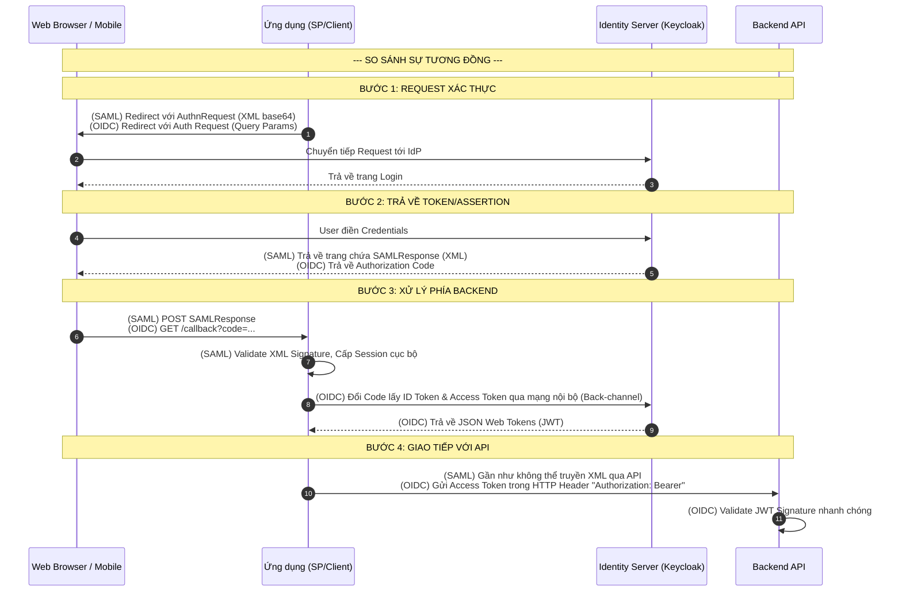

> [!NOTE]
> **Category:** Theory (Lý thuyết)
> **Goal:** So sánh chi tiết về kiến trúc, giao thức, định dạng dữ liệu và mục đích sử dụng giữa hai giao thức xác thực hàng đầu: SAML 2.0 và OpenID Connect (OIDC). Giúp đưa ra quyết định kiến trúc khi nào nên dùng công nghệ nào.

## 1. Lý thuyết chuyên sâu (Detailed Theory)

Trong thế giới Identity and Access Management (IAM), **SAML 2.0** và **OpenID Connect (OIDC)** là hai tiêu chuẩn thống trị. Dù cả hai đều sinh ra để giải quyết bài toán Single Sign-On (SSO) và Federated Identity, chúng có nguồn gốc, định dạng dữ liệu và triết lý thiết kế rất khác nhau.

**SAML (Security Assertion Markup Language):**
- Ra đời từ đầu những năm 2000 (phiên bản 2.0 năm 2005) trong môi trường doanh nghiệp truyền thống.
- Sử dụng **XML** cực kỳ chặt chẽ và nặng nề để mã hóa thông điệp và chữ ký số.
- Phù hợp với kiến trúc Web dựa trên Trình duyệt, kết nối các ứng dụng khổng lồ trong mạng nội bộ (On-premise Enterprise).

**OIDC (OpenID Connect):**
- Là thế hệ tiếp theo (2014), được xây dựng như một lớp xác thực mỏng phía trên nền tảng ủy quyền **OAuth 2.0**.
- Sử dụng **JSON (JWT - JSON Web Token)**, nhẹ nhàng và dễ dàng phân tích cú pháp bằng Javascript.
- Đặc biệt tối ưu hóa cho kiến trúc Microservices hiện đại, Single Page Applications (SPA - React, Angular), và Ứng dụng di động (Mobile Apps). Không phụ thuộc hoàn toàn vào Trình duyệt.

Tại sao phải so sánh? Không có cái nào "tốt hơn" hoàn toàn. Việc chọn sai giao thức sẽ dẫn đến kiến trúc rườm rà, lãng phí tài nguyên, hoặc tạo ra rào cản bảo mật (Ví dụ: Dùng SAML cho Mobile App gọi REST API là một ác mộng kỹ thuật).

## 2. Luồng nội bộ & Cơ chế cấp thấp (Internal Workflow & Low-level Mechanisms)

Hãy so sánh luồng cấp thấp của hai giao thức thông qua biểu đồ sau.



**Sự khác biệt cốt lõi ở mức cấp thấp:**
1. **Back-channel vs Front-channel:** SAML dựa rất nhiều vào Front-channel (Trình duyệt truyền `SAMLResponse` khổng lồ). OIDC sử dụng Back-channel (Mã `Code` nhỏ truyền qua trình duyệt, sau đó Backend App gọi trực tiếp Server-to-Server để lấy Token), bảo mật hơn trước nguy cơ rò rỉ trên Trình duyệt.
2. **API Chuyên biệt:** SAML sinh ra Assertion chỉ để SP tiêu thụ một lần, phục vụ việc cấp Session. OIDC sinh ra `Access Token` có thể được tái sử dụng để đính kèm vào các cuộc gọi REST API (Stateless Backend).

## 3. Thực hành tốt nhất & Bảo mật (Best Practices & Security)

> [!TIP]
> **Quy tắc chọn Architecture:** 
> - Nếu đang tích hợp với đối tác doanh nghiệp cũ, chính phủ, y tế (Legacy Enterprise) đã có sẵn ADFS -> Chọn SAML.
> - Nếu đang xây dựng hệ thống mới (SPA, Mobile App, Microservices) -> BẮT BUỘC chọn OIDC.

> [!WARNING]
> **Mobile Apps & SAML:** Tuyệt đối tránh sử dụng SAML để xác thực Native Mobile Apps. SAML không được thiết kế cho môi trường phi trình duyệt. Việc phải parse XML trong Swift/Kotlin rất phức tạp và thiếu an toàn.

- **Kích thước Payload:** SAML XML rất nặng, không phù hợp cho băng thông thấp. JWT (OIDC) rất nhẹ và nhỏ gọn.
- **Bảo mật State:** Trong OIDC, việc sử dụng tham số `state` (chống CSRF) và `PKCE` (Proof Key for Code Exchange) (chống chặn bắt Code) là bắt buộc. Trong SAML, dùng thuộc tính `RelayState`.
- **Cấp độ ủy quyền (Delegation):** OIDC kế thừa từ OAuth 2.0 nên hỗ trợ rất tốt bài toán "Ủy quyền" (User cho phép App A đọc dữ liệu của User tại API B). SAML chỉ làm tốt bài toán "Xác thực" (Authentication).

## 4. Cấu hình minh họa thực tế (Configuration Examples)

Sự khác biệt trong định dạng Data Payload:

**Payload của SAML (Assertion XML Fragment):**
```xml
<saml:Assertion ID="123" IssueInstant="2023-10-10T12:00:00Z" Version="2.0">
  <saml:Issuer>https://idp.example.com</saml:Issuer>
  <saml:Subject>
    <saml:NameID>user@example.com</saml:NameID>
  </saml:Subject>
  <!-- Kèm theo chữ ký XML đồ sộ và các Node Attribute -->
</saml:Assertion>
```

**Payload của OIDC (ID Token JWT Decoded):**
```json
{
  "iss": "https://idp.example.com",
  "sub": "b1a2c3d4-e5f6-7890",
  "aud": "my_spa_client",
  "exp": 1696942800,
  "iat": 1696939200,
  "email": "user@example.com",
  "preferred_username": "user1"
}
```
*Nhận xét:* JSON rất tự nhiên cho các framework hiện đại như NodeJS, Spring Boot, React. Việc validate JWT (bằng Base64 decode và check Signature thuật toán RS256) nhanh hơn hàng chục lần so với parse XML C14N của SAML.

## 5. Trường hợp ngoại lệ (Edge Cases)

- **Legacy SOAP Services:** Một số hệ thống Ngân hàng cũ sử dụng dịch vụ Web SOAP. SAML có một Binding đặc biệt là SAML SOAP Binding, hỗ trợ đính kèm Assertion thẳng vào WSS-Security Header. OIDC hoàn toàn "bó tay" trong trường hợp này.
- **Identity Federation:** Bạn có một ứng dụng OIDC, nhưng khách hàng lớn lại yêu cầu đăng nhập bằng hệ thống SAML của họ. **Khắc phục:** Không cần viết lại ứng dụng. Sử dụng Keycloak làm **Identity Broker**. Keycloak sẽ kết nối OIDC với Ứng dụng, đồng thời đóng vai trò là SP giao tiếp SAML với hệ thống của khách hàng. Nó chuyển đổi (translate) tự động Assertion XML thành JWT.

## 6. Câu hỏi Phỏng vấn (Interview Questions)

1. **Junior:** Hai định dạng dữ liệu (payload format) mà SAML và OIDC sử dụng là gì?
   *Đáp án:* SAML sử dụng XML. OIDC sử dụng JSON (dưới dạng JSON Web Token - JWT).
2. **Junior:** Nêu ưu điểm lớn nhất của OIDC so với SAML khi xây dựng ứng dụng Mobile (iOS/Android)?
   *Đáp án:* OIDC dựa trên JSON nhẹ nhàng, hỗ trợ luồng cấp quyền bằng mã Code (Auth Code Flow với PKCE) rất an toàn cho Native App mà không cần nhúng WebView phức tạp. SAML nặng nề và gần như bắt buộc phải dùng trình duyệt Web.
3. **Senior:** Ứng dụng SPA (React) của bạn cần gọi một API Microservice. Tại sao dùng OIDC phù hợp hơn SAML?
   *Đáp án:* SPA có thể lấy được Access Token (JWT) từ luồng OIDC và đính kèm nó vào Header `Authorization: Bearer` để gọi API. API dễ dàng xác minh JWT phân tán mà không cần lưu state. SAML Assertion sinh ra để tạo cookie session trên web server, rất khó dùng cho thiết kế API Stateless.
4. **Senior:** Giao thức nào hỗ trợ Delegation (Ủy quyền) tốt hơn, tại sao?
   *Đáp án:* OIDC (được xây dựng trên OAuth 2.0). OAuth 2.0 bản chất là giao thức ủy quyền (Authorization). Nó cho phép kiểm soát quyền truy cập theo từng API thông qua cấu trúc Scope. SAML thiết kế thuần cho việc xác thực (Authentication).
5. **Senior:** Giải thích vai trò của Identity Broker khi cần hỗ trợ cả OIDC và SAML.
   *Đáp án:* App của ta chỉ hỗ trợ OIDC, đối tác chỉ có SAML. Identity Broker (như Keycloak) đứng ở giữa. App gọi Keycloak bằng OIDC, Keycloak redirect sang IdP đối tác bằng SAML. Đối tác trả XML về Keycloak, Keycloak xử lý hợp lệ và trả JWT về cho App. App không cần quan tâm đến XML.

## 7. Tài liệu tham khảo (References)

- [OpenID Connect Core 1.0 Specification](https://openid.net/specs/openid-connect-core-1_0.html)
- [OASIS SAML 2.0 Specifications](https://docs.oasis-open.org/security/saml/v2.0/saml-core-2.0-os.pdf)
- [OAuth 2.0 (RFC 6749)](https://datatracker.ietf.org/doc/html/rfc6749)
