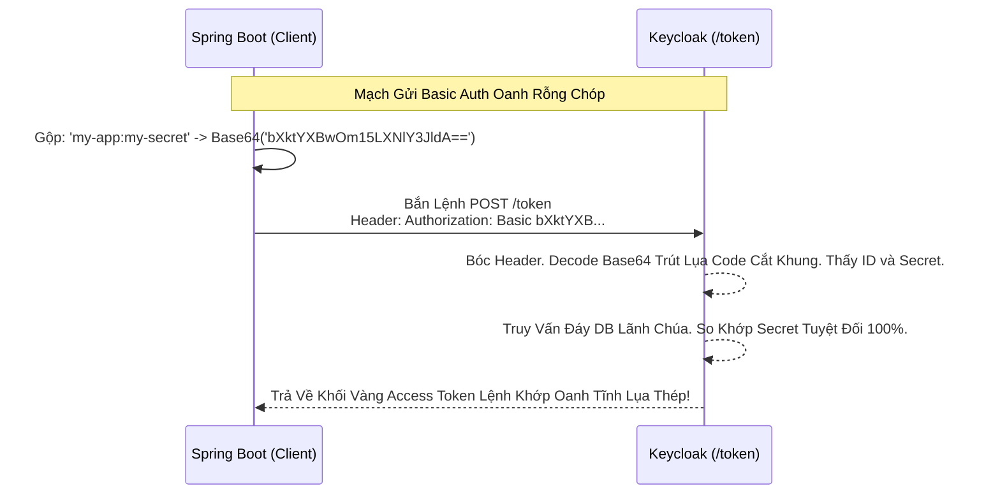

# Lesson 1: Mật Khẩu Tĩnh Đáy DB (Client Secret Basic/Post)

> [!NOTE]
> **Category:** Theory (Lý thuyết)
> **Goal:** Phương thức phổ biến nhất thế giới mà 99% các Lập trình viên đang xài để kết nối App vào Keycloak. Rất dễ cấu hình nhưng cũng chứa đầy lỗ hổng nếu mạng bị rò rỉ.

## 1. Lý thuyết chuyên sâu (Detailed Theory)

### 1.1. Client Secret Basic Là Gì?
Khi Backend Spring Boot (Client Confidential) cầm Mã `authorization_code` chạy lên Keycloak Endpoint `/token` để xin đổi lấy Access Token. Nó phải chứng minh danh tính bằng một cái Mật Khẩu Tĩnh gọi là **Client Secret**.
- Chuẩn `client_secret_basic`: App sẽ gom cục `client_id` và `client_secret`, nối lại với nhau bằng dấu hai chấm `:`. Băm Base64. Rồi nhét vào thanh **Header** của HTTP HTTP: `Authorization: Basic [Base64_String]`.
- Chuẩn `client_secret_post`: App nhét thẳng `client_id` và `client_secret` vào **Body Form** của request (Nơi chứa cái Code đổi lụa). Dễ nhìn hơn nhưng kém chuẩn mực RESTful hơn.

### 1.2. Bản Chất Mạch Oanh Giao Dịch
- Keycloak sẽ cấp cho mỗi Client (Nằm trong Tab Credentials) một chuỗi Secret dài loằng ngoằng (Ví dụ: `8a93xyz...`).
- Chuỗi Secret này được lưu ở 2 nơi: Trong Database Của Keycloak Và Trong File Config (`application.properties`) Của Thằng Spring Boot Đáy Lụa.

---

## 2. Luồng nội bộ & Cơ chế cấp thấp (Internal Workflow & Low-level Mechanisms)

Hành Trình Oanh Cáp Giao Diện Lệnh Bơm Secret Mạch Kẽ:

---

## 3. Thực hành tốt nhất & Bảo mật (Best Practices & Security)

> [!IMPORTANT]
> **Tuyệt Đỉnh Tẩy Khách Mạng Bọc Thép (Thảm Họa Rò Rỉ Mật Khẩu Chết Cứng Qua Github)**
> **Tội Ác Thiết Kế Giao Thức Mạch Rỗng Báo CSRF Rác:** Developer Của Công Ty Paste Cái Mã `Client Secret` Thép Mạch Lụa Này Cứng Vào File Mã Nguồn Code Giao Diện. Xong Gõ Lệnh `git push` Public Lên Mạng Github Cho Cộng Đồng Xem.
> **Hậu Quả:** Một Con Bot Scan Source Code Của Bọn Hacker Khúc Tới Chặt Oanh Tĩnh Sẽ Chộp Lấy Dòng Secret Này Trong 5 Giây! Kẻ Trộm Dùng Client ID Và Secret Này Giả Mạo Hệ Thống Của Bạn Bắn Request Rút Cáp JSON Mạch Cắt Oanh Xin Cấp Token Ảo. Nổ Tung CSDL Đỉnh Đáy Oanh Mạng!
> **Biện Pháp Sống Còn Lớp Trọng Lực:** 
> 1. Tuyệt Đối Không Xài Secret Cho Front-End SPA (React/Vue/Mobile). Vì Mọi Thứ Ở Front-End Đều Dễ Bị Soi Source Trượt Khung. Front-end Phải Xài PKCE Mạch (Client Public Khung Bọt Lụa).
> 2. Ở Backend Spring Boot, KHÔNG Commit Secret Lên Git. Phải Bơm Nó Vào Bằng Biến Môi Trường Hệ Thống Lệnh Oanh Rút Mạch Máu Cắt (`Environment Variables`) Hoặc Dùng Kho Báu Kubernetes Vault Bọc Thép Dịch Tễ Lạ!

---

## 4. Cấu hình minh họa thực tế (Configuration Examples)

Lắp Ráp Cấu Hình Client Secret Basic Cắt Lệnh Đáy Oanh Trên Keycloak:
1. Mở Cấu Hình Client (VD: `spring-api`). 
2. Tab **Settings**: Gạt Công Tắc **`Client authentication`** Sang **ON** (Lúc Này Keycloak Xác Nhận Thằng Này Là Client Có Két Sắt Bí Mật Trút Lụa).
3. Tab **Credentials** (Sẽ Xuất Hiện Khung Chóp Bọt Mạch Kéo): 
   - Mục **Client Authenticator**: Chọn Cờ `Client Id and Secret`.
   - Keycloak Sinh Sẵn Một Cục Mật Khẩu. Bạn Copy Cục Đó Thả Vào Backend. 
   - Nếu Nghi Ngờ Bị Lộ Oanh Khung Dịch Lụa Mạch Lệnh Cũ, Bấm Nút **Regenerate** Để Hủy Mã Cũ Đẻ Mã Mới Lập Tức Bọt Cắt Trắng Đứt Rỗng!

---

## 5. Câu hỏi Phỏng vấn (Interview Questions)

**1. Trong Cơ Chế Chữ Khớp Lệnh Oanh Rỗng 'client_secret_basic', Dữ Liệu Bị Băm Bằng Lệnh Base64 Có Được Tính Là Mã Hóa Bảo Mật An Toàn Không Khung Tĩnh Oanh Khớp? Hacker Bắt Gói Tin Mạch Oanh Giao Dịch HTTP Có Đọc Được Mật Khẩu Không?**
- **Senior:** Dạ thưa sếp, Chỗ Này Tuyệt Đối Rõ Ràng Mệnh Lệnh Khớp Oanh Cáp Giao Diện:
  - Base64 **KHÔNG PHẢI LÀ MÃ HÓA (ENCRYPTION)**. Nó Chỉ Là Dạng Mã Hóa Chuyển Đổi Ký Tự (Encoding). 
  - Bất Kỳ Ai, Kể Cả Thằng Nhóc Học Lập Trình 1 Tuần Bọt Mạch, Đều Có Thể Decode Đoạn Base64 Đó Trong 1 Giây Để Lấy Nguyên Bản `Client_id:Secret` Rõ Ràng Chữ Tĩnh Mạch Rỗng Bằng Code Đáy.
  - VÌ VẬY, Chuẩn Này BẮT BUỘC PHẢI CHẠY TRÊN NỀN ĐƯỜNG TRUYỀN HTTPS (SSL/TLS). 
  - Giao Thức Lệnh Mạch SSL Dưới Gầm Sẽ Chịu Trách Nhiệm Đóng Hòm Toàn Bộ Header HTTP Khúc Tới Ngay Mạch Kín Bưng, Ngăn Chặn Mọi Con Nhện Sniffer Nghe Lén Giữa Đường Lệnh Rút Lụa Bọt Cắt Kẽ Mã Đáy! Trượt Bọt Rỗng Dịch Lụa Lỗ Lủng Bọt Khung Oanh HTTPS Sẽ Giết Chết Bất Kỳ Lệnh Tấn Công Nào!

---

## 6. Tài liệu tham khảo (References)
- **RFC 6749:** Section 2.3.1 Client Password.
- **Keycloak Documentation:** Client Authentication.
