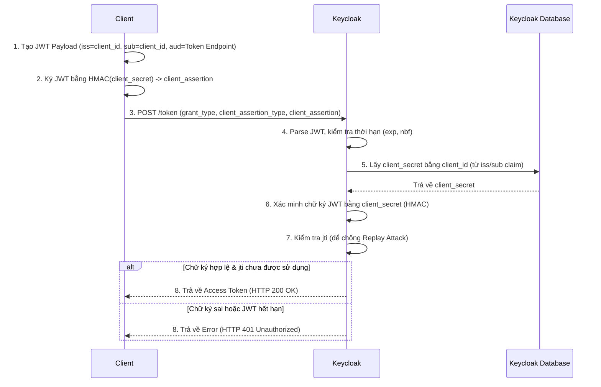

> [!NOTE]
> **Category:** Theory
> **Goal:** Hiểu sâu về phương thức xác thực `client_secret_jwt`, cách thức hoạt động, luồng nội bộ và cách cấu hình an toàn cho Client trên Keycloak.

## 1. Lý thuyết chuyên sâu (Detailed Theory)

Trong hệ sinh thái OAuth 2.0 và OpenID Connect (OIDC), việc xác thực Client (Client Authentication) là bước tối quan trọng để bảo vệ Token Endpoint khỏi các cuộc tấn công. Phương thức xác thực `client_secret_jwt` (được định nghĩa trong RFC 7523) là một cơ chế an toàn hơn rất nhiều so với `client_secret_basic` hoặc `client_secret_post`.

Thay vì gửi trực tiếp `client_id` và `client_secret` dưới dạng plain text hoặc Base64 trong HTTP Header, phương thức `client_secret_jwt` yêu cầu Client tạo ra một JSON Web Token (JWT). Token này sau đó được ký bằng một thuật toán HMAC (ví dụ: HS256) với khóa bí mật chính là `client_secret`. 

JWT này đóng vai trò như một **Client Assertion**. Nó chứa các claims cần thiết như `iss` (Issuer), `sub` (Subject), `aud` (Audience), `exp` (Expiration Time) và `jti` (JWT ID). Khi Keycloak nhận được yêu cầu, nó sẽ trích xuất `client_id`, tìm kiếm `client_secret` tương ứng trong cơ sở dữ liệu và dùng nó để xác minh chữ ký của JWT.

**Tại sao phương thức này tồn tại?**
- **Tránh lộ lọt credentials:** `client_secret` không bao giờ rời khỏi máy chủ của Client. Kẻ tấn công nếu có chặn được Request cũng chỉ thấy một JWT có thời hạn rất ngắn, không thể lấy được `client_secret` gốc.
- **Tính toàn vẹn (Integrity):** Bất kỳ sửa đổi nào đối với Request Payload liên quan đến JWT đều sẽ bị từ chối do chữ ký không hợp lệ.
- **Phòng chống Replay Attack:** Sự kết hợp giữa `exp` (thời hạn ngắn) và `jti` (ID duy nhất cho mỗi Request) giúp Keycloak ngăn chặn các cuộc tấn công phát lại (Replay Attacks).

## 2. Luồng nội bộ & Cơ chế cấp thấp (Internal Workflow & Low-level Mechanisms)

Dưới đây là luồng hoạt động nội bộ khi một Client sử dụng `client_secret_jwt` để yêu cầu Access Token từ Keycloak.



**Giải thích chi tiết (Step-by-Step):**
1. **JWT Construction:** Client xây dựng một JWT với `iss` và `sub` đều là `client_id`. `aud` phải trỏ đúng đến Token Endpoint URL của Keycloak. `jti` được sinh ngẫu nhiên.
2. **Signing:** Client sử dụng thuật toán HMAC (thường là HS256, HS384, hoặc HS512) và sử dụng `client_secret` làm đối số khóa để tạo ra chữ ký.
3. **Request:** Client gửi POST Request lên Token Endpoint với tham số `client_assertion_type=urn:ietf:params:oauth:client-assertion-type:jwt-bearer` và `client_assertion` chứa chuỗi JWT vừa tạo.
4. **Validation:** Keycloak giải mã Header và Payload của JWT để xác định thuật toán và `client_id`. Sau đó tải `client_secret` để tiến hành xác minh chữ ký số. Nếu chữ ký trùng khớp, chứng tỏ Request thực sự xuất phát từ Client đang nắm giữ `client_secret`.

## 3. Thực hành tốt nhất & Bảo mật (Best Practices & Security)

- **Cấu hình thời hạn (exp) cực ngắn:** Thời gian tồn tại của `client_assertion` JWT chỉ nên là vài giây (thường từ 10s đến 60s). Điều này hạn chế cửa sổ tấn công nếu JWT bị đánh cắp.
- **Luôn kích hoạt Replay Prevention:** Đảm bảo hệ thống bắt buộc Client phải gửi claim `jti` và Keycloak lưu trữ (cache) `jti` này cho đến khi JWT hết hạn để từ chối các JWT gửi lại.
- **Độ mạnh của `client_secret`:** Độ dài của `client_secret` phải đủ lớn và có entropy cao. Nếu dùng HS256, `client_secret` ít nhất phải có 256 bits (32 bytes).

> [!WARNING]
> Nếu `client_secret` quá ngắn hoặc dễ đoán, kẻ tấn công có thể sử dụng phương pháp Brute Force ngoại tuyến (Offline Brute Force) đối với JWT bắt được để tìm ra `client_secret`. 

> [!IMPORTANT]
> Phương thức `client_secret_jwt` vẫn yêu cầu chia sẻ một khóa đối xứng (Symmetric Key) giữa Client và Keycloak. Đối với các hệ thống có tính bảo mật cực cao, hãy xem xét sử dụng `private_key_jwt` (Asymmetric Key) để Client không cần lưu trữ bất kỳ Shared Secret nào.

## 4. Cấu hình minh họa thực tế (Configuration Examples)

**Cấu hình trên Keycloak Admin Console:**
1. Vào `Clients` -> Chọn Client cần cấu hình.
2. Sang tab `Credentials`.
3. Tại phần **Client Authenticator**, chọn `Client secret JWT`.
4. Nhấn `Save`. Keycloak sẽ hiển thị `Secret` để Client sử dụng.

**Đoạn mã giả (Node.js) tạo Client Assertion JWT:**
```javascript
const jwt = require('jsonwebtoken');
const axios = require('axios');
const { v4: uuidv4 } = require('uuid');

const clientId = 'my-backend-client';
const clientSecret = 'your-very-long-and-secure-secret-here';
const tokenEndpoint = 'https://keycloak.example.com/realms/myrealm/protocol/openid-connect/token';

// Tạo Payload cho Assertion
const payload = {
  iss: clientId,
  sub: clientId,
  aud: tokenEndpoint,
  jti: uuidv4(),
  exp: Math.floor(Date.now() / 1000) + 30 // JWT hợp lệ trong 30 giây
};

// Ký JWT bằng HMAC SHA-256
const clientAssertion = jwt.sign(payload, clientSecret, { algorithm: 'HS256' });

// Gửi yêu cầu lấy Token
const params = new URLSearchParams();
params.append('grant_type', 'client_credentials');
params.append('client_assertion_type', 'urn:ietf:params:oauth:client-assertion-type:jwt-bearer');
params.append('client_assertion', clientAssertion);

axios.post(tokenEndpoint, params)
  .then(response => console.log('Access Token:', response.data.access_token))
  .catch(error => console.error('Error:', error.response.data));
```

## 5. Trường hợp ngoại lệ (Edge Cases)

- **Lệch thời gian (Clock Skew):** Nếu máy chủ của Client và Keycloak có sự sai lệch về đồng hồ hệ thống (Time Synchronization Issue), JWT do Client tạo ra có thể bị Keycloak từ chối ngay lập tức vì lỗi "Token not yet valid" (`nbf`) hoặc "Token expired" (`exp`). 
  - **Khắc phục:** Đảm bảo cả hai máy chủ đều sử dụng dịch vụ NTP (Network Time Protocol) hoặc định cấu hình một khoảng chênh lệch chấp nhận được (Not Before Leeway) trên Keycloak.
- **Secret bị lộ:** Nếu `client_secret` bị lộ, tất cả các Request đều bị vô hiệu.
  - **Khắc phục:** Thực hiện Client Secret Rotation trên Keycloak và cập nhật cấu hình Client mà không gây gián đoạn hệ thống.

## 6. Câu hỏi Phỏng vấn (Interview Questions)

1. **Junior:** Sự khác biệt chính giữa `client_secret_basic` và `client_secret_jwt` là gì?
   - *Đáp án:* `client_secret_basic` gửi trực tiếp secret trong Header (Base64), có thể bị lộ nếu TLS bị chặn. `client_secret_jwt` không gửi secret qua mạng, mà dùng secret để ký một JWT, an toàn hơn.
2. **Junior:** Claim `jti` đóng vai trò gì trong `client_assertion`?
   - *Đáp án:* `jti` là mã định danh duy nhất cho JWT, dùng để ngăn chặn tấn công phát lại (Replay Attack).
3. **Senior:** Điều gì sẽ xảy ra nếu `client_secret` chỉ có độ dài 10 ký tự nhưng Client yêu cầu dùng HS256?
   - *Đáp án:* Về mặt lý thuyết, một số thư viện JWT có thể ném lỗi (exception) vì HS256 yêu cầu khóa tối thiểu 256 bits (32 bytes). Nếu thư viện vẫn cho phép, bảo mật sẽ cực kỳ yếu và dễ bị Offline Brute Force.
4. **Senior:** Làm thế nào Keycloak xác định được Client đang sử dụng `client_secret_jwt` khi nhận Request tại Token Endpoint?
   - *Đáp án:* Dựa vào tham số `client_assertion_type` có giá trị `urn:ietf:params:oauth:client-assertion-type:jwt-bearer` và cấu hình Authenticator của Client trong Database.
5. **Senior:** So sánh `client_secret_jwt` với `private_key_jwt`? Khi nào nên sử dụng giải pháp nào?
   - *Đáp án:* `client_secret_jwt` dùng mã hóa đối xứng (Symmetric HMAC), yêu cầu chia sẻ secret. `private_key_jwt` dùng bất đối xứng (RSA/EC), Client giữ Private Key, Keycloak giữ Public Key. Nên dùng `private_key_jwt` khi không muốn chia sẻ bí mật với Authorization Server, đặc biệt trong môi trường Zero Trust hoặc Financial-grade API (FAPI).

## 7. Tài liệu tham khảo (References)
- [RFC 7523: JSON Web Token (JWT) Profile for OAuth 2.0 Client Authentication and Authorization Grants](https://datatracker.ietf.org/doc/html/rfc7523)
- [Keycloak Official Documentation - Client Authentication](https://www.keycloak.org/docs/latest/server_admin/#_client-auth)
- [OWASP OAuth 2.0 Security Best Current Practice](https://datatracker.ietf.org/doc/html/draft-ietf-oauth-security-topics)
