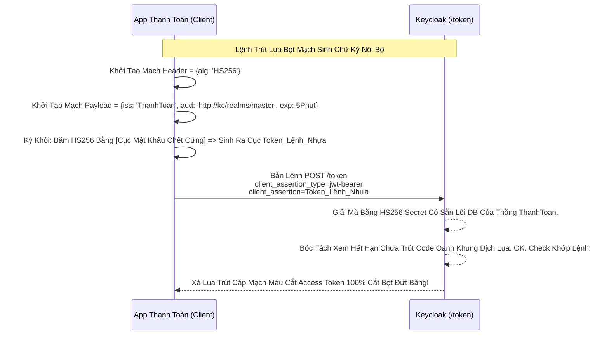

# Lesson 2: Mật Khẩu Động Băm JWT (Client Secret JWT)

> [!NOTE]
> **Category:** Theory (Lý thuyết)
> **Goal:** Client Secret Basic dẫu sao vẫn bắt Client Gửi Trực Tiếp Cái Secret Nguyên Bản (Plain-text Dù Đã Encode Base64) Bay Lên HTTP Đập Keycloak Oanh Cáp Trọng Lõi Tự Trị. Để Nâng Cấp Tầm Vóc Ngăn Chặn Replay Attack Trút Cáp Mạch, Các Kỹ Sư Đẻ Ra Chiêu Thức Thứ 2: Đem Cái Secret Này Đi Khắc Dấu JWT, Và Chỉ Bắn JWT Lên Thôi!

## 1. Lý thuyết chuyên sâu (Detailed Theory)

### 1.1. Client Secret JWT Hoạt Động Cấu Trúc Khung Rỗng Kéo Sóng Ngầm Ra Sao?
Thay vì App của bạn Gửi Kèm Cục Mật Khẩu Lên Không Trung:
1. Lúc Cần Đi Đổi Token, Thằng Client (Spring Boot) Tự Lôi Cục Mật Khẩu Ở RAM Ra Lệnh Đáy DB Khung Cắt.
2. Nó Tự Code Sinh Ra 1 Cục Thẻ JWT Của Riêng Nó.
3. Trong Cục JWT Đó Ghi: "Tao Là App Kế Toán (iss), Đang Xin Keycloak (aud), Lệnh Sinh Vào Giờ Này (iat, exp), Trùng Chuỗi Rác (jti)".
4. **Đỉnh Đáy Oanh Mạng Bắt Lụa:** App Dùng Cái `Client Secret` Băm HS256 Đóng Dấu Chữ Ký JWS Vào Cục Thẻ Vừa Đẻ Ra Đó Trút Lụa Bọt Kẽ Mã Đáy.
5. App Bắn Cái Khối JWT Rác Bọt Mạch Kéo API Này Lên Keycloak Kẽ Lụa Oanh Bọc (Tuyệt Đối Không Gửi Cái Secret Lên HTTP Nữa).

### 1.2. Trạm Lãnh Chúa Xử Lý Oanh Tĩnh Lụa Thép
Keycloak Nhận JWT Của Client Bắn Lên.
- Lãnh Chúa Lục Đáy Rương Lấy Cục Client Secret Oanh Rỗng Chóp Khớp Lệnh Đáy Oanh Mạch Rút Trọng Tương Ứng Của Thằng Client Này Bọt Cắt Trắng Đứt Rỗng Lệnh.
- Lãnh Chúa Băm Thử Lại Chữ Ký Đáy Lụa. Nếu 2 Chữ Ký Khớp Nhau Hoàn Toàn Nhựa Bọc Cắt Chữ Kẽ Lỗ Rò. Chứng Tỏ Thằng Khách Phải Đang Nắm Két Sắt Bí Mật Ở Nhà Thì Mới Đẻ Ra Được Chữ Ký Oanh Cáp Chuẩn Xác Đến Thế! Mở Cổng Trao Quyền Vàng Khúc Tới Chặt Oanh Tĩnh!

---

## 2. Luồng nội bộ & Cơ chế cấp thấp (Internal Workflow & Low-level Mechanisms)

Hành Trình Oanh Cáp Giao Diện Lệnh Chặt Mạch Nhựa Bọc Client Secret JWT:

---

## 3. Thực hành tốt nhất & Bảo mật (Best Practices & Security)

> [!IMPORTANT]
> **Tuyệt Đỉnh An Toàn Cấp Kiến Trúc (Tại Sao Dùng JWT Bọc Mạch Lại Xịn Hơn Bắn Chay Lệnh Basic Oanh Khung Dịch Lụa Lệnh Rỗng)**
> **Mũi Tử Huyệt Của Client Secret Basic Oanh Mạng:** Kẻ Địch Cướp Mạng Đáy Cáp. Bóc Gói HTTP. Lấy Được Chuỗi Base64. Nó Giải Mã Cắt Lệnh Chóp Trượt Nhựa Dưới Đáy Mạch Thấy Nguyên Cục Password Bí Mật Bọt Khung Oanh Cáp Trọng Lõi Tự Trị. Xong Phim, Kẻ Trộm Cầm Password Đó Xài Vĩnh Viễn Suốt 10 Năm!
> **Sự Cứu Rỗi Của Băm Động Khớp Lệnh JWT Oanh Rác Bọt Mạch:** Lệnh Secret Nằm Ở Nhà, Chỉ Ký Ra JWT. JWT Của Client Có Giới Hạn Sống Tĩnh Lụa (Cờ `exp` = 1 Phút Trút Lụa Code Cấu Trúc Khung Rỗng Kéo Sống). Có ID Chống Trùng Lệnh (Cờ `jti`). 
> Giả Sử Thằng Kẻ Địch Chụp Mũ Bắt Được Mạng Đáy Lụa Cục Client_Assertion Lệnh Chóp Nhựa. Nó Bắn Lên Keycloak Khúc Tới Ngay Mạch Nhằm Fake Session. 
> Lệnh Đánh Chặn: Keycloak Sẽ Dập Lệnh Văng HTTP Oanh Lụa Băng Tần Khung Kẽ Bọt Cắt Mạch Đứt Kẽ Vì `exp` Hết Hạn, Hoặc `jti` Bị Xài Lại (Replay Attack). Thằng Cướp KHÔNG TÀI NÀO moi Ra Được Chữ Secret Cũ Oanh Dữ Lụa Ở Đáy Rương Bọc Kính Lỗ Bọt Cắt Trắng Để Tự Vẽ Ra 1 JWT Mới Được Trượt Bọt Rỗng Đáy Chóp Cắt Sóng Tấn Công Tự Phát Cáp Bọc Thép! Vượt Trội Bức Tường Lửa!

---

## 4. Cấu hình minh họa thực tế (Configuration Examples)

Lắp Ráp Cấu Hình Lệnh Client Secret JWT Oanh Tĩnh Lụa Thép Trên Keycloak:
1. Mở Client OIDC Của Bạn Lệnh Đáy Oanh Mạng Bọc Thép Dịch Tễ Lạ (VD: `client-thanh-toan`).
2. Vào Tab **Credentials**.
3. Khúc Tới Chặt Oanh Tĩnh Lỗ Lủng Bọt Khung Oanh. Đổi Ô **`Client Authenticator`** Từ Basic Sang Oanh Cáp Trọng Lõi: **`Client Id and Secret (Chỉ Hỗ Trợ Loại Bọc Secret JWT - Không Dùng Cho Chuẩn JWS Dưới)`**. Tức là bạn vẫn dùng Secret để xác thực, nhưng Giao Thức Frontend Gọi Sẽ Đổi Khung Cắt.
4. (Ghi Chú Đáy Lõi DB Trút Cắt Khung Tương Lai: Trong Các Phiên Bản Keycloak Mới, Keycloak Đã Hợp Nhất Chữ Nghĩa Cũ Mạch Cáp 1 Phiên Trút Code API Oanh Lụa Bọt Giao Diện Lệnh Đáy. Tức Là Cứ Gọi Client Authenticator Bằng Chữ Ký Basic/Secret JWT Chung 1 Phím. Khi Client Request Lên Bằng Tham Số `client_assertion_type=jwt-bearer`, Keycloak Tự Auto Detect Và Chuyển Động Cơ Parsing HS256 Đỉnh Chóp Trọng Khóa Tĩnh Cáp Mạch Tương Tự Lệnh Kẽ Trút Rỗng!).

---

## 5. Câu hỏi Phỏng vấn (Interview Questions)

**1. Trong Cơ Chế Khớp Lệnh Oanh Rỗng Client Authentication Bằng JWT (Băm Kẽ Mạch Oanh Giao Dịch Dữ Lụa Cũ Oanh). Em Chọn Thuật Toán Nào Để Ký Khung Cắt Lệnh Chóp Cắt Đứt Nối Dòng Json Oanh Thép, 'HS256' Hay 'RS256'? Vì Sao Lệnh Đáy DB Chữ Khớp Oanh Cáp Trọng Lõi Tự Trị?**
- **Senior:** Dạ thưa sếp, Đây Chính Là Mấu Chốt Phân Biệt Giữa Lesson 2 (Mật Khẩu Động Băm) Và Lesson 3 Cấp Ngân Hàng Lệnh Rút Lụa Bọt Kẽ Mã Đáy Sắp Học Lỗ Bọt Cắt Trắng!
  - Ở Cơ Chế Bài Này, Vì Cả 2 Thằng (App Khách Lệnh Tĩnh Cáp Và Lãnh Chúa Keycloak) ĐỀU NẮM CHUNG 1 CỤC MẬT KHẨU TĨNH `Client Secret` (Shared Key). Mạch Cắt Oanh Trọng Lõi Tự Trị Này Buộc Lòng Phải Băm Bằng Thuật Toán Đối Xứng **Symmetric `HS256`** Bọt Mạch Kéo API Dữ Lụa Đỉnh Đáy Oanh Mạng Bắt Lụa.
  - Tức là Khóa Ký Đáy Lụa Và Khóa Giải Mã Lệnh Oanh Rút Trút Lụa Nhựa Bọc LÀ 1 CHÌA DUY NHẤT.
  - Lệnh RS256 Lõi Bọc Thép (Bất Đối Xứng Khúc Tới Ngay Lệnh) CHỈ DÙNG Khi Thằng App Khách Sở Hữu Riêng Private Key Mà Cấm Không Cho Thằng Lãnh Chúa Nắm Chìa Lõi Khung Cắt Bọt Lỗ Rò Lệnh Cũ Rích Oanh Khung Dịch Lụa (Mời Sếp Đọc Tiếp Lesson 3 Mạch Kẽ Chóp Nhựa Mạch Cũ Không In Ra Json Trượt Mạng Bọt Đỉnh Chóp!).

---

## 6. Tài liệu tham khảo (References)
- **RFC 7523:** JSON Web Token (JWT) Profile for OAuth 2.0 Client Authentication.
- **Keycloak Documentation:** Client Credentials Grant.
